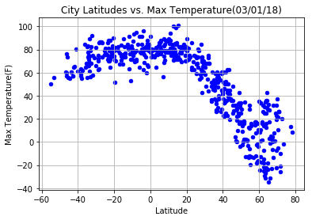
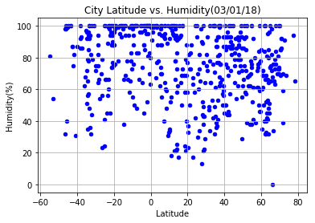
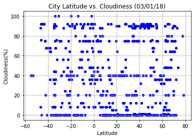
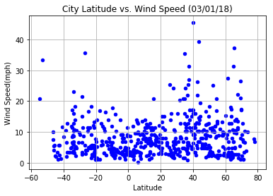

**WeatherPy**

** Analysis **

* Observed trend 1: The farther a city is above the equator the colder it is


* Observed trend 2: Even though two cities might be at the same distant from the equator on both ends, the cities above the equator appear to be colder than those below

* Observed trend 3: Humidity is dynamic based on the distance from the equator, wind speed and temperator 


```python
# dependencies
import numpy as np
import matplotlib.pyplot as plt
import requests 
import json
from citipy import citipy
import pandas as pd
%matplotlib inline
```

** Generate Random Latitudes and Latitudes ** 


```python
# generate random latitudes and longitutes
geo = []
for i in range(1500):
    lat = np.random.uniform(-90,90 )
    long = np.random.uniform(-180,180 )
    coord =  str(lat ) + ',' + str( long )
    geo.append( coord )

print(geo)
```

    ['48.121179687774855,-81.7618742537624', '10.523346925034517,12.39756696957437', '31.468591438065857,59.45711334459534', '26.133296424591336,-18.51312391409465', '-42.84686722661334,95.99689691529585', '60.484795110679926,-101.10644696834524', '68.59529234939774,154.7098925733166', '-17.23333759385494,-162.6235271425413', '-14.760940835737017,-11.927989198175254', '-26.0941738271247,92.47231191007444', '-8.340190749212809,164.97406713188604', '-6.594919718571873,22.24092685886407', '-47.90742643116488,34.41778141565621', '-58.113555962423916,-11.89720015038182', '-53.16151639446729,74.0613417715968', '81.0031346395836,-162.1527465053601', '79.23505884985539,-19.051223108454735', '79.0516224521067,34.63650066758896', '67.37784519596505,-86.33704534917688', '-49.2940502444922,9.90432080338806', '22.73982791405544,10.213078762883868', '-24.945849895347564,47.77696191539471', '-64.64615741221283,-89.67951637879497', '-73.4820486865815,174.23374254464215', '-43.80306364485286,85.79307001072078', '-56.06655106154783,-167.81604479967004', '25.999114151904152,127.1277073861919', '-54.576869238237954,-73.64667006781353', '-10.446504912629635,-72.8537742370958', '-86.70467467720898,29.80815549579043', '5.439110360868085,-27.21204118672145', '-5.07871659904518,145.62300099760284', '2.5561953538904874,65.97332295858587', '-53.51402527514464,40.844189120494406', '64.30086602663837,111.04295619596991', '-19.96772258548907,102.25483120358916', '-44.01150710698894,-175.0843371881949', '28.328371790725683,56.50752771659961', '10.765724128209541,141.49987339924002', '-21.749668767903685,5.635115013318654', '63.43814924808615,93.0003236118684', '37.46259715414621,-173.0166285927385', '-69.63575915904023,-148.74680362985066', '-3.176433652803567,-83.51055504355732', '84.65617314036442,158.04153652993244', '48.86174864790033,12.862983690998078', '63.79569449693574,-153.80777514101013', '-14.183409061189238,-128.9015582375671', '51.07739538021275,91.45829340645025', '-74.31396988329307,-69.30133465131483', '-54.53581553503234,-85.03808753166886', '-11.422785591402231,42.06872602924099', '-8.318918787863069,127.48990589502625', '38.077656174913386,-167.93944523809915', '60.224791371832794,89.16526508357867', '-6.320408066606319,8.249600273683683', '-18.73477991671396,57.70085853110564', '-6.441234865976739,-131.9462865052698', '8.791916804152677,23.023427259359806', '68.76992790987507,-38.02439146613432', '-65.23026334243711,33.05160610054574', '-14.038433179691935,-10.536156451059895', '-78.87826531757788,95.37965138065522', '-8.71760716136707,36.773418360663214', '4.231843544606846,-86.60532247469517', '-89.99883148352266,-36.51604709056414', '58.71815858339821,175.72764792680573', '61.848293555336994,-163.52859780934008', '87.01514106432859,-23.119624954131297', '41.750070678980194,-166.33650099770378', '60.99035268242892,-73.16373661435073', '24.96450740835931,51.832746020841455', '-54.03059087224078,-103.81016120365489', '-52.18233458437791,-100.47488743127394', '79.58929420130448,-24.387286122052274', '-63.08000841933009,71.54969339211746', '45.65046225668556,135.98901563546906', '8.341389300602728,-55.397405832864635', '10.294930616339343,57.01176346239143', '2.8630817079945956,160.87785613630518', '-29.238389587867545,150.53520485349492', '78.60874468379461,117.40985674063285', '10.52631367617451,100.0257321462035', '-60.263737520232816,-47.01472261010315', '-72.86930586769445,-71.42544624083905', '1.7926167096751584,120.98542110425939', '-28.50766574320135,25.671977127408184', '26.31978862621021,43.08145829285749', '-75.29955071305682,8.246780801346006', '53.17724687368866,-58.5659216275138', '-28.586809938046812,113.67895391405835', '6.414912932949477,126.8778560140417', '-72.0041993173928,13.745885919765357', '-42.90973319082111,-121.34461885506227', '46.98911929312831,126.75283926775694', '63.56526333286001,-124.88904610318514', '84.35199166351273,-80.93993654310447', '-71.019398457206,124.79561168812899', '87.29964027880186,-171.0463331888092', '31.491028923961082,-127.16441225403977', '18.22550519844887,167.9881861197502', '-81.4699793662924,49.07111875836682', '56.02582740595304,122.32844087546715', '12.612151014596463,-139.72537672332575', '38.33370687933885,173.02132456469934', '14.599163490403697,-87.9898066818897', '-57.127744990530935,-21.933864663310345', '76.88301975889848,-11.660918023044161', '-1.9952218404378215,-106.86369067342069', '-73.48400054592726,-102.76008222986242', '3.4916145279023283,-109.07169848358166', '-79.130996981144,58.527905527020664', '23.639464925071167,138.7524943128899', '74.54149698240192,-84.2816285045115', '-50.88966081110071,49.824736126958044', '83.52402138573746,105.23982630854061', '19.754593556011315,161.65165171255347', '77.22014622811355,130.81277487238992', '16.21367482712384,167.2970721781424', '-81.6038323268083,92.29923650936422', '-40.57968189193909,116.3586385151541', '81.37230989308972,133.1981164188407', '66.5897951214015,104.99233215462618', '-0.40803305347328944,-123.65544811395492', '-50.96849711916854,56.296302262394164', '30.594652148051622,55.77199687808857', '1.8475530756803096,-150.06217891476456', '3.6770624989714094,-81.87221280755341', '-70.37232235831493,123.87413233447455', '49.348515515831906,-110.2006846860076', '69.51749389588943,-98.7859338269367', '-38.615635830791916,17.416233831668535', '-75.863254713439,-85.46285215795976', '-28.212090369260864,142.223044941735', '85.54653463224076,91.95106658120005', '-74.16213612436468,6.6432128034027755', '43.37765005024181,-149.89530213228605', '-40.981319213375,-95.58011501821589', '-37.9327309175533,-36.487762467781266', '-43.45359450627259,-40.45008388792672', '-66.54892442458872,113.36959659000752', '-76.02890358039146,139.89589647205673', '-81.01080780840265,123.56490360502784', '10.617716873907199,-53.476681235485074', '45.975916412500226,55.5878375077437', '-66.34312524503201,42.779430080138866', '-30.348649517667248,146.39202960665313', '13.649324040769642,97.92530709965581', '57.09389656313965,8.619186700469385', '-33.480402228301855,-0.8126380148099202', '-55.852477702976245,-40.628131141847035', '30.671389709629267,-94.52729505030256', '48.69562451163682,149.6858560438232', '-60.943309830268234,66.22731575652469', '-62.757822365074276,133.21585534779132', '-82.84939374363317,-112.93903284379144', '-27.88391833867474,-161.43212366081553', '-23.456632332602524,179.60397824892863', '2.4493615892306764,-111.48748532347332', '59.47359443391963,-136.0924312723174', '10.876736045857513,-142.20313660154716', '4.959788598706666,169.3582046569881', '85.91466407809506,-168.2307160100638', '57.41094774746526,39.851811200789825', '-89.22807013144133,-104.985071592573', '-56.55135559703677,133.9285779630677', '25.125684288056036,167.21432474010481', '-81.29004984757968,130.98064146462508', '-53.161217211440544,14.184245279548747', '-68.27597395641388,-165.6988922358064', '31.19140660122106,170.72942568643145', '76.52429168089921,-47.931935156899925', '-72.59601365066005,115.32892649343381', '50.883787324164416,150.31370445137952', '18.328558132424902,124.93537653113248', '-7.872656431348574,37.310116502404384', '-68.74036900601436,-158.57461391568896', '13.076544650927843,120.56042655918986', '80.19298767243248,29.91884439071731', '6.8544746883229095,-161.1900287319915', '-62.24371552324165,-120.36328404617554', '35.42886334401882,-10.728906414515222', '36.18988543833473,140.49378687889208', '-4.779396184810267,4.365065623091823', '-79.31641536021985,-36.860174189394655', '0.4574732510011188,63.727042137408745', '-20.796355635682445,120.42189090456384', '-1.3798813356008992,-65.64907997904557', '-80.21866765151005,-12.333039525326228', '-22.16420228476781,51.16553998217347', '-36.52900805393274,-98.15011571867072', '20.773742557325903,89.78613080910452', '78.47085502735948,17.564594522091824', '-14.525422325560953,-33.12521473854025', '27.98572164638054,-117.92879365841259', '-78.83418989310425,138.95402141345056', '-29.737840065027193,155.5534984108986', '-9.29171737717924,-18.474655838262947', '23.38569582148787,-156.65105007777987', '-63.53178612646694,46.52084702014582', '-10.792416695904933,-141.52829566773954', '49.70816578874721,-7.558339700089647', '-61.96257407522469,-151.9735644317189', '-8.896986220402354,-163.80356862614758', '-5.973868454819794,155.44442064472815', '36.77935409732308,-10.480274372363652', '56.47596962469888,60.58925350855745', '41.170519244569505,107.43379818963575', '-11.770848315635448,70.47045782098337', '-53.28964554794818,-171.75098151147185', '-69.75849244564996,62.73082216551143', '-38.23053308826183,58.11208581991758', '11.011277568817079,36.65678160542842', '-88.97307538033124,-94.260894358889', '56.903082775075575,-6.831112377467946', '89.23061068992402,-124.81807668625564', '11.963085345175884,-58.403185066752485', '83.66412066246102,-118.6129766594945', '-39.54690554018796,-115.44574916768579', '83.47631521445695,62.6679916557475', '-83.52858460794265,-73.05696041465048', '-44.4436997142337,-121.09538281601101', '33.63351208413813,168.64897082602033', '-60.27054284834817,-4.466497887074581', '-25.18509176444337,-158.70347082412934', '6.670677222630744,143.18765879299144', '54.80802306098579,-148.3498569821522', '67.71875848372085,-160.9154999683241', '-75.65918649865742,-87.7022115024558', '17.96332952640749,91.93552711575535', '3.3181125727068377,-164.61890759198863', '-68.63852943077966,-19.725553276315765', '-89.10271766842465,-53.88444763557729', '-19.855446067666236,89.33304566973896', '-65.86808686689356,-140.935716045952', '45.208589757533304,-140.02641235754425', '34.38635783735596,21.69397617231786', '-38.72454733586658,-36.34134363486311', '-88.90232205239572,-81.29899582596092', '15.56358630927339,-77.17058569702931', '77.4398046651821,11.813596854121414', '-38.97360084054574,115.1387165189771', '30.664988667881275,84.3276005460325', '-42.4464944053935,65.46586083143936', '-50.72940370584915,39.43378423446919', '1.9213351981426428,-153.8235395552635', '-89.72309473238774,42.90292405402164', '-82.25113607424363,-19.010878852671595', '-25.80394885455027,-10.570530916017617', '19.389605726776693,-175.58572069755897', '-3.344012428523314,142.88600724013776', '69.87544662442593,-130.62866252841764', '-62.290590525396944,-132.42525063430259', '-34.473177533617765,17.630367885260398', '53.6573552024328,-163.71291776844578', '1.8329414256363776,43.8186325685532', '15.773167928777582,-161.9693331830772', '51.64919948221137,3.726797340003003', '-44.27547781095017,-18.28299433346271', '16.928884876062327,-125.72476836303878', '-12.986068703339313,-125.93695375665898', '47.24884022945588,-63.693989310363435', '-68.93298747589954,-139.8923630572508', '-63.67852823244573,118.66432561357158', '52.99757504413287,96.40667028392227', '-13.291791499482358,158.60751655883735', '11.439628732002461,164.60439263393744', '34.4345439535133,-60.8577381903136', '55.72012772732248,-68.24880621117389', '-86.76283812631334,-118.85474746923309', '35.58761039192326,123.06435653524665', '3.6979941816761226,126.2682582214623', '-11.25747242796669,-65.61462795437309', '-41.13953102876998,173.67597478552926', '37.179547093562775,118.31554051705035', '-33.840993869453804,179.69240802215927', '3.106274570572481,48.949403021516645', '-89.54597512824223,138.2245591788324', '4.665559296938255,157.8075795314474', '30.973879598312664,-10.359035518377766', '11.733339442807633,89.4538039354407', '41.04058018488524,147.45511294481634', '-17.529988273509602,-45.17125540361738', '-88.04891222267128,-157.82064623664644', '63.08323618688107,59.812456091782565', '18.011877542549954,147.1705531920021', '31.710264891309933,97.2588033879419', '-37.960194556245035,113.76762213520101', '54.82210068716475,-119.78351574261472', '52.27829069814101,-131.33507591140034', '82.19190389818695,-67.42233053691001', '32.062403879296426,-167.45716072428868', '77.70988708525385,87.96014504855327', '-45.9184573967413,-98.30072172208236', '-46.056748776899006,33.86160305725713', '-62.279480231077194,-59.11178597316835', '9.70400826365534,77.5776374305454', '-82.56128353680786,-24.822968104748952', '78.37206005580717,-36.10922296906509', '-29.760283689119255,-43.953908664432305', '46.46112169185079,-92.2936395407888', '56.52195999440286,87.7891070477242', '56.68015644911995,-92.40863063645592', '29.42217132740818,34.56945727365152', '-15.631214331050217,-11.676060539062746', '-15.148654712926387,-137.54609083556608', '-22.427632672177907,84.5533356344202', '-81.70674247757509,-174.62335731915633', '-47.26995187315418,82.88629990732284', '5.913202363870624,20.79277318999786', '69.33336803531523,43.70248582467309', '-31.85811918225624,-133.75029274889297', '-2.974875254815018,16.1438668756669', '-38.05572618781037,95.4392919008418', '71.17027962936032,-11.73401716505714', '85.7723736565012,85.01244889153065', '-61.28529263591765,32.99585545195711', '-65.37353934835637,145.8621110567584', '75.28677468370265,-80.9460962468554', '85.88737614488744,-173.80203471961593', '-23.89481329351166,106.75939674558748', '-1.1266099560899931,-44.04779963061307', '-13.824862923935385,129.30012662405488', '10.7493665103337,96.04996056490393', '-5.452418904896561,7.037366802200751', '-20.143921460638325,-138.17105556603505', '3.9212287701702593,140.3243782044666', '-39.23575390563338,-41.02563810678362', '-43.291306424929246,157.32412070234875', '-58.855808360593684,113.90639804583083', '50.728100047748654,11.86843715166151', '46.27672490398976,129.42209142262072', '48.73535755664909,-7.146726149272837', '-28.51421888315039,-92.2663813915538', '-5.005866730138578,134.57662642288665', '30.045264026601927,-110.71458052161272', '-89.39536456626858,121.01930741583038', '-48.895525808389145,-44.624600129823705', '-70.6494048571559,114.87527782178717', '-59.74998688438549,-150.89742568961563', '-12.926983084587206,170.63708927952297', '-15.772936522317679,-4.056536994138185', '60.544237681135485,133.6875148772312', '-24.243752773330456,-36.98771280852591', '85.25794287681566,27.09526822561881', '74.1197635759813,96.21877790985695', '77.81726468803336,-127.34004582623498', '-43.10864169661618,-73.80571574556956', '38.650565986062816,7.849183996495668', '-64.03029034650623,101.75404449732821', '-34.821443903729616,28.69622773144917', '-6.482704953686849,41.60997476554604', '-37.63877745476358,125.38008855267736', '-82.72948347070793,24.77664642688282', '-89.40833405003146,79.6934541244629', '17.38604892580915,-26.46261262838763', '33.06319887352457,-41.24879514916603', '-70.11570891361853,125.0096233510535', '26.501678401740534,42.692522250717445', '85.48037146266265,109.67817821324144', '68.7844436646892,-131.68995049412422', '-38.11167481780337,-26.244953316092335', '83.87121037130174,113.50669135193567', '-49.14241992969807,-178.80718228992342', '63.935438789772235,-158.64658525884127', '82.43690275633233,-84.71991300847124', '-76.60519820927469,104.82050772337067', '42.3165307847928,50.08187733359472', '-51.78083631299989,-2.818867439869649', '-45.005148115223676,118.4960725773712', '-76.60287747499805,115.09349809904575', '29.221684331187802,-23.32664331211555', '52.51393869828587,115.78750532975937', '-45.6524574028142,52.840497496208314', '-65.65656570841982,-81.90512446025502', '22.07617689630456,69.29805826325514', '29.210712973680913,72.1082886865558', '87.65893568196728,144.3706931900997', '-13.142411853133567,-63.73679896138121', '-33.65980059858785,17.66382476870453', '-57.799812687255105,-9.025860367782002', '-33.882772272576474,-63.02421615917949', '-35.52194085756979,36.55000854654318', '-58.76282547449385,104.72896137075031', '-7.60004097166015,-57.16115189433505', '-82.03456882985749,-169.4674797353578', '46.50677911378153,27.330677011145042', '35.61195928477879,-124.92065157904487', '34.67754897159007,168.87883890638466', '-2.544039574815301,-6.058736311496261', '25.714340623860124,97.92594935366611', '61.13955507388482,-8.148332425854022', '83.49806104652117,-144.21363793359433', '-5.342495229618493,-40.59783492030206', '-0.5644349216557316,-123.0158814164401', '-22.77721300531944,-24.910968971226055', '76.2422693561349,-116.60816018766519', '-63.110787166069464,-176.40613301410392', '-47.800189570797215,55.659684374891015', '42.37616895274326,149.72887448548465', '-50.7923372909268,-63.36454877467223', '5.791234994181636,90.71213179479452', '-19.392390113780067,-69.46245386503634', '83.20107817801514,178.54643003961098', '2.0353194027954373,86.12250229158724', '-16.10490301679215,-137.95717710167878', '-81.87773628862999,-73.37841075254012', '-75.01295102660933,42.44928497736311', '42.44370143459602,-86.6007274883615', '86.9599107272773,71.80631229090596', '-63.80780142118496,-69.00261543023434', '-77.11494893823856,-6.23112582451887', '-63.772729970352145,-158.58361522800305', '70.6757635936548,36.571908279421876', '-41.5354342214218,-47.5234247504693', '-17.349303210663024,52.62542659591267', '20.477448171014103,71.9455304958494', '39.29484845896826,-78.8828315022309', '21.84174498872717,-100.52442579503655', '79.33318496207357,9.858107301050609', '52.62765249562261,119.30394124447815', '-2.937281289186515,-71.1194594798579', '10.734273046155877,163.99687577325096', '17.92220807968512,165.64620780874043', '-29.114600721813716,141.9274968163695', '-1.6736776072887096,-113.64222282434719', '80.23767860379715,-133.02208601844268', '-58.96605363692047,-117.23409870800613', '-1.0428133390795722,57.36171706907865', '-71.57494427220536,73.83687559925755', '59.80762392898825,-126.88758475918964', '-58.175558202730784,-152.52634161140608', '-11.830964816613829,-90.91060866267135', '-75.98430944927195,88.29146832364444', '7.572827172423729,48.05102010886023', '74.10175676978628,-39.10178182138628', '-12.983404988219505,53.47125416010175', '71.14781830462061,159.08507867948936', '-48.524553597359855,16.183002298958115', '30.055091964511774,-13.044262018813754', '-55.53506931109012,-23.379301983868544', '-15.471752807174568,-55.360461322765985', '-75.09160904098287,-128.01902909147435', '75.90449522261275,38.72557986915149', '47.46844938531373,-140.22142881641568', '-63.624562412132676,-27.302195796226158', '-87.66436916621778,-143.5923472580325', '-19.980786596925427,106.27514075756898', '-75.8398750936231,84.82641087073472', '31.2897242968302,29.840519554128576', '-9.175824548413544,113.98477367746489', '47.186802166069015,-65.36540698915158', '50.74020288457797,46.860227257183595', '25.78440080770038,49.95728210475542', '13.901393335029013,62.16573088253406', '41.99954537071207,-66.31041904290241', '81.01540064544619,-153.26838187115408', '22.005815741993842,-16.067107941486768', '82.78651442555591,-162.16660001860924', '70.9715077749442,-111.12624613468255', '6.26784519722186,98.23833032015426', '70.52713718448479,-133.5501652218133', '-70.8558741831458,2.9258342294877764', '58.50067632091341,-41.221523616098466', '76.05881949750412,-165.40361780653228', '-26.5933715229056,73.82387331329085', '-76.94247182184279,63.76576007180557', '35.80625502702438,-33.13879420277465', '-14.578300123330166,176.6034633041287', '-61.47120545990066,25.967795185160526', '14.648304341386336,123.72227247854158', '-10.733042988592857,2.63075824497804', '-26.41045851959465,-149.0049643590581', '56.499658618181485,-113.90948492928553', '71.27473174020321,-144.58277435584256', '30.20630178841938,0.9041227662823417', '76.62305411305098,-3.1090194143800147', '1.6430859661229675,-97.91860027261393', '-31.448752312282394,-120.3955748866544', '44.016313349221974,95.25108804222208', '-64.25825677504714,-124.18524758704277', '56.33279685625405,38.79583278026399', '6.417353098659078,63.142175954088', '-31.520533123182503,-13.51010969767475', '18.571261424367236,78.99217750046017', '15.066410127866689,-56.63661558300829', '-50.50362699419187,25.06738737713792', '81.89833096573241,-164.32165773879754', '-58.80588941095044,6.985861621690077', '-77.31593111471194,80.6039655057454', '-15.248453571029685,25.75904218524917', '87.85196224396577,-31.714221349186715', '-31.569227575256022,12.367248927800887', '-45.003325874386775,-6.883431095609325', '-1.1305249152920567,-45.72501033514493', '-64.41296008967048,-96.90367452867117', '6.357850163897837,-113.69118248806551', '-10.047832198307063,-125.29416960150984', '-33.898639957914334,2.4327599345042756', '40.70620744544206,-167.18868908097068', '61.520783851870334,-116.15241028051318', '-41.84789879421686,156.10561189989886', '53.82604836321124,66.34017361146317', '47.8735904197861,73.00156100315724', '-87.70406794429718,10.806051682089532', '34.88487091706378,46.91144419890031', '14.384415898348962,-70.4028484892397', '28.134979501349292,139.75006249469993', '-13.887231721090401,-152.46698264900857', '1.8519095694963,-37.73522880403689', '-38.77611517555277,81.73615344199851', '-36.700437458827885,130.35541759810707', '-1.8427834741614646,68.37281417180293', '-7.497578679763123,-94.74193732982316', '-33.135423758653516,150.71302235770105', '41.83012215220833,-156.69206391023266', '-87.5648338944414,167.412270797495', '-28.416060968073914,-96.52217056744352', '36.893286512410725,138.2569079894393', '-67.99291765808462,21.940346064320096', '29.185921826162172,67.85320968728178', '-22.899695871853496,-109.66804640982933', '66.65281269921704,-108.52467167026282', '-73.41556712580723,-2.5211416698961955', '89.6505017002805,-108.49307367631566', '87.64423601389453,132.3207742435576', '-53.723863828756016,70.59378420803634', '27.10817960567151,112.72084430081833', '-1.7872194332869356,-161.9490888875477', '41.48572618050895,-40.770729136489905', '-25.74422479927712,84.77441686083893', '80.05512340557169,49.647444362972976', '31.050024357058504,-46.383778874675954', '52.325347054454284,-52.344591387541485', '-23.771386850374654,-74.32886071634165', '-6.4057474899678795,169.10967421957747', '18.740902355687354,-45.58988222080899', '19.193964245299284,171.60185143053207', '89.8893765856067,8.231350435531652', '-77.74055396664583,-92.92479341363943', '-76.8637396901731,-86.1835882589176', '-78.1481191086738,-69.02511454364665', '-32.981573945637635,-174.89239073046946', '-1.2149346176977787,-97.44143830621647', '-22.86148309582947,164.3892890832115', '-88.02028041651151,-69.10304919084342', '-82.27596841412242,4.634719470268379', '-30.5305964095448,170.66578531306772', '72.46358822579265,0.9874948036047613', '-31.088693813907135,-36.25147978377086', '22.946505554337378,54.58189512966152', '-79.13699963843278,-141.43775456486043', '-61.68932181426572,-88.53332089511167', '53.12150993489729,105.32516464727496', '-62.959548774383364,-71.44099788685091', '-77.7397080732131,-129.9941599802905', '-46.37018272420703,159.79235637569224', '7.247178546158054,-158.07191979480046', '-62.16366694678659,155.67421484399983', '-63.76026364231364,-166.93375885680476', '44.72191227876573,24.95777491923704', '-54.10409056250043,67.16033943636762', '41.224213337347805,55.784837615560804', '31.95070709121414,-133.51268581602417', '61.073646009747165,-23.72272232778448', '-36.572843169023905,-95.19461402845818', '-23.976322174890626,-76.72500169122964', '6.030354330600616,-149.53892657144397', '-63.103393515953435,-103.97946319041915', '-42.89523654185778,-58.24224925935026', '48.930516622525005,164.65990173092223', '9.39403618737029,-152.33521479651708', '29.579150082200186,-88.52137127259681', '62.848859960844464,10.709163346940414', '-15.990382187279536,145.87091163793372', '13.575098432610261,-46.93627553778481', '31.768264904095503,-37.774216926421445', '38.01986782020052,-18.49508129177198', '53.39521445705398,17.5072209209319', '-26.06214788662534,132.27335527619664', '31.88650871215596,-74.2415482260627', '-14.443325356518898,-46.98180343305572', '-61.38302621729693,-61.47776569049044', '38.48442973784461,-69.85521517732903', '-21.574182591687972,146.6764410026421', '-47.757018174892686,-169.29073214132274', '22.97512498286156,-131.5289089447446', '48.067568165130524,-23.298948669579005', '-73.97650606786152,97.60306390392293', '-73.40941354380718,102.12451787862267', '35.86176523347936,-68.97898479608293', '35.850654882870145,-51.92451126243404', '-81.8515741037127,-145.54040063056127', '68.94928181567397,-5.712189785071359', '76.92285913803104,-70.46167792050831', '18.771999112260914,-98.38560635931861', '-12.310385806368402,-2.1340375479442173', '68.54030182646738,21.267296168926464', '14.574835303293668,-5.696509609439033', '25.65179080753711,1.0153494978501953', '9.904765029478696,-167.49596073044103', '85.92300090686791,61.044784523768215', '-73.4954981964986,-84.4513145940563', '78.3678310757009,-139.0061355589092', '2.558358723106366,155.61502974785856', '39.73497104415529,-109.29503780128425', '-63.11919467440755,59.246603614711546', '-79.27735501996108,-127.8347815680111', '-50.16934625758589,-155.3292193216422', '75.41725922229182,105.09848463338079', '-57.497491436655665,131.19258755505194', '-47.80589308947407,-7.647500910923867', '82.01711842681945,61.8827194782248', '34.622555644555106,163.64929297487737', '-19.50625995343141,52.07309992478383', '77.89770707904435,69.50823074522165', '72.45719255523437,-36.52545522160466', '-6.471108246524153,115.45411976378256', '-80.56316158469994,-83.55454081824632', '71.4447884117287,-63.7651700821763', '63.15632711265823,-117.01732772881945', '34.472898273102174,134.8589039417215', '77.98712519682462,-171.3709302627281', '-31.050433691093993,150.5146097049771', '-46.97064411845617,-111.14276602779685', '78.85752238407784,97.63095771299498', '25.69527942792712,-108.7231243325889', '87.53420907300901,-34.071706059873065', '-31.235724599374414,45.6906883010183', '80.63862308632966,18.591470285591612', '34.98247275793683,76.19324272440468', '-27.965831296839234,50.013800144487846', '78.35384106025717,96.05099373236357', '88.77377341481716,-153.21748913462417', '87.6846952270237,97.89632680672923', '-31.86426535913526,-105.63731464915509', '76.23894224577805,94.05888466216459', '-14.983601479700866,-34.46248225020807', '3.53369662536376,68.0144913219078', '-13.58097997487485,-143.35136775873457', '56.99518897783943,51.46409489574617', '73.37819288779605,-139.94565201070395', '42.1559902576476,30.1703098319079', '5.378294780883749,-171.06332682479976', '71.81514351762667,116.71841305580512', '7.599253788081896,1.2408275861861', '39.74671070146945,54.570702833874634', '-76.52553925482648,-87.67471507317282', '-0.9613799294547789,-100.64414014842893', '3.0190783906819263,46.75099441925536', '46.3477986669503,-22.492618047291046', '-74.44437067365364,1.8988380772228197', '-58.63020836100525,43.633440908480736', '50.2981602565236,132.66924365066853', '31.9056520443052,129.76013342983845', '-46.793570973710445,-10.433852718203099', '-26.897298930294326,51.236404702714935', '-9.83198331589611,-37.34541195464166', '88.86007241837243,-167.4593959388748', '-48.43873070480097,11.214637869057498', '-12.146762776609648,163.9010297838803', '-10.453188513696844,-123.07884986188786', '-20.933710651212408,83.19471931549703', '42.543201219923105,-121.69477263131532', '-43.27966694690744,-126.82698789767778', '17.858272776088683,99.42751445531462', '7.922612992326279,25.131151187118263', '20.289399297375567,66.24140233202527', '-78.40355440222345,141.73083359334862', '70.35135910725288,-70.14758451113441', '31.602022695188907,50.4836848219509', '-30.024549439296173,-8.460511610692322', '-25.749506336951285,1.5455717933347728', '-45.104466144456936,78.53393931338798', '-5.335861011087701,40.99279118750084', '-68.80916582236634,15.88131798316499', '-14.01595147309422,176.31903147959525', '46.612918481360765,-155.2223451537473', '-39.08444298746558,-166.03075689478646', '84.45189358424645,176.45439457542147', '-72.32679490969468,96.95897612129124', '-88.3864441908002,178.50641694971682', '-3.0204964875095044,-170.29187400682318', '-10.539619450725354,-169.47720306981245', '37.39922115133959,-158.69246655219018', '-41.67127654243637,69.58683586182448', '-26.206996785191485,-62.121874261262874', '68.84377537386621,157.0999572594356', '72.79074692231342,29.304423685321837', '24.072609902440263,-128.6047824812408', '57.07772333232623,144.2594299762963', '-16.98575346044926,-105.73085283569331', '57.03960218041644,111.79998726291882', '-26.541010187686027,37.92320373148203', '-41.29678115914978,-171.79861966571008', '89.62597672092147,-81.58608632828903', '62.2250262144137,-60.35937504848238', '-13.74410951962085,16.044540981756512', '-77.96571460706524,161.64814197344913', '-71.1318732122116,20.12030048687953', '22.50415179623944,58.83986209148662', '-79.29431297731391,174.73123222571547', '68.86134012633553,-84.55398579520524', '80.67500920829818,15.377815425611857', '47.022390912808675,127.21182916152321', '-74.3665296295393,-130.80555563440578', '-31.60191620289484,-131.64638994618795', '17.585025089915078,19.081836092914017', '53.7711680382977,-160.46994851495236', '88.17175592441822,-2.4363367769930733', '62.344245538572665,-76.4662158967061', '-47.61765138977822,161.2065202820075', '56.122054406289465,164.33310669136813', '73.33143666273054,-67.0424364813583', '-30.522880984968815,-123.19877992362366', '63.620613772089825,-90.46274259846015', '-47.39015772326316,-72.57577097736527', '-85.82160768924123,172.01153593086252', '45.785323506655885,76.5824711130175', '-25.238927747282375,-105.46029231332827', '-35.477298539971386,-5.048226862309008', '4.34899631680625,-14.89256244422782', '-74.51360982467418,-67.16937413947915', '-19.521224467443858,-71.68248811212737', '31.763634420619198,12.223981446015841', '49.02263142775013,37.737135991756105', '-60.789021199344916,-94.57281508237753', '-80.88739845631088,117.9654264357361', '60.87408712703987,124.90108788496417', '50.953143230921825,-127.08500611363547', '-40.55330724416304,-78.80937556717355', '-57.53251316994504,-127.98066415455537', '-68.95245683290165,83.78383885424876', '-12.139933903431952,85.38192326215483', '-49.25637856687983,-159.29447053235955', '28.370651526649738,123.69965930711066', '-26.506537214079188,80.66012672691267', '36.30376303864443,-4.723370744573714', '-68.65619301078607,6.474598614463133', '-19.280058121983757,-136.04575622708472', '20.66928551652188,-152.34550889432722', '39.99842646803816,173.34292179046662', '-9.569247924352425,-130.08839359990347', '-19.657690272246626,77.51938080481023', '-17.852212284168246,-107.49653185790027', '-56.04077582931483,67.94385827637316', '-85.26041498018414,-10.775750443427654', '-87.12716105635336,-42.371148456599826', '-48.09590861469863,-63.494912256018665', '-88.35069910264086,131.94982693432667', '53.40969511618948,101.97586545960132', '25.879527842789145,154.41626075820488', '10.32729152524324,86.28308473987744', '29.995862403971273,-126.90433899085943', '-0.47169066009803373,122.26694830940005', '26.120455479826305,86.41657064188792', '-58.0608988142178,-129.93658880267034', '47.9157181682169,-153.20324315137634', '-68.26152610238663,15.434834657300428', '7.2586533813598635,166.39573738945052', '-1.4695825304781494,-84.24474084509878', '62.20363717849881,-177.88700374300802', '84.92884186966305,121.35435861791592', '44.127057731587655,-89.40982724063875', '-60.46620185345765,74.19054437336112', '-9.895175658529794,-50.834186508826605', '-87.25902036922761,-116.47565059472404', '-26.034507560271145,145.28064131702138', '61.836858195629105,124.5800529032673', '62.49554100776106,108.69414975259326', '33.96931807292195,-74.48070937558563', '59.177920371682006,8.961740303405236', '1.9278440689417096,-49.86443857934324', '-10.267397101225896,-128.44574720184363', '-16.61665544736968,28.83023883987599', '23.08021229842204,20.66899091181159', '-15.466546854536318,116.29009743526098', '39.83721178865949,-137.03642976616968', '-80.73424448361249,53.79468623870994', '81.68671746071655,-58.64513626033148', '21.84095870204534,92.7255157707674', '49.043590149221075,117.57314459785886', '-64.67169032270769,-18.470514224624225', '3.9100938781607226,-150.74583573763567', '57.420245651286706,131.63543554563364', '-44.57975492009767,-138.76735880771326', '73.40705968523574,-8.885010479924176', '-20.340637750014338,-138.22627962743243', '-70.78036786261012,-61.245733914737016', '62.98262325123147,74.42513368176398', '18.80326160817029,-60.32481291876725', '-55.30232495520085,99.15918116226965', '-69.6389160570263,1.650424717495298', '-69.61756218682544,62.63671015542718', '3.262090621548296,142.91511839839035', '-36.52097493031354,124.60339656567044', '-15.996088927778658,58.49191946574311', '60.60890900804844,-57.259134807168124', '50.5076323784007,132.49254595503953', '-62.52997022599665,-58.74349944042041', '66.48727599079038,51.01645840261344', '-82.76716768200428,104.24411694230406', '58.69374222512502,-87.10718078109484', '68.80846540823447,78.40115111735474', '18.74125536914279,37.76623692029807', '43.382393081655465,110.91600934342455', '-9.96334560825342,-26.806405367494875', '15.435578246553959,141.86284989998762', '89.70940925171683,2.41097551455897', '-1.9417941519358237,5.105093670847424', '-45.16044991855476,-168.20889013698724', '34.34772081924321,134.9006834718491', '-81.67704347074962,-158.95391617046042', '68.56720906799663,-130.0674379130274', '7.56294470684675,-123.30452894149748', '-71.63559759625988,-66.96075365590802', '-4.801178611873993,-159.30771916404905', '87.06208165266901,-69.84700264717011', '-63.624011039208355,-17.528235793244704', '-72.61301289524017,-151.78366512394095', '-23.760636566853393,-44.90114016767174', '-42.54047851814136,46.24816040746842', '15.035532722437395,133.08557023905394', '-39.93600521441366,-142.93930807579574', '28.02355253210598,-160.04511654731309', '7.7686301518998135,48.061296546824565', '44.18277254007984,-115.39111660780429', '-32.89572979679341,132.6209766642363', '-49.66140943749321,-74.54837842685873', '78.56699897604463,-63.51582397048223', '-81.57177420681869,165.52343569142948', '82.99057117979888,-14.917586208056775', '-21.16907322374108,139.3024386970768', '76.76384223544449,-61.051196708381894', '7.344212455736709,-8.523977042030197', '-10.924172216842805,20.262809599814318', '-10.52788946038207,-62.14823183617585', '34.27427853837422,130.36341451310398', '17.439011839688973,-38.8090315339075', '36.83802870710382,42.133225635909014', '19.67354928408278,-162.75394044256862', '6.688056640350553,150.86144065566373', '-1.2144001400465925,-112.19324508375944', '3.2419469410977086,-153.55001296277592', '-17.618830567257902,141.47880120796162', '-49.53282725776786,119.5167685942966', '-57.50113634730557,-62.79092719886209', '-7.682253712018934,28.878727446010714', '32.07472068652261,-97.41957845388019', '87.61596826894873,129.49492412206843', '-41.44586530071775,-37.05390720002541', '-24.889217807014504,116.93597199550396', '-16.90113057813329,159.54971274253188', '22.907481556403837,-173.73555530514824', '-4.399365952206779,-38.12710534073355', '58.364439141010934,-41.23764559146758', '-80.17623813414662,-147.94489663253137', '-49.904666654801034,155.1096445588609', '68.64400292840867,8.623400816755634', '37.20360909448854,-135.17639036230656', '60.76571278346276,-148.55507260851388', '-3.9084886788888014,34.12631738476179', '-33.73687404421172,-4.901718600327172', '51.831277599419906,-170.92268070545276', '-61.900294912088455,85.16914525874381', '66.47118066797887,85.43967093235955', '-57.86948760547555,70.45314543629743', '-41.519928754652945,-114.35512973890059', '4.863057532799289,-21.898522608134073', '-29.172832986206757,-134.8172211737954', '84.98431926235301,-23.524393443863687', '-23.060240292416537,-159.29900140566053', '29.75790726367771,-177.9512304944622', '-55.774139108744485,-47.153455565261396', '4.420103258752292,-173.3649325803229', '-64.25825839097891,16.737060511856328', '-87.02605222259812,-176.34670991080705', '-87.22745112573838,-94.91531137977827', '-43.74357778709697,11.899902621522529', '38.15029004289403,-98.0498804714779', '70.31376685473799,40.755715154950536', '88.3750317834945,-32.87029755138451', '-33.25430033977506,-5.4280061636997345', '10.8328678033498,80.5934675242354', '33.172842254602614,-133.739218275371', '-54.44345079538557,-155.4796226109166', '74.9698762905297,17.928825942801467', '-40.397830379108875,-89.16162707274235', '-70.39342646874711,104.19336166600209', '31.48749331858245,-26.876963059224153', '31.824482676566404,170.34749998700852', '78.08141162052351,102.12508675674803', '86.7449616430975,37.11040577296663', '42.070881400628764,146.2972913599512', '12.984844113008123,-82.32079424331388', '-46.8383288032791,-101.3295347649496', '31.513198223407997,-57.700680907256924', '-54.89329010062866,-110.62754109190284', '-56.92255242011002,-37.70150861335435', '65.57249673343932,-136.54278131540244', '77.90803638290538,-179.71472154254337', '80.17342201077258,100.87487475032361', '-82.6632650302506,50.59608533532341', '60.75411043097304,-153.56628248923752', '-48.50606180178991,124.79690424707536', '25.277364205845245,14.119630945984596', '-76.45002759432639,128.8111216879687', '-55.95399102696782,-23.673397521197728', '29.722464067788422,173.59530069356458', '36.146999108263685,-111.49800311044766', '-22.56615987775683,-115.16078923383185', '-5.398671155647634,-160.12208142838202', '-18.869198957264032,-80.98993261418389', '24.297016850334614,94.21635804710911', '77.21815536498136,93.04982708926798', '-46.11354909849679,28.917155045230402', '-4.021702504497853,5.167459255974876', '-21.221198464192668,-92.29546952066188', '29.630233099070267,101.12354213995815', '-25.564254584895295,-82.22117383645539', '68.85604003658563,38.24625392955167', '-50.18885887699232,-61.04198691345445', '-27.14391965176077,42.76225031129928', '-85.25700492412575,-24.293703379500272', '34.65406249436427,-75.09361406957485', '-89.5294053968784,102.30928351680632', '-62.24316875004537,86.50746954390655', '80.68130620878506,-99.3997113646004', '-72.30105853972404,-90.34096978256947', '-69.99441005072815,-174.9608259037101', '65.61941448354293,-116.35759802825325', '-33.27258278982145,10.2652826187919', '8.208322048818047,-42.26330841867809', '69.93034421426486,166.04122356432418', '56.40859764283326,-71.34740054876414', '-65.49360882697725,114.58561109038982', '78.6542216595573,169.7401495362369', '-53.78359760245091,58.30719689030067', '43.86421236483366,152.55301370624807', '-56.29819309059571,-38.99312983127754', '-3.590865076877094,172.94189167907996', '-64.33646467455938,-163.93437554327934', '32.9882824175573,-16.964236251192233', '53.164921761399,-7.028933961292097', '71.34855500926616,145.1530371646271', '20.915348835486228,-37.87523520026147', '13.368009159211596,-82.27612945930599', '-75.83934845760189,36.06830912176929', '-10.609468730237694,163.53679377031335', '27.455275746250507,-61.48043096064626', '-57.30149004377169,-49.80999697748439', '-40.42725452039302,90.6679247686431', '-14.061128006133984,74.46560426039653', '-83.87090414836541,-34.1345215885751', '76.92348319473828,110.28922727594846', '2.6260607485368723,154.31243247164252', '-18.019168750327836,142.87547012398164', '-58.314799394763995,91.63010113412838', '27.446377883873396,63.36436814161772', '82.0541670722649,-134.29770831633203', '70.93113695412359,142.29904449687467', '-56.928733257650066,152.1587543221359', '46.55037492484678,-118.71679940865475', '-87.60358535693179,-45.99787515709653', '21.059395925902635,2.338173331827136', '14.979742505025825,73.55134154845388', '-36.105766642039235,73.85503809250673', '-16.46360508199193,154.1306832143856', '-51.773169414572976,-159.223643275751', '-84.65859185590202,174.92094453288814', '78.71120626555711,-145.10489474018684', '87.82594705516706,121.04937333976193', '62.940875668606026,-168.02838945042066', '-28.101085076558462,58.25133591172715', '20.01983040198894,169.8302585291322', '15.159870103195544,20.499850605683918', '-7.111534132006923,65.020470942933', '42.835949607724416,-0.5206039100749251', '-4.067435869125632,-100.16775106835057', '-53.60824534308007,58.17469624660973', '-22.10890381188848,-113.76275274461783', '71.68693591602641,122.64276752108964', '-73.58526830415401,68.56320685620258', '15.70370789078305,2.69690342792822', '-68.19680165285149,-26.84158559367154', '-4.533528335389136,-88.13412905069174', '59.584771371409744,-48.01434567148712', '15.48327115681343,13.035177299956587', '-84.14673989706509,-170.03787231191478', '-54.688794165429236,-151.8847807771544', '-48.56896812401387,-173.7676033395624', '-0.6426897690539022,-167.24585403276475', '-86.65601046789968,78.27493138158053', '3.2928106192381534,60.674695365695754', '-73.26606029989591,69.59911647041972', '-81.25603449162574,6.510137856309285', '85.35366968200523,113.30113894137043', '-83.44496276507329,160.11230032725268', '75.67290710437652,-52.289545432229374', '58.35650883372281,28.24996499252677', '46.70076192005229,-121.1108786441853', '21.416922316081283,38.7304680546369', '-3.8422181313897,-122.75716056759511', '22.610873344921743,-136.67359525155925', '-65.1391626272571,38.75123249623147', '24.62238337485006,-87.11692303148813', '-56.682243921686585,150.88295148642345', '-60.25217944228551,78.83197558000228', '62.756594384864314,18.393288813125253', '-87.83808677078952,-63.45138149712011', '73.46722183068337,92.9990677915398', '10.024453095089413,-82.02519670536023', '74.67895837802962,-114.23353686088416', '75.11333258313837,-133.55563179322832', '-52.38716386255168,4.6702896445577835', '-77.88598122118907,104.66830796393748', '-22.751968236592162,153.9818994420363', '73.84425478224784,-44.517206461091774', '85.09457677754139,177.21283069436572', '71.0123411795862,-174.13194053082583', '7.1138708508539,-140.0618985417404', '-23.75525185188515,-20.042834702901274', '-56.53540734099558,136.74857665763182', '-41.481541027290234,-39.412531489453784', '-8.294941956624683,88.30302314983953', '-82.50129925647929,-152.3704076853008', '5.836544618214944,60.03159545364227', '26.918354766912955,134.47926681762237', '-45.80983079265412,105.67308603513175', '30.313568325471763,-26.107135126455887', '19.17651101095653,126.74817663026391', '35.681613840052506,-93.98825073305218', '54.07127703475942,-83.16051837112094', '-11.742518143007985,-34.91703257892442', '28.29944346491257,-168.75342694604473', '21.541944691243586,-98.79170862727386', '88.43560754626401,-45.13614175383648', '34.47701940180009,-49.54080486613606', '2.1905440929455438,-139.94949851677387', '-15.984960606644051,-116.30749290339378', '81.2764800530085,-53.25993320652516', '81.8076872556397,122.33525469980123', '87.02779422961524,177.96845374932565', '17.31259551021087,11.154090365695339', '22.378698509063966,-21.812138879145664', '-53.18200503410989,-147.98182745266942', '-56.18156424027473,-144.5046768322784', '-16.066139943527986,92.80685845405407', '-69.53261190590563,179.63497572556378', '-47.495817355107114,-67.9296521256921', '-80.07928362823232,-146.99890139422337', '37.09777527666793,-66.79798885678528', '-70.13845377894992,-66.59438616436647', '-19.785446698375992,-100.27965161811558', '4.088403142947783,-35.647197011799165', '86.2129459686679,-118.02467866284542', '-66.63639383894274,-45.86694188313683', '-72.19988692887821,-16.570509540702517', '30.49405669684849,99.32999548222824', '-72.45219864527499,-117.51156891180912', '-10.66884990225148,115.20739526160412', '-31.410427533868663,134.75495636410795', '-8.17006026096179,164.2744089244672', '-2.530619359183248,32.11212512921253', '-46.662791449941324,-52.85004285386849', '-26.66298684530934,-159.16635906384195', '53.36435153264685,-95.60698015477874', '72.89287123771737,107.3889915005463', '-36.403625391486315,43.77201845755823', '10.60929190299477,124.01333176892524', '78.33188661886697,135.3675578552586', '-71.27660669350041,-11.62948671548105', '-50.75222314333456,-27.05604297146948', '5.8120371396539525,-118.82310027825253', '89.477165931678,79.76361074771', '37.71318345110059,166.89605860033066', '27.55723997984248,-120.51991002005609', '26.323276418642735,82.54869179311498', '-59.234105998155755,30.073019812291648', '22.935930602751398,-167.63695853799243', '-21.77075039005878,-173.30551622402515', '14.861633210352181,6.863270871989954', '-3.6599012600755856,-133.83032549425957', '-48.56133814881901,179.94651170074064', '-65.5543735623425,18.452964806649845', '-45.65859070083464,3.9279322813029864', '21.205411241740265,32.545649380809834', '-1.9003642990064549,-22.960448849613897', '51.10168451780643,6.654116258094405', '-34.31562812437927,3.6956071410473044', '73.31392739233175,116.24090742709666', '-18.231484436599843,104.71711627082533', '-35.8159333761077,58.667844557632236', '12.320626084333895,-28.8028545366235', '-54.78140168698816,53.075446409497914', '65.65980054890414,96.8395060873977', '-47.675441358563255,-167.8262623222848', '-19.75469426770124,177.83710386712733', '23.4218512588064,-0.2020626055669652', '-57.63137484879364,169.66472711115438', '0.4734161574754978,155.69160321410135', '59.80766804573602,127.38342555918541', '65.40008581743504,-108.21317858708889', '-39.41512926132624,-135.6367992024517', '-14.364508025692032,-127.04173791017342', '81.088183541723,-131.22220626873263', '14.401616294936417,40.201265489642054', '68.20100787831132,-88.99104547633308', '17.032707018073012,6.308656142151136', '-54.27366795232689,-126.11770339309572', '73.94330456193933,113.86518877831963', '-58.68085273574957,-2.293245116942245', '-25.630485896015898,171.0763006484641', '32.298959887280034,-74.76077441379286', '77.61002327360606,-173.5468855902467', '60.49120687869896,10.335061628399387', '-27.68562925686185,122.80996932196842', '58.31818863484551,63.937435309383744', '43.47403667003351,54.70286094978147', '30.348714676996735,-56.707290897730104', '-75.42333327487893,-172.1826790569361', '84.19834556174803,-21.441285531181165', '-79.64153994833892,125.78235479390156', '12.786951250380582,43.0244145282993', '11.043066457716293,54.565921849059436', '3.487571311664098,68.257975464348', '-30.46949596680875,-49.39850429395622', '-79.89289554090274,-34.586224467376326', '-66.6343201169671,-4.298083794712994', '-69.2513398663509,12.125733995773174', '-4.790864799755326,155.80560872767245', '-14.131749857090355,74.33441413524494', '86.20269767381924,-76.59026646621193', '78.33826864849263,-139.65185530206355', '-76.65211119804641,166.70629278964913', '-78.06061547701293,-46.69995036530278', '-89.12563535507236,-171.5484816140144', '11.885835239672602,-67.48553063680791', '37.10204190460962,-5.791182071660529', '-78.10689202944998,-57.98428358084945', '17.120377679422276,-9.236437905161296', '-72.15387170845025,41.80656844566175', '55.71189142356326,-33.79344553050916', '-84.04672875276816,178.70119930291116', '-7.282130164363025,127.89551893002846', '18.466350977517862,34.116009768630306', '-85.05745539676738,-94.11815860087475', '-8.328499753179756,-53.880542226900886', '20.687586599992258,-149.22926023297254', '31.782296275753453,83.40396984721383', '66.68781279724647,-118.58084254331459', '47.096945369189115,-52.31254542714778', '23.68276071482147,6.149148894120714', '-0.7158848105886051,24.695527039245235', '-18.179641381218445,-3.9925505276006845', '-11.937975300611953,-41.2372331685564', '-64.46826002809571,61.762194534436134', '32.21329898620321,-70.59585550702272', '52.57991994939752,-74.95901450592812', '-29.235509173592924,67.52749764445514', '88.79320667125594,-75.77979640540771', '-20.77449853236388,-117.60461807730084', '3.3360991569102083,88.70437016650362', '-31.631764850969944,157.78002241974127', '-49.83948615454333,-114.54755325468773', '-52.6633578482661,-43.774651439861685', '-64.3377592832184,158.47156186360996', '-28.952152458844473,66.49462092207182', '50.28876901105505,122.2867765191578', '-65.95536237258676,-16.689342588016103', '-81.79700071964022,-53.01985026053751', '4.304296163140151,10.614641558266669', '37.97626464983058,-15.519097576457114', '75.85966474430316,-47.234403833512346', '75.54196422070245,-169.3445735921169', '30.287776297124452,106.73492943868825', '-7.8155280446535755,-166.3989430045056', '74.85392325108538,34.57530131564013', '86.09290646719424,-127.9506342828144', '-2.877999135125421,100.35568922771614', '-3.0878445614645216,-64.12420158492797', '-70.38562060747074,-16.551255490960585', '-47.23506264840106,-50.98025802878806', '-49.0075326925056,-21.40069318971078', '87.33933275521025,70.70395203436621', '-43.62170673209233,-146.6263366590358', '9.000793991019535,9.363444813194832', '14.557392746795202,54.94570901764405', '-26.467448819960985,54.855835565246196', '-45.519262192075914,-132.37072880606976', '-89.94479657780558,113.61140424207372', '64.44150227556281,86.77493540047448', '-63.68274716395173,90.00784868371233', '-15.581032054942753,-113.73280616067625', '15.875671459966512,-176.4496654407813', '-59.90304526511251,15.770622731099081', '76.52182211220239,119.21309463233291', '71.98772073212356,179.87464832639296', '-41.36877453594321,176.97434285637064', '-71.49457759336266,-76.6122477607005', '-35.3560417572791,21.93820361703476', '12.49105026730929,79.75480904542849', '-39.62063478663444,-162.69967604744681', '43.65299590759017,51.86894802052851', '-19.582265839054443,-119.72135566328708', '-64.80030164077291,-22.63111603217925', '-67.61766850255388,4.716611694723838', '-18.415884174747916,16.859557696941437', '13.603117454890139,150.96584741501414', '63.438361213304205,147.7306737236944', '38.23297823435189,-14.723924513766747', '29.50684149790132,-30.68286536042669', '44.16764900289144,-17.549183897756762', '57.2675494738219,-161.56082825248393', '1.0133128906951612,-35.49622735602347', '20.64101007393927,-59.15169520634363', '-50.6886275330035,-123.64844027101617', '53.206739682673,41.93970446076878', '-18.265149814422983,-85.60100461253599', '-27.92000799703161,-20.37848047269236', '33.80137324268145,15.576100332585412', '-4.130923392043783,119.9077698531006', '-71.64398168578501,-78.04408274865634', '-75.9779012837677,87.3513407327452', '-81.1114502748499,-124.03762117269969', '41.29163804060289,-167.55387757212986', '45.78949504245489,42.3194214285715', '50.47288311886737,-43.3499204653462', '85.00262032019651,58.2167484087592', '-11.230468979462373,144.43515486512268', '-23.866264955319622,118.44517623926964', '-19.49035024891259,-17.424700032026152', '-6.471308370397125,57.46738171343472', '46.23410556634596,-53.024443647902146', '6.83578850286645,143.59836852572732', '-56.49517686481854,4.901939827128416', '1.4490845892925108,66.05009467875348', '46.26048973128803,5.752974991027941', '9.073976417783754,-21.78594880098541', '-47.511310738389746,113.39793923109994', '-70.55909701063958,-49.295360014196746', '8.144699824466699,-51.28894782984739', '-59.050214657696195,-90.83395352765518', '-18.362432812119877,-87.05539850195237', '17.80711614432343,172.75234118682238', '89.6129765785276,78.8988959184295', '-80.29134856046807,-69.13794071826413', '45.70623518544528,94.79815104855231', '25.556815272640577,-52.97319944711657', '34.389481684287944,31.653858273132187', '-48.32801554704905,128.87263723274356', '-63.91064292393559,91.53453762231601', '-6.225935095894357,-132.89854748856885', '49.05882379003168,-75.01683995888668', '14.258213070917847,-78.94386259047127', '5.75392792001324,-94.88387669056787', '42.34196006234268,-106.34072131646349', '-55.56366176723972,-112.48637100245283', '-78.46432606742515,-174.20756475378056', '-25.44612476976556,-172.85747377803588', '-86.58621820148764,-151.06105723939126', '-21.211885025747833,-45.93716299682791', '2.318160538813885,-146.3828540653589', '54.50540412217558,57.02204995151459', '45.98866193078996,77.84924945612687', '4.051272033498265,102.02794189867296', '46.22319182688349,-71.2141516731213', '-10.136455154911118,-160.29912153017696', '-55.25078715742686,-134.21535258851873', '-49.68195882505748,100.29727372990999', '58.53581225192704,-51.47677640748071', '-75.46775833135379,-15.908835036849297', '79.94658523567807,133.49976192716673', '-8.288956070679461,-61.23969729385793', '-70.88600584116305,64.04412915853464', '81.41448843951096,-113.89212889014604', '-80.17922067797305,-119.56793095869946', '73.05501802310198,-3.414362578224825', '81.07572755249848,90.21168787776514', '84.2329343957143,-8.450293754888179', '60.96822415560686,125.86356871654698', '67.59721107181707,-104.63477895482683', '38.379342049694884,153.96162263027037', '-24.44447855524986,-140.95854463146128', '4.46571277397949,-20.78917080005661', '-32.56076849858255,-28.32009068864616', '-64.15352152483881,-137.57819524386508', '-4.53442607864929,93.20853782703767', '-44.811397860842995,-150.69516096276882', '17.2053221451487,68.54098799651217', '-42.00450555364478,-167.84516919448433', '80.58051241106463,-6.257996996696136', '-23.51344602243431,-6.68714288823756', '87.84036612535692,114.32757514913033', '42.468573587230736,-87.60070063209528', '78.90417774044752,117.77801631007054', '84.19579110968999,99.21242565047476', '-24.8182099993563,52.25562361842404', '-45.993667679229794,-107.41052349722928', '-4.292806784738403,-114.91739173352491', '22.023389614925435,-132.46720026162905', '59.230378397610195,112.83499695282046', '72.26977747555955,-101.38066532810446', '57.54764456422143,138.29758782430895', '41.69155076730925,114.01927097575862', '69.57336955858202,60.45119972329417', '25.801765940898648,-113.42607463455333', '-33.29860124077436,-162.60255949861505', '80.79964854080018,110.60437273593988', '84.73513280303078,-132.05847222373956', '-6.812780883429255,170.65941327556777', '21.381514868442565,-86.65956727115426', '-16.76375659961974,-98.79109494390849', '55.81716604418591,-136.17388485861463', '21.643258983714816,47.947693487917746', '-53.92813570518621,172.28660020839982', '-73.94167995711439,159.35367680194406', '-66.08152185818085,-17.995918364749713', '-44.3080177990773,-38.09629374737332', '-9.901186456420845,10.411974240140552', '-87.81421894877934,-4.252348145216047', '-2.822623958656223,-124.77373962331386', '-29.777197751838493,-65.52429990114169', '-44.410047927767344,9.974773252550733', '-11.384378139710037,-149.44273528841416', '-50.9390398997259,31.910968887724295', '-86.63810591088091,40.436631635690105', '-83.15502907523333,57.391145672775195', '63.67498838763967,-170.39955409266403', '79.06933072275552,-72.23524948717596', '19.427188468109648,75.78375327280136', '47.11397403830742,-170.0914824474602', '12.6818427973854,-1.918354848623693', '66.38857726649431,156.03424794573698', '-83.22090800283252,172.07126988020917', '51.06461680253861,165.37250670044182', '28.460024874823773,59.12377068828522', '-38.861832509023145,-31.749133368933173', '43.195758893486015,-45.68779063229988', '-84.04633360602239,-12.939997145836742', '16.033990704662244,-130.27444812839343', '58.667068340020904,67.61777499019084', '-83.4835254961145,107.28228969085632', '60.735801722914374,20.599552488530776', '85.63386370033294,170.91622047254936', '62.13101142024931,-97.72803971496043', '-78.9541200581532,-34.051355481708356', '-23.7605553487802,47.44920135021505', '-45.927737498834716,137.83542453503372', '-73.15248164411571,8.347746516973956', '53.347324315350875,165.2162580663126', '19.143415273757668,22.88762992377133', '70.32697139045763,110.02982751164438', '-62.71682563217768,-43.58394043301749', '-67.64186321217615,109.07633930811971', '53.0884696313293,-171.7928738647432', '-25.348351586602462,-75.57920484871832', '1.2861621662696479,-28.638558978062008', '-9.136289593196508,155.08501415547465', '74.26322627777597,-97.85685945882837', '-42.57135882275089,53.88511903880911', '2.306098532962764,-2.0677763548902135', '-56.037915898209135,75.76117804912724', '16.94921997054675,-67.00238543816596', '4.568119880935086,-4.655199590634766', '-11.122886684591165,129.19912695211593', '1.170157086261753,56.970142725991224', '-17.284223376897813,-3.435021632248464', '-27.22001753311679,79.46035965127868', '-74.49074101945578,127.44743466421676', '-69.6306505695282,135.10547088111127', '-82.07950013026169,25.441608737727478', '26.323787802711678,-133.49381683621533', '-55.67251381692178,-119.74824834506943', '-72.61145574024602,-84.47109050723226', '-72.08865363863737,67.04759214161334', '25.874934015696425,-166.27153613660175', '-19.969681430316413,-93.58968224582617', '11.811063779404023,104.81257362891319', '84.1619421650837,-74.97830237347002', '-78.45176812197445,-92.44143465290816', '-15.532563947539046,82.66834397932729', '82.401808269067,-174.1250826182506', '-35.35182551059372,28.460684206424247', '-80.60455031864733,-67.92287123685603', '61.56791195959269,21.392155905959243', '34.6401966223267,-169.54265309714435', '15.230401597612413,-82.24422424492462', '-50.86252632449498,-159.72942777302382', '-38.59997618663402,-33.71536601132067', '-63.175742502924166,120.01444818955474', '65.54628826238977,-26.281845290706087', '71.38895631480759,-88.33127647893056', '9.474414748419818,-171.1341544965008', '-80.5171389895996,-150.73051821372874', '39.87604231111425,-146.554593056879', '-49.324706780976896,-8.205364884330038', '-49.47340815009755,158.2969637997275', '6.797010434035755,-86.43423114292094', '-88.78008803309544,-12.121795473409804', '-62.96822001415702,57.69267980697148', '29.146601370262644,57.481700011361', '80.11683744469636,179.83532742347415', '81.72616725599269,41.284798776906854', '-74.5066971062559,-25.126325382201316', '-79.55081185380612,-40.35593843710333', '-71.18207146784306,128.38877570629643', '-32.56950558883733,-10.60668810398613', '-69.7691347167221,-40.87087505359918', '16.980974373430286,120.62161820404134', '8.015411765736843,-124.68827275284909', '52.425978239425206,-152.3228534265478', '68.5604953232957,70.23369764438513', '-0.4897266847081738,-134.98697039595993', '-68.70001434020331,38.86860383741683', '-55.559821107650144,75.15115731094818', '60.696692255025425,171.13383690673209', '45.01689672146924,-139.5467156865592', '-39.99517480837508,-17.7300550308658', '75.81251902384281,159.58001897824795', '-49.515683738271925,19.51489665832608', '28.303110399721234,-97.86030620502619', '-82.14689961023053,139.12391732681482', '-33.784058452361215,134.6011625701189', '87.58101373366497,86.61593454455425', '35.79738552339106,152.50597269798237', '39.520956881654854,-72.93627417728608', '-86.14074203706579,114.39889528614964', '70.63571296135262,7.997996090701605', '77.84114436053994,-163.5428023031927', '40.743212164241015,177.77481345275362', '-38.911186946901935,-7.339344776929693', '-43.386285167755965,140.97026753346108', '82.34606794429752,-113.00670409914059', '62.63232007731088,-94.96782450702614', '67.68951601278783,161.2637279580573', '-85.11001866879988,-65.25532137106296', '-10.593938861059428,119.32208645575338', '-45.50315710469098,-26.38898621126603', '-3.2760438514796704,137.0721468547278', '-10.15817525275007,-7.798949258989694', '72.40934999781058,-128.9558286790077', '-29.578403018861493,-97.9163921167975', '-87.35175212395535,-130.89320934330385', '-67.95869346637764,-67.39557886716624', '1.3318922506352209,1.2833555966073789', '-86.13212834069768,87.97434372765076', '22.106604938271033,9.974822882628985', '-20.533861118818194,87.24636472275705', '30.25851597965945,-52.849578598717684', '86.56151289086128,150.79543036946973', '-81.70327005118153,93.51469977449347', '7.43651662736886,120.79975592307926', '58.80999890556737,108.55743584253855', '-9.552610405000678,-134.70722148658396', '-62.489073302583265,-88.00478223297411', '-76.90599487539308,53.97023441601013', '-18.827032135759254,-169.1096677923342', '40.03487369248094,-170.91034423643828', '-9.971762825469568,41.45619049393551', '26.656753297521746,-5.749020067700542', '47.380184723523314,84.39441755069396', '-82.86616724420499,-46.91333554021554', '46.15566329162064,-71.85523775835432', '18.917449769588856,-112.03425571671202', '-85.39944741710418,-144.2408052270479', '1.6276111637641293,-73.7599353183347', '-35.47765083431447,149.03292348313073', '-89.30761443251242,22.08984905428602', '81.17170187019633,-30.665290253046408', '82.93524331468649,179.69770622738793', '-81.16597008499585,-37.27397354973516', '44.91522235044252,160.99361953503887', '-87.88984838309776,124.33905140085585', '17.297011771801166,-9.152157293512147', '84.32513112812222,140.57662544238252', '-47.58107515723396,130.09151344630675', '50.28214825814226,-113.20530353487305', '43.512862362071246,-24.46408816564366', '-12.727057341496788,171.51028328900367', '47.15949230710703,109.05390325917728', '18.53381304013884,-36.791239171526115', '-61.33325950630627,92.88951682468883', '-53.54419098247975,129.76000623431395', '-67.50343704558982,-92.14930857431975', '-89.48178820979852,43.748018847653896', '-28.12948161691046,90.55864155142962', '-21.00150394068909,-164.486189875019', '-78.85512162098985,-65.99743137160178', '71.78168625721929,-54.645085258071006', '-14.50694830520105,55.22093197376205', '-3.343718861566998,2.750353528255033', '73.39056935108303,33.335124927812785', '-60.84373744940683,171.56639002952488', '30.610346259330555,-91.64964210185059', '-59.36472348549228,82.39912725872284', '43.596139809187974,-18.03841280389537', '-14.912842238824311,61.15886313395225', '-9.365428066193033,97.50326652019925', '11.832672449883617,168.61686969324188']
    

** Generate Cities List and Perform API Calls ** 


```python
# loop over geo points and get city. country and weather data
api_key = 'xxxxxxxxxxxxxxx'

data = {}
counter = 1 
for i in geo:
    lat = i.split(',')[0]
    long = i.split(',')[1]

    city = citipy.nearest_city( float(lat) , float(long) ).city_name
    country = citipy.nearest_city( float(lat) , float(long) ).country_code
    
    url = 'http://api.openweathermap.org/data/2.5/weather?q={},{}&units=Imperial&APPID={}'.format( city, country, api_key )
    r = requests.get( url )

    # check for valid response from API
    if r.status_code != 200:
        continue 
        
    response = r.json() 
    print('Processing record {} of set 1 | {}'.format(counter , city))
    print(url.replace('db33280cde513587ec16a5cd5027a141','xxxxxxxxxxxxxxxxxxxxxxxxxxx'))
    
    # using the city as key for the dict ensures they are unique
    data[city] = response
    counter += 1

```

    Processing record 1 of set 1 | timmins
    http://api.openweathermap.org/data/2.5/weather?q=timmins,ca&units=Imperial&APPID=xxxxxxxxxxxxxxxxxxxxxxxxxxx
    Processing record 2 of set 1 | biu
    http://api.openweathermap.org/data/2.5/weather?q=biu,ng&units=Imperial&APPID=xxxxxxxxxxxxxxxxxxxxxxxxxxx
    Processing record 3 of set 1 | birjand
    http://api.openweathermap.org/data/2.5/weather?q=birjand,ir&units=Imperial&APPID=xxxxxxxxxxxxxxxxxxxxxxxxxxx
    Processing record 4 of set 1 | los llanos de aridane
    http://api.openweathermap.org/data/2.5/weather?q=los llanos de aridane,es&units=Imperial&APPID=xxxxxxxxxxxxxxxxxxxxxxxxxxx
    Processing record 5 of set 1 | busselton
    http://api.openweathermap.org/data/2.5/weather?q=busselton,au&units=Imperial&APPID=xxxxxxxxxxxxxxxxxxxxxxxxxxx
    Processing record 6 of set 1 | thompson
    http://api.openweathermap.org/data/2.5/weather?q=thompson,ca&units=Imperial&APPID=xxxxxxxxxxxxxxxxxxxxxxxxxxx
    Processing record 7 of set 1 | srednekolymsk
    http://api.openweathermap.org/data/2.5/weather?q=srednekolymsk,ru&units=Imperial&APPID=xxxxxxxxxxxxxxxxxxxxxxxxxxx
    Processing record 8 of set 1 | avarua
    http://api.openweathermap.org/data/2.5/weather?q=avarua,ck&units=Imperial&APPID=xxxxxxxxxxxxxxxxxxxxxxxxxxx
    Processing record 9 of set 1 | jamestown
    http://api.openweathermap.org/data/2.5/weather?q=jamestown,sh&units=Imperial&APPID=xxxxxxxxxxxxxxxxxxxxxxxxxxx
    Processing record 10 of set 1 | carnarvon
    http://api.openweathermap.org/data/2.5/weather?q=carnarvon,au&units=Imperial&APPID=xxxxxxxxxxxxxxxxxxxxxxxxxxx
    Processing record 11 of set 1 | port alfred
    http://api.openweathermap.org/data/2.5/weather?q=port alfred,za&units=Imperial&APPID=xxxxxxxxxxxxxxxxxxxxxxxxxxx
    Processing record 12 of set 1 | cape town
    http://api.openweathermap.org/data/2.5/weather?q=cape town,za&units=Imperial&APPID=xxxxxxxxxxxxxxxxxxxxxxxxxxx
    Processing record 13 of set 1 | souillac
    http://api.openweathermap.org/data/2.5/weather?q=souillac,mu&units=Imperial&APPID=xxxxxxxxxxxxxxxxxxxxxxxxxxx
    Processing record 14 of set 1 | barrow
    http://api.openweathermap.org/data/2.5/weather?q=barrow,us&units=Imperial&APPID=xxxxxxxxxxxxxxxxxxxxxxxxxxx
    Processing record 15 of set 1 | vardo
    http://api.openweathermap.org/data/2.5/weather?q=vardo,no&units=Imperial&APPID=xxxxxxxxxxxxxxxxxxxxxxxxxxx
    Processing record 16 of set 1 | hermanus
    http://api.openweathermap.org/data/2.5/weather?q=hermanus,za&units=Imperial&APPID=xxxxxxxxxxxxxxxxxxxxxxxxxxx
    Processing record 17 of set 1 | punta arenas
    http://api.openweathermap.org/data/2.5/weather?q=punta arenas,cl&units=Imperial&APPID=xxxxxxxxxxxxxxxxxxxxxxxxxxx
    Processing record 18 of set 1 | bluff
    http://api.openweathermap.org/data/2.5/weather?q=bluff,nz&units=Imperial&APPID=xxxxxxxxxxxxxxxxxxxxxxxxxxx
    Processing record 19 of set 1 | busselton
    http://api.openweathermap.org/data/2.5/weather?q=busselton,au&units=Imperial&APPID=xxxxxxxxxxxxxxxxxxxxxxxxxxx
    Processing record 20 of set 1 | vaini
    http://api.openweathermap.org/data/2.5/weather?q=vaini,to&units=Imperial&APPID=xxxxxxxxxxxxxxxxxxxxxxxxxxx
    Processing record 21 of set 1 | itoman
    http://api.openweathermap.org/data/2.5/weather?q=itoman,jp&units=Imperial&APPID=xxxxxxxxxxxxxxxxxxxxxxxxxxx
    Processing record 22 of set 1 | punta arenas
    http://api.openweathermap.org/data/2.5/weather?q=punta arenas,cl&units=Imperial&APPID=xxxxxxxxxxxxxxxxxxxxxxxxxxx
    Processing record 23 of set 1 | pangoa
    http://api.openweathermap.org/data/2.5/weather?q=pangoa,pe&units=Imperial&APPID=xxxxxxxxxxxxxxxxxxxxxxxxxxx
    Processing record 24 of set 1 | kruisfontein
    http://api.openweathermap.org/data/2.5/weather?q=kruisfontein,za&units=Imperial&APPID=xxxxxxxxxxxxxxxxxxxxxxxxxxx
    Processing record 25 of set 1 | sao filipe
    http://api.openweathermap.org/data/2.5/weather?q=sao filipe,cv&units=Imperial&APPID=xxxxxxxxxxxxxxxxxxxxxxxxxxx
    Processing record 26 of set 1 | madang
    http://api.openweathermap.org/data/2.5/weather?q=madang,pg&units=Imperial&APPID=xxxxxxxxxxxxxxxxxxxxxxxxxxx
    Processing record 27 of set 1 | kudahuvadhoo
    http://api.openweathermap.org/data/2.5/weather?q=kudahuvadhoo,mv&units=Imperial&APPID=xxxxxxxxxxxxxxxxxxxxxxxxxxx
    Processing record 28 of set 1 | east london
    http://api.openweathermap.org/data/2.5/weather?q=east london,za&units=Imperial&APPID=xxxxxxxxxxxxxxxxxxxxxxxxxxx
    Processing record 29 of set 1 | aykhal
    http://api.openweathermap.org/data/2.5/weather?q=aykhal,ru&units=Imperial&APPID=xxxxxxxxxxxxxxxxxxxxxxxxxxx
    Processing record 30 of set 1 | carnarvon
    http://api.openweathermap.org/data/2.5/weather?q=carnarvon,au&units=Imperial&APPID=xxxxxxxxxxxxxxxxxxxxxxxxxxx
    Processing record 31 of set 1 | vaini
    http://api.openweathermap.org/data/2.5/weather?q=vaini,to&units=Imperial&APPID=xxxxxxxxxxxxxxxxxxxxxxxxxxx
    Processing record 32 of set 1 | baft
    http://api.openweathermap.org/data/2.5/weather?q=baft,ir&units=Imperial&APPID=xxxxxxxxxxxxxxxxxxxxxxxxxxx
    Processing record 33 of set 1 | henties bay
    http://api.openweathermap.org/data/2.5/weather?q=henties bay,na&units=Imperial&APPID=xxxxxxxxxxxxxxxxxxxxxxxxxxx
    Processing record 34 of set 1 | severo-yeniseyskiy
    http://api.openweathermap.org/data/2.5/weather?q=severo-yeniseyskiy,ru&units=Imperial&APPID=xxxxxxxxxxxxxxxxxxxxxxxxxxx
    Processing record 35 of set 1 | kapaa
    http://api.openweathermap.org/data/2.5/weather?q=kapaa,us&units=Imperial&APPID=xxxxxxxxxxxxxxxxxxxxxxxxxxx
    Processing record 36 of set 1 | cherskiy
    http://api.openweathermap.org/data/2.5/weather?q=cherskiy,ru&units=Imperial&APPID=xxxxxxxxxxxxxxxxxxxxxxxxxxx
    Processing record 37 of set 1 | plattling
    http://api.openweathermap.org/data/2.5/weather?q=plattling,de&units=Imperial&APPID=xxxxxxxxxxxxxxxxxxxxxxxxxxx
    Processing record 38 of set 1 | kenai
    http://api.openweathermap.org/data/2.5/weather?q=kenai,us&units=Imperial&APPID=xxxxxxxxxxxxxxxxxxxxxxxxxxx
    Processing record 39 of set 1 | rikitea
    http://api.openweathermap.org/data/2.5/weather?q=rikitea,pf&units=Imperial&APPID=xxxxxxxxxxxxxxxxxxxxxxxxxxx
    Processing record 40 of set 1 | chadan
    http://api.openweathermap.org/data/2.5/weather?q=chadan,ru&units=Imperial&APPID=xxxxxxxxxxxxxxxxxxxxxxxxxxx
    Processing record 41 of set 1 | ushuaia
    http://api.openweathermap.org/data/2.5/weather?q=ushuaia,ar&units=Imperial&APPID=xxxxxxxxxxxxxxxxxxxxxxxxxxx
    Processing record 42 of set 1 | punta arenas
    http://api.openweathermap.org/data/2.5/weather?q=punta arenas,cl&units=Imperial&APPID=xxxxxxxxxxxxxxxxxxxxxxxxxxx
    Processing record 43 of set 1 | moroni
    http://api.openweathermap.org/data/2.5/weather?q=moroni,km&units=Imperial&APPID=xxxxxxxxxxxxxxxxxxxxxxxxxxx
    Processing record 44 of set 1 | atambua
    http://api.openweathermap.org/data/2.5/weather?q=atambua,id&units=Imperial&APPID=xxxxxxxxxxxxxxxxxxxxxxxxxxx
    Processing record 45 of set 1 | kapaa
    http://api.openweathermap.org/data/2.5/weather?q=kapaa,us&units=Imperial&APPID=xxxxxxxxxxxxxxxxxxxxxxxxxxx
    Processing record 46 of set 1 | teguldet
    http://api.openweathermap.org/data/2.5/weather?q=teguldet,ru&units=Imperial&APPID=xxxxxxxxxxxxxxxxxxxxxxxxxxx
    Processing record 47 of set 1 | mayumba
    http://api.openweathermap.org/data/2.5/weather?q=mayumba,ga&units=Imperial&APPID=xxxxxxxxxxxxxxxxxxxxxxxxxxx
    Processing record 48 of set 1 | cap malheureux
    http://api.openweathermap.org/data/2.5/weather?q=cap malheureux,mu&units=Imperial&APPID=xxxxxxxxxxxxxxxxxxxxxxxxxxx
    Processing record 49 of set 1 | atuona
    http://api.openweathermap.org/data/2.5/weather?q=atuona,pf&units=Imperial&APPID=xxxxxxxxxxxxxxxxxxxxxxxxxxx
    Processing record 50 of set 1 | ouadda
    http://api.openweathermap.org/data/2.5/weather?q=ouadda,cf&units=Imperial&APPID=xxxxxxxxxxxxxxxxxxxxxxxxxxx
    Processing record 51 of set 1 | tasiilaq
    http://api.openweathermap.org/data/2.5/weather?q=tasiilaq,gl&units=Imperial&APPID=xxxxxxxxxxxxxxxxxxxxxxxxxxx
    Processing record 52 of set 1 | port elizabeth
    http://api.openweathermap.org/data/2.5/weather?q=port elizabeth,za&units=Imperial&APPID=xxxxxxxxxxxxxxxxxxxxxxxxxxx
    Processing record 53 of set 1 | jamestown
    http://api.openweathermap.org/data/2.5/weather?q=jamestown,sh&units=Imperial&APPID=xxxxxxxxxxxxxxxxxxxxxxxxxxx
    Processing record 54 of set 1 | albany
    http://api.openweathermap.org/data/2.5/weather?q=albany,au&units=Imperial&APPID=xxxxxxxxxxxxxxxxxxxxxxxxxxx
    Processing record 55 of set 1 | mahenge
    http://api.openweathermap.org/data/2.5/weather?q=mahenge,tz&units=Imperial&APPID=xxxxxxxxxxxxxxxxxxxxxxxxxxx
    Processing record 56 of set 1 | ushuaia
    http://api.openweathermap.org/data/2.5/weather?q=ushuaia,ar&units=Imperial&APPID=xxxxxxxxxxxxxxxxxxxxxxxxxxx
    Processing record 57 of set 1 | beringovskiy
    http://api.openweathermap.org/data/2.5/weather?q=beringovskiy,ru&units=Imperial&APPID=xxxxxxxxxxxxxxxxxxxxxxxxxxx
    Processing record 58 of set 1 | bethel
    http://api.openweathermap.org/data/2.5/weather?q=bethel,us&units=Imperial&APPID=xxxxxxxxxxxxxxxxxxxxxxxxxxx
    Processing record 59 of set 1 | bethel
    http://api.openweathermap.org/data/2.5/weather?q=bethel,us&units=Imperial&APPID=xxxxxxxxxxxxxxxxxxxxxxxxxxx
    Processing record 60 of set 1 | iqaluit
    http://api.openweathermap.org/data/2.5/weather?q=iqaluit,ca&units=Imperial&APPID=xxxxxxxxxxxxxxxxxxxxxxxxxxx
    Processing record 61 of set 1 | doha
    http://api.openweathermap.org/data/2.5/weather?q=doha,qa&units=Imperial&APPID=xxxxxxxxxxxxxxxxxxxxxxxxxxx
    Processing record 62 of set 1 | castro
    http://api.openweathermap.org/data/2.5/weather?q=castro,cl&units=Imperial&APPID=xxxxxxxxxxxxxxxxxxxxxxxxxxx
    Processing record 63 of set 1 | castro
    http://api.openweathermap.org/data/2.5/weather?q=castro,cl&units=Imperial&APPID=xxxxxxxxxxxxxxxxxxxxxxxxxxx
    Processing record 64 of set 1 | saint-philippe
    http://api.openweathermap.org/data/2.5/weather?q=saint-philippe,re&units=Imperial&APPID=xxxxxxxxxxxxxxxxxxxxxxxxxxx
    Processing record 65 of set 1 | vostok
    http://api.openweathermap.org/data/2.5/weather?q=vostok,ru&units=Imperial&APPID=xxxxxxxxxxxxxxxxxxxxxxxxxxx
    Processing record 66 of set 1 | nieuw amsterdam
    http://api.openweathermap.org/data/2.5/weather?q=nieuw amsterdam,sr&units=Imperial&APPID=xxxxxxxxxxxxxxxxxxxxxxxxxxx
    Processing record 67 of set 1 | kieta
    http://api.openweathermap.org/data/2.5/weather?q=kieta,pg&units=Imperial&APPID=xxxxxxxxxxxxxxxxxxxxxxxxxxx
    Processing record 68 of set 1 | moree
    http://api.openweathermap.org/data/2.5/weather?q=moree,au&units=Imperial&APPID=xxxxxxxxxxxxxxxxxxxxxxxxxxx
    Processing record 69 of set 1 | saskylakh
    http://api.openweathermap.org/data/2.5/weather?q=saskylakh,ru&units=Imperial&APPID=xxxxxxxxxxxxxxxxxxxxxxxxxxx
    Processing record 70 of set 1 | chumphon
    http://api.openweathermap.org/data/2.5/weather?q=chumphon,th&units=Imperial&APPID=xxxxxxxxxxxxxxxxxxxxxxxxxxx
    Processing record 71 of set 1 | ushuaia
    http://api.openweathermap.org/data/2.5/weather?q=ushuaia,ar&units=Imperial&APPID=xxxxxxxxxxxxxxxxxxxxxxxxxxx
    Processing record 72 of set 1 | ushuaia
    http://api.openweathermap.org/data/2.5/weather?q=ushuaia,ar&units=Imperial&APPID=xxxxxxxxxxxxxxxxxxxxxxxxxxx
    Processing record 73 of set 1 | gorontalo
    http://api.openweathermap.org/data/2.5/weather?q=gorontalo,id&units=Imperial&APPID=xxxxxxxxxxxxxxxxxxxxxxxxxxx
    Processing record 74 of set 1 | hoopstad
    http://api.openweathermap.org/data/2.5/weather?q=hoopstad,za&units=Imperial&APPID=xxxxxxxxxxxxxxxxxxxxxxxxxxx
    Processing record 75 of set 1 | buraydah
    http://api.openweathermap.org/data/2.5/weather?q=buraydah,sa&units=Imperial&APPID=xxxxxxxxxxxxxxxxxxxxxxxxxxx
    Processing record 76 of set 1 | hermanus
    http://api.openweathermap.org/data/2.5/weather?q=hermanus,za&units=Imperial&APPID=xxxxxxxxxxxxxxxxxxxxxxxxxxx
    Processing record 77 of set 1 | saint-augustin
    http://api.openweathermap.org/data/2.5/weather?q=saint-augustin,ca&units=Imperial&APPID=xxxxxxxxxxxxxxxxxxxxxxxxxxx
    Processing record 78 of set 1 | geraldton
    http://api.openweathermap.org/data/2.5/weather?q=geraldton,au&units=Imperial&APPID=xxxxxxxxxxxxxxxxxxxxxxxxxxx
    Processing record 79 of set 1 | pundaguitan
    http://api.openweathermap.org/data/2.5/weather?q=pundaguitan,ph&units=Imperial&APPID=xxxxxxxxxxxxxxxxxxxxxxxxxxx
    Processing record 80 of set 1 | hermanus
    http://api.openweathermap.org/data/2.5/weather?q=hermanus,za&units=Imperial&APPID=xxxxxxxxxxxxxxxxxxxxxxxxxxx
    Processing record 81 of set 1 | rikitea
    http://api.openweathermap.org/data/2.5/weather?q=rikitea,pf&units=Imperial&APPID=xxxxxxxxxxxxxxxxxxxxxxxxxxx
    Processing record 82 of set 1 | wangkui
    http://api.openweathermap.org/data/2.5/weather?q=wangkui,cn&units=Imperial&APPID=xxxxxxxxxxxxxxxxxxxxxxxxxxx
    Processing record 83 of set 1 | norman wells
    http://api.openweathermap.org/data/2.5/weather?q=norman wells,ca&units=Imperial&APPID=xxxxxxxxxxxxxxxxxxxxxxxxxxx
    Processing record 84 of set 1 | qaanaaq
    http://api.openweathermap.org/data/2.5/weather?q=qaanaaq,gl&units=Imperial&APPID=xxxxxxxxxxxxxxxxxxxxxxxxxxx
    Processing record 85 of set 1 | new norfolk
    http://api.openweathermap.org/data/2.5/weather?q=new norfolk,au&units=Imperial&APPID=xxxxxxxxxxxxxxxxxxxxxxxxxxx
    Processing record 86 of set 1 | pacific grove
    http://api.openweathermap.org/data/2.5/weather?q=pacific grove,us&units=Imperial&APPID=xxxxxxxxxxxxxxxxxxxxxxxxxxx
    Processing record 87 of set 1 | butaritari
    http://api.openweathermap.org/data/2.5/weather?q=butaritari,ki&units=Imperial&APPID=xxxxxxxxxxxxxxxxxxxxxxxxxxx
    Processing record 88 of set 1 | port alfred
    http://api.openweathermap.org/data/2.5/weather?q=port alfred,za&units=Imperial&APPID=xxxxxxxxxxxxxxxxxxxxxxxxxxx
    Processing record 89 of set 1 | hilo
    http://api.openweathermap.org/data/2.5/weather?q=hilo,us&units=Imperial&APPID=xxxxxxxxxxxxxxxxxxxxxxxxxxx
    Processing record 90 of set 1 | nikolskoye
    http://api.openweathermap.org/data/2.5/weather?q=nikolskoye,ru&units=Imperial&APPID=xxxxxxxxxxxxxxxxxxxxxxxxxxx
    Processing record 91 of set 1 | ojos de agua
    http://api.openweathermap.org/data/2.5/weather?q=ojos de agua,hn&units=Imperial&APPID=xxxxxxxxxxxxxxxxxxxxxxxxxxx
    Processing record 92 of set 1 | cidreira
    http://api.openweathermap.org/data/2.5/weather?q=cidreira,br&units=Imperial&APPID=xxxxxxxxxxxxxxxxxxxxxxxxxxx
    Processing record 93 of set 1 | puerto ayora
    http://api.openweathermap.org/data/2.5/weather?q=puerto ayora,ec&units=Imperial&APPID=xxxxxxxxxxxxxxxxxxxxxxxxxxx
    Processing record 94 of set 1 | punta arenas
    http://api.openweathermap.org/data/2.5/weather?q=punta arenas,cl&units=Imperial&APPID=xxxxxxxxxxxxxxxxxxxxxxxxxxx
    Processing record 95 of set 1 | ixtapa
    http://api.openweathermap.org/data/2.5/weather?q=ixtapa,mx&units=Imperial&APPID=xxxxxxxxxxxxxxxxxxxxxxxxxxx
    Processing record 96 of set 1 | naze
    http://api.openweathermap.org/data/2.5/weather?q=naze,jp&units=Imperial&APPID=xxxxxxxxxxxxxxxxxxxxxxxxxxx
    Processing record 97 of set 1 | qaanaaq
    http://api.openweathermap.org/data/2.5/weather?q=qaanaaq,gl&units=Imperial&APPID=xxxxxxxxxxxxxxxxxxxxxxxxxxx
    Processing record 98 of set 1 | khatanga
    http://api.openweathermap.org/data/2.5/weather?q=khatanga,ru&units=Imperial&APPID=xxxxxxxxxxxxxxxxxxxxxxxxxxx
    Processing record 99 of set 1 | butaritari
    http://api.openweathermap.org/data/2.5/weather?q=butaritari,ki&units=Imperial&APPID=xxxxxxxxxxxxxxxxxxxxxxxxxxx
    Processing record 100 of set 1 | tiksi
    http://api.openweathermap.org/data/2.5/weather?q=tiksi,ru&units=Imperial&APPID=xxxxxxxxxxxxxxxxxxxxxxxxxxx
    Processing record 101 of set 1 | butaritari
    http://api.openweathermap.org/data/2.5/weather?q=butaritari,ki&units=Imperial&APPID=xxxxxxxxxxxxxxxxxxxxxxxxxxx
    Processing record 102 of set 1 | albany
    http://api.openweathermap.org/data/2.5/weather?q=albany,au&units=Imperial&APPID=xxxxxxxxxxxxxxxxxxxxxxxxxxx
    Processing record 103 of set 1 | albany
    http://api.openweathermap.org/data/2.5/weather?q=albany,au&units=Imperial&APPID=xxxxxxxxxxxxxxxxxxxxxxxxxxx
    Processing record 104 of set 1 | tura
    http://api.openweathermap.org/data/2.5/weather?q=tura,ru&units=Imperial&APPID=xxxxxxxxxxxxxxxxxxxxxxxxxxx
    Processing record 105 of set 1 | atuona
    http://api.openweathermap.org/data/2.5/weather?q=atuona,pf&units=Imperial&APPID=xxxxxxxxxxxxxxxxxxxxxxxxxxx
    Processing record 106 of set 1 | rafsanjan
    http://api.openweathermap.org/data/2.5/weather?q=rafsanjan,ir&units=Imperial&APPID=xxxxxxxxxxxxxxxxxxxxxxxxxxx
    Processing record 107 of set 1 | atuona
    http://api.openweathermap.org/data/2.5/weather?q=atuona,pf&units=Imperial&APPID=xxxxxxxxxxxxxxxxxxxxxxxxxxx
    Processing record 108 of set 1 | esmeraldas
    http://api.openweathermap.org/data/2.5/weather?q=esmeraldas,ec&units=Imperial&APPID=xxxxxxxxxxxxxxxxxxxxxxxxxxx
    Processing record 109 of set 1 | albany
    http://api.openweathermap.org/data/2.5/weather?q=albany,au&units=Imperial&APPID=xxxxxxxxxxxxxxxxxxxxxxxxxxx
    Processing record 110 of set 1 | medicine hat
    http://api.openweathermap.org/data/2.5/weather?q=medicine hat,ca&units=Imperial&APPID=xxxxxxxxxxxxxxxxxxxxxxxxxxx
    Processing record 111 of set 1 | thompson
    http://api.openweathermap.org/data/2.5/weather?q=thompson,ca&units=Imperial&APPID=xxxxxxxxxxxxxxxxxxxxxxxxxxx
    Processing record 112 of set 1 | hermanus
    http://api.openweathermap.org/data/2.5/weather?q=hermanus,za&units=Imperial&APPID=xxxxxxxxxxxxxxxxxxxxxxxxxxx
    Processing record 113 of set 1 | punta arenas
    http://api.openweathermap.org/data/2.5/weather?q=punta arenas,cl&units=Imperial&APPID=xxxxxxxxxxxxxxxxxxxxxxxxxxx
    Processing record 114 of set 1 | broken hill
    http://api.openweathermap.org/data/2.5/weather?q=broken hill,au&units=Imperial&APPID=xxxxxxxxxxxxxxxxxxxxxxxxxxx
    Processing record 115 of set 1 | talnakh
    http://api.openweathermap.org/data/2.5/weather?q=talnakh,ru&units=Imperial&APPID=xxxxxxxxxxxxxxxxxxxxxxxxxxx
    Processing record 116 of set 1 | hermanus
    http://api.openweathermap.org/data/2.5/weather?q=hermanus,za&units=Imperial&APPID=xxxxxxxxxxxxxxxxxxxxxxxxxxx
    Processing record 117 of set 1 | kodiak
    http://api.openweathermap.org/data/2.5/weather?q=kodiak,us&units=Imperial&APPID=xxxxxxxxxxxxxxxxxxxxxxxxxxx
    Processing record 118 of set 1 | ancud
    http://api.openweathermap.org/data/2.5/weather?q=ancud,cl&units=Imperial&APPID=xxxxxxxxxxxxxxxxxxxxxxxxxxx
    Processing record 119 of set 1 | chuy
    http://api.openweathermap.org/data/2.5/weather?q=chuy,uy&units=Imperial&APPID=xxxxxxxxxxxxxxxxxxxxxxxxxxx
    Processing record 120 of set 1 | albany
    http://api.openweathermap.org/data/2.5/weather?q=albany,au&units=Imperial&APPID=xxxxxxxxxxxxxxxxxxxxxxxxxxx
    Processing record 121 of set 1 | hobart
    http://api.openweathermap.org/data/2.5/weather?q=hobart,au&units=Imperial&APPID=xxxxxxxxxxxxxxxxxxxxxxxxxxx
    Processing record 122 of set 1 | new norfolk
    http://api.openweathermap.org/data/2.5/weather?q=new norfolk,au&units=Imperial&APPID=xxxxxxxxxxxxxxxxxxxxxxxxxxx
    Processing record 123 of set 1 | mana
    http://api.openweathermap.org/data/2.5/weather?q=mana,gf&units=Imperial&APPID=xxxxxxxxxxxxxxxxxxxxxxxxxxx
    Processing record 124 of set 1 | beyneu
    http://api.openweathermap.org/data/2.5/weather?q=beyneu,kz&units=Imperial&APPID=xxxxxxxxxxxxxxxxxxxxxxxxxxx
    Processing record 125 of set 1 | port alfred
    http://api.openweathermap.org/data/2.5/weather?q=port alfred,za&units=Imperial&APPID=xxxxxxxxxxxxxxxxxxxxxxxxxxx
    Processing record 126 of set 1 | dubbo
    http://api.openweathermap.org/data/2.5/weather?q=dubbo,au&units=Imperial&APPID=xxxxxxxxxxxxxxxxxxxxxxxxxxx
    Processing record 127 of set 1 | dawei
    http://api.openweathermap.org/data/2.5/weather?q=dawei,mm&units=Imperial&APPID=xxxxxxxxxxxxxxxxxxxxxxxxxxx
    Processing record 128 of set 1 | hanstholm
    http://api.openweathermap.org/data/2.5/weather?q=hanstholm,dk&units=Imperial&APPID=xxxxxxxxxxxxxxxxxxxxxxxxxxx
    Processing record 129 of set 1 | luderitz
    http://api.openweathermap.org/data/2.5/weather?q=luderitz,na&units=Imperial&APPID=xxxxxxxxxxxxxxxxxxxxxxxxxxx
    Processing record 130 of set 1 | mar del plata
    http://api.openweathermap.org/data/2.5/weather?q=mar del plata,ar&units=Imperial&APPID=xxxxxxxxxxxxxxxxxxxxxxxxxxx
    Processing record 131 of set 1 | lumberton
    http://api.openweathermap.org/data/2.5/weather?q=lumberton,us&units=Imperial&APPID=xxxxxxxxxxxxxxxxxxxxxxxxxxx
    Processing record 132 of set 1 | vostok
    http://api.openweathermap.org/data/2.5/weather?q=vostok,ru&units=Imperial&APPID=xxxxxxxxxxxxxxxxxxxxxxxxxxx
    Processing record 133 of set 1 | new norfolk
    http://api.openweathermap.org/data/2.5/weather?q=new norfolk,au&units=Imperial&APPID=xxxxxxxxxxxxxxxxxxxxxxxxxxx
    Processing record 134 of set 1 | punta arenas
    http://api.openweathermap.org/data/2.5/weather?q=punta arenas,cl&units=Imperial&APPID=xxxxxxxxxxxxxxxxxxxxxxxxxxx
    Processing record 135 of set 1 | avarua
    http://api.openweathermap.org/data/2.5/weather?q=avarua,ck&units=Imperial&APPID=xxxxxxxxxxxxxxxxxxxxxxxxxxx
    Processing record 136 of set 1 | isangel
    http://api.openweathermap.org/data/2.5/weather?q=isangel,vu&units=Imperial&APPID=xxxxxxxxxxxxxxxxxxxxxxxxxxx
    Processing record 137 of set 1 | coahuayana
    http://api.openweathermap.org/data/2.5/weather?q=coahuayana,mx&units=Imperial&APPID=xxxxxxxxxxxxxxxxxxxxxxxxxxx
    Processing record 138 of set 1 | whitehorse
    http://api.openweathermap.org/data/2.5/weather?q=whitehorse,ca&units=Imperial&APPID=xxxxxxxxxxxxxxxxxxxxxxxxxxx
    Processing record 139 of set 1 | hilo
    http://api.openweathermap.org/data/2.5/weather?q=hilo,us&units=Imperial&APPID=xxxxxxxxxxxxxxxxxxxxxxxxxxx
    Processing record 140 of set 1 | butaritari
    http://api.openweathermap.org/data/2.5/weather?q=butaritari,ki&units=Imperial&APPID=xxxxxxxxxxxxxxxxxxxxxxxxxxx
    Processing record 141 of set 1 | barrow
    http://api.openweathermap.org/data/2.5/weather?q=barrow,us&units=Imperial&APPID=xxxxxxxxxxxxxxxxxxxxxxxxxxx
    Processing record 142 of set 1 | gavrilov-yam
    http://api.openweathermap.org/data/2.5/weather?q=gavrilov-yam,ru&units=Imperial&APPID=xxxxxxxxxxxxxxxxxxxxxxxxxxx
    Processing record 143 of set 1 | punta arenas
    http://api.openweathermap.org/data/2.5/weather?q=punta arenas,cl&units=Imperial&APPID=xxxxxxxxxxxxxxxxxxxxxxxxxxx
    Processing record 144 of set 1 | new norfolk
    http://api.openweathermap.org/data/2.5/weather?q=new norfolk,au&units=Imperial&APPID=xxxxxxxxxxxxxxxxxxxxxxxxxxx
    Processing record 145 of set 1 | butaritari
    http://api.openweathermap.org/data/2.5/weather?q=butaritari,ki&units=Imperial&APPID=xxxxxxxxxxxxxxxxxxxxxxxxxxx
    Processing record 146 of set 1 | new norfolk
    http://api.openweathermap.org/data/2.5/weather?q=new norfolk,au&units=Imperial&APPID=xxxxxxxxxxxxxxxxxxxxxxxxxxx
    Processing record 147 of set 1 | hermanus
    http://api.openweathermap.org/data/2.5/weather?q=hermanus,za&units=Imperial&APPID=xxxxxxxxxxxxxxxxxxxxxxxxxxx
    Processing record 148 of set 1 | avarua
    http://api.openweathermap.org/data/2.5/weather?q=avarua,ck&units=Imperial&APPID=xxxxxxxxxxxxxxxxxxxxxxxxxxx
    Processing record 149 of set 1 | severo-kurilsk
    http://api.openweathermap.org/data/2.5/weather?q=severo-kurilsk,ru&units=Imperial&APPID=xxxxxxxxxxxxxxxxxxxxxxxxxxx
    Processing record 150 of set 1 | ilulissat
    http://api.openweathermap.org/data/2.5/weather?q=ilulissat,gl&units=Imperial&APPID=xxxxxxxxxxxxxxxxxxxxxxxxxxx
    Processing record 151 of set 1 | albany
    http://api.openweathermap.org/data/2.5/weather?q=albany,au&units=Imperial&APPID=xxxxxxxxxxxxxxxxxxxxxxxxxxx
    Processing record 152 of set 1 | vostok
    http://api.openweathermap.org/data/2.5/weather?q=vostok,ru&units=Imperial&APPID=xxxxxxxxxxxxxxxxxxxxxxxxxxx
    Processing record 153 of set 1 | san vicente
    http://api.openweathermap.org/data/2.5/weather?q=san vicente,ph&units=Imperial&APPID=xxxxxxxxxxxxxxxxxxxxxxxxxxx
    Processing record 154 of set 1 | kidodi
    http://api.openweathermap.org/data/2.5/weather?q=kidodi,tz&units=Imperial&APPID=xxxxxxxxxxxxxxxxxxxxxxxxxxx
    Processing record 155 of set 1 | mamburao
    http://api.openweathermap.org/data/2.5/weather?q=mamburao,ph&units=Imperial&APPID=xxxxxxxxxxxxxxxxxxxxxxxxxxx
    Processing record 156 of set 1 | berlevag
    http://api.openweathermap.org/data/2.5/weather?q=berlevag,no&units=Imperial&APPID=xxxxxxxxxxxxxxxxxxxxxxxxxxx
    Processing record 157 of set 1 | hilo
    http://api.openweathermap.org/data/2.5/weather?q=hilo,us&units=Imperial&APPID=xxxxxxxxxxxxxxxxxxxxxxxxxxx
    Processing record 158 of set 1 | rikitea
    http://api.openweathermap.org/data/2.5/weather?q=rikitea,pf&units=Imperial&APPID=xxxxxxxxxxxxxxxxxxxxxxxxxxx
    Processing record 159 of set 1 | lagos
    http://api.openweathermap.org/data/2.5/weather?q=lagos,pt&units=Imperial&APPID=xxxxxxxxxxxxxxxxxxxxxxxxxxx
    Processing record 160 of set 1 | hokota
    http://api.openweathermap.org/data/2.5/weather?q=hokota,jp&units=Imperial&APPID=xxxxxxxxxxxxxxxxxxxxxxxxxxx
    Processing record 161 of set 1 | omboue
    http://api.openweathermap.org/data/2.5/weather?q=omboue,ga&units=Imperial&APPID=xxxxxxxxxxxxxxxxxxxxxxxxxxx
    Processing record 162 of set 1 | ushuaia
    http://api.openweathermap.org/data/2.5/weather?q=ushuaia,ar&units=Imperial&APPID=xxxxxxxxxxxxxxxxxxxxxxxxxxx
    Processing record 163 of set 1 | thinadhoo
    http://api.openweathermap.org/data/2.5/weather?q=thinadhoo,mv&units=Imperial&APPID=xxxxxxxxxxxxxxxxxxxxxxxxxxx
    Processing record 164 of set 1 | port hedland
    http://api.openweathermap.org/data/2.5/weather?q=port hedland,au&units=Imperial&APPID=xxxxxxxxxxxxxxxxxxxxxxxxxxx
    Processing record 165 of set 1 | maraa
    http://api.openweathermap.org/data/2.5/weather?q=maraa,br&units=Imperial&APPID=xxxxxxxxxxxxxxxxxxxxxxxxxxx
    Processing record 166 of set 1 | cape town
    http://api.openweathermap.org/data/2.5/weather?q=cape town,za&units=Imperial&APPID=xxxxxxxxxxxxxxxxxxxxxxxxxxx
    Processing record 167 of set 1 | mananjary
    http://api.openweathermap.org/data/2.5/weather?q=mananjary,mg&units=Imperial&APPID=xxxxxxxxxxxxxxxxxxxxxxxxxxx
    Processing record 168 of set 1 | lebu
    http://api.openweathermap.org/data/2.5/weather?q=lebu,cl&units=Imperial&APPID=xxxxxxxxxxxxxxxxxxxxxxxxxxx
    Processing record 169 of set 1 | sarankhola
    http://api.openweathermap.org/data/2.5/weather?q=sarankhola,bd&units=Imperial&APPID=xxxxxxxxxxxxxxxxxxxxxxxxxxx
    Processing record 170 of set 1 | longyearbyen
    http://api.openweathermap.org/data/2.5/weather?q=longyearbyen,sj&units=Imperial&APPID=xxxxxxxxxxxxxxxxxxxxxxxxxxx
    Processing record 171 of set 1 | conde
    http://api.openweathermap.org/data/2.5/weather?q=conde,br&units=Imperial&APPID=xxxxxxxxxxxxxxxxxxxxxxxxxxx
    Processing record 172 of set 1 | hobart
    http://api.openweathermap.org/data/2.5/weather?q=hobart,au&units=Imperial&APPID=xxxxxxxxxxxxxxxxxxxxxxxxxxx
    Processing record 173 of set 1 | ballina
    http://api.openweathermap.org/data/2.5/weather?q=ballina,au&units=Imperial&APPID=xxxxxxxxxxxxxxxxxxxxxxxxxxx
    Processing record 174 of set 1 | georgetown
    http://api.openweathermap.org/data/2.5/weather?q=georgetown,sh&units=Imperial&APPID=xxxxxxxxxxxxxxxxxxxxxxxxxxx
    Processing record 175 of set 1 | kailua
    http://api.openweathermap.org/data/2.5/weather?q=kailua,us&units=Imperial&APPID=xxxxxxxxxxxxxxxxxxxxxxxxxxx
    Processing record 176 of set 1 | east london
    http://api.openweathermap.org/data/2.5/weather?q=east london,za&units=Imperial&APPID=xxxxxxxxxxxxxxxxxxxxxxxxxxx
    Processing record 177 of set 1 | atuona
    http://api.openweathermap.org/data/2.5/weather?q=atuona,pf&units=Imperial&APPID=xxxxxxxxxxxxxxxxxxxxxxxxxxx
    Processing record 178 of set 1 | penzance
    http://api.openweathermap.org/data/2.5/weather?q=penzance,gb&units=Imperial&APPID=xxxxxxxxxxxxxxxxxxxxxxxxxxx
    Processing record 179 of set 1 | arawa
    http://api.openweathermap.org/data/2.5/weather?q=arawa,pg&units=Imperial&APPID=xxxxxxxxxxxxxxxxxxxxxxxxxxx
    Processing record 180 of set 1 | aljezur
    http://api.openweathermap.org/data/2.5/weather?q=aljezur,pt&units=Imperial&APPID=xxxxxxxxxxxxxxxxxxxxxxxxxxx
    Processing record 181 of set 1 | shabrovskiy
    http://api.openweathermap.org/data/2.5/weather?q=shabrovskiy,ru&units=Imperial&APPID=xxxxxxxxxxxxxxxxxxxxxxxxxxx
    Processing record 182 of set 1 | hithadhoo
    http://api.openweathermap.org/data/2.5/weather?q=hithadhoo,mv&units=Imperial&APPID=xxxxxxxxxxxxxxxxxxxxxxxxxxx
    Processing record 183 of set 1 | vaini
    http://api.openweathermap.org/data/2.5/weather?q=vaini,to&units=Imperial&APPID=xxxxxxxxxxxxxxxxxxxxxxxxxxx
    Processing record 184 of set 1 | saint-philippe
    http://api.openweathermap.org/data/2.5/weather?q=saint-philippe,re&units=Imperial&APPID=xxxxxxxxxxxxxxxxxxxxxxxxxxx
    Processing record 185 of set 1 | punta arenas
    http://api.openweathermap.org/data/2.5/weather?q=punta arenas,cl&units=Imperial&APPID=xxxxxxxxxxxxxxxxxxxxxxxxxxx
    Processing record 186 of set 1 | tuktoyaktuk
    http://api.openweathermap.org/data/2.5/weather?q=tuktoyaktuk,ca&units=Imperial&APPID=xxxxxxxxxxxxxxxxxxxxxxxxxxx
    Processing record 187 of set 1 | oistins
    http://api.openweathermap.org/data/2.5/weather?q=oistins,bb&units=Imperial&APPID=xxxxxxxxxxxxxxxxxxxxxxxxxxx
    Processing record 188 of set 1 | norman wells
    http://api.openweathermap.org/data/2.5/weather?q=norman wells,ca&units=Imperial&APPID=xxxxxxxxxxxxxxxxxxxxxxxxxxx
    Processing record 189 of set 1 | rikitea
    http://api.openweathermap.org/data/2.5/weather?q=rikitea,pf&units=Imperial&APPID=xxxxxxxxxxxxxxxxxxxxxxxxxxx
    Processing record 190 of set 1 | ushuaia
    http://api.openweathermap.org/data/2.5/weather?q=ushuaia,ar&units=Imperial&APPID=xxxxxxxxxxxxxxxxxxxxxxxxxxx
    Processing record 191 of set 1 | rikitea
    http://api.openweathermap.org/data/2.5/weather?q=rikitea,pf&units=Imperial&APPID=xxxxxxxxxxxxxxxxxxxxxxxxxxx
    Processing record 192 of set 1 | severo-kurilsk
    http://api.openweathermap.org/data/2.5/weather?q=severo-kurilsk,ru&units=Imperial&APPID=xxxxxxxxxxxxxxxxxxxxxxxxxxx
    Processing record 193 of set 1 | cape town
    http://api.openweathermap.org/data/2.5/weather?q=cape town,za&units=Imperial&APPID=xxxxxxxxxxxxxxxxxxxxxxxxxxx
    Processing record 194 of set 1 | avarua
    http://api.openweathermap.org/data/2.5/weather?q=avarua,ck&units=Imperial&APPID=xxxxxxxxxxxxxxxxxxxxxxxxxxx
    Processing record 195 of set 1 | kodiak
    http://api.openweathermap.org/data/2.5/weather?q=kodiak,us&units=Imperial&APPID=xxxxxxxxxxxxxxxxxxxxxxxxxxx
    Processing record 196 of set 1 | barrow
    http://api.openweathermap.org/data/2.5/weather?q=barrow,us&units=Imperial&APPID=xxxxxxxxxxxxxxxxxxxxxxxxxxx
    Processing record 197 of set 1 | punta arenas
    http://api.openweathermap.org/data/2.5/weather?q=punta arenas,cl&units=Imperial&APPID=xxxxxxxxxxxxxxxxxxxxxxxxxxx
    Processing record 198 of set 1 | chuy
    http://api.openweathermap.org/data/2.5/weather?q=chuy,uy&units=Imperial&APPID=xxxxxxxxxxxxxxxxxxxxxxxxxxx
    Processing record 199 of set 1 | ushuaia
    http://api.openweathermap.org/data/2.5/weather?q=ushuaia,ar&units=Imperial&APPID=xxxxxxxxxxxxxxxxxxxxxxxxxxx
    Processing record 200 of set 1 | rikitea
    http://api.openweathermap.org/data/2.5/weather?q=rikitea,pf&units=Imperial&APPID=xxxxxxxxxxxxxxxxxxxxxxxxxxx
    Processing record 201 of set 1 | sitka
    http://api.openweathermap.org/data/2.5/weather?q=sitka,us&units=Imperial&APPID=xxxxxxxxxxxxxxxxxxxxxxxxxxx
    Processing record 202 of set 1 | darnah
    http://api.openweathermap.org/data/2.5/weather?q=darnah,ly&units=Imperial&APPID=xxxxxxxxxxxxxxxxxxxxxxxxxxx
    Processing record 203 of set 1 | ushuaia
    http://api.openweathermap.org/data/2.5/weather?q=ushuaia,ar&units=Imperial&APPID=xxxxxxxxxxxxxxxxxxxxxxxxxxx
    Processing record 204 of set 1 | bull savanna
    http://api.openweathermap.org/data/2.5/weather?q=bull savanna,jm&units=Imperial&APPID=xxxxxxxxxxxxxxxxxxxxxxxxxxx
    Processing record 205 of set 1 | albany
    http://api.openweathermap.org/data/2.5/weather?q=albany,au&units=Imperial&APPID=xxxxxxxxxxxxxxxxxxxxxxxxxxx
    Processing record 206 of set 1 | pokhara
    http://api.openweathermap.org/data/2.5/weather?q=pokhara,np&units=Imperial&APPID=xxxxxxxxxxxxxxxxxxxxxxxxxxx
    Processing record 207 of set 1 | saint-philippe
    http://api.openweathermap.org/data/2.5/weather?q=saint-philippe,re&units=Imperial&APPID=xxxxxxxxxxxxxxxxxxxxxxxxxxx
    Processing record 208 of set 1 | east london
    http://api.openweathermap.org/data/2.5/weather?q=east london,za&units=Imperial&APPID=xxxxxxxxxxxxxxxxxxxxxxxxxxx
    Processing record 209 of set 1 | hilo
    http://api.openweathermap.org/data/2.5/weather?q=hilo,us&units=Imperial&APPID=xxxxxxxxxxxxxxxxxxxxxxxxxxx
    Processing record 210 of set 1 | port alfred
    http://api.openweathermap.org/data/2.5/weather?q=port alfred,za&units=Imperial&APPID=xxxxxxxxxxxxxxxxxxxxxxxxxxx
    Processing record 211 of set 1 | ushuaia
    http://api.openweathermap.org/data/2.5/weather?q=ushuaia,ar&units=Imperial&APPID=xxxxxxxxxxxxxxxxxxxxxxxxxxx
    Processing record 212 of set 1 | jamestown
    http://api.openweathermap.org/data/2.5/weather?q=jamestown,sh&units=Imperial&APPID=xxxxxxxxxxxxxxxxxxxxxxxxxxx
    Processing record 213 of set 1 | kapaa
    http://api.openweathermap.org/data/2.5/weather?q=kapaa,us&units=Imperial&APPID=xxxxxxxxxxxxxxxxxxxxxxxxxxx
    Processing record 214 of set 1 | aitape
    http://api.openweathermap.org/data/2.5/weather?q=aitape,pg&units=Imperial&APPID=xxxxxxxxxxxxxxxxxxxxxxxxxxx
    Processing record 215 of set 1 | tuktoyaktuk
    http://api.openweathermap.org/data/2.5/weather?q=tuktoyaktuk,ca&units=Imperial&APPID=xxxxxxxxxxxxxxxxxxxxxxxxxxx
    Processing record 216 of set 1 | rikitea
    http://api.openweathermap.org/data/2.5/weather?q=rikitea,pf&units=Imperial&APPID=xxxxxxxxxxxxxxxxxxxxxxxxxxx
    Processing record 217 of set 1 | cape town
    http://api.openweathermap.org/data/2.5/weather?q=cape town,za&units=Imperial&APPID=xxxxxxxxxxxxxxxxxxxxxxxxxxx
    Processing record 218 of set 1 | bethel
    http://api.openweathermap.org/data/2.5/weather?q=bethel,us&units=Imperial&APPID=xxxxxxxxxxxxxxxxxxxxxxxxxxx
    Processing record 219 of set 1 | nanakuli
    http://api.openweathermap.org/data/2.5/weather?q=nanakuli,us&units=Imperial&APPID=xxxxxxxxxxxxxxxxxxxxxxxxxxx
    Processing record 220 of set 1 | veere
    http://api.openweathermap.org/data/2.5/weather?q=veere,nl&units=Imperial&APPID=xxxxxxxxxxxxxxxxxxxxxxxxxxx
    Processing record 221 of set 1 | jamestown
    http://api.openweathermap.org/data/2.5/weather?q=jamestown,sh&units=Imperial&APPID=xxxxxxxxxxxxxxxxxxxxxxxxxxx
    Processing record 222 of set 1 | guerrero negro
    http://api.openweathermap.org/data/2.5/weather?q=guerrero negro,mx&units=Imperial&APPID=xxxxxxxxxxxxxxxxxxxxxxxxxxx
    Processing record 223 of set 1 | atuona
    http://api.openweathermap.org/data/2.5/weather?q=atuona,pf&units=Imperial&APPID=xxxxxxxxxxxxxxxxxxxxxxxxxxx
    Processing record 224 of set 1 | alberton
    http://api.openweathermap.org/data/2.5/weather?q=alberton,ca&units=Imperial&APPID=xxxxxxxxxxxxxxxxxxxxxxxxxxx
    Processing record 225 of set 1 | rikitea
    http://api.openweathermap.org/data/2.5/weather?q=rikitea,pf&units=Imperial&APPID=xxxxxxxxxxxxxxxxxxxxxxxxxxx
    Processing record 226 of set 1 | albany
    http://api.openweathermap.org/data/2.5/weather?q=albany,au&units=Imperial&APPID=xxxxxxxxxxxxxxxxxxxxxxxxxxx
    Processing record 227 of set 1 | toora-khem
    http://api.openweathermap.org/data/2.5/weather?q=toora-khem,ru&units=Imperial&APPID=xxxxxxxxxxxxxxxxxxxxxxxxxxx
    Processing record 228 of set 1 | honiara
    http://api.openweathermap.org/data/2.5/weather?q=honiara,sb&units=Imperial&APPID=xxxxxxxxxxxxxxxxxxxxxxxxxxx
    Processing record 229 of set 1 | butaritari
    http://api.openweathermap.org/data/2.5/weather?q=butaritari,ki&units=Imperial&APPID=xxxxxxxxxxxxxxxxxxxxxxxxxxx
    Processing record 230 of set 1 | saint george
    http://api.openweathermap.org/data/2.5/weather?q=saint george,bm&units=Imperial&APPID=xxxxxxxxxxxxxxxxxxxxxxxxxxx
    Processing record 231 of set 1 | sept-iles
    http://api.openweathermap.org/data/2.5/weather?q=sept-iles,ca&units=Imperial&APPID=xxxxxxxxxxxxxxxxxxxxxxxxxxx
    Processing record 232 of set 1 | punta arenas
    http://api.openweathermap.org/data/2.5/weather?q=punta arenas,cl&units=Imperial&APPID=xxxxxxxxxxxxxxxxxxxxxxxxxxx
    Processing record 233 of set 1 | yatou
    http://api.openweathermap.org/data/2.5/weather?q=yatou,cn&units=Imperial&APPID=xxxxxxxxxxxxxxxxxxxxxxxxxxx
    Processing record 234 of set 1 | sarangani
    http://api.openweathermap.org/data/2.5/weather?q=sarangani,ph&units=Imperial&APPID=xxxxxxxxxxxxxxxxxxxxxxxxxxx
    Processing record 235 of set 1 | guayaramerin
    http://api.openweathermap.org/data/2.5/weather?q=guayaramerin,bo&units=Imperial&APPID=xxxxxxxxxxxxxxxxxxxxxxxxxxx
    Processing record 236 of set 1 | havelock
    http://api.openweathermap.org/data/2.5/weather?q=havelock,nz&units=Imperial&APPID=xxxxxxxxxxxxxxxxxxxxxxxxxxx
    Processing record 237 of set 1 | suozhen
    http://api.openweathermap.org/data/2.5/weather?q=suozhen,cn&units=Imperial&APPID=xxxxxxxxxxxxxxxxxxxxxxxxxxx
    Processing record 238 of set 1 | hobyo
    http://api.openweathermap.org/data/2.5/weather?q=hobyo,so&units=Imperial&APPID=xxxxxxxxxxxxxxxxxxxxxxxxxxx
    Processing record 239 of set 1 | hobart
    http://api.openweathermap.org/data/2.5/weather?q=hobart,au&units=Imperial&APPID=xxxxxxxxxxxxxxxxxxxxxxxxxxx
    Processing record 240 of set 1 | namatanai
    http://api.openweathermap.org/data/2.5/weather?q=namatanai,pg&units=Imperial&APPID=xxxxxxxxxxxxxxxxxxxxxxxxxxx
    Processing record 241 of set 1 | agadir
    http://api.openweathermap.org/data/2.5/weather?q=agadir,ma&units=Imperial&APPID=xxxxxxxxxxxxxxxxxxxxxxxxxxx
    Processing record 242 of set 1 | port blair
    http://api.openweathermap.org/data/2.5/weather?q=port blair,in&units=Imperial&APPID=xxxxxxxxxxxxxxxxxxxxxxxxxxx
    Processing record 243 of set 1 | nemuro
    http://api.openweathermap.org/data/2.5/weather?q=nemuro,jp&units=Imperial&APPID=xxxxxxxxxxxxxxxxxxxxxxxxxxx
    Processing record 244 of set 1 | buritizeiro
    http://api.openweathermap.org/data/2.5/weather?q=buritizeiro,br&units=Imperial&APPID=xxxxxxxxxxxxxxxxxxxxxxxxxxx
    Processing record 245 of set 1 | polunochnoye
    http://api.openweathermap.org/data/2.5/weather?q=polunochnoye,ru&units=Imperial&APPID=xxxxxxxxxxxxxxxxxxxxxxxxxxx
    Processing record 246 of set 1 | tezu
    http://api.openweathermap.org/data/2.5/weather?q=tezu,in&units=Imperial&APPID=xxxxxxxxxxxxxxxxxxxxxxxxxxx
    Processing record 247 of set 1 | busselton
    http://api.openweathermap.org/data/2.5/weather?q=busselton,au&units=Imperial&APPID=xxxxxxxxxxxxxxxxxxxxxxxxxxx
    Processing record 248 of set 1 | beaverlodge
    http://api.openweathermap.org/data/2.5/weather?q=beaverlodge,ca&units=Imperial&APPID=xxxxxxxxxxxxxxxxxxxxxxxxxxx
    Processing record 249 of set 1 | prince rupert
    http://api.openweathermap.org/data/2.5/weather?q=prince rupert,ca&units=Imperial&APPID=xxxxxxxxxxxxxxxxxxxxxxxxxxx
    Processing record 250 of set 1 | qaanaaq
    http://api.openweathermap.org/data/2.5/weather?q=qaanaaq,gl&units=Imperial&APPID=xxxxxxxxxxxxxxxxxxxxxxxxxxx
    Processing record 251 of set 1 | kapaa
    http://api.openweathermap.org/data/2.5/weather?q=kapaa,us&units=Imperial&APPID=xxxxxxxxxxxxxxxxxxxxxxxxxxx
    Processing record 252 of set 1 | talnakh
    http://api.openweathermap.org/data/2.5/weather?q=talnakh,ru&units=Imperial&APPID=xxxxxxxxxxxxxxxxxxxxxxxxxxx
    Processing record 253 of set 1 | castro
    http://api.openweathermap.org/data/2.5/weather?q=castro,cl&units=Imperial&APPID=xxxxxxxxxxxxxxxxxxxxxxxxxxx
    Processing record 254 of set 1 | port alfred
    http://api.openweathermap.org/data/2.5/weather?q=port alfred,za&units=Imperial&APPID=xxxxxxxxxxxxxxxxxxxxxxxxxxx
    Processing record 255 of set 1 | ushuaia
    http://api.openweathermap.org/data/2.5/weather?q=ushuaia,ar&units=Imperial&APPID=xxxxxxxxxxxxxxxxxxxxxxxxxxx
    Processing record 256 of set 1 | srivilliputtur
    http://api.openweathermap.org/data/2.5/weather?q=srivilliputtur,in&units=Imperial&APPID=xxxxxxxxxxxxxxxxxxxxxxxxxxx
    Processing record 257 of set 1 | ushuaia
    http://api.openweathermap.org/data/2.5/weather?q=ushuaia,ar&units=Imperial&APPID=xxxxxxxxxxxxxxxxxxxxxxxxxxx
    Processing record 258 of set 1 | tasiilaq
    http://api.openweathermap.org/data/2.5/weather?q=tasiilaq,gl&units=Imperial&APPID=xxxxxxxxxxxxxxxxxxxxxxxxxxx
    Processing record 259 of set 1 | imbituba
    http://api.openweathermap.org/data/2.5/weather?q=imbituba,br&units=Imperial&APPID=xxxxxxxxxxxxxxxxxxxxxxxxxxx
    Processing record 260 of set 1 | cloquet
    http://api.openweathermap.org/data/2.5/weather?q=cloquet,us&units=Imperial&APPID=xxxxxxxxxxxxxxxxxxxxxxxxxxx
    Processing record 261 of set 1 | mariinsk
    http://api.openweathermap.org/data/2.5/weather?q=mariinsk,ru&units=Imperial&APPID=xxxxxxxxxxxxxxxxxxxxxxxxxxx
    Processing record 262 of set 1 | thompson
    http://api.openweathermap.org/data/2.5/weather?q=thompson,ca&units=Imperial&APPID=xxxxxxxxxxxxxxxxxxxxxxxxxxx
    Processing record 263 of set 1 | jamestown
    http://api.openweathermap.org/data/2.5/weather?q=jamestown,sh&units=Imperial&APPID=xxxxxxxxxxxxxxxxxxxxxxxxxxx
    Processing record 264 of set 1 | atuona
    http://api.openweathermap.org/data/2.5/weather?q=atuona,pf&units=Imperial&APPID=xxxxxxxxxxxxxxxxxxxxxxxxxxx
    Processing record 265 of set 1 | hithadhoo
    http://api.openweathermap.org/data/2.5/weather?q=hithadhoo,mv&units=Imperial&APPID=xxxxxxxxxxxxxxxxxxxxxxxxxxx
    Processing record 266 of set 1 | vaini
    http://api.openweathermap.org/data/2.5/weather?q=vaini,to&units=Imperial&APPID=xxxxxxxxxxxxxxxxxxxxxxxxxxx
    Processing record 267 of set 1 | busselton
    http://api.openweathermap.org/data/2.5/weather?q=busselton,au&units=Imperial&APPID=xxxxxxxxxxxxxxxxxxxxxxxxxxx
    Processing record 268 of set 1 | bambari
    http://api.openweathermap.org/data/2.5/weather?q=bambari,cf&units=Imperial&APPID=xxxxxxxxxxxxxxxxxxxxxxxxxxx
    Processing record 269 of set 1 | kamenka
    http://api.openweathermap.org/data/2.5/weather?q=kamenka,ru&units=Imperial&APPID=xxxxxxxxxxxxxxxxxxxxxxxxxxx
    Processing record 270 of set 1 | rikitea
    http://api.openweathermap.org/data/2.5/weather?q=rikitea,pf&units=Imperial&APPID=xxxxxxxxxxxxxxxxxxxxxxxxxxx
    Processing record 271 of set 1 | mushie
    http://api.openweathermap.org/data/2.5/weather?q=mushie,cd&units=Imperial&APPID=xxxxxxxxxxxxxxxxxxxxxxxxxxx
    Processing record 272 of set 1 | busselton
    http://api.openweathermap.org/data/2.5/weather?q=busselton,au&units=Imperial&APPID=xxxxxxxxxxxxxxxxxxxxxxxxxxx
    Processing record 273 of set 1 | husavik
    http://api.openweathermap.org/data/2.5/weather?q=husavik,is&units=Imperial&APPID=xxxxxxxxxxxxxxxxxxxxxxxxxxx
    Processing record 274 of set 1 | dikson
    http://api.openweathermap.org/data/2.5/weather?q=dikson,ru&units=Imperial&APPID=xxxxxxxxxxxxxxxxxxxxxxxxxxx
    Processing record 275 of set 1 | port elizabeth
    http://api.openweathermap.org/data/2.5/weather?q=port elizabeth,za&units=Imperial&APPID=xxxxxxxxxxxxxxxxxxxxxxxxxxx
    Processing record 276 of set 1 | hobart
    http://api.openweathermap.org/data/2.5/weather?q=hobart,au&units=Imperial&APPID=xxxxxxxxxxxxxxxxxxxxxxxxxxx
    Processing record 277 of set 1 | qaanaaq
    http://api.openweathermap.org/data/2.5/weather?q=qaanaaq,gl&units=Imperial&APPID=xxxxxxxxxxxxxxxxxxxxxxxxxxx
    Processing record 278 of set 1 | carnarvon
    http://api.openweathermap.org/data/2.5/weather?q=carnarvon,au&units=Imperial&APPID=xxxxxxxxxxxxxxxxxxxxxxxxxxx
    Processing record 279 of set 1 | cururupu
    http://api.openweathermap.org/data/2.5/weather?q=cururupu,br&units=Imperial&APPID=xxxxxxxxxxxxxxxxxxxxxxxxxxx
    Processing record 280 of set 1 | port keats
    http://api.openweathermap.org/data/2.5/weather?q=port keats,au&units=Imperial&APPID=xxxxxxxxxxxxxxxxxxxxxxxxxxx
    Processing record 281 of set 1 | ranong
    http://api.openweathermap.org/data/2.5/weather?q=ranong,th&units=Imperial&APPID=xxxxxxxxxxxxxxxxxxxxxxxxxxx
    Processing record 282 of set 1 | gamba
    http://api.openweathermap.org/data/2.5/weather?q=gamba,ga&units=Imperial&APPID=xxxxxxxxxxxxxxxxxxxxxxxxxxx
    Processing record 283 of set 1 | rikitea
    http://api.openweathermap.org/data/2.5/weather?q=rikitea,pf&units=Imperial&APPID=xxxxxxxxxxxxxxxxxxxxxxxxxxx
    Processing record 284 of set 1 | biak
    http://api.openweathermap.org/data/2.5/weather?q=biak,id&units=Imperial&APPID=xxxxxxxxxxxxxxxxxxxxxxxxxxx
    Processing record 285 of set 1 | cidreira
    http://api.openweathermap.org/data/2.5/weather?q=cidreira,br&units=Imperial&APPID=xxxxxxxxxxxxxxxxxxxxxxxxxxx
    Processing record 286 of set 1 | hobart
    http://api.openweathermap.org/data/2.5/weather?q=hobart,au&units=Imperial&APPID=xxxxxxxxxxxxxxxxxxxxxxxxxxx
    Processing record 287 of set 1 | albany
    http://api.openweathermap.org/data/2.5/weather?q=albany,au&units=Imperial&APPID=xxxxxxxxxxxxxxxxxxxxxxxxxxx
    Processing record 288 of set 1 | neustadt
    http://api.openweathermap.org/data/2.5/weather?q=neustadt,de&units=Imperial&APPID=xxxxxxxxxxxxxxxxxxxxxxxxxxx
    Processing record 289 of set 1 | yilan
    http://api.openweathermap.org/data/2.5/weather?q=yilan,cn&units=Imperial&APPID=xxxxxxxxxxxxxxxxxxxxxxxxxxx
    Processing record 290 of set 1 | penzance
    http://api.openweathermap.org/data/2.5/weather?q=penzance,gb&units=Imperial&APPID=xxxxxxxxxxxxxxxxxxxxxxxxxxx
    Processing record 291 of set 1 | lebu
    http://api.openweathermap.org/data/2.5/weather?q=lebu,cl&units=Imperial&APPID=xxxxxxxxxxxxxxxxxxxxxxxxxxx
    Processing record 292 of set 1 | nabire
    http://api.openweathermap.org/data/2.5/weather?q=nabire,id&units=Imperial&APPID=xxxxxxxxxxxxxxxxxxxxxxxxxxx
    Processing record 293 of set 1 | benjamin hill
    http://api.openweathermap.org/data/2.5/weather?q=benjamin hill,mx&units=Imperial&APPID=xxxxxxxxxxxxxxxxxxxxxxxxxxx
    Processing record 294 of set 1 | new norfolk
    http://api.openweathermap.org/data/2.5/weather?q=new norfolk,au&units=Imperial&APPID=xxxxxxxxxxxxxxxxxxxxxxxxxxx
    Processing record 295 of set 1 | mar del plata
    http://api.openweathermap.org/data/2.5/weather?q=mar del plata,ar&units=Imperial&APPID=xxxxxxxxxxxxxxxxxxxxxxxxxxx
    Processing record 296 of set 1 | albany
    http://api.openweathermap.org/data/2.5/weather?q=albany,au&units=Imperial&APPID=xxxxxxxxxxxxxxxxxxxxxxxxxxx
    Processing record 297 of set 1 | sola
    http://api.openweathermap.org/data/2.5/weather?q=sola,vu&units=Imperial&APPID=xxxxxxxxxxxxxxxxxxxxxxxxxxx
    Processing record 298 of set 1 | jamestown
    http://api.openweathermap.org/data/2.5/weather?q=jamestown,sh&units=Imperial&APPID=xxxxxxxxxxxxxxxxxxxxxxxxxxx
    Processing record 299 of set 1 | ust-maya
    http://api.openweathermap.org/data/2.5/weather?q=ust-maya,ru&units=Imperial&APPID=xxxxxxxxxxxxxxxxxxxxxxxxxxx
    Processing record 300 of set 1 | sao joao da barra
    http://api.openweathermap.org/data/2.5/weather?q=sao joao da barra,br&units=Imperial&APPID=xxxxxxxxxxxxxxxxxxxxxxxxxxx
    Processing record 301 of set 1 | longyearbyen
    http://api.openweathermap.org/data/2.5/weather?q=longyearbyen,sj&units=Imperial&APPID=xxxxxxxxxxxxxxxxxxxxxxxxxxx
    Processing record 302 of set 1 | khatanga
    http://api.openweathermap.org/data/2.5/weather?q=khatanga,ru&units=Imperial&APPID=xxxxxxxxxxxxxxxxxxxxxxxxxxx
    Processing record 303 of set 1 | tuktoyaktuk
    http://api.openweathermap.org/data/2.5/weather?q=tuktoyaktuk,ca&units=Imperial&APPID=xxxxxxxxxxxxxxxxxxxxxxxxxxx
    Processing record 304 of set 1 | castro
    http://api.openweathermap.org/data/2.5/weather?q=castro,cl&units=Imperial&APPID=xxxxxxxxxxxxxxxxxxxxxxxxxxx
    Processing record 305 of set 1 | carbonia
    http://api.openweathermap.org/data/2.5/weather?q=carbonia,it&units=Imperial&APPID=xxxxxxxxxxxxxxxxxxxxxxxxxxx
    Processing record 306 of set 1 | albany
    http://api.openweathermap.org/data/2.5/weather?q=albany,au&units=Imperial&APPID=xxxxxxxxxxxxxxxxxxxxxxxxxxx
    Processing record 307 of set 1 | east london
    http://api.openweathermap.org/data/2.5/weather?q=east london,za&units=Imperial&APPID=xxxxxxxxxxxxxxxxxxxxxxxxxxx
    Processing record 308 of set 1 | esperance
    http://api.openweathermap.org/data/2.5/weather?q=esperance,au&units=Imperial&APPID=xxxxxxxxxxxxxxxxxxxxxxxxxxx
    Processing record 309 of set 1 | bredasdorp
    http://api.openweathermap.org/data/2.5/weather?q=bredasdorp,za&units=Imperial&APPID=xxxxxxxxxxxxxxxxxxxxxxxxxxx
    Processing record 310 of set 1 | busselton
    http://api.openweathermap.org/data/2.5/weather?q=busselton,au&units=Imperial&APPID=xxxxxxxxxxxxxxxxxxxxxxxxxxx
    Processing record 311 of set 1 | ponta do sol
    http://api.openweathermap.org/data/2.5/weather?q=ponta do sol,cv&units=Imperial&APPID=xxxxxxxxxxxxxxxxxxxxxxxxxxx
    Processing record 312 of set 1 | ribeira grande
    http://api.openweathermap.org/data/2.5/weather?q=ribeira grande,pt&units=Imperial&APPID=xxxxxxxxxxxxxxxxxxxxxxxxxxx
    Processing record 313 of set 1 | new norfolk
    http://api.openweathermap.org/data/2.5/weather?q=new norfolk,au&units=Imperial&APPID=xxxxxxxxxxxxxxxxxxxxxxxxxxx
    Processing record 314 of set 1 | buraydah
    http://api.openweathermap.org/data/2.5/weather?q=buraydah,sa&units=Imperial&APPID=xxxxxxxxxxxxxxxxxxxxxxxxxxx
    Processing record 315 of set 1 | saskylakh
    http://api.openweathermap.org/data/2.5/weather?q=saskylakh,ru&units=Imperial&APPID=xxxxxxxxxxxxxxxxxxxxxxxxxxx
    Processing record 316 of set 1 | tuktoyaktuk
    http://api.openweathermap.org/data/2.5/weather?q=tuktoyaktuk,ca&units=Imperial&APPID=xxxxxxxxxxxxxxxxxxxxxxxxxxx
    Processing record 317 of set 1 | arraial do cabo
    http://api.openweathermap.org/data/2.5/weather?q=arraial do cabo,br&units=Imperial&APPID=xxxxxxxxxxxxxxxxxxxxxxxxxxx
    Processing record 318 of set 1 | saskylakh
    http://api.openweathermap.org/data/2.5/weather?q=saskylakh,ru&units=Imperial&APPID=xxxxxxxxxxxxxxxxxxxxxxxxxxx
    Processing record 319 of set 1 | vaini
    http://api.openweathermap.org/data/2.5/weather?q=vaini,to&units=Imperial&APPID=xxxxxxxxxxxxxxxxxxxxxxxxxxx
    Processing record 320 of set 1 | bethel
    http://api.openweathermap.org/data/2.5/weather?q=bethel,us&units=Imperial&APPID=xxxxxxxxxxxxxxxxxxxxxxxxxxx
    Processing record 321 of set 1 | qaanaaq
    http://api.openweathermap.org/data/2.5/weather?q=qaanaaq,gl&units=Imperial&APPID=xxxxxxxxxxxxxxxxxxxxxxxxxxx
    Processing record 322 of set 1 | albany
    http://api.openweathermap.org/data/2.5/weather?q=albany,au&units=Imperial&APPID=xxxxxxxxxxxxxxxxxxxxxxxxxxx
    Processing record 323 of set 1 | xacmaz
    http://api.openweathermap.org/data/2.5/weather?q=xacmaz,az&units=Imperial&APPID=xxxxxxxxxxxxxxxxxxxxxxxxxxx
    Processing record 324 of set 1 | cape town
    http://api.openweathermap.org/data/2.5/weather?q=cape town,za&units=Imperial&APPID=xxxxxxxxxxxxxxxxxxxxxxxxxxx
    Processing record 325 of set 1 | albany
    http://api.openweathermap.org/data/2.5/weather?q=albany,au&units=Imperial&APPID=xxxxxxxxxxxxxxxxxxxxxxxxxxx
    Processing record 326 of set 1 | albany
    http://api.openweathermap.org/data/2.5/weather?q=albany,au&units=Imperial&APPID=xxxxxxxxxxxxxxxxxxxxxxxxxxx
    Processing record 327 of set 1 | los llanos de aridane
    http://api.openweathermap.org/data/2.5/weather?q=los llanos de aridane,es&units=Imperial&APPID=xxxxxxxxxxxxxxxxxxxxxxxxxxx
    Processing record 328 of set 1 | vershino-darasunskiy
    http://api.openweathermap.org/data/2.5/weather?q=vershino-darasunskiy,ru&units=Imperial&APPID=xxxxxxxxxxxxxxxxxxxxxxxxxxx
    Processing record 329 of set 1 | punta arenas
    http://api.openweathermap.org/data/2.5/weather?q=punta arenas,cl&units=Imperial&APPID=xxxxxxxxxxxxxxxxxxxxxxxxxxx
    Processing record 330 of set 1 | dwarka
    http://api.openweathermap.org/data/2.5/weather?q=dwarka,in&units=Imperial&APPID=xxxxxxxxxxxxxxxxxxxxxxxxxxx
    Processing record 331 of set 1 | chokurdakh
    http://api.openweathermap.org/data/2.5/weather?q=chokurdakh,ru&units=Imperial&APPID=xxxxxxxxxxxxxxxxxxxxxxxxxxx
    Processing record 332 of set 1 | san ramon
    http://api.openweathermap.org/data/2.5/weather?q=san ramon,bo&units=Imperial&APPID=xxxxxxxxxxxxxxxxxxxxxxxxxxx
    Processing record 333 of set 1 | saldanha
    http://api.openweathermap.org/data/2.5/weather?q=saldanha,za&units=Imperial&APPID=xxxxxxxxxxxxxxxxxxxxxxxxxxx
    Processing record 334 of set 1 | cape town
    http://api.openweathermap.org/data/2.5/weather?q=cape town,za&units=Imperial&APPID=xxxxxxxxxxxxxxxxxxxxxxxxxxx
    Processing record 335 of set 1 | venado tuerto
    http://api.openweathermap.org/data/2.5/weather?q=venado tuerto,ar&units=Imperial&APPID=xxxxxxxxxxxxxxxxxxxxxxxxxxx
    Processing record 336 of set 1 | margate
    http://api.openweathermap.org/data/2.5/weather?q=margate,za&units=Imperial&APPID=xxxxxxxxxxxxxxxxxxxxxxxxxxx
    Processing record 337 of set 1 | albany
    http://api.openweathermap.org/data/2.5/weather?q=albany,au&units=Imperial&APPID=xxxxxxxxxxxxxxxxxxxxxxxxxxx
    Processing record 338 of set 1 | jacareacanga
    http://api.openweathermap.org/data/2.5/weather?q=jacareacanga,br&units=Imperial&APPID=xxxxxxxxxxxxxxxxxxxxxxxxxxx
    Processing record 339 of set 1 | vaini
    http://api.openweathermap.org/data/2.5/weather?q=vaini,to&units=Imperial&APPID=xxxxxxxxxxxxxxxxxxxxxxxxxxx
    Processing record 340 of set 1 | colonesti
    http://api.openweathermap.org/data/2.5/weather?q=colonesti,ro&units=Imperial&APPID=xxxxxxxxxxxxxxxxxxxxxxxxxxx
    Processing record 341 of set 1 | half moon bay
    http://api.openweathermap.org/data/2.5/weather?q=half moon bay,us&units=Imperial&APPID=xxxxxxxxxxxxxxxxxxxxxxxxxxx
    Processing record 342 of set 1 | severo-kurilsk
    http://api.openweathermap.org/data/2.5/weather?q=severo-kurilsk,ru&units=Imperial&APPID=xxxxxxxxxxxxxxxxxxxxxxxxxxx
    Processing record 343 of set 1 | tabou
    http://api.openweathermap.org/data/2.5/weather?q=tabou,ci&units=Imperial&APPID=xxxxxxxxxxxxxxxxxxxxxxxxxxx
    Processing record 344 of set 1 | myitkyina
    http://api.openweathermap.org/data/2.5/weather?q=myitkyina,mm&units=Imperial&APPID=xxxxxxxxxxxxxxxxxxxxxxxxxxx
    Processing record 345 of set 1 | barrow
    http://api.openweathermap.org/data/2.5/weather?q=barrow,us&units=Imperial&APPID=xxxxxxxxxxxxxxxxxxxxxxxxxxx
    Processing record 346 of set 1 | crateus
    http://api.openweathermap.org/data/2.5/weather?q=crateus,br&units=Imperial&APPID=xxxxxxxxxxxxxxxxxxxxxxxxxxx
    Processing record 347 of set 1 | atuona
    http://api.openweathermap.org/data/2.5/weather?q=atuona,pf&units=Imperial&APPID=xxxxxxxxxxxxxxxxxxxxxxxxxxx
    Processing record 348 of set 1 | caravelas
    http://api.openweathermap.org/data/2.5/weather?q=caravelas,br&units=Imperial&APPID=xxxxxxxxxxxxxxxxxxxxxxxxxxx
    Processing record 349 of set 1 | yellowknife
    http://api.openweathermap.org/data/2.5/weather?q=yellowknife,ca&units=Imperial&APPID=xxxxxxxxxxxxxxxxxxxxxxxxxxx
    Processing record 350 of set 1 | vaini
    http://api.openweathermap.org/data/2.5/weather?q=vaini,to&units=Imperial&APPID=xxxxxxxxxxxxxxxxxxxxxxxxxxx
    Processing record 351 of set 1 | rio gallegos
    http://api.openweathermap.org/data/2.5/weather?q=rio gallegos,ar&units=Imperial&APPID=xxxxxxxxxxxxxxxxxxxxxxxxxxx
    Processing record 352 of set 1 | sabang
    http://api.openweathermap.org/data/2.5/weather?q=sabang,id&units=Imperial&APPID=xxxxxxxxxxxxxxxxxxxxxxxxxxx
    Processing record 353 of set 1 | iquique
    http://api.openweathermap.org/data/2.5/weather?q=iquique,cl&units=Imperial&APPID=xxxxxxxxxxxxxxxxxxxxxxxxxxx
    Processing record 354 of set 1 | leningradskiy
    http://api.openweathermap.org/data/2.5/weather?q=leningradskiy,ru&units=Imperial&APPID=xxxxxxxxxxxxxxxxxxxxxxxxxxx
    Processing record 355 of set 1 | hambantota
    http://api.openweathermap.org/data/2.5/weather?q=hambantota,lk&units=Imperial&APPID=xxxxxxxxxxxxxxxxxxxxxxxxxxx
    Processing record 356 of set 1 | atuona
    http://api.openweathermap.org/data/2.5/weather?q=atuona,pf&units=Imperial&APPID=xxxxxxxxxxxxxxxxxxxxxxxxxxx
    Processing record 357 of set 1 | ushuaia
    http://api.openweathermap.org/data/2.5/weather?q=ushuaia,ar&units=Imperial&APPID=xxxxxxxxxxxxxxxxxxxxxxxxxxx
    Processing record 358 of set 1 | port alfred
    http://api.openweathermap.org/data/2.5/weather?q=port alfred,za&units=Imperial&APPID=xxxxxxxxxxxxxxxxxxxxxxxxxxx
    Processing record 359 of set 1 | benton harbor
    http://api.openweathermap.org/data/2.5/weather?q=benton harbor,us&units=Imperial&APPID=xxxxxxxxxxxxxxxxxxxxxxxxxxx
    Processing record 360 of set 1 | dikson
    http://api.openweathermap.org/data/2.5/weather?q=dikson,ru&units=Imperial&APPID=xxxxxxxxxxxxxxxxxxxxxxxxxxx
    Processing record 361 of set 1 | ushuaia
    http://api.openweathermap.org/data/2.5/weather?q=ushuaia,ar&units=Imperial&APPID=xxxxxxxxxxxxxxxxxxxxxxxxxxx
    Processing record 362 of set 1 | hermanus
    http://api.openweathermap.org/data/2.5/weather?q=hermanus,za&units=Imperial&APPID=xxxxxxxxxxxxxxxxxxxxxxxxxxx
    Processing record 363 of set 1 | rocha
    http://api.openweathermap.org/data/2.5/weather?q=rocha,uy&units=Imperial&APPID=xxxxxxxxxxxxxxxxxxxxxxxxxxx
    Processing record 364 of set 1 | mahuva
    http://api.openweathermap.org/data/2.5/weather?q=mahuva,in&units=Imperial&APPID=xxxxxxxxxxxxxxxxxxxxxxxxxxx
    Processing record 365 of set 1 | cumberland
    http://api.openweathermap.org/data/2.5/weather?q=cumberland,us&units=Imperial&APPID=xxxxxxxxxxxxxxxxxxxxxxxxxxx
    Processing record 366 of set 1 | tierranueva
    http://api.openweathermap.org/data/2.5/weather?q=tierranueva,mx&units=Imperial&APPID=xxxxxxxxxxxxxxxxxxxxxxxxxxx
    Processing record 367 of set 1 | ust-karsk
    http://api.openweathermap.org/data/2.5/weather?q=ust-karsk,ru&units=Imperial&APPID=xxxxxxxxxxxxxxxxxxxxxxxxxxx
    Processing record 368 of set 1 | puerto narino
    http://api.openweathermap.org/data/2.5/weather?q=puerto narino,co&units=Imperial&APPID=xxxxxxxxxxxxxxxxxxxxxxxxxxx
    Processing record 369 of set 1 | butaritari
    http://api.openweathermap.org/data/2.5/weather?q=butaritari,ki&units=Imperial&APPID=xxxxxxxxxxxxxxxxxxxxxxxxxxx
    Processing record 370 of set 1 | butaritari
    http://api.openweathermap.org/data/2.5/weather?q=butaritari,ki&units=Imperial&APPID=xxxxxxxxxxxxxxxxxxxxxxxxxxx
    Processing record 371 of set 1 | broken hill
    http://api.openweathermap.org/data/2.5/weather?q=broken hill,au&units=Imperial&APPID=xxxxxxxxxxxxxxxxxxxxxxxxxxx
    Processing record 372 of set 1 | coahuayana
    http://api.openweathermap.org/data/2.5/weather?q=coahuayana,mx&units=Imperial&APPID=xxxxxxxxxxxxxxxxxxxxxxxxxxx
    Processing record 373 of set 1 | tuktoyaktuk
    http://api.openweathermap.org/data/2.5/weather?q=tuktoyaktuk,ca&units=Imperial&APPID=xxxxxxxxxxxxxxxxxxxxxxxxxxx
    Processing record 374 of set 1 | rikitea
    http://api.openweathermap.org/data/2.5/weather?q=rikitea,pf&units=Imperial&APPID=xxxxxxxxxxxxxxxxxxxxxxxxxxx
    Processing record 375 of set 1 | victoria
    http://api.openweathermap.org/data/2.5/weather?q=victoria,sc&units=Imperial&APPID=xxxxxxxxxxxxxxxxxxxxxxxxxxx
    Processing record 376 of set 1 | saint-philippe
    http://api.openweathermap.org/data/2.5/weather?q=saint-philippe,re&units=Imperial&APPID=xxxxxxxxxxxxxxxxxxxxxxxxxxx
    Processing record 377 of set 1 | fort nelson
    http://api.openweathermap.org/data/2.5/weather?q=fort nelson,ca&units=Imperial&APPID=xxxxxxxxxxxxxxxxxxxxxxxxxxx
    Processing record 378 of set 1 | san cristobal
    http://api.openweathermap.org/data/2.5/weather?q=san cristobal,ec&units=Imperial&APPID=xxxxxxxxxxxxxxxxxxxxxxxxxxx
    Processing record 379 of set 1 | busselton
    http://api.openweathermap.org/data/2.5/weather?q=busselton,au&units=Imperial&APPID=xxxxxxxxxxxxxxxxxxxxxxxxxxx
    Processing record 380 of set 1 | garowe
    http://api.openweathermap.org/data/2.5/weather?q=garowe,so&units=Imperial&APPID=xxxxxxxxxxxxxxxxxxxxxxxxxxx
    Processing record 381 of set 1 | tasiilaq
    http://api.openweathermap.org/data/2.5/weather?q=tasiilaq,gl&units=Imperial&APPID=xxxxxxxxxxxxxxxxxxxxxxxxxxx
    Processing record 382 of set 1 | sambava
    http://api.openweathermap.org/data/2.5/weather?q=sambava,mg&units=Imperial&APPID=xxxxxxxxxxxxxxxxxxxxxxxxxxx
    Processing record 383 of set 1 | cherskiy
    http://api.openweathermap.org/data/2.5/weather?q=cherskiy,ru&units=Imperial&APPID=xxxxxxxxxxxxxxxxxxxxxxxxxxx
    Processing record 384 of set 1 | hermanus
    http://api.openweathermap.org/data/2.5/weather?q=hermanus,za&units=Imperial&APPID=xxxxxxxxxxxxxxxxxxxxxxxxxxx
    Processing record 385 of set 1 | teguise
    http://api.openweathermap.org/data/2.5/weather?q=teguise,es&units=Imperial&APPID=xxxxxxxxxxxxxxxxxxxxxxxxxxx
    Processing record 386 of set 1 | cidreira
    http://api.openweathermap.org/data/2.5/weather?q=cidreira,br&units=Imperial&APPID=xxxxxxxxxxxxxxxxxxxxxxxxxxx
    Processing record 387 of set 1 | chapada dos guimaraes
    http://api.openweathermap.org/data/2.5/weather?q=chapada dos guimaraes,br&units=Imperial&APPID=xxxxxxxxxxxxxxxxxxxxxxxxxxx
    Processing record 388 of set 1 | rikitea
    http://api.openweathermap.org/data/2.5/weather?q=rikitea,pf&units=Imperial&APPID=xxxxxxxxxxxxxxxxxxxxxxxxxxx
    Processing record 389 of set 1 | sitka
    http://api.openweathermap.org/data/2.5/weather?q=sitka,us&units=Imperial&APPID=xxxxxxxxxxxxxxxxxxxxxxxxxxx
    Processing record 390 of set 1 | mar del plata
    http://api.openweathermap.org/data/2.5/weather?q=mar del plata,ar&units=Imperial&APPID=xxxxxxxxxxxxxxxxxxxxxxxxxxx
    Processing record 391 of set 1 | carnarvon
    http://api.openweathermap.org/data/2.5/weather?q=carnarvon,au&units=Imperial&APPID=xxxxxxxxxxxxxxxxxxxxxxxxxxx
    Processing record 392 of set 1 | busselton
    http://api.openweathermap.org/data/2.5/weather?q=busselton,au&units=Imperial&APPID=xxxxxxxxxxxxxxxxxxxxxxxxxxx
    Processing record 393 of set 1 | alexandria
    http://api.openweathermap.org/data/2.5/weather?q=alexandria,eg&units=Imperial&APPID=xxxxxxxxxxxxxxxxxxxxxxxxxxx
    Processing record 394 of set 1 | gambiran
    http://api.openweathermap.org/data/2.5/weather?q=gambiran,id&units=Imperial&APPID=xxxxxxxxxxxxxxxxxxxxxxxxxxx
    Processing record 395 of set 1 | bathurst
    http://api.openweathermap.org/data/2.5/weather?q=bathurst,ca&units=Imperial&APPID=xxxxxxxxxxxxxxxxxxxxxxxxxxx
    Processing record 396 of set 1 | krasnyy kut
    http://api.openweathermap.org/data/2.5/weather?q=krasnyy kut,ru&units=Imperial&APPID=xxxxxxxxxxxxxxxxxxxxxxxxxxx
    Processing record 397 of set 1 | salalah
    http://api.openweathermap.org/data/2.5/weather?q=salalah,om&units=Imperial&APPID=xxxxxxxxxxxxxxxxxxxxxxxxxxx
    Processing record 398 of set 1 | yarmouth
    http://api.openweathermap.org/data/2.5/weather?q=yarmouth,ca&units=Imperial&APPID=xxxxxxxxxxxxxxxxxxxxxxxxxxx
    Processing record 399 of set 1 | barrow
    http://api.openweathermap.org/data/2.5/weather?q=barrow,us&units=Imperial&APPID=xxxxxxxxxxxxxxxxxxxxxxxxxxx
    Processing record 400 of set 1 | nouadhibou
    http://api.openweathermap.org/data/2.5/weather?q=nouadhibou,mr&units=Imperial&APPID=xxxxxxxxxxxxxxxxxxxxxxxxxxx
    Processing record 401 of set 1 | barrow
    http://api.openweathermap.org/data/2.5/weather?q=barrow,us&units=Imperial&APPID=xxxxxxxxxxxxxxxxxxxxxxxxxxx
    Processing record 402 of set 1 | yellowknife
    http://api.openweathermap.org/data/2.5/weather?q=yellowknife,ca&units=Imperial&APPID=xxxxxxxxxxxxxxxxxxxxxxxxxxx
    Processing record 403 of set 1 | lhokseumawe
    http://api.openweathermap.org/data/2.5/weather?q=lhokseumawe,id&units=Imperial&APPID=xxxxxxxxxxxxxxxxxxxxxxxxxxx
    Processing record 404 of set 1 | tuktoyaktuk
    http://api.openweathermap.org/data/2.5/weather?q=tuktoyaktuk,ca&units=Imperial&APPID=xxxxxxxxxxxxxxxxxxxxxxxxxxx
    Processing record 405 of set 1 | hermanus
    http://api.openweathermap.org/data/2.5/weather?q=hermanus,za&units=Imperial&APPID=xxxxxxxxxxxxxxxxxxxxxxxxxxx
    Processing record 406 of set 1 | nanortalik
    http://api.openweathermap.org/data/2.5/weather?q=nanortalik,gl&units=Imperial&APPID=xxxxxxxxxxxxxxxxxxxxxxxxxxx
    Processing record 407 of set 1 | barrow
    http://api.openweathermap.org/data/2.5/weather?q=barrow,us&units=Imperial&APPID=xxxxxxxxxxxxxxxxxxxxxxxxxxx
    Processing record 408 of set 1 | bambous virieux
    http://api.openweathermap.org/data/2.5/weather?q=bambous virieux,mu&units=Imperial&APPID=xxxxxxxxxxxxxxxxxxxxxxxxxxx
    Processing record 409 of set 1 | ribeira grande
    http://api.openweathermap.org/data/2.5/weather?q=ribeira grande,pt&units=Imperial&APPID=xxxxxxxxxxxxxxxxxxxxxxxxxxx
    Processing record 410 of set 1 | kruisfontein
    http://api.openweathermap.org/data/2.5/weather?q=kruisfontein,za&units=Imperial&APPID=xxxxxxxxxxxxxxxxxxxxxxxxxxx
    Processing record 411 of set 1 | pandan
    http://api.openweathermap.org/data/2.5/weather?q=pandan,ph&units=Imperial&APPID=xxxxxxxxxxxxxxxxxxxxxxxxxxx
    Processing record 412 of set 1 | jamestown
    http://api.openweathermap.org/data/2.5/weather?q=jamestown,sh&units=Imperial&APPID=xxxxxxxxxxxxxxxxxxxxxxxxxxx
    Processing record 413 of set 1 | slave lake
    http://api.openweathermap.org/data/2.5/weather?q=slave lake,ca&units=Imperial&APPID=xxxxxxxxxxxxxxxxxxxxxxxxxxx
    Processing record 414 of set 1 | fairbanks
    http://api.openweathermap.org/data/2.5/weather?q=fairbanks,us&units=Imperial&APPID=xxxxxxxxxxxxxxxxxxxxxxxxxxx
    Processing record 415 of set 1 | adrar
    http://api.openweathermap.org/data/2.5/weather?q=adrar,dz&units=Imperial&APPID=xxxxxxxxxxxxxxxxxxxxxxxxxxx
    Processing record 416 of set 1 | klaksvik
    http://api.openweathermap.org/data/2.5/weather?q=klaksvik,fo&units=Imperial&APPID=xxxxxxxxxxxxxxxxxxxxxxxxxxx
    Processing record 417 of set 1 | puerto ayora
    http://api.openweathermap.org/data/2.5/weather?q=puerto ayora,ec&units=Imperial&APPID=xxxxxxxxxxxxxxxxxxxxxxxxxxx
    Processing record 418 of set 1 | rikitea
    http://api.openweathermap.org/data/2.5/weather?q=rikitea,pf&units=Imperial&APPID=xxxxxxxxxxxxxxxxxxxxxxxxxxx
    Processing record 419 of set 1 | hami
    http://api.openweathermap.org/data/2.5/weather?q=hami,cn&units=Imperial&APPID=xxxxxxxxxxxxxxxxxxxxxxxxxxx
    Processing record 420 of set 1 | rikitea
    http://api.openweathermap.org/data/2.5/weather?q=rikitea,pf&units=Imperial&APPID=xxxxxxxxxxxxxxxxxxxxxxxxxxx
    Processing record 421 of set 1 | karabanovo
    http://api.openweathermap.org/data/2.5/weather?q=karabanovo,ru&units=Imperial&APPID=xxxxxxxxxxxxxxxxxxxxxxxxxxx
    Processing record 422 of set 1 | ugoofaaru
    http://api.openweathermap.org/data/2.5/weather?q=ugoofaaru,mv&units=Imperial&APPID=xxxxxxxxxxxxxxxxxxxxxxxxxxx
    Processing record 423 of set 1 | jamestown
    http://api.openweathermap.org/data/2.5/weather?q=jamestown,sh&units=Imperial&APPID=xxxxxxxxxxxxxxxxxxxxxxxxxxx
    Processing record 424 of set 1 | kottapalli
    http://api.openweathermap.org/data/2.5/weather?q=kottapalli,in&units=Imperial&APPID=xxxxxxxxxxxxxxxxxxxxxxxxxxx
    Processing record 425 of set 1 | bathsheba
    http://api.openweathermap.org/data/2.5/weather?q=bathsheba,bb&units=Imperial&APPID=xxxxxxxxxxxxxxxxxxxxxxxxxxx
    Processing record 426 of set 1 | kruisfontein
    http://api.openweathermap.org/data/2.5/weather?q=kruisfontein,za&units=Imperial&APPID=xxxxxxxxxxxxxxxxxxxxxxxxxxx
    Processing record 427 of set 1 | barrow
    http://api.openweathermap.org/data/2.5/weather?q=barrow,us&units=Imperial&APPID=xxxxxxxxxxxxxxxxxxxxxxxxxxx
    Processing record 428 of set 1 | hermanus
    http://api.openweathermap.org/data/2.5/weather?q=hermanus,za&units=Imperial&APPID=xxxxxxxxxxxxxxxxxxxxxxxxxxx
    Processing record 429 of set 1 | busselton
    http://api.openweathermap.org/data/2.5/weather?q=busselton,au&units=Imperial&APPID=xxxxxxxxxxxxxxxxxxxxxxxxxxx
    Processing record 430 of set 1 | namwala
    http://api.openweathermap.org/data/2.5/weather?q=namwala,zm&units=Imperial&APPID=xxxxxxxxxxxxxxxxxxxxxxxxxxx
    Processing record 431 of set 1 | oranjemund
    http://api.openweathermap.org/data/2.5/weather?q=oranjemund,na&units=Imperial&APPID=xxxxxxxxxxxxxxxxxxxxxxxxxxx
    Processing record 432 of set 1 | saldanha
    http://api.openweathermap.org/data/2.5/weather?q=saldanha,za&units=Imperial&APPID=xxxxxxxxxxxxxxxxxxxxxxxxxxx
    Processing record 433 of set 1 | carutapera
    http://api.openweathermap.org/data/2.5/weather?q=carutapera,br&units=Imperial&APPID=xxxxxxxxxxxxxxxxxxxxxxxxxxx
    Processing record 434 of set 1 | punta arenas
    http://api.openweathermap.org/data/2.5/weather?q=punta arenas,cl&units=Imperial&APPID=xxxxxxxxxxxxxxxxxxxxxxxxxxx
    Processing record 435 of set 1 | san patricio
    http://api.openweathermap.org/data/2.5/weather?q=san patricio,mx&units=Imperial&APPID=xxxxxxxxxxxxxxxxxxxxxxxxxxx
    Processing record 436 of set 1 | atuona
    http://api.openweathermap.org/data/2.5/weather?q=atuona,pf&units=Imperial&APPID=xxxxxxxxxxxxxxxxxxxxxxxxxxx
    Processing record 437 of set 1 | luderitz
    http://api.openweathermap.org/data/2.5/weather?q=luderitz,na&units=Imperial&APPID=xxxxxxxxxxxxxxxxxxxxxxxxxxx
    Processing record 438 of set 1 | kapaa
    http://api.openweathermap.org/data/2.5/weather?q=kapaa,us&units=Imperial&APPID=xxxxxxxxxxxxxxxxxxxxxxxxxxx
    Processing record 439 of set 1 | hay river
    http://api.openweathermap.org/data/2.5/weather?q=hay river,ca&units=Imperial&APPID=xxxxxxxxxxxxxxxxxxxxxxxxxxx
    Processing record 440 of set 1 | batemans bay
    http://api.openweathermap.org/data/2.5/weather?q=batemans bay,au&units=Imperial&APPID=xxxxxxxxxxxxxxxxxxxxxxxxxxx
    Processing record 441 of set 1 | polovinnoye
    http://api.openweathermap.org/data/2.5/weather?q=polovinnoye,ru&units=Imperial&APPID=xxxxxxxxxxxxxxxxxxxxxxxxxxx
    Processing record 442 of set 1 | atasu
    http://api.openweathermap.org/data/2.5/weather?q=atasu,kz&units=Imperial&APPID=xxxxxxxxxxxxxxxxxxxxxxxxxxx
    Processing record 443 of set 1 | hermanus
    http://api.openweathermap.org/data/2.5/weather?q=hermanus,za&units=Imperial&APPID=xxxxxxxxxxxxxxxxxxxxxxxxxxx
    Processing record 444 of set 1 | kamyaran
    http://api.openweathermap.org/data/2.5/weather?q=kamyaran,ir&units=Imperial&APPID=xxxxxxxxxxxxxxxxxxxxxxxxxxx
    Processing record 445 of set 1 | oranjestad
    http://api.openweathermap.org/data/2.5/weather?q=oranjestad,aw&units=Imperial&APPID=xxxxxxxxxxxxxxxxxxxxxxxxxxx
    Processing record 446 of set 1 | shimoda
    http://api.openweathermap.org/data/2.5/weather?q=shimoda,jp&units=Imperial&APPID=xxxxxxxxxxxxxxxxxxxxxxxxxxx
    Processing record 447 of set 1 | faanui
    http://api.openweathermap.org/data/2.5/weather?q=faanui,pf&units=Imperial&APPID=xxxxxxxxxxxxxxxxxxxxxxxxxxx
    Processing record 448 of set 1 | itarema
    http://api.openweathermap.org/data/2.5/weather?q=itarema,br&units=Imperial&APPID=xxxxxxxxxxxxxxxxxxxxxxxxxxx
    Processing record 449 of set 1 | bambous virieux
    http://api.openweathermap.org/data/2.5/weather?q=bambous virieux,mu&units=Imperial&APPID=xxxxxxxxxxxxxxxxxxxxxxxxxxx
    Processing record 450 of set 1 | flinders
    http://api.openweathermap.org/data/2.5/weather?q=flinders,au&units=Imperial&APPID=xxxxxxxxxxxxxxxxxxxxxxxxxxx
    Processing record 451 of set 1 | hithadhoo
    http://api.openweathermap.org/data/2.5/weather?q=hithadhoo,mv&units=Imperial&APPID=xxxxxxxxxxxxxxxxxxxxxxxxxxx
    Processing record 452 of set 1 | puerto ayora
    http://api.openweathermap.org/data/2.5/weather?q=puerto ayora,ec&units=Imperial&APPID=xxxxxxxxxxxxxxxxxxxxxxxxxxx
    Processing record 453 of set 1 | lithgow
    http://api.openweathermap.org/data/2.5/weather?q=lithgow,au&units=Imperial&APPID=xxxxxxxxxxxxxxxxxxxxxxxxxxx
    Processing record 454 of set 1 | kodiak
    http://api.openweathermap.org/data/2.5/weather?q=kodiak,us&units=Imperial&APPID=xxxxxxxxxxxxxxxxxxxxxxxxxxx
    Processing record 455 of set 1 | bluff
    http://api.openweathermap.org/data/2.5/weather?q=bluff,nz&units=Imperial&APPID=xxxxxxxxxxxxxxxxxxxxxxxxxxx
    Processing record 456 of set 1 | lebu
    http://api.openweathermap.org/data/2.5/weather?q=lebu,cl&units=Imperial&APPID=xxxxxxxxxxxxxxxxxxxxxxxxxxx
    Processing record 457 of set 1 | iiyama
    http://api.openweathermap.org/data/2.5/weather?q=iiyama,jp&units=Imperial&APPID=xxxxxxxxxxxxxxxxxxxxxxxxxxx
    Processing record 458 of set 1 | bredasdorp
    http://api.openweathermap.org/data/2.5/weather?q=bredasdorp,za&units=Imperial&APPID=xxxxxxxxxxxxxxxxxxxxxxxxxxx
    Processing record 459 of set 1 | bhag
    http://api.openweathermap.org/data/2.5/weather?q=bhag,pk&units=Imperial&APPID=xxxxxxxxxxxxxxxxxxxxxxxxxxx
    Processing record 460 of set 1 | rikitea
    http://api.openweathermap.org/data/2.5/weather?q=rikitea,pf&units=Imperial&APPID=xxxxxxxxxxxxxxxxxxxxxxxxxxx
    Processing record 461 of set 1 | yellowknife
    http://api.openweathermap.org/data/2.5/weather?q=yellowknife,ca&units=Imperial&APPID=xxxxxxxxxxxxxxxxxxxxxxxxxxx
    Processing record 462 of set 1 | hermanus
    http://api.openweathermap.org/data/2.5/weather?q=hermanus,za&units=Imperial&APPID=xxxxxxxxxxxxxxxxxxxxxxxxxxx
    Processing record 463 of set 1 | yellowknife
    http://api.openweathermap.org/data/2.5/weather?q=yellowknife,ca&units=Imperial&APPID=xxxxxxxxxxxxxxxxxxxxxxxxxxx
    Processing record 464 of set 1 | tiksi
    http://api.openweathermap.org/data/2.5/weather?q=tiksi,ru&units=Imperial&APPID=xxxxxxxxxxxxxxxxxxxxxxxxxxx
    Processing record 465 of set 1 | saint-philippe
    http://api.openweathermap.org/data/2.5/weather?q=saint-philippe,re&units=Imperial&APPID=xxxxxxxxxxxxxxxxxxxxxxxxxxx
    Processing record 466 of set 1 | hengyang
    http://api.openweathermap.org/data/2.5/weather?q=hengyang,cn&units=Imperial&APPID=xxxxxxxxxxxxxxxxxxxxxxxxxxx
    Processing record 467 of set 1 | ribeira grande
    http://api.openweathermap.org/data/2.5/weather?q=ribeira grande,pt&units=Imperial&APPID=xxxxxxxxxxxxxxxxxxxxxxxxxxx
    Processing record 468 of set 1 | torbay
    http://api.openweathermap.org/data/2.5/weather?q=torbay,ca&units=Imperial&APPID=xxxxxxxxxxxxxxxxxxxxxxxxxxx
    Processing record 469 of set 1 | antofagasta
    http://api.openweathermap.org/data/2.5/weather?q=antofagasta,cl&units=Imperial&APPID=xxxxxxxxxxxxxxxxxxxxxxxxxxx
    Processing record 470 of set 1 | bathsheba
    http://api.openweathermap.org/data/2.5/weather?q=bathsheba,bb&units=Imperial&APPID=xxxxxxxxxxxxxxxxxxxxxxxxxxx
    Processing record 471 of set 1 | butaritari
    http://api.openweathermap.org/data/2.5/weather?q=butaritari,ki&units=Imperial&APPID=xxxxxxxxxxxxxxxxxxxxxxxxxxx
    Processing record 472 of set 1 | punta arenas
    http://api.openweathermap.org/data/2.5/weather?q=punta arenas,cl&units=Imperial&APPID=xxxxxxxxxxxxxxxxxxxxxxxxxxx
    Processing record 473 of set 1 | punta arenas
    http://api.openweathermap.org/data/2.5/weather?q=punta arenas,cl&units=Imperial&APPID=xxxxxxxxxxxxxxxxxxxxxxxxxxx
    Processing record 474 of set 1 | ushuaia
    http://api.openweathermap.org/data/2.5/weather?q=ushuaia,ar&units=Imperial&APPID=xxxxxxxxxxxxxxxxxxxxxxxxxxx
    Processing record 475 of set 1 | vaini
    http://api.openweathermap.org/data/2.5/weather?q=vaini,to&units=Imperial&APPID=xxxxxxxxxxxxxxxxxxxxxxxxxxx
    Processing record 476 of set 1 | puerto ayora
    http://api.openweathermap.org/data/2.5/weather?q=puerto ayora,ec&units=Imperial&APPID=xxxxxxxxxxxxxxxxxxxxxxxxxxx
    Processing record 477 of set 1 | poya
    http://api.openweathermap.org/data/2.5/weather?q=poya,nc&units=Imperial&APPID=xxxxxxxxxxxxxxxxxxxxxxxxxxx
    Processing record 478 of set 1 | ushuaia
    http://api.openweathermap.org/data/2.5/weather?q=ushuaia,ar&units=Imperial&APPID=xxxxxxxxxxxxxxxxxxxxxxxxxxx
    Processing record 479 of set 1 | hermanus
    http://api.openweathermap.org/data/2.5/weather?q=hermanus,za&units=Imperial&APPID=xxxxxxxxxxxxxxxxxxxxxxxxxxx
    Processing record 480 of set 1 | ahipara
    http://api.openweathermap.org/data/2.5/weather?q=ahipara,nz&units=Imperial&APPID=xxxxxxxxxxxxxxxxxxxxxxxxxxx
    Processing record 481 of set 1 | roald
    http://api.openweathermap.org/data/2.5/weather?q=roald,no&units=Imperial&APPID=xxxxxxxxxxxxxxxxxxxxxxxxxxx
    Processing record 482 of set 1 | arraial do cabo
    http://api.openweathermap.org/data/2.5/weather?q=arraial do cabo,br&units=Imperial&APPID=xxxxxxxxxxxxxxxxxxxxxxxxxxx
    Processing record 483 of set 1 | abu dhabi
    http://api.openweathermap.org/data/2.5/weather?q=abu dhabi,ae&units=Imperial&APPID=xxxxxxxxxxxxxxxxxxxxxxxxxxx
    Processing record 484 of set 1 | punta arenas
    http://api.openweathermap.org/data/2.5/weather?q=punta arenas,cl&units=Imperial&APPID=xxxxxxxxxxxxxxxxxxxxxxxxxxx
    Processing record 485 of set 1 | bayanday
    http://api.openweathermap.org/data/2.5/weather?q=bayanday,ru&units=Imperial&APPID=xxxxxxxxxxxxxxxxxxxxxxxxxxx
    Processing record 486 of set 1 | ushuaia
    http://api.openweathermap.org/data/2.5/weather?q=ushuaia,ar&units=Imperial&APPID=xxxxxxxxxxxxxxxxxxxxxxxxxxx
    Processing record 487 of set 1 | rikitea
    http://api.openweathermap.org/data/2.5/weather?q=rikitea,pf&units=Imperial&APPID=xxxxxxxxxxxxxxxxxxxxxxxxxxx
    Processing record 488 of set 1 | tuatapere
    http://api.openweathermap.org/data/2.5/weather?q=tuatapere,nz&units=Imperial&APPID=xxxxxxxxxxxxxxxxxxxxxxxxxxx
    Processing record 489 of set 1 | hilo
    http://api.openweathermap.org/data/2.5/weather?q=hilo,us&units=Imperial&APPID=xxxxxxxxxxxxxxxxxxxxxxxxxxx
    Processing record 490 of set 1 | tuatapere
    http://api.openweathermap.org/data/2.5/weather?q=tuatapere,nz&units=Imperial&APPID=xxxxxxxxxxxxxxxxxxxxxxxxxxx
    Processing record 491 of set 1 | avarua
    http://api.openweathermap.org/data/2.5/weather?q=avarua,ck&units=Imperial&APPID=xxxxxxxxxxxxxxxxxxxxxxxxxxx
    Processing record 492 of set 1 | suseni
    http://api.openweathermap.org/data/2.5/weather?q=suseni,ro&units=Imperial&APPID=xxxxxxxxxxxxxxxxxxxxxxxxxxx
    Processing record 493 of set 1 | saint-philippe
    http://api.openweathermap.org/data/2.5/weather?q=saint-philippe,re&units=Imperial&APPID=xxxxxxxxxxxxxxxxxxxxxxxxxxx
    Processing record 494 of set 1 | gazanjyk
    http://api.openweathermap.org/data/2.5/weather?q=gazanjyk,tm&units=Imperial&APPID=xxxxxxxxxxxxxxxxxxxxxxxxxxx
    Processing record 495 of set 1 | half moon bay
    http://api.openweathermap.org/data/2.5/weather?q=half moon bay,us&units=Imperial&APPID=xxxxxxxxxxxxxxxxxxxxxxxxxxx
    Processing record 496 of set 1 | grindavik
    http://api.openweathermap.org/data/2.5/weather?q=grindavik,is&units=Imperial&APPID=xxxxxxxxxxxxxxxxxxxxxxxxxxx
    Processing record 497 of set 1 | lebu
    http://api.openweathermap.org/data/2.5/weather?q=lebu,cl&units=Imperial&APPID=xxxxxxxxxxxxxxxxxxxxxxxxxxx
    Processing record 498 of set 1 | antofagasta
    http://api.openweathermap.org/data/2.5/weather?q=antofagasta,cl&units=Imperial&APPID=xxxxxxxxxxxxxxxxxxxxxxxxxxx
    Processing record 499 of set 1 | hilo
    http://api.openweathermap.org/data/2.5/weather?q=hilo,us&units=Imperial&APPID=xxxxxxxxxxxxxxxxxxxxxxxxxxx
    Processing record 500 of set 1 | punta arenas
    http://api.openweathermap.org/data/2.5/weather?q=punta arenas,cl&units=Imperial&APPID=xxxxxxxxxxxxxxxxxxxxxxxxxxx
    Processing record 501 of set 1 | necochea
    http://api.openweathermap.org/data/2.5/weather?q=necochea,ar&units=Imperial&APPID=xxxxxxxxxxxxxxxxxxxxxxxxxxx
    Processing record 502 of set 1 | nikolskoye
    http://api.openweathermap.org/data/2.5/weather?q=nikolskoye,ru&units=Imperial&APPID=xxxxxxxxxxxxxxxxxxxxxxxxxxx
    Processing record 503 of set 1 | hilo
    http://api.openweathermap.org/data/2.5/weather?q=hilo,us&units=Imperial&APPID=xxxxxxxxxxxxxxxxxxxxxxxxxxx
    Processing record 504 of set 1 | pascagoula
    http://api.openweathermap.org/data/2.5/weather?q=pascagoula,us&units=Imperial&APPID=xxxxxxxxxxxxxxxxxxxxxxxxxxx
    Processing record 505 of set 1 | lundamo
    http://api.openweathermap.org/data/2.5/weather?q=lundamo,no&units=Imperial&APPID=xxxxxxxxxxxxxxxxxxxxxxxxxxx
    Processing record 506 of set 1 | cairns
    http://api.openweathermap.org/data/2.5/weather?q=cairns,au&units=Imperial&APPID=xxxxxxxxxxxxxxxxxxxxxxxxxxx
    Processing record 507 of set 1 | sinnamary
    http://api.openweathermap.org/data/2.5/weather?q=sinnamary,gf&units=Imperial&APPID=xxxxxxxxxxxxxxxxxxxxxxxxxxx
    Processing record 508 of set 1 | ribeira grande
    http://api.openweathermap.org/data/2.5/weather?q=ribeira grande,pt&units=Imperial&APPID=xxxxxxxxxxxxxxxxxxxxxxxxxxx
    Processing record 509 of set 1 | camacha
    http://api.openweathermap.org/data/2.5/weather?q=camacha,pt&units=Imperial&APPID=xxxxxxxxxxxxxxxxxxxxxxxxxxx
    Processing record 510 of set 1 | sepolno krajenskie
    http://api.openweathermap.org/data/2.5/weather?q=sepolno krajenskie,pl&units=Imperial&APPID=xxxxxxxxxxxxxxxxxxxxxxxxxxx
    Processing record 511 of set 1 | yulara
    http://api.openweathermap.org/data/2.5/weather?q=yulara,au&units=Imperial&APPID=xxxxxxxxxxxxxxxxxxxxxxxxxxx
    Processing record 512 of set 1 | havelock
    http://api.openweathermap.org/data/2.5/weather?q=havelock,us&units=Imperial&APPID=xxxxxxxxxxxxxxxxxxxxxxxxxxx
    Processing record 513 of set 1 | iaciara
    http://api.openweathermap.org/data/2.5/weather?q=iaciara,br&units=Imperial&APPID=xxxxxxxxxxxxxxxxxxxxxxxxxxx
    Processing record 514 of set 1 | ushuaia
    http://api.openweathermap.org/data/2.5/weather?q=ushuaia,ar&units=Imperial&APPID=xxxxxxxxxxxxxxxxxxxxxxxxxxx
    Processing record 515 of set 1 | nantucket
    http://api.openweathermap.org/data/2.5/weather?q=nantucket,us&units=Imperial&APPID=xxxxxxxxxxxxxxxxxxxxxxxxxxx
    Processing record 516 of set 1 | moranbah
    http://api.openweathermap.org/data/2.5/weather?q=moranbah,au&units=Imperial&APPID=xxxxxxxxxxxxxxxxxxxxxxxxxxx
    Processing record 517 of set 1 | vaini
    http://api.openweathermap.org/data/2.5/weather?q=vaini,to&units=Imperial&APPID=xxxxxxxxxxxxxxxxxxxxxxxxxxx
    Processing record 518 of set 1 | lompoc
    http://api.openweathermap.org/data/2.5/weather?q=lompoc,us&units=Imperial&APPID=xxxxxxxxxxxxxxxxxxxxxxxxxxx
    Processing record 519 of set 1 | praia da vitoria
    http://api.openweathermap.org/data/2.5/weather?q=praia da vitoria,pt&units=Imperial&APPID=xxxxxxxxxxxxxxxxxxxxxxxxxxx
    Processing record 520 of set 1 | albany
    http://api.openweathermap.org/data/2.5/weather?q=albany,au&units=Imperial&APPID=xxxxxxxxxxxxxxxxxxxxxxxxxxx
    Processing record 521 of set 1 | albany
    http://api.openweathermap.org/data/2.5/weather?q=albany,au&units=Imperial&APPID=xxxxxxxxxxxxxxxxxxxxxxxxxxx
    Processing record 522 of set 1 | hamilton
    http://api.openweathermap.org/data/2.5/weather?q=hamilton,bm&units=Imperial&APPID=xxxxxxxxxxxxxxxxxxxxxxxxxxx
    Processing record 523 of set 1 | saint-pierre
    http://api.openweathermap.org/data/2.5/weather?q=saint-pierre,pm&units=Imperial&APPID=xxxxxxxxxxxxxxxxxxxxxxxxxxx
    Processing record 524 of set 1 | klaksvik
    http://api.openweathermap.org/data/2.5/weather?q=klaksvik,fo&units=Imperial&APPID=xxxxxxxxxxxxxxxxxxxxxxxxxxx
    Processing record 525 of set 1 | qaanaaq
    http://api.openweathermap.org/data/2.5/weather?q=qaanaaq,gl&units=Imperial&APPID=xxxxxxxxxxxxxxxxxxxxxxxxxxx
    Processing record 526 of set 1 | tepeojuma
    http://api.openweathermap.org/data/2.5/weather?q=tepeojuma,mx&units=Imperial&APPID=xxxxxxxxxxxxxxxxxxxxxxxxxxx
    Processing record 527 of set 1 | jamestown
    http://api.openweathermap.org/data/2.5/weather?q=jamestown,sh&units=Imperial&APPID=xxxxxxxxxxxxxxxxxxxxxxxxxxx
    Processing record 528 of set 1 | storslett
    http://api.openweathermap.org/data/2.5/weather?q=storslett,no&units=Imperial&APPID=xxxxxxxxxxxxxxxxxxxxxxxxxxx
    Processing record 529 of set 1 | niono
    http://api.openweathermap.org/data/2.5/weather?q=niono,ml&units=Imperial&APPID=xxxxxxxxxxxxxxxxxxxxxxxxxxx
    Processing record 530 of set 1 | adrar
    http://api.openweathermap.org/data/2.5/weather?q=adrar,dz&units=Imperial&APPID=xxxxxxxxxxxxxxxxxxxxxxxxxxx
    Processing record 531 of set 1 | kapaa
    http://api.openweathermap.org/data/2.5/weather?q=kapaa,us&units=Imperial&APPID=xxxxxxxxxxxxxxxxxxxxxxxxxxx
    Processing record 532 of set 1 | punta arenas
    http://api.openweathermap.org/data/2.5/weather?q=punta arenas,cl&units=Imperial&APPID=xxxxxxxxxxxxxxxxxxxxxxxxxxx
    Processing record 533 of set 1 | tuktoyaktuk
    http://api.openweathermap.org/data/2.5/weather?q=tuktoyaktuk,ca&units=Imperial&APPID=xxxxxxxxxxxxxxxxxxxxxxxxxxx
    Processing record 534 of set 1 | namatanai
    http://api.openweathermap.org/data/2.5/weather?q=namatanai,pg&units=Imperial&APPID=xxxxxxxxxxxxxxxxxxxxxxxxxxx
    Processing record 535 of set 1 | redlands
    http://api.openweathermap.org/data/2.5/weather?q=redlands,us&units=Imperial&APPID=xxxxxxxxxxxxxxxxxxxxxxxxxxx
    Processing record 536 of set 1 | rikitea
    http://api.openweathermap.org/data/2.5/weather?q=rikitea,pf&units=Imperial&APPID=xxxxxxxxxxxxxxxxxxxxxxxxxxx
    Processing record 537 of set 1 | khatanga
    http://api.openweathermap.org/data/2.5/weather?q=khatanga,ru&units=Imperial&APPID=xxxxxxxxxxxxxxxxxxxxxxxxxxx
    Processing record 538 of set 1 | new norfolk
    http://api.openweathermap.org/data/2.5/weather?q=new norfolk,au&units=Imperial&APPID=xxxxxxxxxxxxxxxxxxxxxxxxxxx
    Processing record 539 of set 1 | cape town
    http://api.openweathermap.org/data/2.5/weather?q=cape town,za&units=Imperial&APPID=xxxxxxxxxxxxxxxxxxxxxxxxxxx
    Processing record 540 of set 1 | severo-kurilsk
    http://api.openweathermap.org/data/2.5/weather?q=severo-kurilsk,ru&units=Imperial&APPID=xxxxxxxxxxxxxxxxxxxxxxxxxxx
    Processing record 541 of set 1 | toamasina
    http://api.openweathermap.org/data/2.5/weather?q=toamasina,mg&units=Imperial&APPID=xxxxxxxxxxxxxxxxxxxxxxxxxxx
    Processing record 542 of set 1 | yar-sale
    http://api.openweathermap.org/data/2.5/weather?q=yar-sale,ru&units=Imperial&APPID=xxxxxxxxxxxxxxxxxxxxxxxxxxx
    Processing record 543 of set 1 | tasiilaq
    http://api.openweathermap.org/data/2.5/weather?q=tasiilaq,gl&units=Imperial&APPID=xxxxxxxxxxxxxxxxxxxxxxxxxxx
    Processing record 544 of set 1 | kalianget
    http://api.openweathermap.org/data/2.5/weather?q=kalianget,id&units=Imperial&APPID=xxxxxxxxxxxxxxxxxxxxxxxxxxx
    Processing record 545 of set 1 | ushuaia
    http://api.openweathermap.org/data/2.5/weather?q=ushuaia,ar&units=Imperial&APPID=xxxxxxxxxxxxxxxxxxxxxxxxxxx
    Processing record 546 of set 1 | clyde river
    http://api.openweathermap.org/data/2.5/weather?q=clyde river,ca&units=Imperial&APPID=xxxxxxxxxxxxxxxxxxxxxxxxxxx
    Processing record 547 of set 1 | hay river
    http://api.openweathermap.org/data/2.5/weather?q=hay river,ca&units=Imperial&APPID=xxxxxxxxxxxxxxxxxxxxxxxxxxx
    Processing record 548 of set 1 | sumoto
    http://api.openweathermap.org/data/2.5/weather?q=sumoto,jp&units=Imperial&APPID=xxxxxxxxxxxxxxxxxxxxxxxxxxx
    Processing record 549 of set 1 | gunnedah
    http://api.openweathermap.org/data/2.5/weather?q=gunnedah,au&units=Imperial&APPID=xxxxxxxxxxxxxxxxxxxxxxxxxxx
    Processing record 550 of set 1 | rikitea
    http://api.openweathermap.org/data/2.5/weather?q=rikitea,pf&units=Imperial&APPID=xxxxxxxxxxxxxxxxxxxxxxxxxxx
    Processing record 551 of set 1 | khatanga
    http://api.openweathermap.org/data/2.5/weather?q=khatanga,ru&units=Imperial&APPID=xxxxxxxxxxxxxxxxxxxxxxxxxxx
    Processing record 552 of set 1 | adolfo ruiz cortines
    http://api.openweathermap.org/data/2.5/weather?q=adolfo ruiz cortines,mx&units=Imperial&APPID=xxxxxxxxxxxxxxxxxxxxxxxxxxx
    Processing record 553 of set 1 | longyearbyen
    http://api.openweathermap.org/data/2.5/weather?q=longyearbyen,sj&units=Imperial&APPID=xxxxxxxxxxxxxxxxxxxxxxxxxxx
    Processing record 554 of set 1 | kargil
    http://api.openweathermap.org/data/2.5/weather?q=kargil,in&units=Imperial&APPID=xxxxxxxxxxxxxxxxxxxxxxxxxxx
    Processing record 555 of set 1 | khatanga
    http://api.openweathermap.org/data/2.5/weather?q=khatanga,ru&units=Imperial&APPID=xxxxxxxxxxxxxxxxxxxxxxxxxxx
    Processing record 556 of set 1 | barrow
    http://api.openweathermap.org/data/2.5/weather?q=barrow,us&units=Imperial&APPID=xxxxxxxxxxxxxxxxxxxxxxxxxxx
    Processing record 557 of set 1 | khatanga
    http://api.openweathermap.org/data/2.5/weather?q=khatanga,ru&units=Imperial&APPID=xxxxxxxxxxxxxxxxxxxxxxxxxxx
    Processing record 558 of set 1 | rikitea
    http://api.openweathermap.org/data/2.5/weather?q=rikitea,pf&units=Imperial&APPID=xxxxxxxxxxxxxxxxxxxxxxxxxxx
    Processing record 559 of set 1 | talnakh
    http://api.openweathermap.org/data/2.5/weather?q=talnakh,ru&units=Imperial&APPID=xxxxxxxxxxxxxxxxxxxxxxxxxxx
    Processing record 560 of set 1 | conde
    http://api.openweathermap.org/data/2.5/weather?q=conde,br&units=Imperial&APPID=xxxxxxxxxxxxxxxxxxxxxxxxxxx
    Processing record 561 of set 1 | mahibadhoo
    http://api.openweathermap.org/data/2.5/weather?q=mahibadhoo,mv&units=Imperial&APPID=xxxxxxxxxxxxxxxxxxxxxxxxxxx
    Processing record 562 of set 1 | atuona
    http://api.openweathermap.org/data/2.5/weather?q=atuona,pf&units=Imperial&APPID=xxxxxxxxxxxxxxxxxxxxxxxxxxx
    Processing record 563 of set 1 | aklavik
    http://api.openweathermap.org/data/2.5/weather?q=aklavik,ca&units=Imperial&APPID=xxxxxxxxxxxxxxxxxxxxxxxxxxx
    Processing record 564 of set 1 | saskylakh
    http://api.openweathermap.org/data/2.5/weather?q=saskylakh,ru&units=Imperial&APPID=xxxxxxxxxxxxxxxxxxxxxxxxxxx
    Processing record 565 of set 1 | atakpame
    http://api.openweathermap.org/data/2.5/weather?q=atakpame,tg&units=Imperial&APPID=xxxxxxxxxxxxxxxxxxxxxxxxxxx
    Processing record 566 of set 1 | balkanabat
    http://api.openweathermap.org/data/2.5/weather?q=balkanabat,tm&units=Imperial&APPID=xxxxxxxxxxxxxxxxxxxxxxxxxxx
    Processing record 567 of set 1 | punta arenas
    http://api.openweathermap.org/data/2.5/weather?q=punta arenas,cl&units=Imperial&APPID=xxxxxxxxxxxxxxxxxxxxxxxxxxx
    Processing record 568 of set 1 | puerto ayora
    http://api.openweathermap.org/data/2.5/weather?q=puerto ayora,ec&units=Imperial&APPID=xxxxxxxxxxxxxxxxxxxxxxxxxxx
    Processing record 569 of set 1 | praia da vitoria
    http://api.openweathermap.org/data/2.5/weather?q=praia da vitoria,pt&units=Imperial&APPID=xxxxxxxxxxxxxxxxxxxxxxxxxxx
    Processing record 570 of set 1 | hermanus
    http://api.openweathermap.org/data/2.5/weather?q=hermanus,za&units=Imperial&APPID=xxxxxxxxxxxxxxxxxxxxxxxxxxx
    Processing record 571 of set 1 | east london
    http://api.openweathermap.org/data/2.5/weather?q=east london,za&units=Imperial&APPID=xxxxxxxxxxxxxxxxxxxxxxxxxxx
    Processing record 572 of set 1 | tyrma
    http://api.openweathermap.org/data/2.5/weather?q=tyrma,ru&units=Imperial&APPID=xxxxxxxxxxxxxxxxxxxxxxxxxxx
    Processing record 573 of set 1 | ushibuka
    http://api.openweathermap.org/data/2.5/weather?q=ushibuka,jp&units=Imperial&APPID=xxxxxxxxxxxxxxxxxxxxxxxxxxx
    Processing record 574 of set 1 | jamestown
    http://api.openweathermap.org/data/2.5/weather?q=jamestown,sh&units=Imperial&APPID=xxxxxxxxxxxxxxxxxxxxxxxxxxx
    Processing record 575 of set 1 | porto da folha
    http://api.openweathermap.org/data/2.5/weather?q=porto da folha,br&units=Imperial&APPID=xxxxxxxxxxxxxxxxxxxxxxxxxxx
    Processing record 576 of set 1 | barrow
    http://api.openweathermap.org/data/2.5/weather?q=barrow,us&units=Imperial&APPID=xxxxxxxxxxxxxxxxxxxxxxxxxxx
    Processing record 577 of set 1 | hermanus
    http://api.openweathermap.org/data/2.5/weather?q=hermanus,za&units=Imperial&APPID=xxxxxxxxxxxxxxxxxxxxxxxxxxx
    Processing record 578 of set 1 | atuona
    http://api.openweathermap.org/data/2.5/weather?q=atuona,pf&units=Imperial&APPID=xxxxxxxxxxxxxxxxxxxxxxxxxxx
    Processing record 579 of set 1 | hithadhoo
    http://api.openweathermap.org/data/2.5/weather?q=hithadhoo,mv&units=Imperial&APPID=xxxxxxxxxxxxxxxxxxxxxxxxxxx
    Processing record 580 of set 1 | klamath falls
    http://api.openweathermap.org/data/2.5/weather?q=klamath falls,us&units=Imperial&APPID=xxxxxxxxxxxxxxxxxxxxxxxxxxx
    Processing record 581 of set 1 | rikitea
    http://api.openweathermap.org/data/2.5/weather?q=rikitea,pf&units=Imperial&APPID=xxxxxxxxxxxxxxxxxxxxxxxxxxx
    Processing record 582 of set 1 | thoen
    http://api.openweathermap.org/data/2.5/weather?q=thoen,th&units=Imperial&APPID=xxxxxxxxxxxxxxxxxxxxxxxxxxx
    Processing record 583 of set 1 | dwarka
    http://api.openweathermap.org/data/2.5/weather?q=dwarka,in&units=Imperial&APPID=xxxxxxxxxxxxxxxxxxxxxxxxxxx
    Processing record 584 of set 1 | hobart
    http://api.openweathermap.org/data/2.5/weather?q=hobart,au&units=Imperial&APPID=xxxxxxxxxxxxxxxxxxxxxxxxxxx
    Processing record 585 of set 1 | clyde river
    http://api.openweathermap.org/data/2.5/weather?q=clyde river,ca&units=Imperial&APPID=xxxxxxxxxxxxxxxxxxxxxxxxxxx
    Processing record 586 of set 1 | shahr-e kord
    http://api.openweathermap.org/data/2.5/weather?q=shahr-e kord,ir&units=Imperial&APPID=xxxxxxxxxxxxxxxxxxxxxxxxxxx
    Processing record 587 of set 1 | jamestown
    http://api.openweathermap.org/data/2.5/weather?q=jamestown,sh&units=Imperial&APPID=xxxxxxxxxxxxxxxxxxxxxxxxxxx
    Processing record 588 of set 1 | jamestown
    http://api.openweathermap.org/data/2.5/weather?q=jamestown,sh&units=Imperial&APPID=xxxxxxxxxxxxxxxxxxxxxxxxxxx
    Processing record 589 of set 1 | mahebourg
    http://api.openweathermap.org/data/2.5/weather?q=mahebourg,mu&units=Imperial&APPID=xxxxxxxxxxxxxxxxxxxxxxxxxxx
    Processing record 590 of set 1 | micheweni
    http://api.openweathermap.org/data/2.5/weather?q=micheweni,tz&units=Imperial&APPID=xxxxxxxxxxxxxxxxxxxxxxxxxxx
    Processing record 591 of set 1 | bredasdorp
    http://api.openweathermap.org/data/2.5/weather?q=bredasdorp,za&units=Imperial&APPID=xxxxxxxxxxxxxxxxxxxxxxxxxxx
    Processing record 592 of set 1 | kodiak
    http://api.openweathermap.org/data/2.5/weather?q=kodiak,us&units=Imperial&APPID=xxxxxxxxxxxxxxxxxxxxxxxxxxx
    Processing record 593 of set 1 | avarua
    http://api.openweathermap.org/data/2.5/weather?q=avarua,ck&units=Imperial&APPID=xxxxxxxxxxxxxxxxxxxxxxxxxxx
    Processing record 594 of set 1 | leningradskiy
    http://api.openweathermap.org/data/2.5/weather?q=leningradskiy,ru&units=Imperial&APPID=xxxxxxxxxxxxxxxxxxxxxxxxxxx
    Processing record 595 of set 1 | albany
    http://api.openweathermap.org/data/2.5/weather?q=albany,au&units=Imperial&APPID=xxxxxxxxxxxxxxxxxxxxxxxxxxx
    Processing record 596 of set 1 | kaitangata
    http://api.openweathermap.org/data/2.5/weather?q=kaitangata,nz&units=Imperial&APPID=xxxxxxxxxxxxxxxxxxxxxxxxxxx
    Processing record 597 of set 1 | kapaa
    http://api.openweathermap.org/data/2.5/weather?q=kapaa,us&units=Imperial&APPID=xxxxxxxxxxxxxxxxxxxxxxxxxxx
    Processing record 598 of set 1 | souillac
    http://api.openweathermap.org/data/2.5/weather?q=souillac,mu&units=Imperial&APPID=xxxxxxxxxxxxxxxxxxxxxxxxxxx
    Processing record 599 of set 1 | presidencia roque saenz pena
    http://api.openweathermap.org/data/2.5/weather?q=presidencia roque saenz pena,ar&units=Imperial&APPID=xxxxxxxxxxxxxxxxxxxxxxxxxxx
    Processing record 600 of set 1 | srednekolymsk
    http://api.openweathermap.org/data/2.5/weather?q=srednekolymsk,ru&units=Imperial&APPID=xxxxxxxxxxxxxxxxxxxxxxxxxxx
    Processing record 601 of set 1 | berlevag
    http://api.openweathermap.org/data/2.5/weather?q=berlevag,no&units=Imperial&APPID=xxxxxxxxxxxxxxxxxxxxxxxxxxx
    Processing record 602 of set 1 | lompoc
    http://api.openweathermap.org/data/2.5/weather?q=lompoc,us&units=Imperial&APPID=xxxxxxxxxxxxxxxxxxxxxxxxxxx
    Processing record 603 of set 1 | okhotsk
    http://api.openweathermap.org/data/2.5/weather?q=okhotsk,ru&units=Imperial&APPID=xxxxxxxxxxxxxxxxxxxxxxxxxxx
    Processing record 604 of set 1 | puerto ayora
    http://api.openweathermap.org/data/2.5/weather?q=puerto ayora,ec&units=Imperial&APPID=xxxxxxxxxxxxxxxxxxxxxxxxxxx
    Processing record 605 of set 1 | inhambane
    http://api.openweathermap.org/data/2.5/weather?q=inhambane,mz&units=Imperial&APPID=xxxxxxxxxxxxxxxxxxxxxxxxxxx
    Processing record 606 of set 1 | vaini
    http://api.openweathermap.org/data/2.5/weather?q=vaini,to&units=Imperial&APPID=xxxxxxxxxxxxxxxxxxxxxxxxxxx
    Processing record 607 of set 1 | qaanaaq
    http://api.openweathermap.org/data/2.5/weather?q=qaanaaq,gl&units=Imperial&APPID=xxxxxxxxxxxxxxxxxxxxxxxxxxx
    Processing record 608 of set 1 | pangnirtung
    http://api.openweathermap.org/data/2.5/weather?q=pangnirtung,ca&units=Imperial&APPID=xxxxxxxxxxxxxxxxxxxxxxxxxxx
    Processing record 609 of set 1 | caconda
    http://api.openweathermap.org/data/2.5/weather?q=caconda,ao&units=Imperial&APPID=xxxxxxxxxxxxxxxxxxxxxxxxxxx
    Processing record 610 of set 1 | bluff
    http://api.openweathermap.org/data/2.5/weather?q=bluff,nz&units=Imperial&APPID=xxxxxxxxxxxxxxxxxxxxxxxxxxx
    Processing record 611 of set 1 | bredasdorp
    http://api.openweathermap.org/data/2.5/weather?q=bredasdorp,za&units=Imperial&APPID=xxxxxxxxxxxxxxxxxxxxxxxxxxx
    Processing record 612 of set 1 | ibra
    http://api.openweathermap.org/data/2.5/weather?q=ibra,om&units=Imperial&APPID=xxxxxxxxxxxxxxxxxxxxxxxxxxx
    Processing record 613 of set 1 | bluff
    http://api.openweathermap.org/data/2.5/weather?q=bluff,nz&units=Imperial&APPID=xxxxxxxxxxxxxxxxxxxxxxxxxxx
    Processing record 614 of set 1 | clyde river
    http://api.openweathermap.org/data/2.5/weather?q=clyde river,ca&units=Imperial&APPID=xxxxxxxxxxxxxxxxxxxxxxxxxxx
    Processing record 615 of set 1 | longyearbyen
    http://api.openweathermap.org/data/2.5/weather?q=longyearbyen,sj&units=Imperial&APPID=xxxxxxxxxxxxxxxxxxxxxxxxxxx
    Processing record 616 of set 1 | suileng
    http://api.openweathermap.org/data/2.5/weather?q=suileng,cn&units=Imperial&APPID=xxxxxxxxxxxxxxxxxxxxxxxxxxx
    Processing record 617 of set 1 | rikitea
    http://api.openweathermap.org/data/2.5/weather?q=rikitea,pf&units=Imperial&APPID=xxxxxxxxxxxxxxxxxxxxxxxxxxx
    Processing record 618 of set 1 | rikitea
    http://api.openweathermap.org/data/2.5/weather?q=rikitea,pf&units=Imperial&APPID=xxxxxxxxxxxxxxxxxxxxxxxxxxx
    Processing record 619 of set 1 | bethel
    http://api.openweathermap.org/data/2.5/weather?q=bethel,us&units=Imperial&APPID=xxxxxxxxxxxxxxxxxxxxxxxxxxx
    Processing record 620 of set 1 | iqaluit
    http://api.openweathermap.org/data/2.5/weather?q=iqaluit,ca&units=Imperial&APPID=xxxxxxxxxxxxxxxxxxxxxxxxxxx
    Processing record 621 of set 1 | tuatapere
    http://api.openweathermap.org/data/2.5/weather?q=tuatapere,nz&units=Imperial&APPID=xxxxxxxxxxxxxxxxxxxxxxxxxxx
    Processing record 622 of set 1 | clyde river
    http://api.openweathermap.org/data/2.5/weather?q=clyde river,ca&units=Imperial&APPID=xxxxxxxxxxxxxxxxxxxxxxxxxxx
    Processing record 623 of set 1 | rikitea
    http://api.openweathermap.org/data/2.5/weather?q=rikitea,pf&units=Imperial&APPID=xxxxxxxxxxxxxxxxxxxxxxxxxxx
    Processing record 624 of set 1 | thompson
    http://api.openweathermap.org/data/2.5/weather?q=thompson,ca&units=Imperial&APPID=xxxxxxxxxxxxxxxxxxxxxxxxxxx
    Processing record 625 of set 1 | coihaique
    http://api.openweathermap.org/data/2.5/weather?q=coihaique,cl&units=Imperial&APPID=xxxxxxxxxxxxxxxxxxxxxxxxxxx
    Processing record 626 of set 1 | bluff
    http://api.openweathermap.org/data/2.5/weather?q=bluff,nz&units=Imperial&APPID=xxxxxxxxxxxxxxxxxxxxxxxxxxx
    Processing record 627 of set 1 | ushtobe
    http://api.openweathermap.org/data/2.5/weather?q=ushtobe,kz&units=Imperial&APPID=xxxxxxxxxxxxxxxxxxxxxxxxxxx
    Processing record 628 of set 1 | puerto ayora
    http://api.openweathermap.org/data/2.5/weather?q=puerto ayora,ec&units=Imperial&APPID=xxxxxxxxxxxxxxxxxxxxxxxxxxx
    Processing record 629 of set 1 | jamestown
    http://api.openweathermap.org/data/2.5/weather?q=jamestown,sh&units=Imperial&APPID=xxxxxxxxxxxxxxxxxxxxxxxxxxx
    Processing record 630 of set 1 | bonthe
    http://api.openweathermap.org/data/2.5/weather?q=bonthe,sl&units=Imperial&APPID=xxxxxxxxxxxxxxxxxxxxxxxxxxx
    Processing record 631 of set 1 | ushuaia
    http://api.openweathermap.org/data/2.5/weather?q=ushuaia,ar&units=Imperial&APPID=xxxxxxxxxxxxxxxxxxxxxxxxxxx
    Processing record 632 of set 1 | iquique
    http://api.openweathermap.org/data/2.5/weather?q=iquique,cl&units=Imperial&APPID=xxxxxxxxxxxxxxxxxxxxxxxxxxx
    Processing record 633 of set 1 | jadu
    http://api.openweathermap.org/data/2.5/weather?q=jadu,ly&units=Imperial&APPID=xxxxxxxxxxxxxxxxxxxxxxxxxxx
    Processing record 634 of set 1 | borova
    http://api.openweathermap.org/data/2.5/weather?q=borova,ua&units=Imperial&APPID=xxxxxxxxxxxxxxxxxxxxxxxxxxx
    Processing record 635 of set 1 | punta arenas
    http://api.openweathermap.org/data/2.5/weather?q=punta arenas,cl&units=Imperial&APPID=xxxxxxxxxxxxxxxxxxxxxxxxxxx
    Processing record 636 of set 1 | albany
    http://api.openweathermap.org/data/2.5/weather?q=albany,au&units=Imperial&APPID=xxxxxxxxxxxxxxxxxxxxxxxxxxx
    Processing record 637 of set 1 | nizhniy kuranakh
    http://api.openweathermap.org/data/2.5/weather?q=nizhniy kuranakh,ru&units=Imperial&APPID=xxxxxxxxxxxxxxxxxxxxxxxxxxx
    Processing record 638 of set 1 | port hardy
    http://api.openweathermap.org/data/2.5/weather?q=port hardy,ca&units=Imperial&APPID=xxxxxxxxxxxxxxxxxxxxxxxxxxx
    Processing record 639 of set 1 | ancud
    http://api.openweathermap.org/data/2.5/weather?q=ancud,cl&units=Imperial&APPID=xxxxxxxxxxxxxxxxxxxxxxxxxxx
    Processing record 640 of set 1 | rikitea
    http://api.openweathermap.org/data/2.5/weather?q=rikitea,pf&units=Imperial&APPID=xxxxxxxxxxxxxxxxxxxxxxxxxxx
    Processing record 641 of set 1 | busselton
    http://api.openweathermap.org/data/2.5/weather?q=busselton,au&units=Imperial&APPID=xxxxxxxxxxxxxxxxxxxxxxxxxxx
    Processing record 642 of set 1 | hithadhoo
    http://api.openweathermap.org/data/2.5/weather?q=hithadhoo,mv&units=Imperial&APPID=xxxxxxxxxxxxxxxxxxxxxxxxxxx
    Processing record 643 of set 1 | shenjiamen
    http://api.openweathermap.org/data/2.5/weather?q=shenjiamen,cn&units=Imperial&APPID=xxxxxxxxxxxxxxxxxxxxxxxxxxx
    Processing record 644 of set 1 | fuengirola
    http://api.openweathermap.org/data/2.5/weather?q=fuengirola,es&units=Imperial&APPID=xxxxxxxxxxxxxxxxxxxxxxxxxxx
    Processing record 645 of set 1 | hermanus
    http://api.openweathermap.org/data/2.5/weather?q=hermanus,za&units=Imperial&APPID=xxxxxxxxxxxxxxxxxxxxxxxxxxx
    Processing record 646 of set 1 | rikitea
    http://api.openweathermap.org/data/2.5/weather?q=rikitea,pf&units=Imperial&APPID=xxxxxxxxxxxxxxxxxxxxxxxxxxx
    Processing record 647 of set 1 | hilo
    http://api.openweathermap.org/data/2.5/weather?q=hilo,us&units=Imperial&APPID=xxxxxxxxxxxxxxxxxxxxxxxxxxx
    Processing record 648 of set 1 | nikolskoye
    http://api.openweathermap.org/data/2.5/weather?q=nikolskoye,ru&units=Imperial&APPID=xxxxxxxxxxxxxxxxxxxxxxxxxxx
    Processing record 649 of set 1 | atuona
    http://api.openweathermap.org/data/2.5/weather?q=atuona,pf&units=Imperial&APPID=xxxxxxxxxxxxxxxxxxxxxxxxxxx
    Processing record 650 of set 1 | hithadhoo
    http://api.openweathermap.org/data/2.5/weather?q=hithadhoo,mv&units=Imperial&APPID=xxxxxxxxxxxxxxxxxxxxxxxxxxx
    Processing record 651 of set 1 | puerto ayora
    http://api.openweathermap.org/data/2.5/weather?q=puerto ayora,ec&units=Imperial&APPID=xxxxxxxxxxxxxxxxxxxxxxxxxxx
    Processing record 652 of set 1 | saint-philippe
    http://api.openweathermap.org/data/2.5/weather?q=saint-philippe,re&units=Imperial&APPID=xxxxxxxxxxxxxxxxxxxxxxxxxxx
    Processing record 653 of set 1 | hermanus
    http://api.openweathermap.org/data/2.5/weather?q=hermanus,za&units=Imperial&APPID=xxxxxxxxxxxxxxxxxxxxxxxxxxx
    Processing record 654 of set 1 | ushuaia
    http://api.openweathermap.org/data/2.5/weather?q=ushuaia,ar&units=Imperial&APPID=xxxxxxxxxxxxxxxxxxxxxxxxxxx
    Processing record 655 of set 1 | comodoro rivadavia
    http://api.openweathermap.org/data/2.5/weather?q=comodoro rivadavia,ar&units=Imperial&APPID=xxxxxxxxxxxxxxxxxxxxxxxxxxx
    Processing record 656 of set 1 | hobart
    http://api.openweathermap.org/data/2.5/weather?q=hobart,au&units=Imperial&APPID=xxxxxxxxxxxxxxxxxxxxxxxxxxx
    Processing record 657 of set 1 | tyret pervaya
    http://api.openweathermap.org/data/2.5/weather?q=tyret pervaya,ru&units=Imperial&APPID=xxxxxxxxxxxxxxxxxxxxxxxxxxx
    Processing record 658 of set 1 | hasaki
    http://api.openweathermap.org/data/2.5/weather?q=hasaki,jp&units=Imperial&APPID=xxxxxxxxxxxxxxxxxxxxxxxxxxx
    Processing record 659 of set 1 | batticaloa
    http://api.openweathermap.org/data/2.5/weather?q=batticaloa,lk&units=Imperial&APPID=xxxxxxxxxxxxxxxxxxxxxxxxxxx
    Processing record 660 of set 1 | lompoc
    http://api.openweathermap.org/data/2.5/weather?q=lompoc,us&units=Imperial&APPID=xxxxxxxxxxxxxxxxxxxxxxxxxxx
    Processing record 661 of set 1 | luwuk
    http://api.openweathermap.org/data/2.5/weather?q=luwuk,id&units=Imperial&APPID=xxxxxxxxxxxxxxxxxxxxxxxxxxx
    Processing record 662 of set 1 | supaul
    http://api.openweathermap.org/data/2.5/weather?q=supaul,in&units=Imperial&APPID=xxxxxxxxxxxxxxxxxxxxxxxxxxx
    Processing record 663 of set 1 | rikitea
    http://api.openweathermap.org/data/2.5/weather?q=rikitea,pf&units=Imperial&APPID=xxxxxxxxxxxxxxxxxxxxxxxxxxx
    Processing record 664 of set 1 | kodiak
    http://api.openweathermap.org/data/2.5/weather?q=kodiak,us&units=Imperial&APPID=xxxxxxxxxxxxxxxxxxxxxxxxxxx
    Processing record 665 of set 1 | bredasdorp
    http://api.openweathermap.org/data/2.5/weather?q=bredasdorp,za&units=Imperial&APPID=xxxxxxxxxxxxxxxxxxxxxxxxxxx
    Processing record 666 of set 1 | butaritari
    http://api.openweathermap.org/data/2.5/weather?q=butaritari,ki&units=Imperial&APPID=xxxxxxxxxxxxxxxxxxxxxxxxxxx
    Processing record 667 of set 1 | salinas
    http://api.openweathermap.org/data/2.5/weather?q=salinas,ec&units=Imperial&APPID=xxxxxxxxxxxxxxxxxxxxxxxxxxx
    Processing record 668 of set 1 | egvekinot
    http://api.openweathermap.org/data/2.5/weather?q=egvekinot,ru&units=Imperial&APPID=xxxxxxxxxxxxxxxxxxxxxxxxxxx
    Processing record 669 of set 1 | saskylakh
    http://api.openweathermap.org/data/2.5/weather?q=saskylakh,ru&units=Imperial&APPID=xxxxxxxxxxxxxxxxxxxxxxxxxxx
    Processing record 670 of set 1 | plover
    http://api.openweathermap.org/data/2.5/weather?q=plover,us&units=Imperial&APPID=xxxxxxxxxxxxxxxxxxxxxxxxxxx
    Processing record 671 of set 1 | saint-philippe
    http://api.openweathermap.org/data/2.5/weather?q=saint-philippe,re&units=Imperial&APPID=xxxxxxxxxxxxxxxxxxxxxxxxxxx
    Processing record 672 of set 1 | conceicao do araguaia
    http://api.openweathermap.org/data/2.5/weather?q=conceicao do araguaia,br&units=Imperial&APPID=xxxxxxxxxxxxxxxxxxxxxxxxxxx
    Processing record 673 of set 1 | punta arenas
    http://api.openweathermap.org/data/2.5/weather?q=punta arenas,cl&units=Imperial&APPID=xxxxxxxxxxxxxxxxxxxxxxxxxxx
    Processing record 674 of set 1 | roma
    http://api.openweathermap.org/data/2.5/weather?q=roma,au&units=Imperial&APPID=xxxxxxxxxxxxxxxxxxxxxxxxxxx
    Processing record 675 of set 1 | berdigestyakh
    http://api.openweathermap.org/data/2.5/weather?q=berdigestyakh,ru&units=Imperial&APPID=xxxxxxxxxxxxxxxxxxxxxxxxxxx
    Processing record 676 of set 1 | yerbogachen
    http://api.openweathermap.org/data/2.5/weather?q=yerbogachen,ru&units=Imperial&APPID=xxxxxxxxxxxxxxxxxxxxxxxxxxx
    Processing record 677 of set 1 | havelock
    http://api.openweathermap.org/data/2.5/weather?q=havelock,us&units=Imperial&APPID=xxxxxxxxxxxxxxxxxxxxxxxxxxx
    Processing record 678 of set 1 | bo
    http://api.openweathermap.org/data/2.5/weather?q=bo,no&units=Imperial&APPID=xxxxxxxxxxxxxxxxxxxxxxxxxxx
    Processing record 679 of set 1 | amapa
    http://api.openweathermap.org/data/2.5/weather?q=amapa,br&units=Imperial&APPID=xxxxxxxxxxxxxxxxxxxxxxxxxxx
    Processing record 680 of set 1 | atuona
    http://api.openweathermap.org/data/2.5/weather?q=atuona,pf&units=Imperial&APPID=xxxxxxxxxxxxxxxxxxxxxxxxxxx
    Processing record 681 of set 1 | kariba
    http://api.openweathermap.org/data/2.5/weather?q=kariba,zw&units=Imperial&APPID=xxxxxxxxxxxxxxxxxxxxxxxxxxx
    Processing record 682 of set 1 | karratha
    http://api.openweathermap.org/data/2.5/weather?q=karratha,au&units=Imperial&APPID=xxxxxxxxxxxxxxxxxxxxxxxxxxx
    Processing record 683 of set 1 | fortuna
    http://api.openweathermap.org/data/2.5/weather?q=fortuna,us&units=Imperial&APPID=xxxxxxxxxxxxxxxxxxxxxxxxxxx
    Processing record 684 of set 1 | port alfred
    http://api.openweathermap.org/data/2.5/weather?q=port alfred,za&units=Imperial&APPID=xxxxxxxxxxxxxxxxxxxxxxxxxxx
    Processing record 685 of set 1 | upernavik
    http://api.openweathermap.org/data/2.5/weather?q=upernavik,gl&units=Imperial&APPID=xxxxxxxxxxxxxxxxxxxxxxxxxxx
    Processing record 686 of set 1 | bandarban
    http://api.openweathermap.org/data/2.5/weather?q=bandarban,bd&units=Imperial&APPID=xxxxxxxxxxxxxxxxxxxxxxxxxxx
    Processing record 687 of set 1 | manzhouli
    http://api.openweathermap.org/data/2.5/weather?q=manzhouli,cn&units=Imperial&APPID=xxxxxxxxxxxxxxxxxxxxxxxxxxx
    Processing record 688 of set 1 | chuy
    http://api.openweathermap.org/data/2.5/weather?q=chuy,uy&units=Imperial&APPID=xxxxxxxxxxxxxxxxxxxxxxxxxxx
    Processing record 689 of set 1 | hilo
    http://api.openweathermap.org/data/2.5/weather?q=hilo,us&units=Imperial&APPID=xxxxxxxxxxxxxxxxxxxxxxxxxxx
    Processing record 690 of set 1 | rikitea
    http://api.openweathermap.org/data/2.5/weather?q=rikitea,pf&units=Imperial&APPID=xxxxxxxxxxxxxxxxxxxxxxxxxxx
    Processing record 691 of set 1 | hofn
    http://api.openweathermap.org/data/2.5/weather?q=hofn,is&units=Imperial&APPID=xxxxxxxxxxxxxxxxxxxxxxxxxxx
    Processing record 692 of set 1 | rikitea
    http://api.openweathermap.org/data/2.5/weather?q=rikitea,pf&units=Imperial&APPID=xxxxxxxxxxxxxxxxxxxxxxxxxxx
    Processing record 693 of set 1 | ushuaia
    http://api.openweathermap.org/data/2.5/weather?q=ushuaia,ar&units=Imperial&APPID=xxxxxxxxxxxxxxxxxxxxxxxxxxx
    Processing record 694 of set 1 | noyabrsk
    http://api.openweathermap.org/data/2.5/weather?q=noyabrsk,ru&units=Imperial&APPID=xxxxxxxxxxxxxxxxxxxxxxxxxxx
    Processing record 695 of set 1 | busselton
    http://api.openweathermap.org/data/2.5/weather?q=busselton,au&units=Imperial&APPID=xxxxxxxxxxxxxxxxxxxxxxxxxxx
    Processing record 696 of set 1 | hermanus
    http://api.openweathermap.org/data/2.5/weather?q=hermanus,za&units=Imperial&APPID=xxxxxxxxxxxxxxxxxxxxxxxxxxx
    Processing record 697 of set 1 | vanimo
    http://api.openweathermap.org/data/2.5/weather?q=vanimo,pg&units=Imperial&APPID=xxxxxxxxxxxxxxxxxxxxxxxxxxx
    Processing record 698 of set 1 | esperance
    http://api.openweathermap.org/data/2.5/weather?q=esperance,au&units=Imperial&APPID=xxxxxxxxxxxxxxxxxxxxxxxxxxx
    Processing record 699 of set 1 | cap malheureux
    http://api.openweathermap.org/data/2.5/weather?q=cap malheureux,mu&units=Imperial&APPID=xxxxxxxxxxxxxxxxxxxxxxxxxxx
    Processing record 700 of set 1 | maniitsoq
    http://api.openweathermap.org/data/2.5/weather?q=maniitsoq,gl&units=Imperial&APPID=xxxxxxxxxxxxxxxxxxxxxxxxxxx
    Processing record 701 of set 1 | tyrma
    http://api.openweathermap.org/data/2.5/weather?q=tyrma,ru&units=Imperial&APPID=xxxxxxxxxxxxxxxxxxxxxxxxxxx
    Processing record 702 of set 1 | ushuaia
    http://api.openweathermap.org/data/2.5/weather?q=ushuaia,ar&units=Imperial&APPID=xxxxxxxxxxxxxxxxxxxxxxxxxxx
    Processing record 703 of set 1 | ust-tsilma
    http://api.openweathermap.org/data/2.5/weather?q=ust-tsilma,ru&units=Imperial&APPID=xxxxxxxxxxxxxxxxxxxxxxxxxxx
    Processing record 704 of set 1 | albany
    http://api.openweathermap.org/data/2.5/weather?q=albany,au&units=Imperial&APPID=xxxxxxxxxxxxxxxxxxxxxxxxxxx
    Processing record 705 of set 1 | tazovskiy
    http://api.openweathermap.org/data/2.5/weather?q=tazovskiy,ru&units=Imperial&APPID=xxxxxxxxxxxxxxxxxxxxxxxxxxx
    Processing record 706 of set 1 | erenhot
    http://api.openweathermap.org/data/2.5/weather?q=erenhot,cn&units=Imperial&APPID=xxxxxxxxxxxxxxxxxxxxxxxxxxx
    Processing record 707 of set 1 | olinda
    http://api.openweathermap.org/data/2.5/weather?q=olinda,br&units=Imperial&APPID=xxxxxxxxxxxxxxxxxxxxxxxxxxx
    Processing record 708 of set 1 | port-gentil
    http://api.openweathermap.org/data/2.5/weather?q=port-gentil,ga&units=Imperial&APPID=xxxxxxxxxxxxxxxxxxxxxxxxxxx
    Processing record 709 of set 1 | vaini
    http://api.openweathermap.org/data/2.5/weather?q=vaini,to&units=Imperial&APPID=xxxxxxxxxxxxxxxxxxxxxxxxxxx
    Processing record 710 of set 1 | sumoto
    http://api.openweathermap.org/data/2.5/weather?q=sumoto,jp&units=Imperial&APPID=xxxxxxxxxxxxxxxxxxxxxxxxxxx
    Processing record 711 of set 1 | tuktoyaktuk
    http://api.openweathermap.org/data/2.5/weather?q=tuktoyaktuk,ca&units=Imperial&APPID=xxxxxxxxxxxxxxxxxxxxxxxxxxx
    Processing record 712 of set 1 | cabo san lucas
    http://api.openweathermap.org/data/2.5/weather?q=cabo san lucas,mx&units=Imperial&APPID=xxxxxxxxxxxxxxxxxxxxxxxxxxx
    Processing record 713 of set 1 | ushuaia
    http://api.openweathermap.org/data/2.5/weather?q=ushuaia,ar&units=Imperial&APPID=xxxxxxxxxxxxxxxxxxxxxxxxxxx
    Processing record 714 of set 1 | faanui
    http://api.openweathermap.org/data/2.5/weather?q=faanui,pf&units=Imperial&APPID=xxxxxxxxxxxxxxxxxxxxxxxxxxx
    Processing record 715 of set 1 | qaanaaq
    http://api.openweathermap.org/data/2.5/weather?q=qaanaaq,gl&units=Imperial&APPID=xxxxxxxxxxxxxxxxxxxxxxxxxxx
    Processing record 716 of set 1 | cape town
    http://api.openweathermap.org/data/2.5/weather?q=cape town,za&units=Imperial&APPID=xxxxxxxxxxxxxxxxxxxxxxxxxxx
    Processing record 717 of set 1 | ubatuba
    http://api.openweathermap.org/data/2.5/weather?q=ubatuba,br&units=Imperial&APPID=xxxxxxxxxxxxxxxxxxxxxxxxxxx
    Processing record 718 of set 1 | kapaa
    http://api.openweathermap.org/data/2.5/weather?q=kapaa,us&units=Imperial&APPID=xxxxxxxxxxxxxxxxxxxxxxxxxxx
    Processing record 719 of set 1 | garowe
    http://api.openweathermap.org/data/2.5/weather?q=garowe,so&units=Imperial&APPID=xxxxxxxxxxxxxxxxxxxxxxxxxxx
    Processing record 720 of set 1 | garden city
    http://api.openweathermap.org/data/2.5/weather?q=garden city,us&units=Imperial&APPID=xxxxxxxxxxxxxxxxxxxxxxxxxxx
    Processing record 721 of set 1 | flinders
    http://api.openweathermap.org/data/2.5/weather?q=flinders,au&units=Imperial&APPID=xxxxxxxxxxxxxxxxxxxxxxxxxxx
    Processing record 722 of set 1 | coihaique
    http://api.openweathermap.org/data/2.5/weather?q=coihaique,cl&units=Imperial&APPID=xxxxxxxxxxxxxxxxxxxxxxxxxxx
    Processing record 723 of set 1 | narsaq
    http://api.openweathermap.org/data/2.5/weather?q=narsaq,gl&units=Imperial&APPID=xxxxxxxxxxxxxxxxxxxxxxxxxxx
    Processing record 724 of set 1 | bluff
    http://api.openweathermap.org/data/2.5/weather?q=bluff,nz&units=Imperial&APPID=xxxxxxxxxxxxxxxxxxxxxxxxxxx
    Processing record 725 of set 1 | mount isa
    http://api.openweathermap.org/data/2.5/weather?q=mount isa,au&units=Imperial&APPID=xxxxxxxxxxxxxxxxxxxxxxxxxxx
    Processing record 726 of set 1 | upernavik
    http://api.openweathermap.org/data/2.5/weather?q=upernavik,gl&units=Imperial&APPID=xxxxxxxxxxxxxxxxxxxxxxxxxxx
    Processing record 727 of set 1 | ganta
    http://api.openweathermap.org/data/2.5/weather?q=ganta,lr&units=Imperial&APPID=xxxxxxxxxxxxxxxxxxxxxxxxxxx
    Processing record 728 of set 1 | ouro preto do oeste
    http://api.openweathermap.org/data/2.5/weather?q=ouro preto do oeste,br&units=Imperial&APPID=xxxxxxxxxxxxxxxxxxxxxxxxxxx
    Processing record 729 of set 1 | fukuma
    http://api.openweathermap.org/data/2.5/weather?q=fukuma,jp&units=Imperial&APPID=xxxxxxxxxxxxxxxxxxxxxxxxxxx
    Processing record 730 of set 1 | ponta do sol
    http://api.openweathermap.org/data/2.5/weather?q=ponta do sol,cv&units=Imperial&APPID=xxxxxxxxxxxxxxxxxxxxxxxxxxx
    Processing record 731 of set 1 | cizre
    http://api.openweathermap.org/data/2.5/weather?q=cizre,tr&units=Imperial&APPID=xxxxxxxxxxxxxxxxxxxxxxxxxxx
    Processing record 732 of set 1 | kapaa
    http://api.openweathermap.org/data/2.5/weather?q=kapaa,us&units=Imperial&APPID=xxxxxxxxxxxxxxxxxxxxxxxxxxx
    Processing record 733 of set 1 | kavieng
    http://api.openweathermap.org/data/2.5/weather?q=kavieng,pg&units=Imperial&APPID=xxxxxxxxxxxxxxxxxxxxxxxxxxx
    Processing record 734 of set 1 | lazaro cardenas
    http://api.openweathermap.org/data/2.5/weather?q=lazaro cardenas,mx&units=Imperial&APPID=xxxxxxxxxxxxxxxxxxxxxxxxxxx
    Processing record 735 of set 1 | hilo
    http://api.openweathermap.org/data/2.5/weather?q=hilo,us&units=Imperial&APPID=xxxxxxxxxxxxxxxxxxxxxxxxxxx
    Processing record 736 of set 1 | mount isa
    http://api.openweathermap.org/data/2.5/weather?q=mount isa,au&units=Imperial&APPID=xxxxxxxxxxxxxxxxxxxxxxxxxxx
    Processing record 737 of set 1 | albany
    http://api.openweathermap.org/data/2.5/weather?q=albany,au&units=Imperial&APPID=xxxxxxxxxxxxxxxxxxxxxxxxxxx
    Processing record 738 of set 1 | ushuaia
    http://api.openweathermap.org/data/2.5/weather?q=ushuaia,ar&units=Imperial&APPID=xxxxxxxxxxxxxxxxxxxxxxxxxxx
    Processing record 739 of set 1 | moba
    http://api.openweathermap.org/data/2.5/weather?q=moba,cd&units=Imperial&APPID=xxxxxxxxxxxxxxxxxxxxxxxxxxx
    Processing record 740 of set 1 | cleburne
    http://api.openweathermap.org/data/2.5/weather?q=cleburne,us&units=Imperial&APPID=xxxxxxxxxxxxxxxxxxxxxxxxxxx
    Processing record 741 of set 1 | tiksi
    http://api.openweathermap.org/data/2.5/weather?q=tiksi,ru&units=Imperial&APPID=xxxxxxxxxxxxxxxxxxxxxxxxxxx
    Processing record 742 of set 1 | cidreira
    http://api.openweathermap.org/data/2.5/weather?q=cidreira,br&units=Imperial&APPID=xxxxxxxxxxxxxxxxxxxxxxxxxxx
    Processing record 743 of set 1 | carnarvon
    http://api.openweathermap.org/data/2.5/weather?q=carnarvon,au&units=Imperial&APPID=xxxxxxxxxxxxxxxxxxxxxxxxxxx
    Processing record 744 of set 1 | poum
    http://api.openweathermap.org/data/2.5/weather?q=poum,nc&units=Imperial&APPID=xxxxxxxxxxxxxxxxxxxxxxxxxxx
    Processing record 745 of set 1 | kapaa
    http://api.openweathermap.org/data/2.5/weather?q=kapaa,us&units=Imperial&APPID=xxxxxxxxxxxxxxxxxxxxxxxxxxx
    Processing record 746 of set 1 | beberibe
    http://api.openweathermap.org/data/2.5/weather?q=beberibe,br&units=Imperial&APPID=xxxxxxxxxxxxxxxxxxxxxxxxxxx
    Processing record 747 of set 1 | nanortalik
    http://api.openweathermap.org/data/2.5/weather?q=nanortalik,gl&units=Imperial&APPID=xxxxxxxxxxxxxxxxxxxxxxxxxxx
    Processing record 748 of set 1 | hobart
    http://api.openweathermap.org/data/2.5/weather?q=hobart,au&units=Imperial&APPID=xxxxxxxxxxxxxxxxxxxxxxxxxxx
    Processing record 749 of set 1 | sorland
    http://api.openweathermap.org/data/2.5/weather?q=sorland,no&units=Imperial&APPID=xxxxxxxxxxxxxxxxxxxxxxxxxxx
    Processing record 750 of set 1 | fortuna
    http://api.openweathermap.org/data/2.5/weather?q=fortuna,us&units=Imperial&APPID=xxxxxxxxxxxxxxxxxxxxxxxxxxx
    Processing record 751 of set 1 | palmer
    http://api.openweathermap.org/data/2.5/weather?q=palmer,us&units=Imperial&APPID=xxxxxxxxxxxxxxxxxxxxxxxxxxx
    Processing record 752 of set 1 | kishapu
    http://api.openweathermap.org/data/2.5/weather?q=kishapu,tz&units=Imperial&APPID=xxxxxxxxxxxxxxxxxxxxxxxxxxx
    Processing record 753 of set 1 | jamestown
    http://api.openweathermap.org/data/2.5/weather?q=jamestown,sh&units=Imperial&APPID=xxxxxxxxxxxxxxxxxxxxxxxxxxx
    Processing record 754 of set 1 | provideniya
    http://api.openweathermap.org/data/2.5/weather?q=provideniya,ru&units=Imperial&APPID=xxxxxxxxxxxxxxxxxxxxxxxxxxx
    Processing record 755 of set 1 | busselton
    http://api.openweathermap.org/data/2.5/weather?q=busselton,au&units=Imperial&APPID=xxxxxxxxxxxxxxxxxxxxxxxxxxx
    Processing record 756 of set 1 | igarka
    http://api.openweathermap.org/data/2.5/weather?q=igarka,ru&units=Imperial&APPID=xxxxxxxxxxxxxxxxxxxxxxxxxxx
    Processing record 757 of set 1 | saint-philippe
    http://api.openweathermap.org/data/2.5/weather?q=saint-philippe,re&units=Imperial&APPID=xxxxxxxxxxxxxxxxxxxxxxxxxxx
    Processing record 758 of set 1 | rikitea
    http://api.openweathermap.org/data/2.5/weather?q=rikitea,pf&units=Imperial&APPID=xxxxxxxxxxxxxxxxxxxxxxxxxxx
    Processing record 759 of set 1 | bubaque
    http://api.openweathermap.org/data/2.5/weather?q=bubaque,gw&units=Imperial&APPID=xxxxxxxxxxxxxxxxxxxxxxxxxxx
    Processing record 760 of set 1 | rikitea
    http://api.openweathermap.org/data/2.5/weather?q=rikitea,pf&units=Imperial&APPID=xxxxxxxxxxxxxxxxxxxxxxxxxxx
    Processing record 761 of set 1 | avarua
    http://api.openweathermap.org/data/2.5/weather?q=avarua,ck&units=Imperial&APPID=xxxxxxxxxxxxxxxxxxxxxxxxxxx
    Processing record 762 of set 1 | kapaa
    http://api.openweathermap.org/data/2.5/weather?q=kapaa,us&units=Imperial&APPID=xxxxxxxxxxxxxxxxxxxxxxxxxxx
    Processing record 763 of set 1 | mar del plata
    http://api.openweathermap.org/data/2.5/weather?q=mar del plata,ar&units=Imperial&APPID=xxxxxxxxxxxxxxxxxxxxxxxxxxx
    Processing record 764 of set 1 | bredasdorp
    http://api.openweathermap.org/data/2.5/weather?q=bredasdorp,za&units=Imperial&APPID=xxxxxxxxxxxxxxxxxxxxxxxxxxx
    Processing record 765 of set 1 | vaini
    http://api.openweathermap.org/data/2.5/weather?q=vaini,to&units=Imperial&APPID=xxxxxxxxxxxxxxxxxxxxxxxxxxx
    Processing record 766 of set 1 | punta arenas
    http://api.openweathermap.org/data/2.5/weather?q=punta arenas,cl&units=Imperial&APPID=xxxxxxxxxxxxxxxxxxxxxxxxxxx
    Processing record 767 of set 1 | cape town
    http://api.openweathermap.org/data/2.5/weather?q=cape town,za&units=Imperial&APPID=xxxxxxxxxxxxxxxxxxxxxxxxxxx
    Processing record 768 of set 1 | hutchinson
    http://api.openweathermap.org/data/2.5/weather?q=hutchinson,us&units=Imperial&APPID=xxxxxxxxxxxxxxxxxxxxxxxxxxx
    Processing record 769 of set 1 | ostrovnoy
    http://api.openweathermap.org/data/2.5/weather?q=ostrovnoy,ru&units=Imperial&APPID=xxxxxxxxxxxxxxxxxxxxxxxxxxx
    Processing record 770 of set 1 | jamestown
    http://api.openweathermap.org/data/2.5/weather?q=jamestown,sh&units=Imperial&APPID=xxxxxxxxxxxxxxxxxxxxxxxxxxx
    Processing record 771 of set 1 | nagapattinam
    http://api.openweathermap.org/data/2.5/weather?q=nagapattinam,in&units=Imperial&APPID=xxxxxxxxxxxxxxxxxxxxxxxxxxx
    Processing record 772 of set 1 | pacifica
    http://api.openweathermap.org/data/2.5/weather?q=pacifica,us&units=Imperial&APPID=xxxxxxxxxxxxxxxxxxxxxxxxxxx
    Processing record 773 of set 1 | longyearbyen
    http://api.openweathermap.org/data/2.5/weather?q=longyearbyen,sj&units=Imperial&APPID=xxxxxxxxxxxxxxxxxxxxxxxxxxx
    Processing record 774 of set 1 | ancud
    http://api.openweathermap.org/data/2.5/weather?q=ancud,cl&units=Imperial&APPID=xxxxxxxxxxxxxxxxxxxxxxxxxxx
    Processing record 775 of set 1 | albany
    http://api.openweathermap.org/data/2.5/weather?q=albany,au&units=Imperial&APPID=xxxxxxxxxxxxxxxxxxxxxxxxxxx
    Processing record 776 of set 1 | ponta delgada
    http://api.openweathermap.org/data/2.5/weather?q=ponta delgada,pt&units=Imperial&APPID=xxxxxxxxxxxxxxxxxxxxxxxxxxx
    Processing record 777 of set 1 | severo-kurilsk
    http://api.openweathermap.org/data/2.5/weather?q=severo-kurilsk,ru&units=Imperial&APPID=xxxxxxxxxxxxxxxxxxxxxxxxxxx
    Processing record 778 of set 1 | khatanga
    http://api.openweathermap.org/data/2.5/weather?q=khatanga,ru&units=Imperial&APPID=xxxxxxxxxxxxxxxxxxxxxxxxxxx
    Processing record 779 of set 1 | vardo
    http://api.openweathermap.org/data/2.5/weather?q=vardo,no&units=Imperial&APPID=xxxxxxxxxxxxxxxxxxxxxxxxxxx
    Processing record 780 of set 1 | nemuro
    http://api.openweathermap.org/data/2.5/weather?q=nemuro,jp&units=Imperial&APPID=xxxxxxxxxxxxxxxxxxxxxxxxxxx
    Processing record 781 of set 1 | san andres
    http://api.openweathermap.org/data/2.5/weather?q=san andres,co&units=Imperial&APPID=xxxxxxxxxxxxxxxxxxxxxxxxxxx
    Processing record 782 of set 1 | castro
    http://api.openweathermap.org/data/2.5/weather?q=castro,cl&units=Imperial&APPID=xxxxxxxxxxxxxxxxxxxxxxxxxxx
    Processing record 783 of set 1 | saint george
    http://api.openweathermap.org/data/2.5/weather?q=saint george,bm&units=Imperial&APPID=xxxxxxxxxxxxxxxxxxxxxxxxxxx
    Processing record 784 of set 1 | castro
    http://api.openweathermap.org/data/2.5/weather?q=castro,cl&units=Imperial&APPID=xxxxxxxxxxxxxxxxxxxxxxxxxxx
    Processing record 785 of set 1 | mar del plata
    http://api.openweathermap.org/data/2.5/weather?q=mar del plata,ar&units=Imperial&APPID=xxxxxxxxxxxxxxxxxxxxxxxxxxx
    Processing record 786 of set 1 | mayo
    http://api.openweathermap.org/data/2.5/weather?q=mayo,ca&units=Imperial&APPID=xxxxxxxxxxxxxxxxxxxxxxxxxxx
    Processing record 787 of set 1 | khatanga
    http://api.openweathermap.org/data/2.5/weather?q=khatanga,ru&units=Imperial&APPID=xxxxxxxxxxxxxxxxxxxxxxxxxxx
    Processing record 788 of set 1 | port alfred
    http://api.openweathermap.org/data/2.5/weather?q=port alfred,za&units=Imperial&APPID=xxxxxxxxxxxxxxxxxxxxxxxxxxx
    Processing record 789 of set 1 | homer
    http://api.openweathermap.org/data/2.5/weather?q=homer,us&units=Imperial&APPID=xxxxxxxxxxxxxxxxxxxxxxxxxxx
    Processing record 790 of set 1 | esperance
    http://api.openweathermap.org/data/2.5/weather?q=esperance,au&units=Imperial&APPID=xxxxxxxxxxxxxxxxxxxxxxxxxxx
    Processing record 791 of set 1 | new norfolk
    http://api.openweathermap.org/data/2.5/weather?q=new norfolk,au&units=Imperial&APPID=xxxxxxxxxxxxxxxxxxxxxxxxxxx
    Processing record 792 of set 1 | cidreira
    http://api.openweathermap.org/data/2.5/weather?q=cidreira,br&units=Imperial&APPID=xxxxxxxxxxxxxxxxxxxxxxxxxxx
    Processing record 793 of set 1 | nikolskoye
    http://api.openweathermap.org/data/2.5/weather?q=nikolskoye,ru&units=Imperial&APPID=xxxxxxxxxxxxxxxxxxxxxxxxxxx
    Processing record 794 of set 1 | flagstaff
    http://api.openweathermap.org/data/2.5/weather?q=flagstaff,us&units=Imperial&APPID=xxxxxxxxxxxxxxxxxxxxxxxxxxx
    Processing record 795 of set 1 | rikitea
    http://api.openweathermap.org/data/2.5/weather?q=rikitea,pf&units=Imperial&APPID=xxxxxxxxxxxxxxxxxxxxxxxxxxx
    Processing record 796 of set 1 | faanui
    http://api.openweathermap.org/data/2.5/weather?q=faanui,pf&units=Imperial&APPID=xxxxxxxxxxxxxxxxxxxxxxxxxxx
    Processing record 797 of set 1 | kakching
    http://api.openweathermap.org/data/2.5/weather?q=kakching,in&units=Imperial&APPID=xxxxxxxxxxxxxxxxxxxxxxxxxxx
    Processing record 798 of set 1 | talnakh
    http://api.openweathermap.org/data/2.5/weather?q=talnakh,ru&units=Imperial&APPID=xxxxxxxxxxxxxxxxxxxxxxxxxxx
    Processing record 799 of set 1 | port elizabeth
    http://api.openweathermap.org/data/2.5/weather?q=port elizabeth,za&units=Imperial&APPID=xxxxxxxxxxxxxxxxxxxxxxxxxxx
    Processing record 800 of set 1 | omboue
    http://api.openweathermap.org/data/2.5/weather?q=omboue,ga&units=Imperial&APPID=xxxxxxxxxxxxxxxxxxxxxxxxxxx
    Processing record 801 of set 1 | pisco
    http://api.openweathermap.org/data/2.5/weather?q=pisco,pe&units=Imperial&APPID=xxxxxxxxxxxxxxxxxxxxxxxxxxx
    Processing record 802 of set 1 | coquimbo
    http://api.openweathermap.org/data/2.5/weather?q=coquimbo,cl&units=Imperial&APPID=xxxxxxxxxxxxxxxxxxxxxxxxxxx
    Processing record 803 of set 1 | ostrovnoy
    http://api.openweathermap.org/data/2.5/weather?q=ostrovnoy,ru&units=Imperial&APPID=xxxxxxxxxxxxxxxxxxxxxxxxxxx
    Processing record 804 of set 1 | comodoro rivadavia
    http://api.openweathermap.org/data/2.5/weather?q=comodoro rivadavia,ar&units=Imperial&APPID=xxxxxxxxxxxxxxxxxxxxxxxxxxx
    Processing record 805 of set 1 | beloha
    http://api.openweathermap.org/data/2.5/weather?q=beloha,mg&units=Imperial&APPID=xxxxxxxxxxxxxxxxxxxxxxxxxxx
    Processing record 806 of set 1 | ushuaia
    http://api.openweathermap.org/data/2.5/weather?q=ushuaia,ar&units=Imperial&APPID=xxxxxxxxxxxxxxxxxxxxxxxxxxx
    Processing record 807 of set 1 | havelock
    http://api.openweathermap.org/data/2.5/weather?q=havelock,us&units=Imperial&APPID=xxxxxxxxxxxxxxxxxxxxxxxxxxx
    Processing record 808 of set 1 | albany
    http://api.openweathermap.org/data/2.5/weather?q=albany,au&units=Imperial&APPID=xxxxxxxxxxxxxxxxxxxxxxxxxxx
    Processing record 809 of set 1 | busselton
    http://api.openweathermap.org/data/2.5/weather?q=busselton,au&units=Imperial&APPID=xxxxxxxxxxxxxxxxxxxxxxxxxxx
    Processing record 810 of set 1 | yellowknife
    http://api.openweathermap.org/data/2.5/weather?q=yellowknife,ca&units=Imperial&APPID=xxxxxxxxxxxxxxxxxxxxxxxxxxx
    Processing record 811 of set 1 | punta arenas
    http://api.openweathermap.org/data/2.5/weather?q=punta arenas,cl&units=Imperial&APPID=xxxxxxxxxxxxxxxxxxxxxxxxxxx
    Processing record 812 of set 1 | vaini
    http://api.openweathermap.org/data/2.5/weather?q=vaini,to&units=Imperial&APPID=xxxxxxxxxxxxxxxxxxxxxxxxxxx
    Processing record 813 of set 1 | yellowknife
    http://api.openweathermap.org/data/2.5/weather?q=yellowknife,ca&units=Imperial&APPID=xxxxxxxxxxxxxxxxxxxxxxxxxxx
    Processing record 814 of set 1 | saldanha
    http://api.openweathermap.org/data/2.5/weather?q=saldanha,za&units=Imperial&APPID=xxxxxxxxxxxxxxxxxxxxxxxxxxx
    Processing record 815 of set 1 | carutapera
    http://api.openweathermap.org/data/2.5/weather?q=carutapera,br&units=Imperial&APPID=xxxxxxxxxxxxxxxxxxxxxxxxxxx
    Processing record 816 of set 1 | bilibino
    http://api.openweathermap.org/data/2.5/weather?q=bilibino,ru&units=Imperial&APPID=xxxxxxxxxxxxxxxxxxxxxxxxxxx
    Processing record 817 of set 1 | chapais
    http://api.openweathermap.org/data/2.5/weather?q=chapais,ca&units=Imperial&APPID=xxxxxxxxxxxxxxxxxxxxxxxxxxx
    Processing record 818 of set 1 | albany
    http://api.openweathermap.org/data/2.5/weather?q=albany,au&units=Imperial&APPID=xxxxxxxxxxxxxxxxxxxxxxxxxxx
    Processing record 819 of set 1 | pevek
    http://api.openweathermap.org/data/2.5/weather?q=pevek,ru&units=Imperial&APPID=xxxxxxxxxxxxxxxxxxxxxxxxxxx
    Processing record 820 of set 1 | mar del plata
    http://api.openweathermap.org/data/2.5/weather?q=mar del plata,ar&units=Imperial&APPID=xxxxxxxxxxxxxxxxxxxxxxxxxxx
    Processing record 821 of set 1 | avarua
    http://api.openweathermap.org/data/2.5/weather?q=avarua,ck&units=Imperial&APPID=xxxxxxxxxxxxxxxxxxxxxxxxxxx
    Processing record 822 of set 1 | campanario
    http://api.openweathermap.org/data/2.5/weather?q=campanario,pt&units=Imperial&APPID=xxxxxxxxxxxxxxxxxxxxxxxxxxx
    Processing record 823 of set 1 | chokurdakh
    http://api.openweathermap.org/data/2.5/weather?q=chokurdakh,ru&units=Imperial&APPID=xxxxxxxxxxxxxxxxxxxxxxxxxxx
    Processing record 824 of set 1 | ponta do sol
    http://api.openweathermap.org/data/2.5/weather?q=ponta do sol,cv&units=Imperial&APPID=xxxxxxxxxxxxxxxxxxxxxxxxxxx
    Processing record 825 of set 1 | san andres
    http://api.openweathermap.org/data/2.5/weather?q=san andres,co&units=Imperial&APPID=xxxxxxxxxxxxxxxxxxxxxxxxxxx
    Processing record 826 of set 1 | port elizabeth
    http://api.openweathermap.org/data/2.5/weather?q=port elizabeth,za&units=Imperial&APPID=xxxxxxxxxxxxxxxxxxxxxxxxxxx
    Processing record 827 of set 1 | kirakira
    http://api.openweathermap.org/data/2.5/weather?q=kirakira,sb&units=Imperial&APPID=xxxxxxxxxxxxxxxxxxxxxxxxxxx
    Processing record 828 of set 1 | hamilton
    http://api.openweathermap.org/data/2.5/weather?q=hamilton,bm&units=Imperial&APPID=xxxxxxxxxxxxxxxxxxxxxxxxxxx
    Processing record 829 of set 1 | ushuaia
    http://api.openweathermap.org/data/2.5/weather?q=ushuaia,ar&units=Imperial&APPID=xxxxxxxxxxxxxxxxxxxxxxxxxxx
    Processing record 830 of set 1 | busselton
    http://api.openweathermap.org/data/2.5/weather?q=busselton,au&units=Imperial&APPID=xxxxxxxxxxxxxxxxxxxxxxxxxxx
    Processing record 831 of set 1 | hithadhoo
    http://api.openweathermap.org/data/2.5/weather?q=hithadhoo,mv&units=Imperial&APPID=xxxxxxxxxxxxxxxxxxxxxxxxxxx
    Processing record 832 of set 1 | ushuaia
    http://api.openweathermap.org/data/2.5/weather?q=ushuaia,ar&units=Imperial&APPID=xxxxxxxxxxxxxxxxxxxxxxxxxxx
    Processing record 833 of set 1 | saskylakh
    http://api.openweathermap.org/data/2.5/weather?q=saskylakh,ru&units=Imperial&APPID=xxxxxxxxxxxxxxxxxxxxxxxxxxx
    Processing record 834 of set 1 | kavieng
    http://api.openweathermap.org/data/2.5/weather?q=kavieng,pg&units=Imperial&APPID=xxxxxxxxxxxxxxxxxxxxxxxxxxx
    Processing record 835 of set 1 | atherton
    http://api.openweathermap.org/data/2.5/weather?q=atherton,au&units=Imperial&APPID=xxxxxxxxxxxxxxxxxxxxxxxxxxx
    Processing record 836 of set 1 | busselton
    http://api.openweathermap.org/data/2.5/weather?q=busselton,au&units=Imperial&APPID=xxxxxxxxxxxxxxxxxxxxxxxxxxx
    Processing record 837 of set 1 | turbat
    http://api.openweathermap.org/data/2.5/weather?q=turbat,pk&units=Imperial&APPID=xxxxxxxxxxxxxxxxxxxxxxxxxxx
    Processing record 838 of set 1 | tuktoyaktuk
    http://api.openweathermap.org/data/2.5/weather?q=tuktoyaktuk,ca&units=Imperial&APPID=xxxxxxxxxxxxxxxxxxxxxxxxxxx
    Processing record 839 of set 1 | deputatskiy
    http://api.openweathermap.org/data/2.5/weather?q=deputatskiy,ru&units=Imperial&APPID=xxxxxxxxxxxxxxxxxxxxxxxxxxx
    Processing record 840 of set 1 | hobart
    http://api.openweathermap.org/data/2.5/weather?q=hobart,au&units=Imperial&APPID=xxxxxxxxxxxxxxxxxxxxxxxxxxx
    Processing record 841 of set 1 | pasco
    http://api.openweathermap.org/data/2.5/weather?q=pasco,us&units=Imperial&APPID=xxxxxxxxxxxxxxxxxxxxxxxxxxx
    Processing record 842 of set 1 | ushuaia
    http://api.openweathermap.org/data/2.5/weather?q=ushuaia,ar&units=Imperial&APPID=xxxxxxxxxxxxxxxxxxxxxxxxxxx
    Processing record 843 of set 1 | tessalit
    http://api.openweathermap.org/data/2.5/weather?q=tessalit,ml&units=Imperial&APPID=xxxxxxxxxxxxxxxxxxxxxxxxxxx
    Processing record 844 of set 1 | varca
    http://api.openweathermap.org/data/2.5/weather?q=varca,in&units=Imperial&APPID=xxxxxxxxxxxxxxxxxxxxxxxxxxx
    Processing record 845 of set 1 | mahebourg
    http://api.openweathermap.org/data/2.5/weather?q=mahebourg,mu&units=Imperial&APPID=xxxxxxxxxxxxxxxxxxxxxxxxxxx
    Processing record 846 of set 1 | samarai
    http://api.openweathermap.org/data/2.5/weather?q=samarai,pg&units=Imperial&APPID=xxxxxxxxxxxxxxxxxxxxxxxxxxx
    Processing record 847 of set 1 | bluff
    http://api.openweathermap.org/data/2.5/weather?q=bluff,nz&units=Imperial&APPID=xxxxxxxxxxxxxxxxxxxxxxxxxxx
    Processing record 848 of set 1 | barrow
    http://api.openweathermap.org/data/2.5/weather?q=barrow,us&units=Imperial&APPID=xxxxxxxxxxxxxxxxxxxxxxxxxxx
    Processing record 849 of set 1 | saskylakh
    http://api.openweathermap.org/data/2.5/weather?q=saskylakh,ru&units=Imperial&APPID=xxxxxxxxxxxxxxxxxxxxxxxxxxx
    Processing record 850 of set 1 | nome
    http://api.openweathermap.org/data/2.5/weather?q=nome,us&units=Imperial&APPID=xxxxxxxxxxxxxxxxxxxxxxxxxxx
    Processing record 851 of set 1 | saint-philippe
    http://api.openweathermap.org/data/2.5/weather?q=saint-philippe,re&units=Imperial&APPID=xxxxxxxxxxxxxxxxxxxxxxxxxxx
    Processing record 852 of set 1 | butaritari
    http://api.openweathermap.org/data/2.5/weather?q=butaritari,ki&units=Imperial&APPID=xxxxxxxxxxxxxxxxxxxxxxxxxxx
    Processing record 853 of set 1 | biltine
    http://api.openweathermap.org/data/2.5/weather?q=biltine,td&units=Imperial&APPID=xxxxxxxxxxxxxxxxxxxxxxxxxxx
    Processing record 854 of set 1 | victoria
    http://api.openweathermap.org/data/2.5/weather?q=victoria,sc&units=Imperial&APPID=xxxxxxxxxxxxxxxxxxxxxxxxxxx
    Processing record 855 of set 1 | jaca
    http://api.openweathermap.org/data/2.5/weather?q=jaca,es&units=Imperial&APPID=xxxxxxxxxxxxxxxxxxxxxxxxxxx
    Processing record 856 of set 1 | puerto ayora
    http://api.openweathermap.org/data/2.5/weather?q=puerto ayora,ec&units=Imperial&APPID=xxxxxxxxxxxxxxxxxxxxxxxxxxx
    Processing record 857 of set 1 | rikitea
    http://api.openweathermap.org/data/2.5/weather?q=rikitea,pf&units=Imperial&APPID=xxxxxxxxxxxxxxxxxxxxxxxxxxx
    Processing record 858 of set 1 | zhigansk
    http://api.openweathermap.org/data/2.5/weather?q=zhigansk,ru&units=Imperial&APPID=xxxxxxxxxxxxxxxxxxxxxxxxxxx
    Processing record 859 of set 1 | filingue
    http://api.openweathermap.org/data/2.5/weather?q=filingue,ne&units=Imperial&APPID=xxxxxxxxxxxxxxxxxxxxxxxxxxx
    Processing record 860 of set 1 | mar del plata
    http://api.openweathermap.org/data/2.5/weather?q=mar del plata,ar&units=Imperial&APPID=xxxxxxxxxxxxxxxxxxxxxxxxxxx
    Processing record 861 of set 1 | san cristobal
    http://api.openweathermap.org/data/2.5/weather?q=san cristobal,ec&units=Imperial&APPID=xxxxxxxxxxxxxxxxxxxxxxxxxxx
    Processing record 862 of set 1 | qaqortoq
    http://api.openweathermap.org/data/2.5/weather?q=qaqortoq,gl&units=Imperial&APPID=xxxxxxxxxxxxxxxxxxxxxxxxxxx
    Processing record 863 of set 1 | diffa
    http://api.openweathermap.org/data/2.5/weather?q=diffa,ne&units=Imperial&APPID=xxxxxxxxxxxxxxxxxxxxxxxxxxx
    Processing record 864 of set 1 | vaini
    http://api.openweathermap.org/data/2.5/weather?q=vaini,to&units=Imperial&APPID=xxxxxxxxxxxxxxxxxxxxxxxxxxx
    Processing record 865 of set 1 | vaini
    http://api.openweathermap.org/data/2.5/weather?q=vaini,to&units=Imperial&APPID=xxxxxxxxxxxxxxxxxxxxxxxxxxx
    Processing record 866 of set 1 | busselton
    http://api.openweathermap.org/data/2.5/weather?q=busselton,au&units=Imperial&APPID=xxxxxxxxxxxxxxxxxxxxxxxxxxx
    Processing record 867 of set 1 | victoria
    http://api.openweathermap.org/data/2.5/weather?q=victoria,sc&units=Imperial&APPID=xxxxxxxxxxxxxxxxxxxxxxxxxxx
    Processing record 868 of set 1 | hermanus
    http://api.openweathermap.org/data/2.5/weather?q=hermanus,za&units=Imperial&APPID=xxxxxxxxxxxxxxxxxxxxxxxxxxx
    Processing record 869 of set 1 | saskylakh
    http://api.openweathermap.org/data/2.5/weather?q=saskylakh,ru&units=Imperial&APPID=xxxxxxxxxxxxxxxxxxxxxxxxxxx
    Processing record 870 of set 1 | bluff
    http://api.openweathermap.org/data/2.5/weather?q=bluff,nz&units=Imperial&APPID=xxxxxxxxxxxxxxxxxxxxxxxxxxx
    Processing record 871 of set 1 | upernavik
    http://api.openweathermap.org/data/2.5/weather?q=upernavik,gl&units=Imperial&APPID=xxxxxxxxxxxxxxxxxxxxxxxxxxx
    Processing record 872 of set 1 | seredka
    http://api.openweathermap.org/data/2.5/weather?q=seredka,ru&units=Imperial&APPID=xxxxxxxxxxxxxxxxxxxxxxxxxxx
    Processing record 873 of set 1 | yakima
    http://api.openweathermap.org/data/2.5/weather?q=yakima,us&units=Imperial&APPID=xxxxxxxxxxxxxxxxxxxxxxxxxxx
    Processing record 874 of set 1 | atuona
    http://api.openweathermap.org/data/2.5/weather?q=atuona,pf&units=Imperial&APPID=xxxxxxxxxxxxxxxxxxxxxxxxxxx
    Processing record 875 of set 1 | hilo
    http://api.openweathermap.org/data/2.5/weather?q=hilo,us&units=Imperial&APPID=xxxxxxxxxxxxxxxxxxxxxxxxxxx
    Processing record 876 of set 1 | port alfred
    http://api.openweathermap.org/data/2.5/weather?q=port alfred,za&units=Imperial&APPID=xxxxxxxxxxxxxxxxxxxxxxxxxxx
    Processing record 877 of set 1 | isla mujeres
    http://api.openweathermap.org/data/2.5/weather?q=isla mujeres,mx&units=Imperial&APPID=xxxxxxxxxxxxxxxxxxxxxxxxxxx
    Processing record 878 of set 1 | hobart
    http://api.openweathermap.org/data/2.5/weather?q=hobart,au&units=Imperial&APPID=xxxxxxxxxxxxxxxxxxxxxxxxxxx
    Processing record 879 of set 1 | souillac
    http://api.openweathermap.org/data/2.5/weather?q=souillac,mu&units=Imperial&APPID=xxxxxxxxxxxxxxxxxxxxxxxxxxx
    Processing record 880 of set 1 | harnosand
    http://api.openweathermap.org/data/2.5/weather?q=harnosand,se&units=Imperial&APPID=xxxxxxxxxxxxxxxxxxxxxxxxxxx
    Processing record 881 of set 1 | ushuaia
    http://api.openweathermap.org/data/2.5/weather?q=ushuaia,ar&units=Imperial&APPID=xxxxxxxxxxxxxxxxxxxxxxxxxxx
    Processing record 882 of set 1 | talnakh
    http://api.openweathermap.org/data/2.5/weather?q=talnakh,ru&units=Imperial&APPID=xxxxxxxxxxxxxxxxxxxxxxxxxxx
    Processing record 883 of set 1 | bocas del toro
    http://api.openweathermap.org/data/2.5/weather?q=bocas del toro,pa&units=Imperial&APPID=xxxxxxxxxxxxxxxxxxxxxxxxxxx
    Processing record 884 of set 1 | yellowknife
    http://api.openweathermap.org/data/2.5/weather?q=yellowknife,ca&units=Imperial&APPID=xxxxxxxxxxxxxxxxxxxxxxxxxxx
    Processing record 885 of set 1 | tuktoyaktuk
    http://api.openweathermap.org/data/2.5/weather?q=tuktoyaktuk,ca&units=Imperial&APPID=xxxxxxxxxxxxxxxxxxxxxxxxxxx
    Processing record 886 of set 1 | cape town
    http://api.openweathermap.org/data/2.5/weather?q=cape town,za&units=Imperial&APPID=xxxxxxxxxxxxxxxxxxxxxxxxxxx
    Processing record 887 of set 1 | albany
    http://api.openweathermap.org/data/2.5/weather?q=albany,au&units=Imperial&APPID=xxxxxxxxxxxxxxxxxxxxxxxxxxx
    Processing record 888 of set 1 | bundaberg
    http://api.openweathermap.org/data/2.5/weather?q=bundaberg,au&units=Imperial&APPID=xxxxxxxxxxxxxxxxxxxxxxxxxxx
    Processing record 889 of set 1 | ilulissat
    http://api.openweathermap.org/data/2.5/weather?q=ilulissat,gl&units=Imperial&APPID=xxxxxxxxxxxxxxxxxxxxxxxxxxx
    Processing record 890 of set 1 | leningradskiy
    http://api.openweathermap.org/data/2.5/weather?q=leningradskiy,ru&units=Imperial&APPID=xxxxxxxxxxxxxxxxxxxxxxxxxxx
    Processing record 891 of set 1 | atuona
    http://api.openweathermap.org/data/2.5/weather?q=atuona,pf&units=Imperial&APPID=xxxxxxxxxxxxxxxxxxxxxxxxxxx
    Processing record 892 of set 1 | jamestown
    http://api.openweathermap.org/data/2.5/weather?q=jamestown,sh&units=Imperial&APPID=xxxxxxxxxxxxxxxxxxxxxxxxxxx
    Processing record 893 of set 1 | new norfolk
    http://api.openweathermap.org/data/2.5/weather?q=new norfolk,au&units=Imperial&APPID=xxxxxxxxxxxxxxxxxxxxxxxxxxx
    Processing record 894 of set 1 | cidreira
    http://api.openweathermap.org/data/2.5/weather?q=cidreira,br&units=Imperial&APPID=xxxxxxxxxxxxxxxxxxxxxxxxxxx
    Processing record 895 of set 1 | padang
    http://api.openweathermap.org/data/2.5/weather?q=padang,id&units=Imperial&APPID=xxxxxxxxxxxxxxxxxxxxxxxxxxx
    Processing record 896 of set 1 | bandarbeyla
    http://api.openweathermap.org/data/2.5/weather?q=bandarbeyla,so&units=Imperial&APPID=xxxxxxxxxxxxxxxxxxxxxxxxxxx
    Processing record 897 of set 1 | naze
    http://api.openweathermap.org/data/2.5/weather?q=naze,jp&units=Imperial&APPID=xxxxxxxxxxxxxxxxxxxxxxxxxxx
    Processing record 898 of set 1 | busselton
    http://api.openweathermap.org/data/2.5/weather?q=busselton,au&units=Imperial&APPID=xxxxxxxxxxxxxxxxxxxxxxxxxxx
    Processing record 899 of set 1 | ponta delgada
    http://api.openweathermap.org/data/2.5/weather?q=ponta delgada,pt&units=Imperial&APPID=xxxxxxxxxxxxxxxxxxxxxxxxxxx
    Processing record 900 of set 1 | san vicente
    http://api.openweathermap.org/data/2.5/weather?q=san vicente,ph&units=Imperial&APPID=xxxxxxxxxxxxxxxxxxxxxxxxxxx
    Processing record 901 of set 1 | fayetteville
    http://api.openweathermap.org/data/2.5/weather?q=fayetteville,us&units=Imperial&APPID=xxxxxxxxxxxxxxxxxxxxxxxxxxx
    Processing record 902 of set 1 | piacabucu
    http://api.openweathermap.org/data/2.5/weather?q=piacabucu,br&units=Imperial&APPID=xxxxxxxxxxxxxxxxxxxxxxxxxxx
    Processing record 903 of set 1 | kapaa
    http://api.openweathermap.org/data/2.5/weather?q=kapaa,us&units=Imperial&APPID=xxxxxxxxxxxxxxxxxxxxxxxxxxx
    Processing record 904 of set 1 | upernavik
    http://api.openweathermap.org/data/2.5/weather?q=upernavik,gl&units=Imperial&APPID=xxxxxxxxxxxxxxxxxxxxxxxxxxx
    Processing record 905 of set 1 | torbay
    http://api.openweathermap.org/data/2.5/weather?q=torbay,ca&units=Imperial&APPID=xxxxxxxxxxxxxxxxxxxxxxxxxxx
    Processing record 906 of set 1 | atuona
    http://api.openweathermap.org/data/2.5/weather?q=atuona,pf&units=Imperial&APPID=xxxxxxxxxxxxxxxxxxxxxxxxxxx
    Processing record 907 of set 1 | rikitea
    http://api.openweathermap.org/data/2.5/weather?q=rikitea,pf&units=Imperial&APPID=xxxxxxxxxxxxxxxxxxxxxxxxxxx
    Processing record 908 of set 1 | upernavik
    http://api.openweathermap.org/data/2.5/weather?q=upernavik,gl&units=Imperial&APPID=xxxxxxxxxxxxxxxxxxxxxxxxxxx
    Processing record 909 of set 1 | tiksi
    http://api.openweathermap.org/data/2.5/weather?q=tiksi,ru&units=Imperial&APPID=xxxxxxxxxxxxxxxxxxxxxxxxxxx
    Processing record 910 of set 1 | leningradskiy
    http://api.openweathermap.org/data/2.5/weather?q=leningradskiy,ru&units=Imperial&APPID=xxxxxxxxxxxxxxxxxxxxxxxxxxx
    Processing record 911 of set 1 | bilma
    http://api.openweathermap.org/data/2.5/weather?q=bilma,ne&units=Imperial&APPID=xxxxxxxxxxxxxxxxxxxxxxxxxxx
    Processing record 912 of set 1 | nouadhibou
    http://api.openweathermap.org/data/2.5/weather?q=nouadhibou,mr&units=Imperial&APPID=xxxxxxxxxxxxxxxxxxxxxxxxxxx
    Processing record 913 of set 1 | kaitangata
    http://api.openweathermap.org/data/2.5/weather?q=kaitangata,nz&units=Imperial&APPID=xxxxxxxxxxxxxxxxxxxxxxxxxxx
    Processing record 914 of set 1 | comodoro rivadavia
    http://api.openweathermap.org/data/2.5/weather?q=comodoro rivadavia,ar&units=Imperial&APPID=xxxxxxxxxxxxxxxxxxxxxxxxxxx
    Processing record 915 of set 1 | saint george
    http://api.openweathermap.org/data/2.5/weather?q=saint george,bm&units=Imperial&APPID=xxxxxxxxxxxxxxxxxxxxxxxxxxx
    Processing record 916 of set 1 | ushuaia
    http://api.openweathermap.org/data/2.5/weather?q=ushuaia,ar&units=Imperial&APPID=xxxxxxxxxxxxxxxxxxxxxxxxxxx
    Processing record 917 of set 1 | puerto ayora
    http://api.openweathermap.org/data/2.5/weather?q=puerto ayora,ec&units=Imperial&APPID=xxxxxxxxxxxxxxxxxxxxxxxxxxx
    Processing record 918 of set 1 | trairi
    http://api.openweathermap.org/data/2.5/weather?q=trairi,br&units=Imperial&APPID=xxxxxxxxxxxxxxxxxxxxxxxxxxx
    Processing record 919 of set 1 | tuktoyaktuk
    http://api.openweathermap.org/data/2.5/weather?q=tuktoyaktuk,ca&units=Imperial&APPID=xxxxxxxxxxxxxxxxxxxxxxxxxxx
    Processing record 920 of set 1 | ushuaia
    http://api.openweathermap.org/data/2.5/weather?q=ushuaia,ar&units=Imperial&APPID=xxxxxxxxxxxxxxxxxxxxxxxxxxx
    Processing record 921 of set 1 | cape town
    http://api.openweathermap.org/data/2.5/weather?q=cape town,za&units=Imperial&APPID=xxxxxxxxxxxxxxxxxxxxxxxxxxx
    Processing record 922 of set 1 | punta arenas
    http://api.openweathermap.org/data/2.5/weather?q=punta arenas,cl&units=Imperial&APPID=xxxxxxxxxxxxxxxxxxxxxxxxxxx
    Processing record 923 of set 1 | denpasar
    http://api.openweathermap.org/data/2.5/weather?q=denpasar,id&units=Imperial&APPID=xxxxxxxxxxxxxxxxxxxxxxxxxxx
    Processing record 924 of set 1 | flinders
    http://api.openweathermap.org/data/2.5/weather?q=flinders,au&units=Imperial&APPID=xxxxxxxxxxxxxxxxxxxxxxxxxxx
    Processing record 925 of set 1 | chato
    http://api.openweathermap.org/data/2.5/weather?q=chato,tz&units=Imperial&APPID=xxxxxxxxxxxxxxxxxxxxxxxxxxx
    Processing record 926 of set 1 | mar del plata
    http://api.openweathermap.org/data/2.5/weather?q=mar del plata,ar&units=Imperial&APPID=xxxxxxxxxxxxxxxxxxxxxxxxxxx
    Processing record 927 of set 1 | avarua
    http://api.openweathermap.org/data/2.5/weather?q=avarua,ck&units=Imperial&APPID=xxxxxxxxxxxxxxxxxxxxxxxxxxx
    Processing record 928 of set 1 | gimli
    http://api.openweathermap.org/data/2.5/weather?q=gimli,ca&units=Imperial&APPID=xxxxxxxxxxxxxxxxxxxxxxxxxxx
    Processing record 929 of set 1 | khatanga
    http://api.openweathermap.org/data/2.5/weather?q=khatanga,ru&units=Imperial&APPID=xxxxxxxxxxxxxxxxxxxxxxxxxxx
    Processing record 930 of set 1 | carmen
    http://api.openweathermap.org/data/2.5/weather?q=carmen,ph&units=Imperial&APPID=xxxxxxxxxxxxxxxxxxxxxxxxxxx
    Processing record 931 of set 1 | cape town
    http://api.openweathermap.org/data/2.5/weather?q=cape town,za&units=Imperial&APPID=xxxxxxxxxxxxxxxxxxxxxxxxxxx
    Processing record 932 of set 1 | cidreira
    http://api.openweathermap.org/data/2.5/weather?q=cidreira,br&units=Imperial&APPID=xxxxxxxxxxxxxxxxxxxxxxxxxxx
    Processing record 933 of set 1 | cabo san lucas
    http://api.openweathermap.org/data/2.5/weather?q=cabo san lucas,mx&units=Imperial&APPID=xxxxxxxxxxxxxxxxxxxxxxxxxxx
    Processing record 934 of set 1 | dikson
    http://api.openweathermap.org/data/2.5/weather?q=dikson,ru&units=Imperial&APPID=xxxxxxxxxxxxxxxxxxxxxxxxxxx
    Processing record 935 of set 1 | severo-kurilsk
    http://api.openweathermap.org/data/2.5/weather?q=severo-kurilsk,ru&units=Imperial&APPID=xxxxxxxxxxxxxxxxxxxxxxxxxxx
    Processing record 936 of set 1 | dostpur
    http://api.openweathermap.org/data/2.5/weather?q=dostpur,in&units=Imperial&APPID=xxxxxxxxxxxxxxxxxxxxxxxxxxx
    Processing record 937 of set 1 | port elizabeth
    http://api.openweathermap.org/data/2.5/weather?q=port elizabeth,za&units=Imperial&APPID=xxxxxxxxxxxxxxxxxxxxxxxxxxx
    Processing record 938 of set 1 | kapaa
    http://api.openweathermap.org/data/2.5/weather?q=kapaa,us&units=Imperial&APPID=xxxxxxxxxxxxxxxxxxxxxxxxxxx
    Processing record 939 of set 1 | vaini
    http://api.openweathermap.org/data/2.5/weather?q=vaini,to&units=Imperial&APPID=xxxxxxxxxxxxxxxxxxxxxxxxxxx
    Processing record 940 of set 1 | dakoro
    http://api.openweathermap.org/data/2.5/weather?q=dakoro,ne&units=Imperial&APPID=xxxxxxxxxxxxxxxxxxxxxxxxxxx
    Processing record 941 of set 1 | atuona
    http://api.openweathermap.org/data/2.5/weather?q=atuona,pf&units=Imperial&APPID=xxxxxxxxxxxxxxxxxxxxxxxxxxx
    Processing record 942 of set 1 | waipawa
    http://api.openweathermap.org/data/2.5/weather?q=waipawa,nz&units=Imperial&APPID=xxxxxxxxxxxxxxxxxxxxxxxxxxx
    Processing record 943 of set 1 | bredasdorp
    http://api.openweathermap.org/data/2.5/weather?q=bredasdorp,za&units=Imperial&APPID=xxxxxxxxxxxxxxxxxxxxxxxxxxx
    Processing record 944 of set 1 | cape town
    http://api.openweathermap.org/data/2.5/weather?q=cape town,za&units=Imperial&APPID=xxxxxxxxxxxxxxxxxxxxxxxxxxx
    Processing record 945 of set 1 | marawi
    http://api.openweathermap.org/data/2.5/weather?q=marawi,sd&units=Imperial&APPID=xxxxxxxxxxxxxxxxxxxxxxxxxxx
    Processing record 946 of set 1 | georgetown
    http://api.openweathermap.org/data/2.5/weather?q=georgetown,sh&units=Imperial&APPID=xxxxxxxxxxxxxxxxxxxxxxxxxxx
    Processing record 947 of set 1 | grevenbroich
    http://api.openweathermap.org/data/2.5/weather?q=grevenbroich,de&units=Imperial&APPID=xxxxxxxxxxxxxxxxxxxxxxxxxxx
    Processing record 948 of set 1 | luderitz
    http://api.openweathermap.org/data/2.5/weather?q=luderitz,na&units=Imperial&APPID=xxxxxxxxxxxxxxxxxxxxxxxxxxx
    Processing record 949 of set 1 | saskylakh
    http://api.openweathermap.org/data/2.5/weather?q=saskylakh,ru&units=Imperial&APPID=xxxxxxxxxxxxxxxxxxxxxxxxxxx
    Processing record 950 of set 1 | carnarvon
    http://api.openweathermap.org/data/2.5/weather?q=carnarvon,au&units=Imperial&APPID=xxxxxxxxxxxxxxxxxxxxxxxxxxx
    Processing record 951 of set 1 | saint-philippe
    http://api.openweathermap.org/data/2.5/weather?q=saint-philippe,re&units=Imperial&APPID=xxxxxxxxxxxxxxxxxxxxxxxxxxx
    Processing record 952 of set 1 | sao filipe
    http://api.openweathermap.org/data/2.5/weather?q=sao filipe,cv&units=Imperial&APPID=xxxxxxxxxxxxxxxxxxxxxxxxxxx
    Processing record 953 of set 1 | tura
    http://api.openweathermap.org/data/2.5/weather?q=tura,ru&units=Imperial&APPID=xxxxxxxxxxxxxxxxxxxxxxxxxxx
    Processing record 954 of set 1 | vaini
    http://api.openweathermap.org/data/2.5/weather?q=vaini,to&units=Imperial&APPID=xxxxxxxxxxxxxxxxxxxxxxxxxxx
    Processing record 955 of set 1 | isangel
    http://api.openweathermap.org/data/2.5/weather?q=isangel,vu&units=Imperial&APPID=xxxxxxxxxxxxxxxxxxxxxxxxxxx
    Processing record 956 of set 1 | tessalit
    http://api.openweathermap.org/data/2.5/weather?q=tessalit,ml&units=Imperial&APPID=xxxxxxxxxxxxxxxxxxxxxxxxxxx
    Processing record 957 of set 1 | bluff
    http://api.openweathermap.org/data/2.5/weather?q=bluff,nz&units=Imperial&APPID=xxxxxxxxxxxxxxxxxxxxxxxxxxx
    Processing record 958 of set 1 | namatanai
    http://api.openweathermap.org/data/2.5/weather?q=namatanai,pg&units=Imperial&APPID=xxxxxxxxxxxxxxxxxxxxxxxxxxx
    Processing record 959 of set 1 | tommot
    http://api.openweathermap.org/data/2.5/weather?q=tommot,ru&units=Imperial&APPID=xxxxxxxxxxxxxxxxxxxxxxxxxxx
    Processing record 960 of set 1 | yellowknife
    http://api.openweathermap.org/data/2.5/weather?q=yellowknife,ca&units=Imperial&APPID=xxxxxxxxxxxxxxxxxxxxxxxxxxx
    Processing record 961 of set 1 | rikitea
    http://api.openweathermap.org/data/2.5/weather?q=rikitea,pf&units=Imperial&APPID=xxxxxxxxxxxxxxxxxxxxxxxxxxx
    Processing record 962 of set 1 | rikitea
    http://api.openweathermap.org/data/2.5/weather?q=rikitea,pf&units=Imperial&APPID=xxxxxxxxxxxxxxxxxxxxxxxxxxx
    Processing record 963 of set 1 | tuktoyaktuk
    http://api.openweathermap.org/data/2.5/weather?q=tuktoyaktuk,ca&units=Imperial&APPID=xxxxxxxxxxxxxxxxxxxxxxxxxxx
    Processing record 964 of set 1 | adwa
    http://api.openweathermap.org/data/2.5/weather?q=adwa,et&units=Imperial&APPID=xxxxxxxxxxxxxxxxxxxxxxxxxxx
    Processing record 965 of set 1 | thompson
    http://api.openweathermap.org/data/2.5/weather?q=thompson,ca&units=Imperial&APPID=xxxxxxxxxxxxxxxxxxxxxxxxxxx
    Processing record 966 of set 1 | abalak
    http://api.openweathermap.org/data/2.5/weather?q=abalak,ne&units=Imperial&APPID=xxxxxxxxxxxxxxxxxxxxxxxxxxx
    Processing record 967 of set 1 | rikitea
    http://api.openweathermap.org/data/2.5/weather?q=rikitea,pf&units=Imperial&APPID=xxxxxxxxxxxxxxxxxxxxxxxxxxx
    Processing record 968 of set 1 | saskylakh
    http://api.openweathermap.org/data/2.5/weather?q=saskylakh,ru&units=Imperial&APPID=xxxxxxxxxxxxxxxxxxxxxxxxxxx
    Processing record 969 of set 1 | cape town
    http://api.openweathermap.org/data/2.5/weather?q=cape town,za&units=Imperial&APPID=xxxxxxxxxxxxxxxxxxxxxxxxxxx
    Processing record 970 of set 1 | vao
    http://api.openweathermap.org/data/2.5/weather?q=vao,nc&units=Imperial&APPID=xxxxxxxxxxxxxxxxxxxxxxxxxxx
    Processing record 971 of set 1 | havelock
    http://api.openweathermap.org/data/2.5/weather?q=havelock,us&units=Imperial&APPID=xxxxxxxxxxxxxxxxxxxxxxxxxxx
    Processing record 972 of set 1 | hov
    http://api.openweathermap.org/data/2.5/weather?q=hov,no&units=Imperial&APPID=xxxxxxxxxxxxxxxxxxxxxxxxxxx
    Processing record 973 of set 1 | esperance
    http://api.openweathermap.org/data/2.5/weather?q=esperance,au&units=Imperial&APPID=xxxxxxxxxxxxxxxxxxxxxxxxxxx
    Processing record 974 of set 1 | turinsk
    http://api.openweathermap.org/data/2.5/weather?q=turinsk,ru&units=Imperial&APPID=xxxxxxxxxxxxxxxxxxxxxxxxxxx
    Processing record 975 of set 1 | beyneu
    http://api.openweathermap.org/data/2.5/weather?q=beyneu,kz&units=Imperial&APPID=xxxxxxxxxxxxxxxxxxxxxxxxxxx
    Processing record 976 of set 1 | saint george
    http://api.openweathermap.org/data/2.5/weather?q=saint george,bm&units=Imperial&APPID=xxxxxxxxxxxxxxxxxxxxxxxxxxx
    Processing record 977 of set 1 | vaini
    http://api.openweathermap.org/data/2.5/weather?q=vaini,to&units=Imperial&APPID=xxxxxxxxxxxxxxxxxxxxxxxxxxx
    Processing record 978 of set 1 | new norfolk
    http://api.openweathermap.org/data/2.5/weather?q=new norfolk,au&units=Imperial&APPID=xxxxxxxxxxxxxxxxxxxxxxxxxxx
    Processing record 979 of set 1 | kudahuvadhoo
    http://api.openweathermap.org/data/2.5/weather?q=kudahuvadhoo,mv&units=Imperial&APPID=xxxxxxxxxxxxxxxxxxxxxxxxxxx
    Processing record 980 of set 1 | cidreira
    http://api.openweathermap.org/data/2.5/weather?q=cidreira,br&units=Imperial&APPID=xxxxxxxxxxxxxxxxxxxxxxxxxxx
    Processing record 981 of set 1 | ushuaia
    http://api.openweathermap.org/data/2.5/weather?q=ushuaia,ar&units=Imperial&APPID=xxxxxxxxxxxxxxxxxxxxxxxxxxx
    Processing record 982 of set 1 | cape town
    http://api.openweathermap.org/data/2.5/weather?q=cape town,za&units=Imperial&APPID=xxxxxxxxxxxxxxxxxxxxxxxxxxx
    Processing record 983 of set 1 | hermanus
    http://api.openweathermap.org/data/2.5/weather?q=hermanus,za&units=Imperial&APPID=xxxxxxxxxxxxxxxxxxxxxxxxxxx
    Processing record 984 of set 1 | kieta
    http://api.openweathermap.org/data/2.5/weather?q=kieta,pg&units=Imperial&APPID=xxxxxxxxxxxxxxxxxxxxxxxxxxx
    Processing record 985 of set 1 | hithadhoo
    http://api.openweathermap.org/data/2.5/weather?q=hithadhoo,mv&units=Imperial&APPID=xxxxxxxxxxxxxxxxxxxxxxxxxxx
    Processing record 986 of set 1 | qaanaaq
    http://api.openweathermap.org/data/2.5/weather?q=qaanaaq,gl&units=Imperial&APPID=xxxxxxxxxxxxxxxxxxxxxxxxxxx
    Processing record 987 of set 1 | tuktoyaktuk
    http://api.openweathermap.org/data/2.5/weather?q=tuktoyaktuk,ca&units=Imperial&APPID=xxxxxxxxxxxxxxxxxxxxxxxxxxx
    Processing record 988 of set 1 | bluff
    http://api.openweathermap.org/data/2.5/weather?q=bluff,nz&units=Imperial&APPID=xxxxxxxxxxxxxxxxxxxxxxxxxxx
    Processing record 989 of set 1 | ushuaia
    http://api.openweathermap.org/data/2.5/weather?q=ushuaia,ar&units=Imperial&APPID=xxxxxxxxxxxxxxxxxxxxxxxxxxx
    Processing record 990 of set 1 | vaini
    http://api.openweathermap.org/data/2.5/weather?q=vaini,to&units=Imperial&APPID=xxxxxxxxxxxxxxxxxxxxxxxxxxx
    Processing record 991 of set 1 | utrera
    http://api.openweathermap.org/data/2.5/weather?q=utrera,es&units=Imperial&APPID=xxxxxxxxxxxxxxxxxxxxxxxxxxx
    Processing record 992 of set 1 | ushuaia
    http://api.openweathermap.org/data/2.5/weather?q=ushuaia,ar&units=Imperial&APPID=xxxxxxxxxxxxxxxxxxxxxxxxxxx
    Processing record 993 of set 1 | port alfred
    http://api.openweathermap.org/data/2.5/weather?q=port alfred,za&units=Imperial&APPID=xxxxxxxxxxxxxxxxxxxxxxxxxxx
    Processing record 994 of set 1 | tasiilaq
    http://api.openweathermap.org/data/2.5/weather?q=tasiilaq,gl&units=Imperial&APPID=xxxxxxxxxxxxxxxxxxxxxxxxxxx
    Processing record 995 of set 1 | kaitangata
    http://api.openweathermap.org/data/2.5/weather?q=kaitangata,nz&units=Imperial&APPID=xxxxxxxxxxxxxxxxxxxxxxxxxxx
    Processing record 996 of set 1 | atambua
    http://api.openweathermap.org/data/2.5/weather?q=atambua,id&units=Imperial&APPID=xxxxxxxxxxxxxxxxxxxxxxxxxxx
    Processing record 997 of set 1 | punta arenas
    http://api.openweathermap.org/data/2.5/weather?q=punta arenas,cl&units=Imperial&APPID=xxxxxxxxxxxxxxxxxxxxxxxxxxx
    Processing record 998 of set 1 | sao felix do xingu
    http://api.openweathermap.org/data/2.5/weather?q=sao felix do xingu,br&units=Imperial&APPID=xxxxxxxxxxxxxxxxxxxxxxxxxxx
    Processing record 999 of set 1 | hilo
    http://api.openweathermap.org/data/2.5/weather?q=hilo,us&units=Imperial&APPID=xxxxxxxxxxxxxxxxxxxxxxxxxxx
    Processing record 1000 of set 1 | jumla
    http://api.openweathermap.org/data/2.5/weather?q=jumla,np&units=Imperial&APPID=xxxxxxxxxxxxxxxxxxxxxxxxxxx
    Processing record 1001 of set 1 | yellowknife
    http://api.openweathermap.org/data/2.5/weather?q=yellowknife,ca&units=Imperial&APPID=xxxxxxxxxxxxxxxxxxxxxxxxxxx
    Processing record 1002 of set 1 | torbay
    http://api.openweathermap.org/data/2.5/weather?q=torbay,ca&units=Imperial&APPID=xxxxxxxxxxxxxxxxxxxxxxxxxxx
    Processing record 1003 of set 1 | kisangani
    http://api.openweathermap.org/data/2.5/weather?q=kisangani,cd&units=Imperial&APPID=xxxxxxxxxxxxxxxxxxxxxxxxxxx
    Processing record 1004 of set 1 | jamestown
    http://api.openweathermap.org/data/2.5/weather?q=jamestown,sh&units=Imperial&APPID=xxxxxxxxxxxxxxxxxxxxxxxxxxx
    Processing record 1005 of set 1 | cafarnaum
    http://api.openweathermap.org/data/2.5/weather?q=cafarnaum,br&units=Imperial&APPID=xxxxxxxxxxxxxxxxxxxxxxxxxxx
    Processing record 1006 of set 1 | hamilton
    http://api.openweathermap.org/data/2.5/weather?q=hamilton,bm&units=Imperial&APPID=xxxxxxxxxxxxxxxxxxxxxxxxxxx
    Processing record 1007 of set 1 | chapais
    http://api.openweathermap.org/data/2.5/weather?q=chapais,ca&units=Imperial&APPID=xxxxxxxxxxxxxxxxxxxxxxxxxxx
    Processing record 1008 of set 1 | mahebourg
    http://api.openweathermap.org/data/2.5/weather?q=mahebourg,mu&units=Imperial&APPID=xxxxxxxxxxxxxxxxxxxxxxxxxxx
    Processing record 1009 of set 1 | qaanaaq
    http://api.openweathermap.org/data/2.5/weather?q=qaanaaq,gl&units=Imperial&APPID=xxxxxxxxxxxxxxxxxxxxxxxxxxx
    Processing record 1010 of set 1 | rikitea
    http://api.openweathermap.org/data/2.5/weather?q=rikitea,pf&units=Imperial&APPID=xxxxxxxxxxxxxxxxxxxxxxxxxxx
    Processing record 1011 of set 1 | banda aceh
    http://api.openweathermap.org/data/2.5/weather?q=banda aceh,id&units=Imperial&APPID=xxxxxxxxxxxxxxxxxxxxxxxxxxx
    Processing record 1012 of set 1 | sawtell
    http://api.openweathermap.org/data/2.5/weather?q=sawtell,au&units=Imperial&APPID=xxxxxxxxxxxxxxxxxxxxxxxxxxx
    Processing record 1013 of set 1 | rikitea
    http://api.openweathermap.org/data/2.5/weather?q=rikitea,pf&units=Imperial&APPID=xxxxxxxxxxxxxxxxxxxxxxxxxxx
    Processing record 1014 of set 1 | mar del plata
    http://api.openweathermap.org/data/2.5/weather?q=mar del plata,ar&units=Imperial&APPID=xxxxxxxxxxxxxxxxxxxxxxxxxxx
    Processing record 1015 of set 1 | bluff
    http://api.openweathermap.org/data/2.5/weather?q=bluff,nz&units=Imperial&APPID=xxxxxxxxxxxxxxxxxxxxxxxxxxx
    Processing record 1016 of set 1 | mahebourg
    http://api.openweathermap.org/data/2.5/weather?q=mahebourg,mu&units=Imperial&APPID=xxxxxxxxxxxxxxxxxxxxxxxxxxx
    Processing record 1017 of set 1 | genhe
    http://api.openweathermap.org/data/2.5/weather?q=genhe,cn&units=Imperial&APPID=xxxxxxxxxxxxxxxxxxxxxxxxxxx
    Processing record 1018 of set 1 | cape town
    http://api.openweathermap.org/data/2.5/weather?q=cape town,za&units=Imperial&APPID=xxxxxxxxxxxxxxxxxxxxxxxxxxx
    Processing record 1019 of set 1 | ushuaia
    http://api.openweathermap.org/data/2.5/weather?q=ushuaia,ar&units=Imperial&APPID=xxxxxxxxxxxxxxxxxxxxxxxxxxx
    Processing record 1020 of set 1 | camacha
    http://api.openweathermap.org/data/2.5/weather?q=camacha,pt&units=Imperial&APPID=xxxxxxxxxxxxxxxxxxxxxxxxxxx
    Processing record 1021 of set 1 | ilulissat
    http://api.openweathermap.org/data/2.5/weather?q=ilulissat,gl&units=Imperial&APPID=xxxxxxxxxxxxxxxxxxxxxxxxxxx
    Processing record 1022 of set 1 | lavrentiya
    http://api.openweathermap.org/data/2.5/weather?q=lavrentiya,ru&units=Imperial&APPID=xxxxxxxxxxxxxxxxxxxxxxxxxxx
    Processing record 1023 of set 1 | beibei
    http://api.openweathermap.org/data/2.5/weather?q=beibei,cn&units=Imperial&APPID=xxxxxxxxxxxxxxxxxxxxxxxxxxx
    Processing record 1024 of set 1 | vardo
    http://api.openweathermap.org/data/2.5/weather?q=vardo,no&units=Imperial&APPID=xxxxxxxxxxxxxxxxxxxxxxxxxxx
    Processing record 1025 of set 1 | tuktoyaktuk
    http://api.openweathermap.org/data/2.5/weather?q=tuktoyaktuk,ca&units=Imperial&APPID=xxxxxxxxxxxxxxxxxxxxxxxxxxx
    Processing record 1026 of set 1 | sungaipenuh
    http://api.openweathermap.org/data/2.5/weather?q=sungaipenuh,id&units=Imperial&APPID=xxxxxxxxxxxxxxxxxxxxxxxxxxx
    Processing record 1027 of set 1 | tefe
    http://api.openweathermap.org/data/2.5/weather?q=tefe,br&units=Imperial&APPID=xxxxxxxxxxxxxxxxxxxxxxxxxxx
    Processing record 1028 of set 1 | cape town
    http://api.openweathermap.org/data/2.5/weather?q=cape town,za&units=Imperial&APPID=xxxxxxxxxxxxxxxxxxxxxxxxxxx
    Processing record 1029 of set 1 | mar del plata
    http://api.openweathermap.org/data/2.5/weather?q=mar del plata,ar&units=Imperial&APPID=xxxxxxxxxxxxxxxxxxxxxxxxxxx
    Processing record 1030 of set 1 | arraial do cabo
    http://api.openweathermap.org/data/2.5/weather?q=arraial do cabo,br&units=Imperial&APPID=xxxxxxxxxxxxxxxxxxxxxxxxxxx
    Processing record 1031 of set 1 | dikson
    http://api.openweathermap.org/data/2.5/weather?q=dikson,ru&units=Imperial&APPID=xxxxxxxxxxxxxxxxxxxxxxxxxxx
    Processing record 1032 of set 1 | lafia
    http://api.openweathermap.org/data/2.5/weather?q=lafia,ng&units=Imperial&APPID=xxxxxxxxxxxxxxxxxxxxxxxxxxx
    Processing record 1033 of set 1 | salalah
    http://api.openweathermap.org/data/2.5/weather?q=salalah,om&units=Imperial&APPID=xxxxxxxxxxxxxxxxxxxxxxxxxxx
    Processing record 1034 of set 1 | saint-joseph
    http://api.openweathermap.org/data/2.5/weather?q=saint-joseph,re&units=Imperial&APPID=xxxxxxxxxxxxxxxxxxxxxxxxxxx
    Processing record 1035 of set 1 | rikitea
    http://api.openweathermap.org/data/2.5/weather?q=rikitea,pf&units=Imperial&APPID=xxxxxxxxxxxxxxxxxxxxxxxxxxx
    Processing record 1036 of set 1 | albany
    http://api.openweathermap.org/data/2.5/weather?q=albany,au&units=Imperial&APPID=xxxxxxxxxxxxxxxxxxxxxxxxxxx
    Processing record 1037 of set 1 | turukhansk
    http://api.openweathermap.org/data/2.5/weather?q=turukhansk,ru&units=Imperial&APPID=xxxxxxxxxxxxxxxxxxxxxxxxxxx
    Processing record 1038 of set 1 | busselton
    http://api.openweathermap.org/data/2.5/weather?q=busselton,au&units=Imperial&APPID=xxxxxxxxxxxxxxxxxxxxxxxxxxx
    Processing record 1039 of set 1 | rikitea
    http://api.openweathermap.org/data/2.5/weather?q=rikitea,pf&units=Imperial&APPID=xxxxxxxxxxxxxxxxxxxxxxxxxxx
    Processing record 1040 of set 1 | kapaa
    http://api.openweathermap.org/data/2.5/weather?q=kapaa,us&units=Imperial&APPID=xxxxxxxxxxxxxxxxxxxxxxxxxxx
    Processing record 1041 of set 1 | hermanus
    http://api.openweathermap.org/data/2.5/weather?q=hermanus,za&units=Imperial&APPID=xxxxxxxxxxxxxxxxxxxxxxxxxxx
    Processing record 1042 of set 1 | saskylakh
    http://api.openweathermap.org/data/2.5/weather?q=saskylakh,ru&units=Imperial&APPID=xxxxxxxxxxxxxxxxxxxxxxxxxxx
    Processing record 1043 of set 1 | leningradskiy
    http://api.openweathermap.org/data/2.5/weather?q=leningradskiy,ru&units=Imperial&APPID=xxxxxxxxxxxxxxxxxxxxxxxxxxx
    Processing record 1044 of set 1 | masterton
    http://api.openweathermap.org/data/2.5/weather?q=masterton,nz&units=Imperial&APPID=xxxxxxxxxxxxxxxxxxxxxxxxxxx
    Processing record 1045 of set 1 | ushuaia
    http://api.openweathermap.org/data/2.5/weather?q=ushuaia,ar&units=Imperial&APPID=xxxxxxxxxxxxxxxxxxxxxxxxxxx
    Processing record 1046 of set 1 | george
    http://api.openweathermap.org/data/2.5/weather?q=george,za&units=Imperial&APPID=xxxxxxxxxxxxxxxxxxxxxxxxxxx
    Processing record 1047 of set 1 | uttiramerur
    http://api.openweathermap.org/data/2.5/weather?q=uttiramerur,in&units=Imperial&APPID=xxxxxxxxxxxxxxxxxxxxxxxxxxx
    Processing record 1048 of set 1 | avarua
    http://api.openweathermap.org/data/2.5/weather?q=avarua,ck&units=Imperial&APPID=xxxxxxxxxxxxxxxxxxxxxxxxxxx
    Processing record 1049 of set 1 | rikitea
    http://api.openweathermap.org/data/2.5/weather?q=rikitea,pf&units=Imperial&APPID=xxxxxxxxxxxxxxxxxxxxxxxxxxx
    Processing record 1050 of set 1 | chuy
    http://api.openweathermap.org/data/2.5/weather?q=chuy,uy&units=Imperial&APPID=xxxxxxxxxxxxxxxxxxxxxxxxxxx
    Processing record 1051 of set 1 | hermanus
    http://api.openweathermap.org/data/2.5/weather?q=hermanus,za&units=Imperial&APPID=xxxxxxxxxxxxxxxxxxxxxxxxxxx
    Processing record 1052 of set 1 | ondangwa
    http://api.openweathermap.org/data/2.5/weather?q=ondangwa,na&units=Imperial&APPID=xxxxxxxxxxxxxxxxxxxxxxxxxxx
    Processing record 1053 of set 1 | lorengau
    http://api.openweathermap.org/data/2.5/weather?q=lorengau,pg&units=Imperial&APPID=xxxxxxxxxxxxxxxxxxxxxxxxxxx
    Processing record 1054 of set 1 | shirokiy
    http://api.openweathermap.org/data/2.5/weather?q=shirokiy,ru&units=Imperial&APPID=xxxxxxxxxxxxxxxxxxxxxxxxxxx
    Processing record 1055 of set 1 | colares
    http://api.openweathermap.org/data/2.5/weather?q=colares,pt&units=Imperial&APPID=xxxxxxxxxxxxxxxxxxxxxxxxxxx
    Processing record 1056 of set 1 | ribeira grande
    http://api.openweathermap.org/data/2.5/weather?q=ribeira grande,pt&units=Imperial&APPID=xxxxxxxxxxxxxxxxxxxxxxxxxxx
    Processing record 1057 of set 1 | muros
    http://api.openweathermap.org/data/2.5/weather?q=muros,es&units=Imperial&APPID=xxxxxxxxxxxxxxxxxxxxxxxxxxx
    Processing record 1058 of set 1 | bethel
    http://api.openweathermap.org/data/2.5/weather?q=bethel,us&units=Imperial&APPID=xxxxxxxxxxxxxxxxxxxxxxxxxxx
    Processing record 1059 of set 1 | caucaia
    http://api.openweathermap.org/data/2.5/weather?q=caucaia,br&units=Imperial&APPID=xxxxxxxxxxxxxxxxxxxxxxxxxxx
    Processing record 1060 of set 1 | rikitea
    http://api.openweathermap.org/data/2.5/weather?q=rikitea,pf&units=Imperial&APPID=xxxxxxxxxxxxxxxxxxxxxxxxxxx
    Processing record 1061 of set 1 | pichayevo
    http://api.openweathermap.org/data/2.5/weather?q=pichayevo,ru&units=Imperial&APPID=xxxxxxxxxxxxxxxxxxxxxxxxxxx
    Processing record 1062 of set 1 | pisco
    http://api.openweathermap.org/data/2.5/weather?q=pisco,pe&units=Imperial&APPID=xxxxxxxxxxxxxxxxxxxxxxxxxxx
    Processing record 1063 of set 1 | jamestown
    http://api.openweathermap.org/data/2.5/weather?q=jamestown,sh&units=Imperial&APPID=xxxxxxxxxxxxxxxxxxxxxxxxxxx
    Processing record 1064 of set 1 | misratah
    http://api.openweathermap.org/data/2.5/weather?q=misratah,ly&units=Imperial&APPID=xxxxxxxxxxxxxxxxxxxxxxxxxxx
    Processing record 1065 of set 1 | ushuaia
    http://api.openweathermap.org/data/2.5/weather?q=ushuaia,ar&units=Imperial&APPID=xxxxxxxxxxxxxxxxxxxxxxxxxxx
    Processing record 1066 of set 1 | busselton
    http://api.openweathermap.org/data/2.5/weather?q=busselton,au&units=Imperial&APPID=xxxxxxxxxxxxxxxxxxxxxxxxxxx
    Processing record 1067 of set 1 | rikitea
    http://api.openweathermap.org/data/2.5/weather?q=rikitea,pf&units=Imperial&APPID=xxxxxxxxxxxxxxxxxxxxxxxxxxx
    Processing record 1068 of set 1 | bethel
    http://api.openweathermap.org/data/2.5/weather?q=bethel,us&units=Imperial&APPID=xxxxxxxxxxxxxxxxxxxxxxxxxxx
    Processing record 1069 of set 1 | privolnyy
    http://api.openweathermap.org/data/2.5/weather?q=privolnyy,ru&units=Imperial&APPID=xxxxxxxxxxxxxxxxxxxxxxxxxxx
    Processing record 1070 of set 1 | torbay
    http://api.openweathermap.org/data/2.5/weather?q=torbay,ca&units=Imperial&APPID=xxxxxxxxxxxxxxxxxxxxxxxxxxx
    Processing record 1071 of set 1 | daru
    http://api.openweathermap.org/data/2.5/weather?q=daru,pg&units=Imperial&APPID=xxxxxxxxxxxxxxxxxxxxxxxxxxx
    Processing record 1072 of set 1 | roebourne
    http://api.openweathermap.org/data/2.5/weather?q=roebourne,au&units=Imperial&APPID=xxxxxxxxxxxxxxxxxxxxxxxxxxx
    Processing record 1073 of set 1 | georgetown
    http://api.openweathermap.org/data/2.5/weather?q=georgetown,sh&units=Imperial&APPID=xxxxxxxxxxxxxxxxxxxxxxxxxxx
    Processing record 1074 of set 1 | victoria
    http://api.openweathermap.org/data/2.5/weather?q=victoria,sc&units=Imperial&APPID=xxxxxxxxxxxxxxxxxxxxxxxxxxx
    Processing record 1075 of set 1 | bay roberts
    http://api.openweathermap.org/data/2.5/weather?q=bay roberts,ca&units=Imperial&APPID=xxxxxxxxxxxxxxxxxxxxxxxxxxx
    Processing record 1076 of set 1 | cape town
    http://api.openweathermap.org/data/2.5/weather?q=cape town,za&units=Imperial&APPID=xxxxxxxxxxxxxxxxxxxxxxxxxxx
    Processing record 1077 of set 1 | thinadhoo
    http://api.openweathermap.org/data/2.5/weather?q=thinadhoo,mv&units=Imperial&APPID=xxxxxxxxxxxxxxxxxxxxxxxxxxx
    Processing record 1078 of set 1 | oyonnax
    http://api.openweathermap.org/data/2.5/weather?q=oyonnax,fr&units=Imperial&APPID=xxxxxxxxxxxxxxxxxxxxxxxxxxx
    Processing record 1079 of set 1 | praia
    http://api.openweathermap.org/data/2.5/weather?q=praia,cv&units=Imperial&APPID=xxxxxxxxxxxxxxxxxxxxxxxxxxx
    Processing record 1080 of set 1 | albany
    http://api.openweathermap.org/data/2.5/weather?q=albany,au&units=Imperial&APPID=xxxxxxxxxxxxxxxxxxxxxxxxxxx
    Processing record 1081 of set 1 | ushuaia
    http://api.openweathermap.org/data/2.5/weather?q=ushuaia,ar&units=Imperial&APPID=xxxxxxxxxxxxxxxxxxxxxxxxxxx
    Processing record 1082 of set 1 | sinnamary
    http://api.openweathermap.org/data/2.5/weather?q=sinnamary,gf&units=Imperial&APPID=xxxxxxxxxxxxxxxxxxxxxxxxxxx
    Processing record 1083 of set 1 | punta arenas
    http://api.openweathermap.org/data/2.5/weather?q=punta arenas,cl&units=Imperial&APPID=xxxxxxxxxxxxxxxxxxxxxxxxxxx
    Processing record 1084 of set 1 | pisco
    http://api.openweathermap.org/data/2.5/weather?q=pisco,pe&units=Imperial&APPID=xxxxxxxxxxxxxxxxxxxxxxxxxxx
    Processing record 1085 of set 1 | butaritari
    http://api.openweathermap.org/data/2.5/weather?q=butaritari,ki&units=Imperial&APPID=xxxxxxxxxxxxxxxxxxxxxxxxxxx
    Processing record 1086 of set 1 | dikson
    http://api.openweathermap.org/data/2.5/weather?q=dikson,ru&units=Imperial&APPID=xxxxxxxxxxxxxxxxxxxxxxxxxxx
    Processing record 1087 of set 1 | ushuaia
    http://api.openweathermap.org/data/2.5/weather?q=ushuaia,ar&units=Imperial&APPID=xxxxxxxxxxxxxxxxxxxxxxxxxxx
    Processing record 1088 of set 1 | hami
    http://api.openweathermap.org/data/2.5/weather?q=hami,cn&units=Imperial&APPID=xxxxxxxxxxxxxxxxxxxxxxxxxxx
    Processing record 1089 of set 1 | port lincoln
    http://api.openweathermap.org/data/2.5/weather?q=port lincoln,au&units=Imperial&APPID=xxxxxxxxxxxxxxxxxxxxxxxxxxx
    Processing record 1090 of set 1 | busselton
    http://api.openweathermap.org/data/2.5/weather?q=busselton,au&units=Imperial&APPID=xxxxxxxxxxxxxxxxxxxxxxxxxxx
    Processing record 1091 of set 1 | atuona
    http://api.openweathermap.org/data/2.5/weather?q=atuona,pf&units=Imperial&APPID=xxxxxxxxxxxxxxxxxxxxxxxxxxx
    Processing record 1092 of set 1 | chapais
    http://api.openweathermap.org/data/2.5/weather?q=chapais,ca&units=Imperial&APPID=xxxxxxxxxxxxxxxxxxxxxxxxxxx
    Processing record 1093 of set 1 | san andres
    http://api.openweathermap.org/data/2.5/weather?q=san andres,co&units=Imperial&APPID=xxxxxxxxxxxxxxxxxxxxxxxxxxx
    Processing record 1094 of set 1 | puerto ayora
    http://api.openweathermap.org/data/2.5/weather?q=puerto ayora,ec&units=Imperial&APPID=xxxxxxxxxxxxxxxxxxxxxxxxxxx
    Processing record 1095 of set 1 | casper
    http://api.openweathermap.org/data/2.5/weather?q=casper,us&units=Imperial&APPID=xxxxxxxxxxxxxxxxxxxxxxxxxxx
    Processing record 1096 of set 1 | rikitea
    http://api.openweathermap.org/data/2.5/weather?q=rikitea,pf&units=Imperial&APPID=xxxxxxxxxxxxxxxxxxxxxxxxxxx
    Processing record 1097 of set 1 | vaini
    http://api.openweathermap.org/data/2.5/weather?q=vaini,to&units=Imperial&APPID=xxxxxxxxxxxxxxxxxxxxxxxxxxx
    Processing record 1098 of set 1 | vaini
    http://api.openweathermap.org/data/2.5/weather?q=vaini,to&units=Imperial&APPID=xxxxxxxxxxxxxxxxxxxxxxxxxxx
    Processing record 1099 of set 1 | campos gerais
    http://api.openweathermap.org/data/2.5/weather?q=campos gerais,br&units=Imperial&APPID=xxxxxxxxxxxxxxxxxxxxxxxxxxx
    Processing record 1100 of set 1 | atuona
    http://api.openweathermap.org/data/2.5/weather?q=atuona,pf&units=Imperial&APPID=xxxxxxxxxxxxxxxxxxxxxxxxxxx
    Processing record 1101 of set 1 | urman
    http://api.openweathermap.org/data/2.5/weather?q=urman,ru&units=Imperial&APPID=xxxxxxxxxxxxxxxxxxxxxxxxxxx
    Processing record 1102 of set 1 | ushtobe
    http://api.openweathermap.org/data/2.5/weather?q=ushtobe,kz&units=Imperial&APPID=xxxxxxxxxxxxxxxxxxxxxxxxxxx
    Processing record 1103 of set 1 | kuala lipis
    http://api.openweathermap.org/data/2.5/weather?q=kuala lipis,my&units=Imperial&APPID=xxxxxxxxxxxxxxxxxxxxxxxxxxx
    Processing record 1104 of set 1 | thetford mines
    http://api.openweathermap.org/data/2.5/weather?q=thetford mines,ca&units=Imperial&APPID=xxxxxxxxxxxxxxxxxxxxxxxxxxx
    Processing record 1105 of set 1 | faanui
    http://api.openweathermap.org/data/2.5/weather?q=faanui,pf&units=Imperial&APPID=xxxxxxxxxxxxxxxxxxxxxxxxxxx
    Processing record 1106 of set 1 | rikitea
    http://api.openweathermap.org/data/2.5/weather?q=rikitea,pf&units=Imperial&APPID=xxxxxxxxxxxxxxxxxxxxxxxxxxx
    Processing record 1107 of set 1 | busselton
    http://api.openweathermap.org/data/2.5/weather?q=busselton,au&units=Imperial&APPID=xxxxxxxxxxxxxxxxxxxxxxxxxxx
    Processing record 1108 of set 1 | paamiut
    http://api.openweathermap.org/data/2.5/weather?q=paamiut,gl&units=Imperial&APPID=xxxxxxxxxxxxxxxxxxxxxxxxxxx
    Processing record 1109 of set 1 | cape town
    http://api.openweathermap.org/data/2.5/weather?q=cape town,za&units=Imperial&APPID=xxxxxxxxxxxxxxxxxxxxxxxxxxx
    Processing record 1110 of set 1 | aripuana
    http://api.openweathermap.org/data/2.5/weather?q=aripuana,br&units=Imperial&APPID=xxxxxxxxxxxxxxxxxxxxxxxxxxx
    Processing record 1111 of set 1 | yellowknife
    http://api.openweathermap.org/data/2.5/weather?q=yellowknife,ca&units=Imperial&APPID=xxxxxxxxxxxxxxxxxxxxxxxxxxx
    Processing record 1112 of set 1 | punta arenas
    http://api.openweathermap.org/data/2.5/weather?q=punta arenas,cl&units=Imperial&APPID=xxxxxxxxxxxxxxxxxxxxxxxxxxx
    Processing record 1113 of set 1 | klaksvik
    http://api.openweathermap.org/data/2.5/weather?q=klaksvik,fo&units=Imperial&APPID=xxxxxxxxxxxxxxxxxxxxxxxxxxx
    Processing record 1114 of set 1 | talnakh
    http://api.openweathermap.org/data/2.5/weather?q=talnakh,ru&units=Imperial&APPID=xxxxxxxxxxxxxxxxxxxxxxxxxxx
    Processing record 1115 of set 1 | berdigestyakh
    http://api.openweathermap.org/data/2.5/weather?q=berdigestyakh,ru&units=Imperial&APPID=xxxxxxxxxxxxxxxxxxxxxxxxxxx
    Processing record 1116 of set 1 | yellowknife
    http://api.openweathermap.org/data/2.5/weather?q=yellowknife,ca&units=Imperial&APPID=xxxxxxxxxxxxxxxxxxxxxxxxxxx
    Processing record 1117 of set 1 | rikitea
    http://api.openweathermap.org/data/2.5/weather?q=rikitea,pf&units=Imperial&APPID=xxxxxxxxxxxxxxxxxxxxxxxxxxx
    Processing record 1118 of set 1 | bubaque
    http://api.openweathermap.org/data/2.5/weather?q=bubaque,gw&units=Imperial&APPID=xxxxxxxxxxxxxxxxxxxxxxxxxxx
    Processing record 1119 of set 1 | arraial do cabo
    http://api.openweathermap.org/data/2.5/weather?q=arraial do cabo,br&units=Imperial&APPID=xxxxxxxxxxxxxxxxxxxxxxxxxxx
    Processing record 1120 of set 1 | rikitea
    http://api.openweathermap.org/data/2.5/weather?q=rikitea,pf&units=Imperial&APPID=xxxxxxxxxxxxxxxxxxxxxxxxxxx
    Processing record 1121 of set 1 | padang
    http://api.openweathermap.org/data/2.5/weather?q=padang,id&units=Imperial&APPID=xxxxxxxxxxxxxxxxxxxxxxxxxxx
    Processing record 1122 of set 1 | veraval
    http://api.openweathermap.org/data/2.5/weather?q=veraval,in&units=Imperial&APPID=xxxxxxxxxxxxxxxxxxxxxxxxxxx
    Processing record 1123 of set 1 | vaini
    http://api.openweathermap.org/data/2.5/weather?q=vaini,to&units=Imperial&APPID=xxxxxxxxxxxxxxxxxxxxxxxxxxx
    Processing record 1124 of set 1 | husavik
    http://api.openweathermap.org/data/2.5/weather?q=husavik,is&units=Imperial&APPID=xxxxxxxxxxxxxxxxxxxxxxxxxxx
    Processing record 1125 of set 1 | jamestown
    http://api.openweathermap.org/data/2.5/weather?q=jamestown,sh&units=Imperial&APPID=xxxxxxxxxxxxxxxxxxxxxxxxxxx
    Processing record 1126 of set 1 | saskylakh
    http://api.openweathermap.org/data/2.5/weather?q=saskylakh,ru&units=Imperial&APPID=xxxxxxxxxxxxxxxxxxxxxxxxxxx
    Processing record 1127 of set 1 | zion
    http://api.openweathermap.org/data/2.5/weather?q=zion,us&units=Imperial&APPID=xxxxxxxxxxxxxxxxxxxxxxxxxxx
    Processing record 1128 of set 1 | saskylakh
    http://api.openweathermap.org/data/2.5/weather?q=saskylakh,ru&units=Imperial&APPID=xxxxxxxxxxxxxxxxxxxxxxxxxxx
    Processing record 1129 of set 1 | khatanga
    http://api.openweathermap.org/data/2.5/weather?q=khatanga,ru&units=Imperial&APPID=xxxxxxxxxxxxxxxxxxxxxxxxxxx
    Processing record 1130 of set 1 | saint-louis
    http://api.openweathermap.org/data/2.5/weather?q=saint-louis,re&units=Imperial&APPID=xxxxxxxxxxxxxxxxxxxxxxxxxxx
    Processing record 1131 of set 1 | castro
    http://api.openweathermap.org/data/2.5/weather?q=castro,cl&units=Imperial&APPID=xxxxxxxxxxxxxxxxxxxxxxxxxxx
    Processing record 1132 of set 1 | atuona
    http://api.openweathermap.org/data/2.5/weather?q=atuona,pf&units=Imperial&APPID=xxxxxxxxxxxxxxxxxxxxxxxxxxx
    Processing record 1133 of set 1 | lompoc
    http://api.openweathermap.org/data/2.5/weather?q=lompoc,us&units=Imperial&APPID=xxxxxxxxxxxxxxxxxxxxxxxxxxx
    Processing record 1134 of set 1 | vitim
    http://api.openweathermap.org/data/2.5/weather?q=vitim,ru&units=Imperial&APPID=xxxxxxxxxxxxxxxxxxxxxxxxxxx
    Processing record 1135 of set 1 | yellowknife
    http://api.openweathermap.org/data/2.5/weather?q=yellowknife,ca&units=Imperial&APPID=xxxxxxxxxxxxxxxxxxxxxxxxxxx
    Processing record 1136 of set 1 | jining
    http://api.openweathermap.org/data/2.5/weather?q=jining,cn&units=Imperial&APPID=xxxxxxxxxxxxxxxxxxxxxxxxxxx
    Processing record 1137 of set 1 | mulege
    http://api.openweathermap.org/data/2.5/weather?q=mulege,mx&units=Imperial&APPID=xxxxxxxxxxxxxxxxxxxxxxxxxxx
    Processing record 1138 of set 1 | avarua
    http://api.openweathermap.org/data/2.5/weather?q=avarua,ck&units=Imperial&APPID=xxxxxxxxxxxxxxxxxxxxxxxxxxx
    Processing record 1139 of set 1 | saskylakh
    http://api.openweathermap.org/data/2.5/weather?q=saskylakh,ru&units=Imperial&APPID=xxxxxxxxxxxxxxxxxxxxxxxxxxx
    Processing record 1140 of set 1 | tuktoyaktuk
    http://api.openweathermap.org/data/2.5/weather?q=tuktoyaktuk,ca&units=Imperial&APPID=xxxxxxxxxxxxxxxxxxxxxxxxxxx
    Processing record 1141 of set 1 | isla mujeres
    http://api.openweathermap.org/data/2.5/weather?q=isla mujeres,mx&units=Imperial&APPID=xxxxxxxxxxxxxxxxxxxxxxxxxxx
    Processing record 1142 of set 1 | puerto ayora
    http://api.openweathermap.org/data/2.5/weather?q=puerto ayora,ec&units=Imperial&APPID=xxxxxxxxxxxxxxxxxxxxxxxxxxx
    Processing record 1143 of set 1 | sitka
    http://api.openweathermap.org/data/2.5/weather?q=sitka,us&units=Imperial&APPID=xxxxxxxxxxxxxxxxxxxxxxxxxxx
    Processing record 1144 of set 1 | riyadh
    http://api.openweathermap.org/data/2.5/weather?q=riyadh,sa&units=Imperial&APPID=xxxxxxxxxxxxxxxxxxxxxxxxxxx
    Processing record 1145 of set 1 | kaitangata
    http://api.openweathermap.org/data/2.5/weather?q=kaitangata,nz&units=Imperial&APPID=xxxxxxxxxxxxxxxxxxxxxxxxxxx
    Processing record 1146 of set 1 | bluff
    http://api.openweathermap.org/data/2.5/weather?q=bluff,nz&units=Imperial&APPID=xxxxxxxxxxxxxxxxxxxxxxxxxxx
    Processing record 1147 of set 1 | chuy
    http://api.openweathermap.org/data/2.5/weather?q=chuy,uy&units=Imperial&APPID=xxxxxxxxxxxxxxxxxxxxxxxxxxx
    Processing record 1148 of set 1 | cidreira
    http://api.openweathermap.org/data/2.5/weather?q=cidreira,br&units=Imperial&APPID=xxxxxxxxxxxxxxxxxxxxxxxxxxx
    Processing record 1149 of set 1 | luanda
    http://api.openweathermap.org/data/2.5/weather?q=luanda,ao&units=Imperial&APPID=xxxxxxxxxxxxxxxxxxxxxxxxxxx
    Processing record 1150 of set 1 | hermanus
    http://api.openweathermap.org/data/2.5/weather?q=hermanus,za&units=Imperial&APPID=xxxxxxxxxxxxxxxxxxxxxxxxxxx
    Processing record 1151 of set 1 | atuona
    http://api.openweathermap.org/data/2.5/weather?q=atuona,pf&units=Imperial&APPID=xxxxxxxxxxxxxxxxxxxxxxxxxxx
    Processing record 1152 of set 1 | cape town
    http://api.openweathermap.org/data/2.5/weather?q=cape town,za&units=Imperial&APPID=xxxxxxxxxxxxxxxxxxxxxxxxxxx
    Processing record 1153 of set 1 | fare
    http://api.openweathermap.org/data/2.5/weather?q=fare,pf&units=Imperial&APPID=xxxxxxxxxxxxxxxxxxxxxxxxxxx
    Processing record 1154 of set 1 | port alfred
    http://api.openweathermap.org/data/2.5/weather?q=port alfred,za&units=Imperial&APPID=xxxxxxxxxxxxxxxxxxxxxxxxxxx
    Processing record 1155 of set 1 | port alfred
    http://api.openweathermap.org/data/2.5/weather?q=port alfred,za&units=Imperial&APPID=xxxxxxxxxxxxxxxxxxxxxxxxxxx
    Processing record 1156 of set 1 | east london
    http://api.openweathermap.org/data/2.5/weather?q=east london,za&units=Imperial&APPID=xxxxxxxxxxxxxxxxxxxxxxxxxxx
    Processing record 1157 of set 1 | lavrentiya
    http://api.openweathermap.org/data/2.5/weather?q=lavrentiya,ru&units=Imperial&APPID=xxxxxxxxxxxxxxxxxxxxxxxxxxx
    Processing record 1158 of set 1 | qaanaaq
    http://api.openweathermap.org/data/2.5/weather?q=qaanaaq,gl&units=Imperial&APPID=xxxxxxxxxxxxxxxxxxxxxxxxxxx
    Processing record 1159 of set 1 | gevrai
    http://api.openweathermap.org/data/2.5/weather?q=gevrai,in&units=Imperial&APPID=xxxxxxxxxxxxxxxxxxxxxxxxxxx
    Processing record 1160 of set 1 | bethel
    http://api.openweathermap.org/data/2.5/weather?q=bethel,us&units=Imperial&APPID=xxxxxxxxxxxxxxxxxxxxxxxxxxx
    Processing record 1161 of set 1 | pitmoaga
    http://api.openweathermap.org/data/2.5/weather?q=pitmoaga,bf&units=Imperial&APPID=xxxxxxxxxxxxxxxxxxxxxxxxxxx
    Processing record 1162 of set 1 | srednekolymsk
    http://api.openweathermap.org/data/2.5/weather?q=srednekolymsk,ru&units=Imperial&APPID=xxxxxxxxxxxxxxxxxxxxxxxxxxx
    Processing record 1163 of set 1 | bluff
    http://api.openweathermap.org/data/2.5/weather?q=bluff,nz&units=Imperial&APPID=xxxxxxxxxxxxxxxxxxxxxxxxxxx
    Processing record 1164 of set 1 | nikolskoye
    http://api.openweathermap.org/data/2.5/weather?q=nikolskoye,ru&units=Imperial&APPID=xxxxxxxxxxxxxxxxxxxxxxxxxxx
    Processing record 1165 of set 1 | bam
    http://api.openweathermap.org/data/2.5/weather?q=bam,ir&units=Imperial&APPID=xxxxxxxxxxxxxxxxxxxxxxxxxxx
    Processing record 1166 of set 1 | arraial do cabo
    http://api.openweathermap.org/data/2.5/weather?q=arraial do cabo,br&units=Imperial&APPID=xxxxxxxxxxxxxxxxxxxxxxxxxxx
    Processing record 1167 of set 1 | torbay
    http://api.openweathermap.org/data/2.5/weather?q=torbay,ca&units=Imperial&APPID=xxxxxxxxxxxxxxxxxxxxxxxxxxx
    Processing record 1168 of set 1 | cape town
    http://api.openweathermap.org/data/2.5/weather?q=cape town,za&units=Imperial&APPID=xxxxxxxxxxxxxxxxxxxxxxxxxxx
    Processing record 1169 of set 1 | guerrero negro
    http://api.openweathermap.org/data/2.5/weather?q=guerrero negro,mx&units=Imperial&APPID=xxxxxxxxxxxxxxxxxxxxxxxxxxx
    Processing record 1170 of set 1 | irtyshskiy
    http://api.openweathermap.org/data/2.5/weather?q=irtyshskiy,ru&units=Imperial&APPID=xxxxxxxxxxxxxxxxxxxxxxxxxxx
    Processing record 1171 of set 1 | albany
    http://api.openweathermap.org/data/2.5/weather?q=albany,au&units=Imperial&APPID=xxxxxxxxxxxxxxxxxxxxxxxxxxx
    Processing record 1172 of set 1 | uusikaupunki
    http://api.openweathermap.org/data/2.5/weather?q=uusikaupunki,fi&units=Imperial&APPID=xxxxxxxxxxxxxxxxxxxxxxxxxxx
    Processing record 1173 of set 1 | pevek
    http://api.openweathermap.org/data/2.5/weather?q=pevek,ru&units=Imperial&APPID=xxxxxxxxxxxxxxxxxxxxxxxxxxx
    Processing record 1174 of set 1 | thompson
    http://api.openweathermap.org/data/2.5/weather?q=thompson,ca&units=Imperial&APPID=xxxxxxxxxxxxxxxxxxxxxxxxxxx
    Processing record 1175 of set 1 | ushuaia
    http://api.openweathermap.org/data/2.5/weather?q=ushuaia,ar&units=Imperial&APPID=xxxxxxxxxxxxxxxxxxxxxxxxxxx
    Processing record 1176 of set 1 | vangaindrano
    http://api.openweathermap.org/data/2.5/weather?q=vangaindrano,mg&units=Imperial&APPID=xxxxxxxxxxxxxxxxxxxxxxxxxxx
    Processing record 1177 of set 1 | portland
    http://api.openweathermap.org/data/2.5/weather?q=portland,au&units=Imperial&APPID=xxxxxxxxxxxxxxxxxxxxxxxxxxx
    Processing record 1178 of set 1 | hermanus
    http://api.openweathermap.org/data/2.5/weather?q=hermanus,za&units=Imperial&APPID=xxxxxxxxxxxxxxxxxxxxxxxxxxx
    Processing record 1179 of set 1 | nikolskoye
    http://api.openweathermap.org/data/2.5/weather?q=nikolskoye,ru&units=Imperial&APPID=xxxxxxxxxxxxxxxxxxxxxxxxxxx
    Processing record 1180 of set 1 | saskylakh
    http://api.openweathermap.org/data/2.5/weather?q=saskylakh,ru&units=Imperial&APPID=xxxxxxxxxxxxxxxxxxxxxxxxxxx
    Processing record 1181 of set 1 | ushuaia
    http://api.openweathermap.org/data/2.5/weather?q=ushuaia,ar&units=Imperial&APPID=xxxxxxxxxxxxxxxxxxxxxxxxxxx
    Processing record 1182 of set 1 | albany
    http://api.openweathermap.org/data/2.5/weather?q=albany,au&units=Imperial&APPID=xxxxxxxxxxxxxxxxxxxxxxxxxxx
    Processing record 1183 of set 1 | provideniya
    http://api.openweathermap.org/data/2.5/weather?q=provideniya,ru&units=Imperial&APPID=xxxxxxxxxxxxxxxxxxxxxxxxxxx
    Processing record 1184 of set 1 | taltal
    http://api.openweathermap.org/data/2.5/weather?q=taltal,cl&units=Imperial&APPID=xxxxxxxxxxxxxxxxxxxxxxxxxxx
    Processing record 1185 of set 1 | touros
    http://api.openweathermap.org/data/2.5/weather?q=touros,br&units=Imperial&APPID=xxxxxxxxxxxxxxxxxxxxxxxxxxx
    Processing record 1186 of set 1 | gizo
    http://api.openweathermap.org/data/2.5/weather?q=gizo,sb&units=Imperial&APPID=xxxxxxxxxxxxxxxxxxxxxxxxxxx
    Processing record 1187 of set 1 | thompson
    http://api.openweathermap.org/data/2.5/weather?q=thompson,ca&units=Imperial&APPID=xxxxxxxxxxxxxxxxxxxxxxxxxxx
    Processing record 1188 of set 1 | axim
    http://api.openweathermap.org/data/2.5/weather?q=axim,gh&units=Imperial&APPID=xxxxxxxxxxxxxxxxxxxxxxxxxxx
    Processing record 1189 of set 1 | souillac
    http://api.openweathermap.org/data/2.5/weather?q=souillac,mu&units=Imperial&APPID=xxxxxxxxxxxxxxxxxxxxxxxxxxx
    Processing record 1190 of set 1 | grand-lahou
    http://api.openweathermap.org/data/2.5/weather?q=grand-lahou,ci&units=Imperial&APPID=xxxxxxxxxxxxxxxxxxxxxxxxxxx
    Processing record 1191 of set 1 | victoria
    http://api.openweathermap.org/data/2.5/weather?q=victoria,sc&units=Imperial&APPID=xxxxxxxxxxxxxxxxxxxxxxxxxxx
    Processing record 1192 of set 1 | jamestown
    http://api.openweathermap.org/data/2.5/weather?q=jamestown,sh&units=Imperial&APPID=xxxxxxxxxxxxxxxxxxxxxxxxxxx
    Processing record 1193 of set 1 | new norfolk
    http://api.openweathermap.org/data/2.5/weather?q=new norfolk,au&units=Imperial&APPID=xxxxxxxxxxxxxxxxxxxxxxxxxxx
    Processing record 1194 of set 1 | new norfolk
    http://api.openweathermap.org/data/2.5/weather?q=new norfolk,au&units=Imperial&APPID=xxxxxxxxxxxxxxxxxxxxxxxxxxx
    Processing record 1195 of set 1 | bredasdorp
    http://api.openweathermap.org/data/2.5/weather?q=bredasdorp,za&units=Imperial&APPID=xxxxxxxxxxxxxxxxxxxxxxxxxxx
    Processing record 1196 of set 1 | lompoc
    http://api.openweathermap.org/data/2.5/weather?q=lompoc,us&units=Imperial&APPID=xxxxxxxxxxxxxxxxxxxxxxxxxxx
    Processing record 1197 of set 1 | rikitea
    http://api.openweathermap.org/data/2.5/weather?q=rikitea,pf&units=Imperial&APPID=xxxxxxxxxxxxxxxxxxxxxxxxxxx
    Processing record 1198 of set 1 | punta arenas
    http://api.openweathermap.org/data/2.5/weather?q=punta arenas,cl&units=Imperial&APPID=xxxxxxxxxxxxxxxxxxxxxxxxxxx
    Processing record 1199 of set 1 | kapaa
    http://api.openweathermap.org/data/2.5/weather?q=kapaa,us&units=Imperial&APPID=xxxxxxxxxxxxxxxxxxxxxxxxxxx
    Processing record 1200 of set 1 | hualmay
    http://api.openweathermap.org/data/2.5/weather?q=hualmay,pe&units=Imperial&APPID=xxxxxxxxxxxxxxxxxxxxxxxxxxx
    Processing record 1201 of set 1 | qaanaaq
    http://api.openweathermap.org/data/2.5/weather?q=qaanaaq,gl&units=Imperial&APPID=xxxxxxxxxxxxxxxxxxxxxxxxxxx
    Processing record 1202 of set 1 | punta arenas
    http://api.openweathermap.org/data/2.5/weather?q=punta arenas,cl&units=Imperial&APPID=xxxxxxxxxxxxxxxxxxxxxxxxxxx
    Processing record 1203 of set 1 | hithadhoo
    http://api.openweathermap.org/data/2.5/weather?q=hithadhoo,mv&units=Imperial&APPID=xxxxxxxxxxxxxxxxxxxxxxxxxxx
    Processing record 1204 of set 1 | port alfred
    http://api.openweathermap.org/data/2.5/weather?q=port alfred,za&units=Imperial&APPID=xxxxxxxxxxxxxxxxxxxxxxxxxxx
    Processing record 1205 of set 1 | ushuaia
    http://api.openweathermap.org/data/2.5/weather?q=ushuaia,ar&units=Imperial&APPID=xxxxxxxxxxxxxxxxxxxxxxxxxxx
    Processing record 1206 of set 1 | pori
    http://api.openweathermap.org/data/2.5/weather?q=pori,fi&units=Imperial&APPID=xxxxxxxxxxxxxxxxxxxxxxxxxxx
    Processing record 1207 of set 1 | kapaa
    http://api.openweathermap.org/data/2.5/weather?q=kapaa,us&units=Imperial&APPID=xxxxxxxxxxxxxxxxxxxxxxxxxxx
    Processing record 1208 of set 1 | iralaya
    http://api.openweathermap.org/data/2.5/weather?q=iralaya,hn&units=Imperial&APPID=xxxxxxxxxxxxxxxxxxxxxxxxxxx
    Processing record 1209 of set 1 | arraial do cabo
    http://api.openweathermap.org/data/2.5/weather?q=arraial do cabo,br&units=Imperial&APPID=xxxxxxxxxxxxxxxxxxxxxxxxxxx
    Processing record 1210 of set 1 | albany
    http://api.openweathermap.org/data/2.5/weather?q=albany,au&units=Imperial&APPID=xxxxxxxxxxxxxxxxxxxxxxxxxxx
    Processing record 1211 of set 1 | thompson
    http://api.openweathermap.org/data/2.5/weather?q=thompson,ca&units=Imperial&APPID=xxxxxxxxxxxxxxxxxxxxxxxxxxx
    Processing record 1212 of set 1 | kapaa
    http://api.openweathermap.org/data/2.5/weather?q=kapaa,us&units=Imperial&APPID=xxxxxxxxxxxxxxxxxxxxxxxxxxx
    Processing record 1213 of set 1 | kodiak
    http://api.openweathermap.org/data/2.5/weather?q=kodiak,us&units=Imperial&APPID=xxxxxxxxxxxxxxxxxxxxxxxxxxx
    Processing record 1214 of set 1 | cape town
    http://api.openweathermap.org/data/2.5/weather?q=cape town,za&units=Imperial&APPID=xxxxxxxxxxxxxxxxxxxxxxxxxxx
    Processing record 1215 of set 1 | tuatapere
    http://api.openweathermap.org/data/2.5/weather?q=tuatapere,nz&units=Imperial&APPID=xxxxxxxxxxxxxxxxxxxxxxxxxxx
    Processing record 1216 of set 1 | parrita
    http://api.openweathermap.org/data/2.5/weather?q=parrita,cr&units=Imperial&APPID=xxxxxxxxxxxxxxxxxxxxxxxxxxx
    Processing record 1217 of set 1 | hermanus
    http://api.openweathermap.org/data/2.5/weather?q=hermanus,za&units=Imperial&APPID=xxxxxxxxxxxxxxxxxxxxxxxxxxx
    Processing record 1218 of set 1 | leningradskiy
    http://api.openweathermap.org/data/2.5/weather?q=leningradskiy,ru&units=Imperial&APPID=xxxxxxxxxxxxxxxxxxxxxxxxxxx
    Processing record 1219 of set 1 | ostrovnoy
    http://api.openweathermap.org/data/2.5/weather?q=ostrovnoy,ru&units=Imperial&APPID=xxxxxxxxxxxxxxxxxxxxxxxxxxx
    Processing record 1220 of set 1 | ushuaia
    http://api.openweathermap.org/data/2.5/weather?q=ushuaia,ar&units=Imperial&APPID=xxxxxxxxxxxxxxxxxxxxxxxxxxx
    Processing record 1221 of set 1 | ushuaia
    http://api.openweathermap.org/data/2.5/weather?q=ushuaia,ar&units=Imperial&APPID=xxxxxxxxxxxxxxxxxxxxxxxxxxx
    Processing record 1222 of set 1 | new norfolk
    http://api.openweathermap.org/data/2.5/weather?q=new norfolk,au&units=Imperial&APPID=xxxxxxxxxxxxxxxxxxxxxxxxxxx
    Processing record 1223 of set 1 | jamestown
    http://api.openweathermap.org/data/2.5/weather?q=jamestown,sh&units=Imperial&APPID=xxxxxxxxxxxxxxxxxxxxxxxxxxx
    Processing record 1224 of set 1 | ushuaia
    http://api.openweathermap.org/data/2.5/weather?q=ushuaia,ar&units=Imperial&APPID=xxxxxxxxxxxxxxxxxxxxxxxxxxx
    Processing record 1225 of set 1 | suyo
    http://api.openweathermap.org/data/2.5/weather?q=suyo,ph&units=Imperial&APPID=xxxxxxxxxxxxxxxxxxxxxxxxxxx
    Processing record 1226 of set 1 | cabo san lucas
    http://api.openweathermap.org/data/2.5/weather?q=cabo san lucas,mx&units=Imperial&APPID=xxxxxxxxxxxxxxxxxxxxxxxxxxx
    Processing record 1227 of set 1 | kodiak
    http://api.openweathermap.org/data/2.5/weather?q=kodiak,us&units=Imperial&APPID=xxxxxxxxxxxxxxxxxxxxxxxxxxx
    Processing record 1228 of set 1 | yar-sale
    http://api.openweathermap.org/data/2.5/weather?q=yar-sale,ru&units=Imperial&APPID=xxxxxxxxxxxxxxxxxxxxxxxxxxx
    Processing record 1229 of set 1 | atuona
    http://api.openweathermap.org/data/2.5/weather?q=atuona,pf&units=Imperial&APPID=xxxxxxxxxxxxxxxxxxxxxxxxxxx
    Processing record 1230 of set 1 | port alfred
    http://api.openweathermap.org/data/2.5/weather?q=port alfred,za&units=Imperial&APPID=xxxxxxxxxxxxxxxxxxxxxxxxxxx
    Processing record 1231 of set 1 | souillac
    http://api.openweathermap.org/data/2.5/weather?q=souillac,mu&units=Imperial&APPID=xxxxxxxxxxxxxxxxxxxxxxxxxxx
    Processing record 1232 of set 1 | tilichiki
    http://api.openweathermap.org/data/2.5/weather?q=tilichiki,ru&units=Imperial&APPID=xxxxxxxxxxxxxxxxxxxxxxxxxxx
    Processing record 1233 of set 1 | sitka
    http://api.openweathermap.org/data/2.5/weather?q=sitka,us&units=Imperial&APPID=xxxxxxxxxxxxxxxxxxxxxxxxxxx
    Processing record 1234 of set 1 | jamestown
    http://api.openweathermap.org/data/2.5/weather?q=jamestown,sh&units=Imperial&APPID=xxxxxxxxxxxxxxxxxxxxxxxxxxx
    Processing record 1235 of set 1 | cherskiy
    http://api.openweathermap.org/data/2.5/weather?q=cherskiy,ru&units=Imperial&APPID=xxxxxxxxxxxxxxxxxxxxxxxxxxx
    Processing record 1236 of set 1 | bredasdorp
    http://api.openweathermap.org/data/2.5/weather?q=bredasdorp,za&units=Imperial&APPID=xxxxxxxxxxxxxxxxxxxxxxxxxxx
    Processing record 1237 of set 1 | beeville
    http://api.openweathermap.org/data/2.5/weather?q=beeville,us&units=Imperial&APPID=xxxxxxxxxxxxxxxxxxxxxxxxxxx
    Processing record 1238 of set 1 | hobart
    http://api.openweathermap.org/data/2.5/weather?q=hobart,au&units=Imperial&APPID=xxxxxxxxxxxxxxxxxxxxxxxxxxx
    Processing record 1239 of set 1 | flinders
    http://api.openweathermap.org/data/2.5/weather?q=flinders,au&units=Imperial&APPID=xxxxxxxxxxxxxxxxxxxxxxxxxxx
    Processing record 1240 of set 1 | dikson
    http://api.openweathermap.org/data/2.5/weather?q=dikson,ru&units=Imperial&APPID=xxxxxxxxxxxxxxxxxxxxxxxxxxx
    Processing record 1241 of set 1 | nemuro
    http://api.openweathermap.org/data/2.5/weather?q=nemuro,jp&units=Imperial&APPID=xxxxxxxxxxxxxxxxxxxxxxxxxxx
    Processing record 1242 of set 1 | sayville
    http://api.openweathermap.org/data/2.5/weather?q=sayville,us&units=Imperial&APPID=xxxxxxxxxxxxxxxxxxxxxxxxxxx
    Processing record 1243 of set 1 | albany
    http://api.openweathermap.org/data/2.5/weather?q=albany,au&units=Imperial&APPID=xxxxxxxxxxxxxxxxxxxxxxxxxxx
    Processing record 1244 of set 1 | sorland
    http://api.openweathermap.org/data/2.5/weather?q=sorland,no&units=Imperial&APPID=xxxxxxxxxxxxxxxxxxxxxxxxxxx
    Processing record 1245 of set 1 | barrow
    http://api.openweathermap.org/data/2.5/weather?q=barrow,us&units=Imperial&APPID=xxxxxxxxxxxxxxxxxxxxxxxxxxx
    Processing record 1246 of set 1 | nikolskoye
    http://api.openweathermap.org/data/2.5/weather?q=nikolskoye,ru&units=Imperial&APPID=xxxxxxxxxxxxxxxxxxxxxxxxxxx
    Processing record 1247 of set 1 | jamestown
    http://api.openweathermap.org/data/2.5/weather?q=jamestown,sh&units=Imperial&APPID=xxxxxxxxxxxxxxxxxxxxxxxxxxx
    Processing record 1248 of set 1 | portland
    http://api.openweathermap.org/data/2.5/weather?q=portland,au&units=Imperial&APPID=xxxxxxxxxxxxxxxxxxxxxxxxxxx
    Processing record 1249 of set 1 | yellowknife
    http://api.openweathermap.org/data/2.5/weather?q=yellowknife,ca&units=Imperial&APPID=xxxxxxxxxxxxxxxxxxxxxxxxxxx
    Processing record 1250 of set 1 | thompson
    http://api.openweathermap.org/data/2.5/weather?q=thompson,ca&units=Imperial&APPID=xxxxxxxxxxxxxxxxxxxxxxxxxxx
    Processing record 1251 of set 1 | cherskiy
    http://api.openweathermap.org/data/2.5/weather?q=cherskiy,ru&units=Imperial&APPID=xxxxxxxxxxxxxxxxxxxxxxxxxxx
    Processing record 1252 of set 1 | ushuaia
    http://api.openweathermap.org/data/2.5/weather?q=ushuaia,ar&units=Imperial&APPID=xxxxxxxxxxxxxxxxxxxxxxxxxxx
    Processing record 1253 of set 1 | waingapu
    http://api.openweathermap.org/data/2.5/weather?q=waingapu,id&units=Imperial&APPID=xxxxxxxxxxxxxxxxxxxxxxxxxxx
    Processing record 1254 of set 1 | arraial do cabo
    http://api.openweathermap.org/data/2.5/weather?q=arraial do cabo,br&units=Imperial&APPID=xxxxxxxxxxxxxxxxxxxxxxxxxxx
    Processing record 1255 of set 1 | nabire
    http://api.openweathermap.org/data/2.5/weather?q=nabire,id&units=Imperial&APPID=xxxxxxxxxxxxxxxxxxxxxxxxxxx
    Processing record 1256 of set 1 | jamestown
    http://api.openweathermap.org/data/2.5/weather?q=jamestown,sh&units=Imperial&APPID=xxxxxxxxxxxxxxxxxxxxxxxxxxx
    Processing record 1257 of set 1 | tuktoyaktuk
    http://api.openweathermap.org/data/2.5/weather?q=tuktoyaktuk,ca&units=Imperial&APPID=xxxxxxxxxxxxxxxxxxxxxxxxxxx
    Processing record 1258 of set 1 | lebu
    http://api.openweathermap.org/data/2.5/weather?q=lebu,cl&units=Imperial&APPID=xxxxxxxxxxxxxxxxxxxxxxxxxxx
    Processing record 1259 of set 1 | rikitea
    http://api.openweathermap.org/data/2.5/weather?q=rikitea,pf&units=Imperial&APPID=xxxxxxxxxxxxxxxxxxxxxxxxxxx
    Processing record 1260 of set 1 | ushuaia
    http://api.openweathermap.org/data/2.5/weather?q=ushuaia,ar&units=Imperial&APPID=xxxxxxxxxxxxxxxxxxxxxxxxxxx
    Processing record 1261 of set 1 | mumford
    http://api.openweathermap.org/data/2.5/weather?q=mumford,gh&units=Imperial&APPID=xxxxxxxxxxxxxxxxxxxxxxxxxxx
    Processing record 1262 of set 1 | busselton
    http://api.openweathermap.org/data/2.5/weather?q=busselton,au&units=Imperial&APPID=xxxxxxxxxxxxxxxxxxxxxxxxxxx
    Processing record 1263 of set 1 | saint george
    http://api.openweathermap.org/data/2.5/weather?q=saint george,bm&units=Imperial&APPID=xxxxxxxxxxxxxxxxxxxxxxxxxxx
    Processing record 1264 of set 1 | chokurdakh
    http://api.openweathermap.org/data/2.5/weather?q=chokurdakh,ru&units=Imperial&APPID=xxxxxxxxxxxxxxxxxxxxxxxxxxx
    Processing record 1265 of set 1 | albany
    http://api.openweathermap.org/data/2.5/weather?q=albany,au&units=Imperial&APPID=xxxxxxxxxxxxxxxxxxxxxxxxxxx
    Processing record 1266 of set 1 | limpapa
    http://api.openweathermap.org/data/2.5/weather?q=limpapa,ph&units=Imperial&APPID=xxxxxxxxxxxxxxxxxxxxxxxxxxx
    Processing record 1267 of set 1 | alekseyevsk
    http://api.openweathermap.org/data/2.5/weather?q=alekseyevsk,ru&units=Imperial&APPID=xxxxxxxxxxxxxxxxxxxxxxxxxxx
    Processing record 1268 of set 1 | atuona
    http://api.openweathermap.org/data/2.5/weather?q=atuona,pf&units=Imperial&APPID=xxxxxxxxxxxxxxxxxxxxxxxxxxx
    Processing record 1269 of set 1 | punta arenas
    http://api.openweathermap.org/data/2.5/weather?q=punta arenas,cl&units=Imperial&APPID=xxxxxxxxxxxxxxxxxxxxxxxxxxx
    Processing record 1270 of set 1 | east london
    http://api.openweathermap.org/data/2.5/weather?q=east london,za&units=Imperial&APPID=xxxxxxxxxxxxxxxxxxxxxxxxxxx
    Processing record 1271 of set 1 | alofi
    http://api.openweathermap.org/data/2.5/weather?q=alofi,nu&units=Imperial&APPID=xxxxxxxxxxxxxxxxxxxxxxxxxxx
    Processing record 1272 of set 1 | kapaa
    http://api.openweathermap.org/data/2.5/weather?q=kapaa,us&units=Imperial&APPID=xxxxxxxxxxxxxxxxxxxxxxxxxxx
    Processing record 1273 of set 1 | madimba
    http://api.openweathermap.org/data/2.5/weather?q=madimba,tz&units=Imperial&APPID=xxxxxxxxxxxxxxxxxxxxxxxxxxx
    Processing record 1274 of set 1 | taoudenni
    http://api.openweathermap.org/data/2.5/weather?q=taoudenni,ml&units=Imperial&APPID=xxxxxxxxxxxxxxxxxxxxxxxxxxx
    Processing record 1275 of set 1 | zaysan
    http://api.openweathermap.org/data/2.5/weather?q=zaysan,kz&units=Imperial&APPID=xxxxxxxxxxxxxxxxxxxxxxxxxxx
    Processing record 1276 of set 1 | ushuaia
    http://api.openweathermap.org/data/2.5/weather?q=ushuaia,ar&units=Imperial&APPID=xxxxxxxxxxxxxxxxxxxxxxxxxxx
    Processing record 1277 of set 1 | princeville
    http://api.openweathermap.org/data/2.5/weather?q=princeville,ca&units=Imperial&APPID=xxxxxxxxxxxxxxxxxxxxxxxxxxx
    Processing record 1278 of set 1 | cabo san lucas
    http://api.openweathermap.org/data/2.5/weather?q=cabo san lucas,mx&units=Imperial&APPID=xxxxxxxxxxxxxxxxxxxxxxxxxxx
    Processing record 1279 of set 1 | la macarena
    http://api.openweathermap.org/data/2.5/weather?q=la macarena,co&units=Imperial&APPID=xxxxxxxxxxxxxxxxxxxxxxxxxxx
    Processing record 1280 of set 1 | canberra
    http://api.openweathermap.org/data/2.5/weather?q=canberra,au&units=Imperial&APPID=xxxxxxxxxxxxxxxxxxxxxxxxxxx
    Processing record 1281 of set 1 | bredasdorp
    http://api.openweathermap.org/data/2.5/weather?q=bredasdorp,za&units=Imperial&APPID=xxxxxxxxxxxxxxxxxxxxxxxxxxx
    Processing record 1282 of set 1 | leningradskiy
    http://api.openweathermap.org/data/2.5/weather?q=leningradskiy,ru&units=Imperial&APPID=xxxxxxxxxxxxxxxxxxxxxxxxxxx
    Processing record 1283 of set 1 | ushuaia
    http://api.openweathermap.org/data/2.5/weather?q=ushuaia,ar&units=Imperial&APPID=xxxxxxxxxxxxxxxxxxxxxxxxxxx
    Processing record 1284 of set 1 | severo-kurilsk
    http://api.openweathermap.org/data/2.5/weather?q=severo-kurilsk,ru&units=Imperial&APPID=xxxxxxxxxxxxxxxxxxxxxxxxxxx
    Processing record 1285 of set 1 | new norfolk
    http://api.openweathermap.org/data/2.5/weather?q=new norfolk,au&units=Imperial&APPID=xxxxxxxxxxxxxxxxxxxxxxxxxxx
    Processing record 1286 of set 1 | port lincoln
    http://api.openweathermap.org/data/2.5/weather?q=port lincoln,au&units=Imperial&APPID=xxxxxxxxxxxxxxxxxxxxxxxxxxx
    Processing record 1287 of set 1 | vulcan
    http://api.openweathermap.org/data/2.5/weather?q=vulcan,ca&units=Imperial&APPID=xxxxxxxxxxxxxxxxxxxxxxxxxxx
    Processing record 1288 of set 1 | praia da vitoria
    http://api.openweathermap.org/data/2.5/weather?q=praia da vitoria,pt&units=Imperial&APPID=xxxxxxxxxxxxxxxxxxxxxxxxxxx
    Processing record 1289 of set 1 | sola
    http://api.openweathermap.org/data/2.5/weather?q=sola,vu&units=Imperial&APPID=xxxxxxxxxxxxxxxxxxxxxxxxxxx
    Processing record 1290 of set 1 | darhan
    http://api.openweathermap.org/data/2.5/weather?q=darhan,mn&units=Imperial&APPID=xxxxxxxxxxxxxxxxxxxxxxxxxxx
    Processing record 1291 of set 1 | ponta do sol
    http://api.openweathermap.org/data/2.5/weather?q=ponta do sol,cv&units=Imperial&APPID=xxxxxxxxxxxxxxxxxxxxxxxxxxx
    Processing record 1292 of set 1 | busselton
    http://api.openweathermap.org/data/2.5/weather?q=busselton,au&units=Imperial&APPID=xxxxxxxxxxxxxxxxxxxxxxxxxxx
    Processing record 1293 of set 1 | mount gambier
    http://api.openweathermap.org/data/2.5/weather?q=mount gambier,au&units=Imperial&APPID=xxxxxxxxxxxxxxxxxxxxxxxxxxx
    Processing record 1294 of set 1 | punta arenas
    http://api.openweathermap.org/data/2.5/weather?q=punta arenas,cl&units=Imperial&APPID=xxxxxxxxxxxxxxxxxxxxxxxxxxx
    Processing record 1295 of set 1 | port alfred
    http://api.openweathermap.org/data/2.5/weather?q=port alfred,za&units=Imperial&APPID=xxxxxxxxxxxxxxxxxxxxxxxxxxx
    Processing record 1296 of set 1 | carnarvon
    http://api.openweathermap.org/data/2.5/weather?q=carnarvon,au&units=Imperial&APPID=xxxxxxxxxxxxxxxxxxxxxxxxxxx
    Processing record 1297 of set 1 | avarua
    http://api.openweathermap.org/data/2.5/weather?q=avarua,ck&units=Imperial&APPID=xxxxxxxxxxxxxxxxxxxxxxxxxxx
    Processing record 1298 of set 1 | ushuaia
    http://api.openweathermap.org/data/2.5/weather?q=ushuaia,ar&units=Imperial&APPID=xxxxxxxxxxxxxxxxxxxxxxxxxxx
    Processing record 1299 of set 1 | upernavik
    http://api.openweathermap.org/data/2.5/weather?q=upernavik,gl&units=Imperial&APPID=xxxxxxxxxxxxxxxxxxxxxxxxxxx
    Processing record 1300 of set 1 | antalaha
    http://api.openweathermap.org/data/2.5/weather?q=antalaha,mg&units=Imperial&APPID=xxxxxxxxxxxxxxxxxxxxxxxxxxx
    Processing record 1301 of set 1 | port-gentil
    http://api.openweathermap.org/data/2.5/weather?q=port-gentil,ga&units=Imperial&APPID=xxxxxxxxxxxxxxxxxxxxxxxxxxx
    Processing record 1302 of set 1 | vardo
    http://api.openweathermap.org/data/2.5/weather?q=vardo,no&units=Imperial&APPID=xxxxxxxxxxxxxxxxxxxxxxxxxxx
    Processing record 1303 of set 1 | bluff
    http://api.openweathermap.org/data/2.5/weather?q=bluff,nz&units=Imperial&APPID=xxxxxxxxxxxxxxxxxxxxxxxxxxx
    Processing record 1304 of set 1 | opelousas
    http://api.openweathermap.org/data/2.5/weather?q=opelousas,us&units=Imperial&APPID=xxxxxxxxxxxxxxxxxxxxxxxxxxx
    Processing record 1305 of set 1 | busselton
    http://api.openweathermap.org/data/2.5/weather?q=busselton,au&units=Imperial&APPID=xxxxxxxxxxxxxxxxxxxxxxxxxxx
    Processing record 1306 of set 1 | muros
    http://api.openweathermap.org/data/2.5/weather?q=muros,es&units=Imperial&APPID=xxxxxxxxxxxxxxxxxxxxxxxxxxx
    Processing record 1307 of set 1 | grand gaube
    http://api.openweathermap.org/data/2.5/weather?q=grand gaube,mu&units=Imperial&APPID=xxxxxxxxxxxxxxxxxxxxxxxxxxx
    Processing record 1308 of set 1 | butaritari
    http://api.openweathermap.org/data/2.5/weather?q=butaritari,ki&units=Imperial&APPID=xxxxxxxxxxxxxxxxxxxxxxxxxxx
    


```python
# print number of unique cities
print( len(data) ) 
```

    521
    


```python
# loop over the data from the api and extract the needed data
trimmed_data = []
for k,v in data.items():
        lat = v['coord']['lat']
        long = v['coord']['lon']
        temp_max = v['main']['temp_max']
        wind = v['wind']['speed']
        clouds = v['clouds']['all']
        country = v['sys']['country']
        date = v['dt']
        humidity = v['main']['humidity']
        trimmed_data.append( ( k, clouds, country, date, humidity, lat, long, temp_max, wind ) )

print(trimmed_data)
```

    [('albany', 88, 'AU', 1519924377, 92, -35.02, 117.88, 55.97, 5.06), ('cullman', 20, 'US', 1519922100, 100, 34.17, -86.84, 60.8, 4.7), ('upernavik', 88, 'GL', 1519924483, 91, 72.79, -56.15, 20.06, 3.94), ('ushuaia', 40, 'AR', 1519920000, 81, -54.81, -68.31, 50, 20.8), ('punta arenas', 40, 'CL', 1519920000, 54, -53.16, -70.91, 55.4, 33.33), ('brunswick', 90, 'US', 1519923360, 93, 41.25, -81.83, 50, 11.41), ('dikson', 48, 'RU', 1519924407, 69, 73.51, 80.55, -1.64, 9.98), ('padang', 48, 'ID', 1519924196, 100, -0.92, 100.36, 82.52, 2.71), ('xai-xai', 24, 'MZ', 1519924197, 100, -25.04, 33.64, 75.86, 11.43), ('tarakan', 24, 'ID', 1519924198, 100, 3.3, 117.63, 80.27, 4.27), ('chokurdakh', 64, 'RU', 1519924394, 69, 70.62, 147.9, -5.46, 7.52), ('ahuimanu', 90, 'US', 1519919820, 73, 21.44, -157.84, 75.2, 11.41), ('arraial do cabo', 40, 'BR', 1519920000, 66, -22.97, -42.02, 87.8, 4.7), ('luderitz', 0, 'NA', 1519920000, 56, -26.65, 15.16, 73.4, 35.57), ('emerald', 20, 'AU', 1519924199, 89, -23.53, 148.16, 74.69, 5.39), ('rikitea', 48, 'PF', 1519924358, 99, -23.12, -134.97, 80.85, 18.37), ('tasiilaq', 5, 'GL', 1519923000, 72, 65.61, -37.64, 17.6, 4.7), ('lufilufi', 20, 'WS', 1519920000, 94, -13.87, -171.6, 77, 6.93), ('sao filipe', 0, 'CV', 1519923761, 92, 14.9, -24.5, 71.27, 10.65), ('korla', 12, 'CN', 1519924201, 74, 41.76, 86.15, 25.19, 2.59), ('busselton', 0, 'AU', 1519924359, 100, -33.64, 115.35, 61.41, 16.02), ('bestobe', 44, 'KZ', 1519923971, 68, 52.5, 73.1, 2.37, 10.54), ('san gavino monreale', 40, 'IT', 1519923300, 93, 39.55, 8.79, 60.8, 4.7), ('kavieng', 48, 'PG', 1519924467, 100, -2.57, 150.8, 82.38, 4.38), ('victoria', 75, 'SC', 1519920000, 74, -4.62, 55.45, 84.2, 9.17), ('tuktoyaktuk', 20, 'CA', 1519920000, 74, 69.44, -133.03, -22.01, 8.05), ('antofagasta', 20, 'CL', 1519920000, 56, -23.65, -70.4, 71.6, 11.41), ('butaritari', 76, 'KI', 1519924436, 100, 3.07, 172.79, 81.93, 11.99), ('jamestown', 0, 'SH', 1519924411, 100, -15.94, -5.72, 74.51, 11.77), ('lagoa', 40, 'PT', 1519921800, 82, 37.14, -8.45, 59, 25.28), ('sangar', 48, 'RU', 1519924205, 32, 63.92, 127.47, -22.29, 1.7), ('makakilo city', 40, 'US', 1519919820, 83, 21.35, -158.09, 75.2, 8.05), ('cape town', 20, 'ZA', 1519920000, 57, -33.93, 18.42, 75.2, 23.04), ('pekan', 75, 'MY', 1519920000, 88, 3.49, 103.39, 78.8, 2.24), ('mackay', 64, 'AU', 1519920000, 88, -21.15, 149.2, 77, 4.7), ('severo-kurilsk', 8, 'RU', 1519924019, 100, 50.68, 156.12, 17.49, 5.06), ('mar del plata', 8, 'AR', 1519923695, 32, -46.43, -67.52, 76.17, 7.52), ('kjollefjord', 90, 'NO', 1519923000, 92, 70.95, 27.35, 26.6, 1.12), ('vardo', 0, 'NO', 1519923000, 85, 70.37, 31.11, 21.2, 9.17), ('khandyga', 76, 'RU', 1519924208, 52, 62.65, 135.58, -18.33, 2.93), ('bredasdorp', 92, 'ZA', 1519920000, 56, -34.53, 20.04, 73.4, 17.22), ('esmeraldas', 40, 'EC', 1519920000, 52, -1.87, -79.8, 87.8, 6.93), ('bayan', 0, 'KW', 1519923600, 64, 29.3, 48.05, 69.8, 8.05), ('palmer', 1, 'US', 1519921260, 40, 61.6, -149.11, 17.6, 27.51), ('aykhal', 0, 'RU', 1519923793, 0, 65.95, 111.51, -31.11, 4.94), ('tinyahuarco', 56, 'PE', 1519924210, 78, -10.75, -76.3, 52.82, 3.83), ('ribeira grande', 75, 'PT', 1519921800, 66, 38.52, -28.7, 53.6, 10.29), ('kaitangata', 92, 'NZ', 1519924211, 98, -46.28, 169.85, 57.27, 4.16), ('san martin', 68, 'AR', 1519924212, 66, -24.71, -64.13, 81.3, 4.94), ('port alfred', 68, 'ZA', 1519924366, 92, -33.59, 26.89, 68.88, 10.76), ('acapulco', 5, 'MX', 1519918860, 69, 16.86, -99.88, 82.4, 5.73), ('bluff', 88, 'NZ', 1519924403, 98, -46.6, 168.33, 60.69, 9.98), ('fairbanks', 1, 'US', 1519919880, 74, 64.84, -147.72, -23.81, 6.96), ('sao joao da barra', 12, 'BR', 1519923774, 100, -21.64, -41.05, 79.68, 12.21), ('east london', 90, 'ZA', 1519920060, 94, -33.02, 27.91, 68, 4.7), ('bethel', 40, 'US', 1519923180, 72, 60.79, -161.76, 10.4, 9.17), ('nikolskoye', 0, 'RU', 1519921800, 78, 59.7, 30.79, 10.4, 4.47), ('yellowknife', 75, 'CA', 1519923600, 69, 62.45, -114.38, -7.61, 12.75), ('vao', 20, 'NC', 1519923783, 100, -22.67, 167.48, 78.69, 5.73), ('puebloviejo', 36, 'EC', 1519924214, 100, -1.55, -79.53, 79.46, 2.93), ('port-gentil', 75, 'GA', 1519920000, 83, -0.72, 8.78, 78.8, 9.17), ('hasaki', 0, 'JP', 1519920000, 36, 35.73, 140.83, 48.2, 8.05), ('qaanaaq', 80, 'GL', 1519924420, 94, 77.48, -69.36, 13.49, 7.74), ('mount isa', 40, 'AU', 1519921800, 94, -20.73, 139.49, 77, 3.15), ('sobolevo', 92, 'RU', 1519924216, 78, 54.43, 31.9, 12.63, 17.02), ('college', 1, 'US', 1519919880, 74, 64.86, -147.8, -23.81, 6.96), ('kavaratti', 0, 'IN', 1519923869, 99, 10.57, 72.64, 84.99, 7.18), ('port blair', 24, 'IN', 1519924217, 97, 11.67, 92.75, 84.36, 7.74), ('pochutla', 5, 'MX', 1519919100, 93, 15.74, -96.47, 82.4, 20.8), ('avarua', 20, 'CK', 1519920000, 88, -21.21, -159.78, 77, 3.36), ('orichi', 0, 'RU', 1519924218, 76, 58.4, 49.06, 7.77, 9.98), ('altay', 88, 'CN', 1519923977, 87, 47.83, 88.13, 19.02, 1.92), ('saint-joseph', 0, 'RE', 1519921800, 74, -21.37, 55.62, 80.6, 2.24), ('kruisfontein', 100, 'ZA', 1519924007, 85, -34, 24.73, 68.43, 8.63), ('coquimbo', 75, 'CL', 1519920000, 72, -29.95, -71.34, 66.2, 9.17), ('newport', 1, 'US', 1519923360, 44, 41.49, -71.31, 60.8, 3.36), ('miguel hidalgo', 5, 'MX', 1519919580, 40, 19.41, -99.19, 75.2, 4.7), ('jacqueville', 40, 'CI', 1519921800, 74, 5.21, -4.42, 86, 13.87), ('atuona', 64, 'PF', 1519924471, 100, -9.8, -139.03, 80.54, 17.81), ('hobart', 75, 'AU', 1519923600, 87, -42.88, 147.33, 57.2, 5.82), ('lithakia', 40, 'GR', 1519923000, 76, 37.72, 20.83, 55.4, 17.22), ('zhanaozen', 92, 'KZ', 1519924223, 86, 43.35, 52.85, 44.4, 14.67), ('saldanha', 0, 'ZA', 1519920000, 36, -33.01, 17.94, 78.8, 18.34), ('khatanga', 36, 'RU', 1519924467, 70, 71.98, 102.47, -10.14, 6.73), ('ipil', 0, 'PH', 1519924225, 92, 7.78, 122.59, 70.95, 1.25), ('bambous virieux', 40, 'MU', 1519920000, 88, -20.34, 57.76, 78.8, 1.12), ('san pedro', 36, 'AR', 1519924227, 48, -33.68, -59.66, 89.54, 3.94), ('palauig', 32, 'PH', 1519924227, 100, 15.44, 119.9, 73.34, 2.71), ('rakaia', 92, 'NZ', 1519921800, 100, -43.76, 172.02, 60.8, 3.36), ('merauke', 8, 'ID', 1519923866, 100, -8.49, 140.4, 78.42, 4.61), ('saint-philippe', 0, 'RE', 1519921800, 74, -21.36, 55.77, 80.6, 2.24), ('khanpur', 8, 'PK', 1519924229, 77, 28.65, 70.66, 69.33, 7.18), ('villa maria', 0, 'AR', 1519924230, 44, -32.41, -63.24, 91.79, 5.17), ('tomatlan', 0, 'MX', 1519923759, 58, 19.93, -105.25, 82.2, 3.38), ('hermanus', 8, 'ZA', 1519924402, 65, -34.42, 19.24, 65.96, 8.97), ('pyapon', 12, 'MM', 1519924231, 94, 16.29, 95.68, 71.72, 8.97), ('vaini', 90, 'TO', 1519920000, 94, -21.2, -175.2, 75.2, 11.41), ('bonthe', 8, 'SL', 1519924232, 64, 7.53, -12.5, 83.01, 6.73), ('road town', 40, 'VG', 1519920000, 58, 18.42, -64.62, 82.4, 6.93), ('polazna', 40, 'RU', 1519921800, 61, 58.29, 56.41, 17.6, 8.95), ('anadyr', 20, 'RU', 1519920000, 100, 64.73, 177.51, 28.4, 31.32), ('novyy urengoy', 36, 'RU', 1519924234, 68, 66.08, 76.63, -1.37, 10.42), ('chuy', 44, 'UY', 1519924487, 100, -33.69, -53.46, 74.42, 5.95), ('lompoc', 75, 'US', 1519922100, 71, 34.64, -120.46, 51.8, 12.75), ('elko', 90, 'US', 1519923360, 86, 40.83, -115.76, 33.8, 9.17), ('provideniya', 92, 'RU', 1519924496, 96, 64.42, -173.23, 29.82, 10.76), ('klaksvik', 8, 'FO', 1519921200, 100, 62.23, -6.59, 32, 10.29), ('te anau', 92, 'NZ', 1519924235, 99, -45.41, 167.72, 55.61, 2.26), ('mahebourg', 40, 'MU', 1519920000, 88, -20.41, 57.7, 78.8, 1.12), ('saint george', 90, 'BM', 1519919700, 64, 32.38, -64.68, 68, 8.05), ('beroroha', 36, 'MG', 1519924236, 96, -21.68, 45.17, 73.83, 5.17), ('lebu', 0, 'CL', 1519924501, 86, -37.62, -73.65, 61.64, 12.88), ('itarema', 32, 'BR', 1519923953, 100, -2.92, -39.92, 80.36, 7.96), ('datong', 0, 'CN', 1519924238, 50, 40.09, 113.3, 22.89, 6.4), ('fraga', 92, 'ES', 1519924238, 96, 41.52, 0.35, 52.41, 12.66), ('muncie', 90, 'US', 1519922640, 93, 40.19, -85.39, 51.8, 17.22), ('noumea', 0, 'NC', 1519921800, 94, -22.28, 166.46, 71.6, 2.37), ('sitka', 0, 'US', 1519924492, 68, 37.17, -99.65, 47.42, 6.06), ('lazaro cardenas', 75, 'MX', 1519918800, 38, 28.39, -105.62, 42.8, 6.93), ('santa cruz', 0, 'CR', 1519920000, 35, 10.26, -85.58, 89.6, 13.87), ('tiksi', 68, 'RU', 1519924405, 59, 71.64, 128.87, -20.67, 3.38), ('west wendover', 90, 'US', 1519923360, 50, 40.74, -114.07, 33.8, 3.36), ('hithadhoo', 88, 'MV', 1519924418, 100, -0.6, 73.08, 83.96, 8.63), ('castro', 20, 'CL', 1519924469, 75, -42.48, -73.76, 64.79, 2.48), ('kodiak', 1, 'US', 1519919580, 45, 39.95, -94.76, 42.8, 16.11), ('new norfolk', 75, 'AU', 1519923600, 87, -42.78, 147.06, 57.2, 5.82), ('pala', 0, 'TD', 1519924242, 31, 9.37, 14.91, 87.15, 5.06), ('newtownards', 88, 'GB', 1519923000, 100, 54.59, -5.69, 32, 20.8), ('mehamn', 75, 'NO', 1519921200, 92, 71.03, 27.85, 26.6, 1.12), ('katsuura', 75, 'JP', 1519920660, 42, 33.93, 134.5, 48.2, 20.8), ('bathsheba', 75, 'BB', 1519920000, 78, 13.22, -59.52, 80.6, 12.75), ('wageningen', 64, 'SR', 1519924245, 94, 5.77, -56.69, 80.58, 9.98), ('ramshir', 20, 'IR', 1519920000, 72, 30.89, 49.41, 68, 6.93), ('haines junction', 0, 'CA', 1519923903, 72, 60.75, -137.51, -12.84, 2.37), ('peniche', 40, 'PT', 1519921800, 62, 39.36, -9.38, 59, 14.99), ('takab', 24, 'IR', 1519924247, 81, 36.4, 47.11, 27.89, 2.93), ('chumikan', 24, 'RU', 1519924247, 38, 54.72, 135.31, -11.85, 2.59), ('rechitsy', 0, 'RU', 1519921800, 61, 55.6, 38.46, 14, 8.95), ('cidreira', 0, 'BR', 1519924464, 75, -30.17, -50.22, 81.62, 9.75), ('waipawa', 68, 'NZ', 1519924250, 87, -39.94, 176.59, 61.5, 8.52), ('kapaa', 90, 'US', 1519919760, 88, 22.08, -159.32, 73.4, 14.99), ('rocha', 32, 'UY', 1519924251, 79, -34.48, -54.34, 77.57, 6.17), ('geraldton', 75, 'AU', 1519921800, 88, -28.77, 114.6, 69.8, 14.99), ('remanso', 12, 'BR', 1519924046, 76, -9.62, -42.08, 87.02, 3.94), ('coremas', 20, 'BR', 1519924252, 83, -7.02, -37.95, 84.27, 4.27), ('port elizabeth', 75, 'ZA', 1519920000, 78, -33.92, 25.57, 71.6, 6.93), ('kovylkino', 0, 'RU', 1519924069, 62, 54.04, 43.91, -2.94, 8.3), ('veraval', 0, 'IN', 1519924255, 50, 20.9, 70.37, 80.76, 13.22), ('mbini', 80, 'GQ', 1519924255, 99, 1.58, 9.62, 79.5, 7.07), ('kharp', 0, 'RU', 1519924255, 65, 66.82, 65.8, 2.96, 14.23), ('iracoubo', 88, 'GF', 1519924256, 70, 5.48, -53.21, 82.52, 6.4), ('stillwater', 1, 'US', 1519923300, 37, 36.12, -97.06, 51.8, 14.99), ('komsomolskiy', 48, 'RU', 1519923767, 79, 67.55, 63.78, 4.04, 13.44), ('barrow', 90, 'US', 1519922100, 87, 39.51, -90.4, 44.6, 17.22), ('carnarvon', 0, 'AU', 1519924397, 100, -24.87, 113.63, 76.26, 16.58), ('teahupoo', 40, 'PF', 1519921800, 78, -17.83, -149.27, 78.8, 1.12), ('miki', 80, 'JP', 1519921800, 49, 34.85, 135.08, 46.4, 20.8), ('suda', 36, 'RU', 1519924259, 59, 59.15, 37.56, -1.59, 3.15), ('batagay-alyta', 64, 'RU', 1519924259, 76, 67.8, 130.41, -13.74, 2.71), ('ustka', 56, 'PL', 1519924238, 100, 54.58, 16.86, 12.14, 8.75), ('high level', 40, 'CA', 1519920000, 84, 58.52, -117.13, -2.21, 9.17), ('nhulunbuy', 56, 'AU', 1519921800, 94, -12.18, 136.78, 80.6, 8.05), ('hov', 0, 'NO', 1519924261, 61, 60.7, 10.35, 0.71, 2.15), ('torbay', 90, 'CA', 1519923600, 88, 47.66, -52.73, 32, 9.17), ('jacareacanga', 75, 'BR', 1519920000, 66, -6.22, -57.76, 91.4, 3.36), ('ahipara', 36, 'NZ', 1519924264, 97, -35.17, 173.16, 68.21, 11.99), ('margate', 100, 'ZA', 1519924265, 100, -30.86, 30.37, 73.02, 6.62), ('cap malheureux', 40, 'MU', 1519920000, 88, -19.98, 57.61, 78.8, 1.12), ('talnakh', 64, 'RU', 1519924266, 73, 69.49, 88.39, -7.08, 26.42), ('hamilton', 90, 'BM', 1519919700, 64, 32.3, -64.78, 68, 8.05), ('roma', 44, 'AU', 1519924267, 79, -26.57, 148.79, 73.34, 2.93), ('nanortalik', 0, 'GL', 1519924000, 85, 60.14, -45.24, 34.86, 15.23), ('vondrozo', 92, 'MG', 1519924268, 100, -22.82, 47.32, 70.05, 1.48), ('poum', 44, 'NC', 1519923864, 100, -20.23, 164.02, 81.84, 7.85), ('vila franca do campo', 75, 'PT', 1519921800, 76, 37.72, -25.43, 53.6, 13.87), ('tazovskiy', 64, 'RU', 1519924269, 63, 67.47, 78.7, 0.17, 10.87), ('senanga', 80, 'ZM', 1519924270, 93, -16.1, 23.3, 70.91, 5.95), ('semypolky', 90, 'UA', 1519921800, 92, 50.72, 30.95, 14, 11.18), ('fort frances', 1, 'CA', 1519919700, 79, 48.61, -93.4, 23, 4.7), ('anori', 36, 'BR', 1519924271, 45, -3.74, -61.66, 96.02, 6.96), ('yatou', 88, 'CN', 1519924272, 100, 33.81, 104.32, 36.57, 1.7), ('puerto ayora', 40, 'EC', 1519920000, 70, -0.74, -90.35, 84.2, 11.41), ('ermoupolis', 20, 'GR', 1519923000, 62, 37.44, 24.94, 51.8, 5.82), ('vallenar', 0, 'CL', 1519924274, 64, -28.58, -70.76, 72.26, 2.71), ('along', 92, 'IN', 1519924011, 89, 28.17, 94.8, 56.06, 1.59), ('miandrivazo', 44, 'MG', 1519924275, 98, -19.53, 45.46, 70.86, 1.7), ('ucluelet', 90, 'CA', 1519922280, 100, 48.94, -125.55, 33.8, 4.7), ('lindi', 88, 'TZ', 1519924275, 98, -10, 39.71, 71.36, 6.62), ('bedford', 1, 'US', 1519923360, 44, 42.49, -71.28, 62.6, 4.7), ('luau', 48, 'AO', 1519924283, 83, -10.71, 22.22, 71.81, 5.61), ('pisco', 0, 'PE', 1519920000, 69, -13.71, -76.2, 73.4, 6.93), ('vienne', 90, 'FR', 1519923600, 75, 45.53, 4.87, 48.2, 8.05), ('hilo', 90, 'US', 1519919760, 77, 19.71, -155.08, 69.8, 8.05), ('saskylakh', 0, 'RU', 1519923891, 39, 71.97, 114.09, -25.85, 10.31), ('cairns', 90, 'AU', 1519921800, 100, -16.92, 145.77, 77, 12.75), ('yarkovo', 75, 'RU', 1519921800, 76, 54.81, 82.6, -5.81, 13.42), ('omsukchan', 64, 'RU', 1519924286, 40, 62.53, 155.8, -14.82, 2.93), ('longyearbyen', 20, 'SJ', 1519923000, 65, 78.22, 15.64, 8.6, 6.93), ('baiyin', 0, 'CN', 1519920000, 53, 36.55, 104.13, 26.6, 6.71), ('taoudenni', 0, 'ML', 1519924287, 17, 22.68, -3.98, 86.12, 10.65), ('igarka', 56, 'RU', 1519924287, 73, 67.47, 86.57, -6.63, 22.06), ('xining', 0, 'CN', 1519923889, 41, 36.62, 101.77, 26.76, 5.61), ('nadvoitsy', 80, 'RU', 1519924288, 80, 63.89, 34.27, 12.63, 2.93), ('port augusta', 76, 'AU', 1519920000, 82, -32.49, 137.76, 68, 2.24), ('chateaubelair', 75, 'VC', 1519920000, 66, 13.28, -61.25, 84.2, 11.41), ('patiala', 0, 'IN', 1519924290, 75, 30.33, 76.41, 58.44, 2.71), ('sept-iles', 90, 'CA', 1519921560, 86, 50.2, -66.38, 28.4, 18.34), ('kimbe', 92, 'PG', 1519924290, 100, -5.56, 150.15, 77.66, 1.48), ('maneadero', 0, 'MX', 1519924291, 47, 31.72, -116.57, 54.57, 3.6), ('benguela', 75, 'AO', 1519920000, 66, -12.58, 13.4, 84.2, 13.87), ('ratnagiri', 0, 'IN', 1519924292, 100, 16.98, 73.3, 79.19, 7.63), ('ponta do sol', 0, 'CV', 1519924438, 100, 17.2, -25.09, 69.29, 8.41), ('puerto madero', 20, 'MX', 1519918800, 62, 14.72, -92.42, 86, 11.41), ('sawakin', 0, 'SD', 1519924295, 79, 19.1, 37.33, 70.37, 12.21), ('baruun-urt', 0, 'MN', 1519923978, 54, 46.68, 113.28, 4.31, 10.76), ('caravelas', 0, 'BR', 1519923886, 99, -17.73, -39.27, 82.61, 16.8), ('xingcheng', 0, 'CN', 1519924296, 85, 40.62, 120.71, 21.86, 9.31), ('touros', 92, 'BR', 1519923985, 96, -5.2, -35.46, 76.8, 13.89), ('batticaloa', 48, 'LK', 1519924297, 100, 7.71, 81.69, 78.78, 5.28), ('santiago del estero', 12, 'AR', 1519924221, 54, -27.8, -64.26, 86.25, 8.75), ('kincardine', 88, 'CA', 1519924298, 88, 44.18, -81.63, 37.52, 15.01), ('kanpur', 12, 'IN', 1519921800, 73, 26.46, 80.32, 73.4, 2.24), ('port moresby', 90, 'PG', 1519923600, 94, -9.47, 147.16, 75.2, 4.7), ('matamoros', 40, 'MX', 1519919040, 30, 25.53, -103.23, 59, 25.28), ('naze', 20, 'JP', 1519924299, 100, 28.37, 129.48, 61.77, 10.76), ('berlevag', 75, 'NO', 1519923000, 86, 70.86, 29.09, 26.6, 6.93), ('zhigansk', 36, 'RU', 1519924300, 34, 66.77, 123.37, -22.83, 2.71), ('florencia', 0, 'CR', 1519920000, 34, 10.36, -84.47, 78.8, 11.41), ('yerbogachen', 32, 'RU', 1519923935, 50, 61.28, 108.01, -17.79, 2.71), ('trinidad', 40, 'BO', 1519920000, 66, -14.83, -64.9, 89.6, 10.29), ('grafenau', 0, 'DE', 1519924302, 75, 48.86, 13.39, 15.87, 12.66), ('panlaitan', 0, 'PH', 1519924302, 95, 12.12, 119.85, 80.81, 11.99), ('morro bay', 90, 'US', 1519922220, 87, 35.37, -120.85, 51.8, 10.29), ('iqaluit', 75, 'CA', 1519920000, 85, 63.75, -68.52, 15.8, 3.36), ('isangel', 36, 'VU', 1519923905, 100, -19.55, 169.27, 81.57, 5.28), ('kibuye', 92, 'RW', 1519923870, 100, -2.07, 29.35, 59.97, 1.03), ('kalmunai', 80, 'LK', 1519924303, 100, 7.42, 81.82, 73.92, 3.15), ('kahului', 1, 'US', 1519920000, 82, 20.89, -156.47, 71.6, 4.7), ('matara', 8, 'LK', 1519924305, 100, 5.95, 80.54, 76.31, 3.71), ('georgetown', 44, 'SH', 1519923827, 100, -7.93, -14.42, 79.05, 15.68), ('dawei', 8, 'MM', 1519924306, 83, 14.07, 98.19, 71.54, 1.59), ('solnechnyy', 76, 'RU', 1519924430, 75, 50.72, 136.64, 9.3, 8.75), ('honiara', 75, 'SB', 1519921800, 88, -9.43, 159.96, 75.2, 2.24), ('norman wells', 20, 'CA', 1519920000, 65, 65.28, -126.83, -34.61, 2.71), ('goba', 88, 'ET', 1519924307, 93, 7.01, 39.97, 56.42, 3.38), ('ust-kut', 36, 'RU', 1519924307, 39, 56.78, 105.75, -13.65, 2.48), ('buraydah', 40, 'SA', 1519920000, 82, 26.33, 43.97, 64.4, 16.11), ('ascope', 75, 'PE', 1519920000, 83, -7.71, -79.11, 69.8, 10.29), ('wundanyi', 88, 'KE', 1519924308, 97, -3.4, 38.37, 68.43, 2.71), ('vanavara', 0, 'RU', 1519924309, 35, 60.35, 102.28, -24.5, 2.59), ('clyde river', 90, 'CA', 1519920000, 85, 70.47, -68.59, 10.4, 12.75), ('divnoye', 92, 'RU', 1519924310, 92, 45.91, 43.34, 27.12, 6.17), ('bambanglipuro', 80, 'ID', 1519924311, 100, -7.95, 110.28, 71.31, 2.48), ('portland', 68, 'AU', 1519923915, 93, -33.35, 149.98, 56.42, 3.15), ('santa maria', 40, 'CV', 1519920000, 50, 16.6, -22.9, 78.8, 11.41), ('amapa', 68, 'BR', 1519924312, 81, -1.83, -56.23, 85.08, 4.94), ('nuuk', 75, 'GL', 1519923000, 48, 64.17, -51.74, 42.8, 4.7), ('waddan', 0, 'LY', 1519924313, 22, 29.16, 16.14, 68.25, 6.17), ('kholodnyy', 20, 'RU', 1519924117, 33, 62.72, 147.95, -25.26, 2.48), ('kimberley', 90, 'CA', 1519923600, 86, 49.68, -115.98, 30.2, 2.24), ('tuy hoa', 48, 'VN', 1519924315, 98, 13.08, 109.3, 72.66, 1.14), ('cabo san lucas', 40, 'MX', 1519920000, 63, 22.89, -109.91, 64.4, 8.05), ('grindavik', 75, 'IS', 1519921800, 64, 63.84, -22.43, 35.6, 14.99), ('bilibino', 80, 'RU', 1519924316, 84, 68.06, 166.44, 7.77, 1.59), ('catia la mar', 20, 'VE', 1519920000, 52, 10.6, -67.03, 87.8, 8.05), ('buta', 36, 'CD', 1519924317, 67, 2.79, 24.73, 79.37, 3.94), ('kenai', 1, 'US', 1519919760, 60, 60.55, -151.26, 8.6, 8.05), ('wanaka', 92, 'NZ', 1519924317, 100, -44.7, 169.14, 54.89, 2.04), ('dawson', 90, 'US', 1519922100, 93, 39.85, -89.46, 44.6, 11.41), ('kingman', 1, 'US', 1519922100, 43, 35.19, -114.05, 53.6, 4.61), ('constitucion', 40, 'MX', 1519918920, 42, 23.99, -104.67, 62.6, 6.62), ('kati', 40, 'ML', 1519921800, 21, 12.75, -8.07, 100.4, 8.05), ('piopio', 68, 'NZ', 1519924320, 86, -38.47, 175.01, 63.57, 10.42), ('sorland', 75, 'NO', 1519923000, 100, 67.67, 12.69, 32, 11.41), ('ponta delgada', 75, 'PT', 1519923600, 76, 37.73, -25.67, 53.6, 11.41), ('viedma', 0, 'AR', 1519924322, 31, -40.81, -62.99, 80.09, 11.65), ('weiser', 90, 'US', 1519923180, 86, 44.25, -116.97, 37.4, 19.46), ('vila velha', 75, 'BR', 1519920000, 88, -3.71, -38.6, 78.8, 9.17), ('zhucheng', 90, 'CN', 1519920000, 93, 30.85, 114.8, 48.2, 4.47), ('cherskiy', 88, 'RU', 1519924368, 70, 68.75, 161.3, 1.16, 5.39), ('mirnyy', 36, 'RU', 1519924327, 80, 56.57, 36.46, 4.31, 10.98), ('progreso', 0, 'MX', 1519924327, 37, 20.25, -99.19, 78.78, 3.83), ('bo rai', 0, 'TH', 1519924328, 94, 12.57, 102.54, 70.91, 2.48), ('ode', 24, 'NG', 1519924328, 60, 7.79, 5.71, 84.32, 3.15), ('dwarka', 40, 'IN', 1519921800, 49, 28.58, 77.04, 73.4, 3.36), ('chegdomyn', 68, 'RU', 1519924329, 58, 51.13, 133.04, 0.44, 2.59), ('tyulgan', 0, 'RU', 1519924232, 39, 52.34, 56.17, -12.48, 2.82), ('ancud', 68, 'CL', 1519924425, 82, -41.87, -73.83, 65.24, 1.25), ('manokwari', 64, 'ID', 1519924330, 100, -0.87, 134.08, 81.3, 3.27), ('sola', 100, 'VU', 1519923883, 100, -13.88, 167.55, 76.22, 2.59), ('los andes', 0, 'CL', 1519923600, 32, -32.83, -70.6, 82.4, 13.87), ('comodoro rivadavia', 0, 'AR', 1519920000, 40, -45.87, -67.48, 73.4, 5.82), ('esperance', 0, 'AU', 1519923840, 94, -33.86, 121.89, 65.69, 10.2), ('port hawkesbury', 1, 'CA', 1519920000, 83, 45.62, -61.36, 32, 10.29), ('djenne', 0, 'ML', 1519924334, 22, 13.91, -4.55, 98.99, 5.73), ('mount gambier', 64, 'AU', 1519923825, 93, -37.83, 140.78, 55.02, 3.49), ('tigil', 12, 'RU', 1519924335, 72, 57.8, 158.67, 14.39, 13.22), ('namatanai', 20, 'PG', 1519923785, 100, -3.66, 152.44, 81.3, 8.08), ('thompson', 75, 'CA', 1519920000, 92, 55.74, -97.86, 15.8, 3.94), ('sabang', 36, 'ID', 1519924339, 100, 1.17, 120.82, 79.19, 3.27), ('dubrovnik', 90, 'HR', 1519923600, 87, 42.65, 18.09, 44.6, 21.92), ('pacific grove', 90, 'US', 1519922100, 93, 36.62, -121.92, 55.4, 21.92), ('nalut', 12, 'LY', 1519924341, 34, 31.86, 10.98, 72.75, 20.38), ('kongwa', 64, 'TZ', 1519924341, 96, -6.19, 36.41, 64.92, 3.6), ('aljezur', 0, 'PT', 1519924342, 99, 37.31, -8.8, 57.14, 26.87), ('aripuana', 32, 'BR', 1519924342, 50, -9.17, -60.63, 93.27, 3.27), ('dolores', 8, 'AR', 1519924343, 62, -36.31, -57.68, 84.14, 3.49), ('san cristobal', 92, 'EC', 1519924231, 100, -1.02, -79.44, 65.46, 3.6), ('ossora', 0, 'RU', 1519924343, 77, 59.24, 163.07, 15.87, 9.53), ('hofn', 75, 'IS', 1519920000, 51, 64.25, -15.21, 35.6, 8.05), ('la palma', 0, 'PA', 1519924432, 59, 8.4, -78.14, 88.23, 9.42), ('dickson', 20, 'US', 1519923300, 87, 36.08, -87.39, 59, 10.29), ('port lincoln', 44, 'AU', 1519923746, 96, -34.72, 135.86, 66.36, 8.41), ('muisne', 92, 'EC', 1519924346, 99, 0.61, -80.02, 73.52, 3.71), ('sarangani', 88, 'PH', 1519923778, 100, 5.4, 125.46, 79.05, 13.22), ('conchal', 75, 'BR', 1519920000, 45, -22.34, -47.17, 87.8, 5.82), ('vestmannaeyjar', 0, 'IS', 1519923808, 95, 63.44, -20.27, 34.82, 17.47), ('san jose', 0, 'CR', 1519920000, 33, 9.93, -84.08, 78.8, 10.29), ('susangerd', 0, 'IR', 1519921800, 49, 31.56, 48.19, 68, 2.24), ('oranjemund', 0, 'NA', 1519924252, 94, -28.55, 16.43, 63.44, 21.5), ('lodwar', 44, 'KE', 1519924349, 77, 3.12, 35.6, 75.45, 2.93), ('yulara', 0, 'AU', 1519920000, 24, -25.24, 130.99, 78.8, 10.29), ('uspenka', 92, 'RU', 1519924350, 91, 47.73, 38.7, 22.26, 4.72), ('samarai', 64, 'PG', 1519923931, 100, -10.62, 150.67, 81.39, 3.38), ('poya', 0, 'NC', 1519924351, 100, -21.35, 165.16, 78.29, 5.73), ('ribeirao pires', 40, 'BR', 1519920000, 45, -23.71, -46.41, 86, 4.7), ('evensk', 8, 'RU', 1519924352, 100, 61.92, 159.24, 1.47, 4.83), ('rio grande', 56, 'BR', 1519923966, 100, -32.03, -52.1, 75.18, 10.42), ('three hills', 90, 'CA', 1519923600, 72, 51.7, -113.27, 17.6, 3.36), ('tabuk', 0, 'SA', 1519920000, 21, 28.38, 36.58, 71.6, 4.7), ('kyra', 48, 'RU', 1519924354, 55, 49.58, 111.97, -3.75, 2.59), ('nemuro', 92, 'JP', 1519923977, 90, 43.32, 145.57, 37.11, 39.39), ('ust-kulom', 48, 'RU', 1519924355, 84, 61.69, 53.69, 15.87, 6.85), ('owando', 8, 'CG', 1519924356, 80, -0.49, 15.91, 78.74, 2.71), ('thanh hoa', 8, 'VN', 1519924356, 92, 10.21, 106.33, 77.61, 5.5), ('baie-saint-paul', 88, 'CA', 1519924356, 79, 47.44, -70.51, 27.3, 5.95), ('ihosy', 56, 'MG', 1519924357, 98, -22.4, 46.13, 64.52, 2.71), ('alofi', 92, 'NU', 1519920000, 100, -19.06, -169.92, 69.8, 1.12), ('aksarka', 64, 'RU', 1519924134, 76, 66.56, 67.8, 5.25, 9.64), ('tynda', 24, 'RU', 1519924359, 52, 55.15, 124.74, -19.59, 2.59), ('lorengau', 100, 'PG', 1519924217, 100, -2.02, 147.27, 82.02, 4.16), ('lubsko', 20, 'PL', 1519924362, 57, 51.79, 14.97, 16.19, 11.43), ('nizhniy kuranakh', 32, 'RU', 1519924328, 50, 58.84, 125.49, -18.29, 2.59), ('dingle', 68, 'IE', 1519924364, 100, 52.14, -10.27, 34.32, 25.08), ('nyurba', 12, 'RU', 1519924364, 42, 63.29, 118.35, -27.29, 2.71), ('christiansburg', 90, 'US', 1519923300, 100, 37.13, -80.41, 53.6, 3.15), ('richards bay', 8, 'ZA', 1519924365, 75, -28.77, 32.06, 74.64, 6.51), ('pasni', 0, 'PK', 1519924366, 93, 25.26, 63.48, 73.11, 5.06), ('namibe', 0, 'AO', 1519924456, 100, -15.19, 12.15, 75.45, 11.21), ('mayo', 5, 'CA', 1519920000, 66, 63.59, -135.9, -31.01, 2.59), ('bonavista', 92, 'CA', 1519923907, 96, 48.65, -53.11, 32.88, 8.97), ('denpasar', 8, 'ID', 1519924368, 100, -8.65, 115.22, 69.11, 1.7), ('garowe', 0, 'SO', 1519924369, 48, 8.41, 48.48, 77.34, 13.44), ('leningradskiy', 0, 'RU', 1519923897, 81, 69.38, 178.42, 22.98, 20.94), ('los llanos de aridane', 20, 'ES', 1519923600, 43, 28.66, -17.92, 73.4, 10.29), ('motygino', 0, 'RU', 1519924370, 74, 58.18, 94.69, -11.76, 5.28), ('eureka', 90, 'US', 1519922100, 87, 40.8, -124.16, 46.4, 11.41), ('walvis bay', 0, 'NA', 1519920000, 60, -22.95, 14.51, 69.8, 9.17), ('chernyshevskiy', 0, 'RU', 1519924372, 45, 63.01, 112.47, -28.95, 2.59), ('nanaimo', 20, 'CA', 1519923600, 93, 49.17, -123.94, 42.8, 2.24), ('ilulissat', 75, 'GL', 1519923000, 73, 69.22, -51.1, 24.8, 1.12), ('pontianak', 44, 'ID', 1519924374, 99, -0.02, 109.34, 77.88, 2.93), ('edd', 36, 'ER', 1519924375, 73, 13.93, 41.69, 75.77, 6.29), ('adrar', 48, 'DZ', 1519920600, 13, 27.87, -0.29, 84.2, 24.16), ('moussoro', 0, 'TD', 1519924376, 21, 13.64, 16.49, 85.22, 7.18), ('fortuna', 90, 'US', 1519922100, 87, 40.6, -124.16, 46.4, 11.41), ('okhotsk', 0, 'RU', 1519923867, 100, 59.36, 143.24, -4.02, 2.59), ('rensvik', 0, 'NO', 1519923000, 41, 63.1, 7.82, 24.8, 1.12), ('ekhabi', 36, 'RU', 1519924378, 69, 53.51, 142.97, 1.74, 11.88), ('lodja', 48, 'CD', 1519923900, 85, -3.52, 23.6, 75.36, 2.71), ('winnemucca', 32, 'US', 1519924379, 76, 40.97, -117.74, 34.5, 8.08), ('sistranda', 0, 'NO', 1519923000, 53, 63.73, 8.83, 24.8, 12.75), ('maldonado', 20, 'UY', 1519920000, 51, -34.91, -54.96, 82.4, 11.41), ('piacabucu', 88, 'BR', 1519924142, 73, -10.41, -36.43, 82.92, 11.88), ('cumra', 75, 'TR', 1519919400, 64, 37.57, 32.77, 37.4, 5.82), ('kumluca', 0, 'TR', 1519924382, 93, 36.37, 30.29, 33.15, 0.92), ('dunkwa', 36, 'GH', 1519924383, 55, 5.97, -1.78, 87.24, 7.63), ('ayagoz', 88, 'KZ', 1519924384, 82, 47.96, 80.43, 9.75, 16.69), ('sheridan', 1, 'US', 1519922160, 59, 39.65, -105.03, 41, 4.61), ('taltal', 0, 'CL', 1519924385, 41, -25.41, -70.49, 75.54, 4.16), ('sao gabriel da cachoeira', 40, 'BR', 1519920000, 63, -0.13, -67.09, 91.4, 4.7), ('qaqortoq', 5, 'GL', 1519923000, 69, 60.72, -46.03, 33.8, 2.24), ('honavar', 0, 'IN', 1519924388, 91, 14.28, 74.45, 75.86, 6.62), ('nova granada', 8, 'BR', 1519924167, 75, -20.53, -49.32, 90.21, 4.27), ('arlit', 0, 'NE', 1519923918, 21, 18.74, 7.39, 80.99, 5.17), ('mananum', 0, 'PH', 1519924390, 89, 8.83, 124.95, 78.92, 7.74), ('victor harbor', 0, 'AU', 1519923600, 68, -35.55, 138.62, 64.4, 4.7), ('kutum', 0, 'SD', 1519924391, 25, 14.2, 24.66, 75.09, 10.42), ('zhezkazgan', 0, 'KZ', 1519924391, 71, 47.8, 67.71, 0.57, 12.33), ('verkhnevilyuysk', 0, 'RU', 1519923921, 41, 63.45, 120.31, -26.52, 3.49), ('nouadhibou', 0, 'MR', 1519920000, 73, 20.93, -17.03, 71.6, 14.99), ('ust-nera', 36, 'RU', 1519924394, 45, 64.57, 143.24, -18.02, 1.92), ('sergach', 0, 'RU', 1519924395, 41, 55.53, 45.48, -13.02, 1.48), ('kattivakkam', 0, 'IN', 1519923600, 78, 13.22, 80.32, 80.6, 8.05), ('belmonte', 56, 'BR', 1519923906, 70, -26.84, -53.58, 86.66, 5.73), ('jashpurnagar', 0, 'IN', 1519924396, 67, 22.88, 84.14, 62.49, 2.93), ('muros', 40, 'ES', 1519923600, 93, 42.77, -9.06, 39.2, 10.29), ('anloga', 20, 'GH', 1519920000, 70, 5.79, 0.9, 87.8, 12.75), ('hede', 80, 'CN', 1519924398, 76, 33.77, 120.25, 35.27, 6.96), ('morwell', 36, 'AU', 1519924401, 92, -38.24, 146.4, 57.18, 2.15), ('hangu', 0, 'CN', 1519921800, 50, 39.25, 117.8, 28.4, 4.47), ('sinop', 90, 'TR', 1519923000, 69, 42.03, 35.15, 35.6, 5.82), ('kiama', 90, 'AU', 1519920000, 72, -34.67, 150.86, 66.2, 3.36), ('pangody', 48, 'RU', 1519924207, 82, 65.85, 74.49, 3.18, 13.67), ('key west', 1, 'US', 1519923360, 79, 47.93, -96.78, 28.4, 8.05), ('harper', 12, 'LR', 1519923949, 95, 4.38, -7.71, 82.92, 9.64), ('labuhan', 92, 'ID', 1519923897, 95, -2.54, 115.51, 73.56, 2.15), ('lincoln', 92, 'NZ', 1519923600, 100, -43.64, 172.49, 60.8, 1.12), ('kapuskasing', 40, 'CA', 1519922400, 72, 49.42, -82.43, 17.6, 5.82), ('glasgow', 90, 'US', 1519923300, 100, 37, -85.91, 60.8, 12.75), ('tommot', 36, 'RU', 1519924410, 46, 58.97, 126.27, -17.12, 2.59), ('lhokseumawe', 0, 'ID', 1519924410, 98, 5.18, 97.15, 82.34, 3.94), ('bodden town', 40, 'KY', 1519920000, 69, 19.28, -81.25, 80.6, 9.17), ('angoche', 0, 'MZ', 1519924413, 100, -16.23, 39.91, 83.82, 7.18), ('kijang', 8, 'ID', 1519924414, 96, 0.9, 104.63, 80.04, 8.75), ('ixtlan', 0, 'MX', 1519924246, 33, 20.18, -102.4, 78.96, 2.93), ('sioux lookout', 40, 'CA', 1519920000, 62, 50.1, -91.92, 24.8, 3.27), ('guerrero negro', 0, 'MX', 1519924417, 52, 27.97, -114.04, 62.49, 5.61), ('altus', 1, 'US', 1519923600, 32, 34.64, -99.33, 51.8, 16.11), ('hobyo', 80, 'SO', 1519924418, 88, 5.35, 48.53, 77.97, 9.64), ('san rafael', 8, 'AR', 1519924418, 35, -34.61, -68.33, 83.06, 6.73), ('marataizes', 8, 'BR', 1519924419, 90, -21.04, -40.82, 83.19, 13.22), ('betanzos', 90, 'BO', 1519920000, 76, -19.55, -65.45, 51.8, 13.87), ('mpika', 92, 'ZM', 1519924421, 99, -11.84, 31.4, 63.03, 4.61), ('warrnambool', 64, 'AU', 1519924422, 100, -38.38, 142.48, 59.21, 6.62), ('springdale', 92, 'CA', 1519924422, 93, 49.5, -56.06, 32.12, 15.12), ('katobu', 56, 'ID', 1519924423, 100, -4.94, 122.53, 80.4, 3.15), ('zhangye', 0, 'CN', 1519924423, 57, 38.94, 100.46, 26.54, 5.28), ('lubango', 0, 'AO', 1519924424, 38, -14.92, 13.49, 73.79, 3.27), ('plettenberg bay', 8, 'ZA', 1519924424, 96, -34.05, 23.37, 68.07, 12.88), ('mongu', 92, 'ZM', 1519924425, 98, -15.27, 23.14, 67.08, 3.15), ('zeya', 12, 'RU', 1519924425, 38, 53.74, 127.27, -12.93, 2.37), ('karoi', 88, 'ZW', 1519924426, 95, -16.82, 29.68, 67.44, 5.61), ('champerico', 40, 'GT', 1519920000, 58, 14.3, -91.92, 84.2, 9.17), ('fukue', 40, 'JP', 1519922160, 61, 35.03, 136.69, 46.4, 24.16), ('agadir', 75, 'MA', 1519921800, 82, 30.42, -9.58, 64.4, 16.11), ('tuatapere', 76, 'NZ', 1519924428, 100, -46.13, 167.69, 60.06, 5.39), ('aquiraz', 75, 'BR', 1519920000, 88, -3.9, -38.39, 78.8, 9.17), ('souillac', 40, 'MU', 1519920000, 88, -20.52, 57.52, 78.8, 1.12), ('chifeng', 0, 'CN', 1519924429, 46, 42.27, 118.96, 22.76, 13), ('broken hill', 0, 'AU', 1519924431, 79, -31.97, 141.45, 58.04, 4.83), ('ekibastuz', 48, 'KZ', 1519924432, 85, 51.72, 75.32, 2.51, 10.2), ('san patricio', 75, 'MX', 1519918860, 88, 19.22, -104.7, 75.2, 5.39), ('sambava', 8, 'MG', 1519923874, 100, -14.27, 50.17, 82.65, 16.46), ('kuhdasht', 20, 'IR', 1519919400, 53, 33.53, 47.61, 51.8, 4.7), ('alugan', 92, 'PH', 1519924435, 100, 12.22, 125.48, 77.39, 6.4), ('huarmey', 36, 'PE', 1519924009, 55, -10.07, -78.15, 78.02, 3.94), ('noshiro', 88, 'JP', 1519924438, 100, 40.21, 140.05, 37.52, 45.43), ('bagupaye', 8, 'PH', 1519924439, 94, 13.57, 122.39, 74.37, 3.71), ('miltenberg', 75, 'DE', 1519923000, 29, 49.7, 9.25, 33.8, 12.75), ('mingaora', 92, 'PK', 1519924441, 100, 34.78, 72.36, 45.48, 1.7), ('skjervoy', 90, 'NO', 1519923000, 100, 70.03, 20.97, 37.4, 2.24), ('maniitsoq', 80, 'GL', 1519924443, 75, 65.42, -52.9, 32.61, 9.75), ('auki', 92, 'SB', 1519924444, 100, -8.77, 160.7, 77.88, 8.41), ('antibes', 90, 'FR', 1519923600, 86, 43.58, 7.11, 41, 10.29), ('imbituba', 40, 'BR', 1519920000, 66, -28.24, -48.67, 86, 11.41), ('chokwe', 0, 'MZ', 1519924446, 66, -24.53, 32.98, 76.17, 11.1), ('coahuayana', 0, 'MX', 1519924447, 24, 18.62, -100.35, 84.36, 3.04), ('namtsy', 48, 'RU', 1519924448, 32, 62.72, 129.66, -21.93, 1.81), ('salalah', 20, 'OM', 1519919400, 73, 17.01, 54.1, 77, 6.93), ('zaysan', 92, 'KZ', 1519924450, 93, 47.47, 84.87, 30.86, 6.17), ('high rock', 75, 'BS', 1519920000, 65, 26.63, -78.28, 78.8, 3.36), ('rock sound', 44, 'BS', 1519924451, 100, 24.9, -76.2, 74.06, 2.82), ('bethanien', 88, 'NA', 1519924451, 23, -26.5, 17.16, 85.8, 4.05), ('roebourne', 24, 'AU', 1519924452, 77, -20.77, 117.15, 79.14, 3.71), ('khao yoi', 12, 'TH', 1519924453, 92, 13.24, 99.82, 71.85, 3.15), ('lavrentiya', 92, 'RU', 1519924453, 98, 65.58, -170.99, 27.93, 37.16), ('san juan', 40, 'US', 1519923300, 34, 26.19, -98.16, 80.6, 13.87), ('kupang', 0, 'ID', 1519924454, 100, -10.16, 123.6, 78.29, 2.71), ('okha', 36, 'RU', 1519924454, 69, 53.59, 142.95, 1.74, 11.88), ('smithers', 90, 'CA', 1519923600, 74, 54.78, -127.17, 28.4, 12.75), ('wattegama', 20, 'LK', 1519924455, 95, 7.35, 80.68, 68.39, 2.37), ('tessalit', 64, 'ML', 1519924456, 23, 20.2, 1.01, 89.58, 6.62), ('sibu', 75, 'MY', 1519923600, 100, 2.29, 111.83, 73.4, 2.24), ('pevek', 24, 'RU', 1519924457, 70, 69.7, 170.27, 19.65, 17.36), ('kota kinabalu', 75, 'MY', 1519923600, 88, 5.98, 116.07, 78.8, 0.25), ('brandfort', 40, 'ZA', 1519922220, 82, -28.7, 26.46, 62.6, 3.36), ('gurupi', 0, 'BR', 1519924260, 58, -11.73, -49.07, 91.16, 6.85), ('saint-augustin', 40, 'CA', 1519920000, 64, 45.63, -73.98, 35.6, 5.82), ('saint-marc-des-carrieres', 90, 'CA', 1519920000, 86, 46.68, -72.05, 32, 4.7), ('laukaa', 90, 'FI', 1519923000, 66, 62.42, 25.95, 14, 2.24), ('dzaoudzi', 48, 'YT', 1519921800, 78, -12.79, 45.27, 82.4, 5.82), ('carauari', 8, 'BR', 1519924463, 64, -4.88, -66.9, 91.47, 4.94), ('bakreswar', 0, 'IN', 1519924464, 58, 23.88, 87.37, 69.33, 5.73), ('gigmoto', 36, 'PH', 1519924464, 100, 13.78, 124.39, 78.06, 5.61), ('tromso', 90, 'NO', 1519923000, 100, 69.65, 18.96, 32, 17.22), ('hualmay', 12, 'PE', 1519924468, 65, -11.1, -77.61, 76.44, 4.61), ('fernley', 75, 'US', 1519923360, 56, 39.61, -119.25, 44.6, 17.22), ('nara', 92, 'ML', 1519924469, 17, 15.17, -7.29, 100.74, 6.17), ('empalme', 5, 'MX', 1519918800, 44, 27.96, -110.81, 59, 6.96), ('north bend', 90, 'US', 1519923360, 93, 43.41, -124.22, 37.4, 10.29), ('gamboula', 64, 'CF', 1519924471, 78, 4.12, 15.14, 75.41, 5.39), ('beringovskiy', 36, 'RU', 1519924472, 81, 63.05, 179.32, 30.59, 18.03), ('bharatpur', 56, 'NP', 1519924473, 90, 27.68, 84.43, 58.62, 2.59), ('mangrol', 12, 'IN', 1519923885, 70, 25.33, 76.51, 67.04, 2.71), ('narsaq', 5, 'GL', 1519923000, 69, 60.91, -46.05, 33.8, 2.24), ('howell', 1, 'US', 1519924500, 50, 40.17, -74.19, 60.8, 9.17), ('ozernovskiy', 64, 'RU', 1519924476, 93, 51.5, 156.52, 18.26, 2.37), ('brebu', 0, 'RO', 1519923600, 79, 45.42, 21.99, 24.8, 4.7), ('san jeronimo', 5, 'MX', 1519919160, 29, 29.37, -110.79, 60.8, 4.38), ('bugama', 40, 'NG', 1519920000, 62, 4.73, 6.86, 86, 3.36), ('shintomi', 0, 'JP', 1519924479, 100, 32.08, 131.47, 44.04, 8.41), ('hilton head island', 40, 'US', 1519923360, 78, 32.16, -80.75, 75.2, 12.75), ('yangambi', 32, 'CD', 1519924479, 91, 0.77, 24.47, 74.91, 2.59), ('bandarbeyla', 0, 'SO', 1519923983, 100, 9.49, 50.81, 77.43, 8.86), ('shaowu', 92, 'CN', 1519924481, 98, 27.34, 117.49, 54.44, 1.92), ('jiexiu', 12, 'CN', 1519924482, 77, 37.02, 111.92, 29.37, 6.62), ('peleduy', 32, 'RU', 1519924482, 46, 59.63, 112.75, -16.44, 2.59), ('gamovo', 40, 'RU', 1519921800, 61, 57.87, 56.11, 17.6, 8.95), ('morant bay', 20, 'JM', 1519920000, 69, 17.88, -76.41, 80.6, 8.05), ('bennington', 20, 'US', 1519923240, 57, 42.88, -73.2, 50, 6.93), ('cleveland', 90, 'US', 1519923300, 93, 41.51, -81.69, 50, 16.11), ('sal rei', 20, 'CV', 1519923600, 64, 16.18, -22.92, 77, 9.17), ('jalu', 0, 'LY', 1519924344, 43, 29.03, 21.55, 65.37, 3.94), ('tottori', 88, 'JP', 1519924196, 91, 35.5, 134.23, 37.29, 12.44), ('kabanjahe', 48, 'ID', 1519924488, 99, 3.1, 98.49, 64.61, 1.14), ('pauini', 0, 'BR', 1519924489, 48, -7.71, -67, 94.44, 3.71), ('sulangan', 8, 'PH', 1519924489, 100, 11.14, 123.72, 81.39, 12.55), ('petropavlovka', 0, 'RU', 1519924490, 66, 50.61, 105.32, -2.76, 3.94), ('charters towers', 100, 'AU', 1519924490, 96, -20.07, 146.27, 74.24, 6.96), ('palora', 92, 'EC', 1519924490, 95, -1.7, -77.97, 66.81, 2.71), ('behshahr', 90, 'IR', 1519920000, 93, 36.69, 53.54, 51.8, 4.7), ('pula', 90, 'HR', 1519923600, 100, 44.87, 13.85, 35.6, 8.05), ('yarmouth', 90, 'CA', 1519923600, 87, 43.84, -66.12, 44.6, 13.87), ('orbetello', 90, 'IT', 1519923300, 100, 42.44, 11.21, 42.8, 26.4), ('turbat', 0, 'PK', 1519924494, 60, 26, 63.05, 67.89, 4.05), ('puerto colombia', 0, 'CO', 1519920000, 55, 10.99, -74.96, 87.8, 11.41), ('kamenka', 0, 'RU', 1519924495, 62, 53.19, 44.05, 1.02, 9.98), ('cockburn town', 44, 'BS', 1519924496, 100, 24.03, -74.52, 75.18, 6.4), ('bosaso', 0, 'SO', 1519924312, 100, 11.28, 49.18, 75.09, 2.37), ('san roque', 56, 'PH', 1519924499, 100, 12.54, 124.87, 76.76, 7.52), ('namie', 0, 'JP', 1519924500, 100, 37.52, 140.86, 40.04, 31.34), ('priboj', 90, 'RS', 1519923600, 100, 43.58, 19.53, 19.4, 6.93), ('bend', 1, 'US', 1519923360, 82, 44.06, -121.32, 37.4, 6.93), ('sakaiminato', 75, 'JP', 1519920000, 39, 35.55, 133.23, 44.6, 11.41), ('raudeberg', 0, 'NO', 1519923000, 32, 61.99, 5.14, 26.6, 3.36), ('santona', 75, 'ES', 1519923600, 72, 43.44, -3.46, 62.6, 12.75), ('shimoda', 0, 'JP', 1519924506, 100, 34.7, 138.93, 50.25, 35.37), ('bawku', 0, 'GH', 1519924506, 18, 11.06, -0.24, 94.08, 9.86), ('kurumkan', 36, 'RU', 1519924507, 70, 54.33, 110.32, -13.25, 2.15), ('abhar', 88, 'IR', 1519924507, 77, 36.14, 49.22, 35.99, 3.94), ('thunder bay', 90, 'CA', 1519920000, 79, 48.41, -89.26, 24.8, 10.29), ('mbulu', 48, 'TZ', 1519924508, 100, -3.86, 35.54, 62.58, 3.6), ('moron', 8, 'MN', 1519924509, 62, 47.38, 110.32, 1.02, 5.84), ('ngaoundere', 20, 'CM', 1519920000, 40, 7.32, 13.58, 89.6, 9.17)]
    


```python
# data to Pandas dataframe 
df = pd.DataFrame( trimmed_data, columns=['City', 'Cloudiness','Country','Date', 'Humidity','Lat', 'Long', 'Max Temp','Wind Speed'] )
df.head()
```


<div>
<style>
    .dataframe thead tr:only-child th {
        text-align: right;
    }

    .dataframe thead th {
        text-align: left;
    }

    .dataframe tbody tr th {
        vertical-align: top;
    }
</style>
<table border="1" class="dataframe">
  <thead>
    <tr style="text-align: right;">
      <th></th>
      <th>City</th>
      <th>Cloudiness</th>
      <th>Country</th>
      <th>Date</th>
      <th>Humidity</th>
      <th>Lat</th>
      <th>Long</th>
      <th>Max Temp</th>
      <th>Wind Speed</th>
    </tr>
  </thead>
  <tbody>
    <tr>
      <th>0</th>
      <td>albany</td>
      <td>88</td>
      <td>AU</td>
      <td>1519924377</td>
      <td>92</td>
      <td>-35.02</td>
      <td>117.88</td>
      <td>55.97</td>
      <td>5.06</td>
    </tr>
    <tr>
      <th>1</th>
      <td>cullman</td>
      <td>20</td>
      <td>US</td>
      <td>1519922100</td>
      <td>100</td>
      <td>34.17</td>
      <td>-86.84</td>
      <td>60.80</td>
      <td>4.70</td>
    </tr>
    <tr>
      <th>2</th>
      <td>upernavik</td>
      <td>88</td>
      <td>GL</td>
      <td>1519924483</td>
      <td>91</td>
      <td>72.79</td>
      <td>-56.15</td>
      <td>20.06</td>
      <td>3.94</td>
    </tr>
    <tr>
      <th>3</th>
      <td>ushuaia</td>
      <td>40</td>
      <td>AR</td>
      <td>1519920000</td>
      <td>81</td>
      <td>-54.81</td>
      <td>-68.31</td>
      <td>50.00</td>
      <td>20.80</td>
    </tr>
    <tr>
      <th>4</th>
      <td>punta arenas</td>
      <td>40</td>
      <td>CL</td>
      <td>1519920000</td>
      <td>54</td>
      <td>-53.16</td>
      <td>-70.91</td>
      <td>55.40</td>
      <td>33.33</td>
    </tr>
  </tbody>
</table>
</div>


```python
# save dataframe to CSV
df.to_csv('weather_data.csv')
```

** Latitudes vs Temperature Plot**


```python
#create variables out for x,y, then make scatter plot
color = ['blue']
df.plot(kind='scatter', x='Lat', y='Max Temp', color=color)
plt.title('City Latitudes vs. Max Temperature(03/01/18)')
plt.xlabel('Latitude')
plt.ylabel('Max Temperature(F)')
plt.grid()
```





**City Latitude vs. Humidity (03/01/18)**


```python
df.plot(kind='scatter', x ='Lat', y = 'Humidity', color=color)
plt.title('City Latitude vs. Humidity(03/01/18)')
plt.xlabel('Latitude')
plt.ylabel('Humidity(%)')
plt.grid()
```





**City Latitude vs. Cloudiness (03/01/18)**


```python
df.plot(kind='scatter', x = 'Lat', y = 'Cloudiness', color = color)
plt.title('City Latitude vs. Cloudiness (03/01/18)')
plt.xlabel('Latitude')
plt.ylabel('Cloudiness(%)')
plt.grid()
```





**City Latitude vs. Wind Speed (03/01/18)**


```python
df.plot(kind='scatter', x = 'Lat', y = 'Wind Speed', color = color)
plt.title('City Latitude vs. Wind Speed (03/01/18)')
plt.xlabel('Latitude')
plt.ylabel('Wind Speed(mph)')
plt.grid()
```




