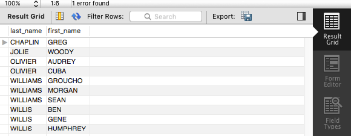

# 1a. Display the first and last names of all actors from the table actor.
            

select first_name, last_name from actor;

## 1b. Display the first and last name of each actor in a single column in upper case letters. Name the column Actor Name.

select CONCAT (first_name,' ',last_name) as 'Actor Name' from actor;

# 2a. You need to find the ID number, first name, and last name of an actor, of whom you know only the first name, "Joe." What is one query would you use to obtain this information?

select actor_id, first_name, last_name from actor where first_name='Joe';

# 2b. Find all actors whose last name contain the letters GEN:

select * from actor where last_name like '%GEN%';

## 2c. Find all actors whose last names contain the letters LI. This time, order the rows by last name and first name, in that order:

select last_name, first_name from actor where last_name like '%%LI%%' order by last_name, first_name;

## 2d. Using IN, display the country_id and country columns of the following countries: Afghanistan, Bangladesh, and China:

select country_id, country from country where country IN ('Afghanistan', 'Bangladesh', 'China');

## 3a. Add a middle_name column to the table actor. Position it between first_name and last_name. Hint: you will need to specify the data type.

alter table actor add column middle_name varchar(100) after first_name;

## 3b. You realize that some of these actors have tremendously long last names. Change the data type of the middle_name column to blobs.

alter table actor modify column middle_name blob;

desc actor;

## 3c. Now delete the middle_name column.

alter table actor drop middle_name;

desc actor;

## 4a. List the last names of actors, as well as how many actors have that last name.

select last_name, count(*) as count from actor group by last_name order by count desc;

## 4b. List last names of actors and the number of actors who have that last name, but only for names that are shared by at least two actors

select last_name, count(*) as count from actor group by last_name having count >=2 order by count desc;

## 4c. Oh, no! The actor HARPO WILLIAMS was accidentally entered in the actor table as GROUCHO WILLIAMS, the name of Harpo's second cousin's husband's yoga teacher. Write a query to fix the record.

update actor set first_name='HARPO' WHERE actor_id=172;

SELECT * FROM ACTOR;

